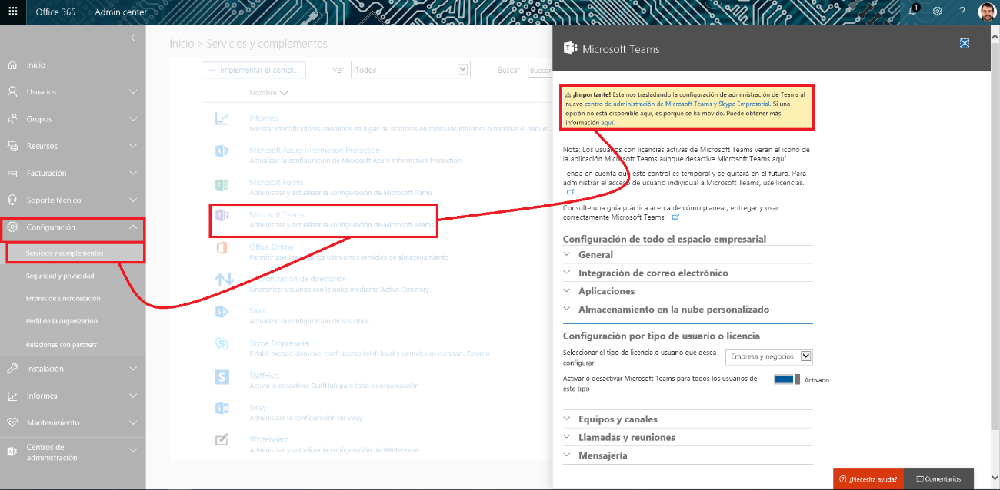
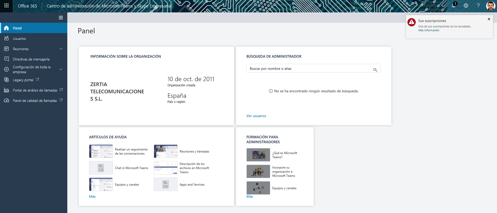
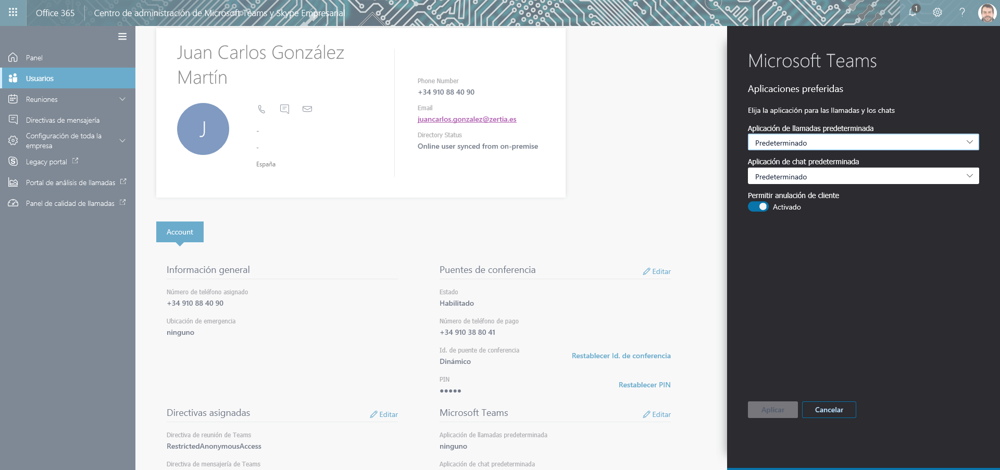
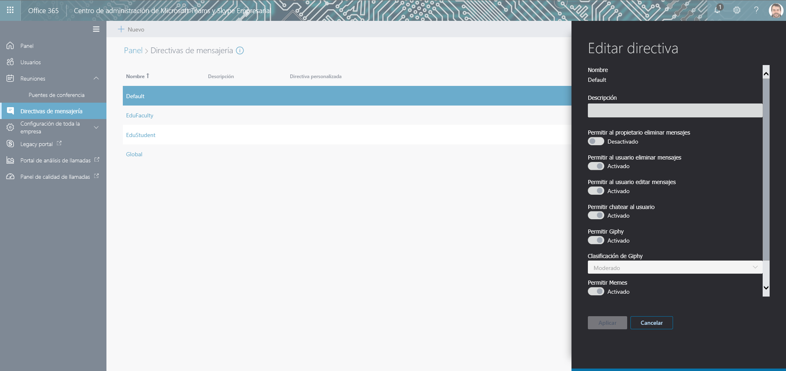
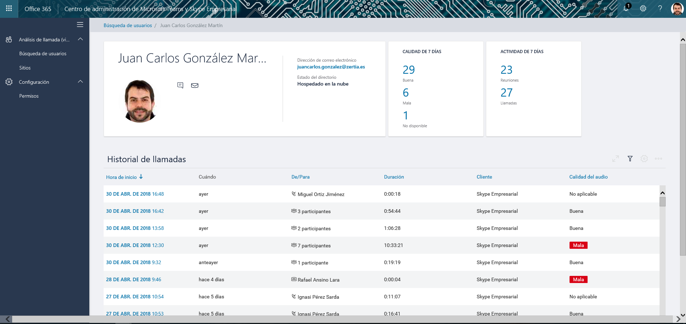
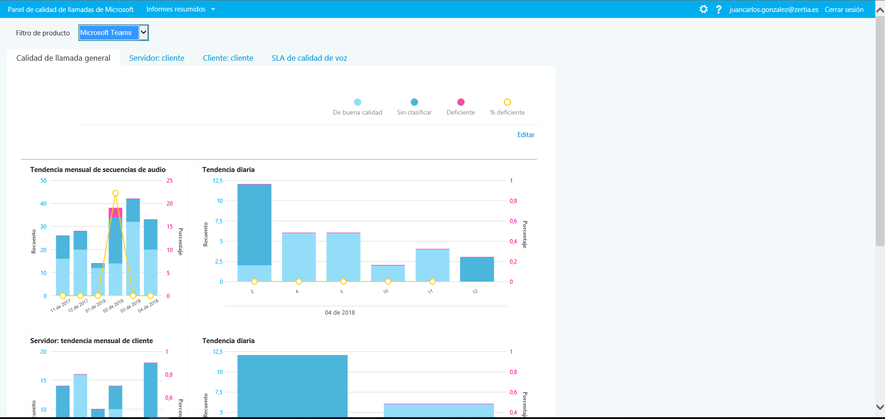

A principios de abril de este año Microsoft anunció el inicio del rollout en tenants Target Release del [nuevo Centro de Administración para Microsoft Teams y Skype For Business](https://techcommunity.microsoft.com/t5/Microsoft-Teams-Blog/Announcing-the-new-Microsoft-Teams-amp-Skype-for-Business-Admin/ba-p/179534) (TSBAC) que a la fecha de redacción de este artículo está todavía en Preview. En este artículo daremos un vistazo a este nuevo y moderno centro de administración.

**Acceso al TSBAC**

Para acceder al nuevo TSBAC tenemos dos posibilidades:

·       A través del acceso a las configuraciones de Microsoft Teams a nivel global en Office 365: “Configuración-&gt;Servicios y complementos-&gt;Microsoft Teams” y en el panel de configuración hacemos clic en el enlace “centro de administración de Microsoft Teams y Skype Empresarial”.

​​

·        Directamente escribiendo la siguiente URL en el navegador:

[https://admin.teams.microsoft.com/](https://admin.teams.microsoft.com/)

Cualquiera de las dos opciones nos llevará al nuevo TSBAC que como es esperable cuenta con una apariencia moderna y en línea con la administración de Office 365 o la nueva administración de SharePoint Online.

**Secciones y opciones en el nuevo TSBAC**

Lo primero que nos encontraremos en el nuevo TSBAC (Imagen 2) es una página principal con poco contenido por el momento en el que se visualiza la información de la organización, un buscador para el administrador y accesos directos a videos de Teams orientados tanto al usuario final como al administrador del servicio.  Sin embargo, en el menú vertical nos encontraremos una serie de opciones interesantes para administrar tanto Microsoft Teams como Skype For Business:

·       **Usuarios**muestra un listado de los usuarios de Microsoft Teams y de Skype For Business en el tenant. Si hacemos clic en uno de los usuarios, accederemos a la página de detalle del usuario en la que no solo se muestra información, sino que es posible realizar cambios en las configuraciones relativas a Teams y Skype for Business para el usuario como por ejemplo:

o   El puente de conferencia asignado para realizar y recibir llamadas.

o   La directiva de mensajería de Teams.

o   Configuraciones concretas de Microsoft Teams como por ejemplo indicar que Teams es la aplicación predeterminada para el usuario tanto para llamadas como para chats.

·       **Reuniones**, por el momento solo proporciona acceso a la opción “Puentes de conferencia” que permite configurar números de teléfono tanto gratuitos como de pago que pueden ser utilizados por los usuarios para conectarse a las reuniones mediante llamada de teléfono.

·       **Directivas de mensajería**, muestra el listado de políticas de mensajería disponibles en el TSBAC y que se pueden asignar a los usuarios de Teams y de Skype For Business. El detalle de cada política se puede ver en el correspondiente panel de detalle y dependiendo de la política tendremos la posibilidad de editar la configuración de la misma o no. De las 4 directivas disponibles a la fecha de redacción de este artículo, sólo la directiva Global es modificable. Finalmente, comentar que desde esta sección es posible crear directivas personalizadas.

·       **Configuración de toda la empresa**, proporciona acceso a las siguientes configuraciones de Teams y Skype for Business:

o   *Acceso externo* que permite habilitar o no la comunicación con usuarios externos de Skype for Business o usuarios de Skype de consumo.

o   *Usuarios invitados* que permite configurar los permisos que van a tener usuarios invitados en Microsoft Teams.

·       **Legacy Portal*,***es simplemente un acceso directo al Centro de Administración legacy de Skype For Business.

·       **Portal de Análisis de Llamadas**, permite acceder al portal citado en el que es posible por usuario revisar la calidad de las últimas llamadas realizadas haciendo uso de Microsoft Teams o de Skype For Business:

Si hacemos clic en una llamada en concreto, podremos ver información detallada que se ha registrado de la misma como detalles del equipo usado para la conexión, características de conectividad al compartir pantalla, detalles de red, etc.

·       **Panel de calidad de llamadas**, que nos proporciona acceso a una serie de informes de calidad de las llamadas realizadas tanto con Microsoft Teams como con Skype For Business.

**Conclusiones**

El nuevo Centro de Administración para Microsoft Team y Skype For Business es un nuevo centro moderno de administración desde el que se podrán realizar todas las configuraciones relativas tanto a Microsoft Teams como a Skype for Business en aspectos como directivas de mensajería, configuraciones de acceso externo y de invitados, etc.

**Juan Carlos González Martín**
 Office Servers and Services MVP
 Cloud & Productivity Advisor 
jcgonzalezmartin1978@hotmail.com
 @jcgm1978 | [https://jcgonzalezmartin.wordpress.com/](https://jcgonzalezmartin.wordpress.com/)

