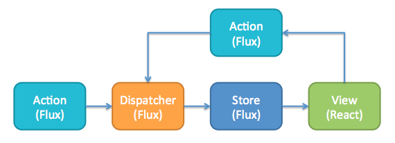

En el número anterior vimos como una introducción a ReactJS para poder abordar un proyecto de este tipo. Una vez ya hemos tenido la primera toma de contacto con la librería y vamos a empezar un nuevo desarrollo utilizando este Framework nos van a surgir muchas preguntas y tendremos que tomar algún tipo de decisión (la cual puede ser acertada o no). Hay nuevos elementos nuevos que tendremos que decidir si incorporarlos o no dentro de nuestro desarrollo, su utilización puede cambiar radicalmente nuestra forma de llevar a cabo dicho desarrollo.

¿Qué aspectos deberemos de incorporar a nuestros desarrollos?

·       Un “route” que se encargue de que dependiendo de la url que se muestre se cargue un componente u otro.

·       Un “almacenamiento” para guardar el estado de los componentes.

·       Que arquitectura vamos a implementar.

**Arquitectura Flux y Redux**

Empecemos por los cimientos de cómo implementar una arquitectura Flux. Si hay algo que ha cambiado realmente la forma de implementar las arquitecturas en el Front es este patrón, para mí lo más importante que ha hecho ReactJS es la incorporación de este patrón y el cambio de pensamiento a la hora de abordar un desarrollo.  Flux es una arquitectura para el manejo y el flujo de los datos en una aplicación web. Fue ideada por el equipo de Facebook siendo su funcionalidad principal facilitar el manejo de datos en aplicaciones web con cierto grado de complejidad.

Estamos acostumbrados a las arquitecturas MVC en la que hay un flujo de datos bidireccional, es decir cualquier modificación en el servidor se modifica en la vista y viceversa, esto hace que en flujos complejos los problemas de rendimiento están a la orden del día. Con Flux esto cambia, propone una arquitectura en la que el flujo de datos es unidireccional. Los datos viajan desde la vista por medio de acciones y llegan a un Store desde el cual se actualizará la vista de nuevo.



Teniendo todo el flujo de la aplicación centralizado es mucho más sencillo depurar las aplicaciones y encontrar los errores en la misma.

Que actores entran en juego en una arquitectura Flux:

·       **Vista**: Serían los propios componentes de React.

·       **Store**: Guarda los datos de la aplicación. No hay métodos en la store que permitan modificar directamente sobre ella, se tiene que hacer a través de dispatcher y acciones.

·       **Actions o Acciones:**Una acción es simplemente un objeto que indica una intención de realizar algo y que lleva datos asociados en caso de ser necesario.

·       **Dispatcher:**No es más que un mediador entre la Store y las acciones. Sirve para desacoplar la Store de la vista, ya que así no es necesario conocer que Store maneja una acción concreta.

El flujo que sigue la aplicación sería el siguiente:

·       La vista, mediante un evento envía una acción con la intención de realizar un cambio en el estado.

·       La acción contiene el tipo y los datos, y es enviada al dispatcher.

·       El dispatcher propaga la acción al Store y se procesa en orden de llegada.

·       El Store recibe la acción y dependiendo del tipo recibido, actualiza el estado y notifica a las vistas de ese cambio.

·       La vista recibe la notificación y se actualiza con los cambios.

Este patrón se puede implementar bien de forma propia o bien utilizando alguna librería como pueda ser Redux, ReFlux, Fluxxor, Fluxible, etc…  De todas ellas la más utilizada es Redux, es una pequeña librería de menos de 2kb y que con unos pocos métodos implementa el patrón Flux. Es agnóstica al framework por lo que esta se puede implementar en otros frameworks como Angular, Vue, etc.

**¿Qué hace Redux?**

Se encarga en cierta manera de desacoplar el estado global de una aplicación web de la parte visual. El estado de la aplicación pueden ser varias cosas, normalmente se trata los datos que se reciben a través de peticiones a servicios REST (consultas a listas de SharePoint). Pero también se refiere al estado de la UI en un determinado momento, por ejemplo: mostrar una información al usuario o no, un mensaje de error, ocultar desplegar un panel, etc.

Los conceptos claves de Redux:

1.       La Store=&gt; La única fuente de datos, aunque el patrón Flux indica que pueden haber más de una store, Redux simplifica unificando todo en un único árbol.

2.       El Estado =&gt; Solo podemos modificar el estado a través de acciones

3.       Reducers=&gt; Es básicamente una función que recibe dos parámetros, el estado inicial y una acción y dependiendo del tipo de acción realizará una operación u otra en el estado.

**SPFx, ReactJS y Redux**

Ahora bien, todo esto sería pensando que estamos haciendo una aplicación “normal” de ReactJS y que no estamos desarrollando un webpart de “SPFx”. Cuando abordamos un desarrollo en SPFx tenemos que tener en cuenta los mismos planteamientos que para el desarrollo de un WebPart:

·       Podemos poner varios WebParts en la misma página.

·       La navegación la gestiona SharePoint.

·       Tiene que haber comunicación entre los distintos WebParts.

·       Es una SPA.

Todo esto que estamos hablando más que propio del desarrollo de React en SPFx es propio del desarrollo en SharePoint. ¿En qué circunstancias extiendo SharePoint mediante desarrollo? En el momento que la plataforma no cumple con los requerimientos del cliente y dichos requerimientos se adaptan perfectamente a SharePoint y hacen uso de alguno de los elementos out of the box de los que se componen. En caso de que estos requerimientos sean que se quiere un SharePoint que no se parezca a un SharePoint plantearos que quizás las necesidades que tiene el cliente no es el de utilizar SharePoint.

Ahora bien, ya hablando directamente de ReactJS, Redux, y SPFx. Partimos del propio contexto de SharePoint en el que en una página pueden tener más de un WebPart. ¿Es necesario utilizar Redux?  Yo creo que Redux viene a cubrir un aspecto de aplicaciones complejas, y no en pequeños desarrollos de código que son lo habitual en SPFx. Además, como hemos comentado para implementar el patrón Flux no es necesario el añadir una complejidad mayor en la aplicación. Pero en el caso de que lo vayamos a utilizar vamos a ver cómo utilizarlo.

**Show me the code, Talk is cheap**

Dado un proyecto en ReactJS, uno de los aspectos que debemos de tener en cuenta para poder un mantenimiento óptimo de nuestro desarrollo es tener clara la organización que vamos a hacer. Por ahora en los proyectos que hemos desarrollado, hemos llegado a la siguiente convención:

·       Una carpeta Reducer, donde tendremos un fichero por cada uno de los reducers que vamos a tener, un fichero index en el que se unificarán todos los reducers que vamos a utilizar.

·       Una carpeta Action donde tendremos las acciones de los componentes, del mismo modo tendremos un fichero donde tendremos en constantes las acciones que vamos a utilizar (de esta forma evitamos los magic strings). Para acciones genéricas de algún componente también creamos una carpeta acction donde tendremos las acciones de dicho componente.

·       Cada componente tendrá una parte de Frontnet y un contenedor que es el que se encargará de inyectar la implementación de dichos métodos.

Vamos a ver un ejemplo práctico, dada la plantilla de ReactJS que viene en Visual Studio en la versión de .NET Core 2.0 (la nueva versión cambia un poco ya que no utiliza TypeScript ☹) En primer lugar lo que vamos a hacer es desde una línea de comandos instalar los siguientes paquetes y sus typings:

```
npm install react react-dom redux react-redux –save
```

```
npm install @types/react @types/react-dom @types/react-redux --save-dev
```


Nos crearemos una carpeta Reducer, donde vamos a tener un fichero UserProfile.ts


```
class UserProfileState {  firstname : string;  constructor() {    this.firstname = "Default name";  }}
```

```
export const userProfileReducer =  (state : UserProfileState = new UserProfileState(), action) => {  return state;};
```

Y como hemos comentado también tendremos un fichero index.tx en el que tendremos todos nuestros reducers, en este ejemplo solamente uno

```
import { combineReducers } from 'redux';import { userProfileReducer } from './userProfile';
```

```
export const reducers =  combineReducers({  userProfileReducer});
```

A continuación, crearemos un componente HelloWorldComponent.tsx de la siguiente forma:

```
import * as React from 'react';
```

```
export const HelloWorldComponent = (props : {userName : string}) => {  return (    <h2>Hello Mr. {props.userName} !</h2>  );}
```

También crearemos el contenedor de dicho componente:

```
import { connect } from 'react-redux';import { HelloWorldComponent } from './helloWorld';const mapStateToProps = (state) => {  return {    userName: state.userProfileReducer.firstname  }}const mapDispatchToProps = (dispatch) => {  return {  }}
```

```
export const HelloWorldContainer = connect(  mapStateToProps,  mapDispatchToProps)(HelloWorldComponent);
```


El siguiente paso es en el punto de arranque de nuestra aplicación indicar que arranque con nuestro componente contenedor e indicarle la store (donde vamos a tener almacenado todo el estado de nuestra aplicación y que Redux se encarga de darnos un método para ahorrarnos dicha implementación).

```
import * as React from 'react';import * as ReactDOM from 'react-dom';import { createStore } from 'redux';import { Provider } from 'react-redux';import {reducers} from './reducers';import {HelloWorldContainer} from './helloWorldContainer';let store = createStore(reducers);
```

```
ReactDOM.render(   <Provider store={store}>     <HelloWorldContainer/>   </Provider>  , document.getElementById('root'));
```


Ahora si arrancamos la aplicación se nos mostrará la pantalla un Hello Mr. Default Name. ¿Lo veis claro no? Vamos a darle una vuelta más a toda la magia de Redux y es dado este desarrollo vamos a añadir un nuevo componente en el que el usuario pueda introducir su nombre. ¿Cómo vamos a modificar el nombre? Se lanzará una acción que será la encarga de modificar el estado que hay en la store y una vez se modifica se volverá a renderizar el componente con dicho nuevo valor.

Para empezar, crearemos un fichero common/actionsEnums.ts con las constates de la acción que vamos a implementar:

```
export const actionsEnums = {  UPDATE_USERPROFILE_NAME : 'UPDATE_USERPROFILE_NAME '}
```


Crearemos una carpeta con donde estará la acción que se va a lanzar: actions/updateUserProfileName.ts

```
import {actionsEnums} from '../common/actionsEnums';export const updateUserProfileName = (newName : string) => {  return {    type: actionsEnums.UPDATE_USERPROFILE_NAME,    newName : newName,  }}
```


A continuación, modificaremos el reducer para que cuando se desencadene dicha acción se modifique el estado de la store, para ello substituiremos el siguiente código:

```
import {actionsEnums} from '../common/actionsEnums';class UserProfileState {  firstname : string;  constructor() {    this.firstname = "Default name";  }}export const userProfileReducer =  (state : UserProfileState = new UserProfileState(), action) => {switch (action.type) {   case actionsEnums.UPDATE_USERPROFILE_NAME:     return handleUserProfileAction(state, action); }  return state;};
```

```
 const handleUserProfileAction = (state : UserProfileState, action) => {   return {     ...state,     firstname: action.newName,   }; }
```


Una vez implementada las Actions y los Reducers nos crearemos el componente NameEdit.tsx

```
import * as React from 'react';
```

```
export const NameEditComponent = (props: {userName : string, onChange : (name : string) => any}) => {  return (    <div>      <label>Update Name:</label>      <input        value={props.userName}        onChange={(e : any) => props.onChange(e.target.value)}        />    </div>  );}
```


Y su contenedor correspondiente NameEditContainer.tsx

```
import { connect } from 'react-redux';import { NameEditComponent } from './nameEdit';import {updateUserProfileName} from './actions/updateUserProfileName';const mapStateToProps = (state) => {  return {    userName: state.userProfileReducer.firstname  }}const mapDispatchToProps = (dispatch) => {  return {    onChange: (name : string) => {return dispatch(updateUserProfileName(name))}  }}
```

```
export const NameEditContainer = connect(  mapStateToProps,  mapDispatchToProps)(NameEditComponent);
```


Para mostrar los dos componentes nos crearemos un Componente Padre App que tendrá la siguiente estructura:

```
import * as React from 'react';import {HelloWorldContainer} from './helloWorldContainer';import {NameEditContainer} from './nameEditContainer';
```

```
export const App = () => {  return (    <div>      <HelloWorldContainer/>      <br/>      <NameEditContainer/>    </div>  );}
```


Si ejecutamos dicho código, lo que vamos a ver es que cada vez que en el componente se modifica el valor automáticamente el Hello World cambia de valor según lo que se ha introducido.

Aunque dicho ejemplo es muy simple sirve como claro concepto para entender cuál es el flujo que sigue una aplicación React. El entender dicho flujo es muy importante porque cuando empecemos a añadir complejidad a nuestra aplicación tenemos que tenerlo muy claro porque si no es muy sencillo que empecemos a odiar a React.

**Resumen**

Hemos visto un planteamiento muy diferente a lo que estamos acostumbrados para llevar a cabo un desarrollo en el FrontEnd. El patrón Flux ha venido para quedarse y el pensar de esta forma hace que nuestras aplicaciones sean más mantenibles y podamos dotarlas de un orden que hasta hace poco carecían. Ahora bien, no todo es color de rosa y detrás del patrón hay que entender muy bien el ciclo de vida de cada componente. Del amor al odio hay un paso, y en el proceso de adopción de React es posible que los primeros días el nivel del desarrollador este muy contento y le parezca lo mejor que ha probado. Cuando se empiezan a añadir dificultad al desarrollo es posible que lo odies e intentes plantear una solución a lo "clásico" y por último acabarás por entender su ciclo de vida y entenderás toda la potencia que tiene React.


**Adrián Diaz Cervera -- Architect Software Lead at Encamina**

MVP Office Development

[http://blogs.encamina.com/desarrollandosobresharepoint](http://blogs.encamina.com/desarrollandosobresharepoint)

[http://geeks.ms/blogs/adiazcervera](http://geeks.ms/blogs/adiazcervera)

adiaz@encamina.com @AdrianDiaz81​

 
 
import LayoutNumber from '../../../components/layout-article'
export default LayoutNumber
