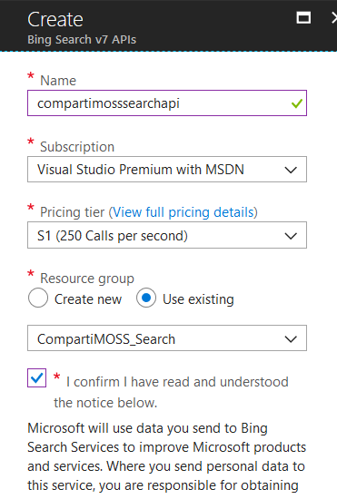
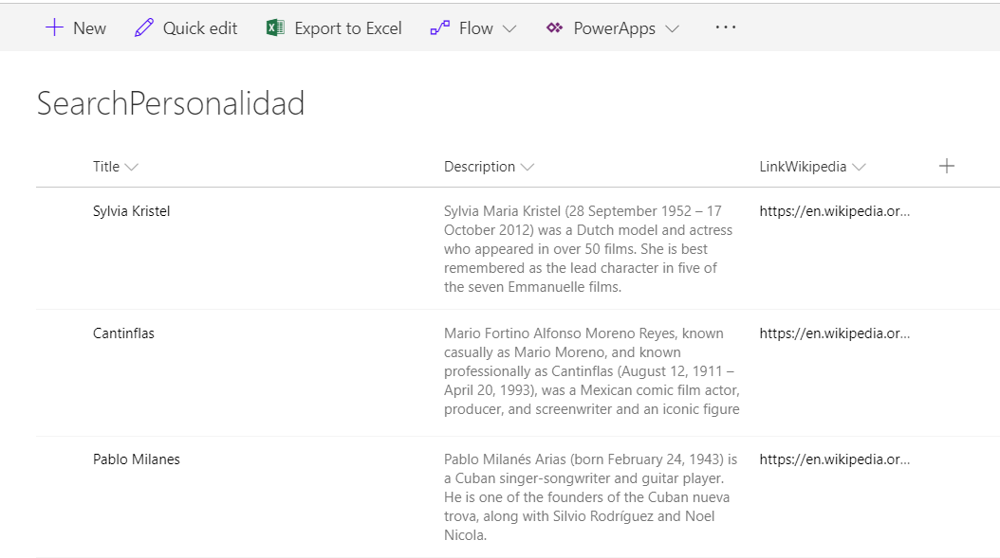

**Que es el Microsoft Bing Search API**

El servicio de búsqueda de Bing en Azure proporciona una experiencia similar a las búsquedas que se pueden realizar con Bing.com, devolviendo los resultados de una consulta que Bing determina son relevantes para el usuario. Los resultados incluyen páginas web, imágenes, vídeos y mucho más, como por ejemplo noticias, consultas relacionadas, corrección de errores de escritura, conversión de unidades, traducciones y cálculos matemáticos. El servicio forma parte del conjunto de Cognitive Services de Azure, que es una colección de algoritmos de Inteligencia Artificial que se pueden utilizar en la nube de Microsoft.

El Bing API es un servicio que consiste en un servicio general, el Bing Web Search, que devuelve resultados generales, de noticias, imágenes, videos, etc. relacionados con la consulta del cliente, y servicios especializados para cada una de esas partes que se pueden llamar por separado y retornan solamente los resultados relevantes (solo noticias, o solo videos, etc.). El servicio está basado en consultas REST, en donde la consulta se envía a un URL especializado (el Endpoint de Bing Search, https://api.cognitive.microsoft.com/bing/v7.0/search), con un parámetro "q" en el Query String con la cadena de consulta, y la llave del usuario de Azure en la cabecera del URL. La respuesta retorna en formato JSON.

Adicionalmente es posible refinar los resultados especificando un país, lo que devuelve los resultados de la búsqueda basándose en los intereses de ese país (para la parte de noticias, por ejemplo). La API de Bing Web Search soporta más de tres docenas de países, muchos con más de un idioma. El país se especifica mediante el parámetro de consulta "cc". Si se especifica un país, también se debe especificar uno o varios códigos de idioma mediante el encabezado HTTP Accept-Language. Los lenguajes soportados varían según el país, y se indican para cada país según su "mercado", que a su vez se puede especificar utilizando el parámetro de consulta "mkt" y un código especifico. Utilizando un mercado, simultáneamente se especifica un país y un idioma preferido. El parámetro de consulta "setLang" puede establecerse en un código de idioma en este caso; usualmente este es el mismo idioma especificado por "mkt" a menos que el usuario prefiera ver Bing en otro idioma. En castellano se pueden utilizar, por ejemplo, los países Argentina (AR), Chile (CL), México (MX) y España (ES), y los mercados Argentina-Español (es-AR), Chile-Español (es-CL), México-Español (es-MX) y España-Español (es-ES).

El Azure Bing Search API se puede utilizar en SharePoint para enriquecer automáticamente la información en el sistema. Aunque SharePoint dispone de su propio motor de búsqueda, él se reduce a indexar información dentro de SharePoint mismo, dentro de SharePoint OnPrem y un tenant de SharePoint 365 (en un sistema hibrido), o indexar sistemas conectados por medio del Business Connectivity Service (y, en ciertos casos, información en file-shares), pero no es capaz de relacionar información interna con información disponible en internet. Por medio del Bing Search API es posible crear este tipo de relaciones y, si es necesario, agregarle también funcionalidad adicional, como por ejemplo hacer cálculos matemáticos.

En el ejemplo que se va a desarrollar enseguida se utiliza el Bing Search API para mostrar información adicional sobre un nombre de un personaje. Una Lista Personalizada de SharePoint dispone de tres campos: uno (el Titulo por defecto) para el nombre del personaje, otro para mostrar un resumen de información al respecto, y un tercero con el vinculo correspondiente a la Wikipedia.

**Configuración del Azure Bing Search API**

Para utilizar el Bing Search API es necesario crear primero el servicio en Azure, aunque también es posible utilizar una cuenta temporal de prueba desde la página de Microsoft [https://azure.microsoft.com/en-us/try/cognitive-services/#search](https://azure.microsoft.com/en-us/try/cognitive-services/#search). Para crear un servicio (de pago) en Azure:

1.      
Entre al portal de manejo de Azure ([https://portal.azure.com](https://portal.azure.com/)) utilizando sus credenciales.

2.      
Vaya a la sección de "Resource Groups" y cree un nuevo Grupo de Recursos (también es posible reutilizar un grupo ya existente).

3.      
Cree un servicio de "Bing Search API":

a.      
En el Resource Group, utilice el botón de "+Add" para crear un recurso, busque por "Bing Search" en la casilla de búsqueda y seleccione "Bing Search v7 APIs" en los resultados.

b.      
Asígnele un nombre al servicio y utilice el Grupo de Recursos deseado. En la casilla de "Pricing tier" seleccione un servicio dependiendo de la cantidad de consultas a esperar por segundo, lo que determina el precio del servicio (por mil consultas). Acepte el anuncio de privacidad que aparece en la configuración (Microsoft utilizara los datos enviados para mejorar automáticamente los algoritmos de Bing).



4.      
Una vez creado el servicio, haga clic sobre su nombre en la lista de recursos del Resource Group, vaya a "Keys" y copie el valor de "Key 1"

**Utilizando el Azure Bing Search API con SharePoint**

En el siguiente ejemplo, como se indicó anteriormente, se va a utilizar una Lista Personalizada de SharePoint en donde el campo de "Titulo" de un elemento nuevo creado en la Lista, inicia una consulta de Bing. Cuando se introduce un nuevo elemento con el nombre de una personalidad en el Titulo de un elemento de la Lista, un WebHook hace que una Función de Azure comience a funcionar, utilice el texto del "Titulo" como consulta para hacer una llamada al Azure Bing Search API y modifique el elemento en la Lista agregándole el resumen de la información y el URL del articulo correspondiente de Wikipedia.

**Nota:** la creación y configuración de una Función de Azure se puede encontrar el en artículo "SharePoint y Azure – Azure Functions" ([http://www.compartimoss.com/revistas/numero-30/sharepoint-y-azure-azure-functions](/revistas/numero-30/sharepoint-y-azure-azure-functions)). La configuración y utilización de WebHooks de SharePoint se puede encontrar en el artículo "Eventos sobre SharePoint Online con Webhooks" ([http://www.compartimoss.com/revistas/numero-32/eventos-sobre-sharepoint-online-con-webhooks](/revistas/numero-32/eventos-sobre-sharepoint-online-con-webhooks)).

5.      
Cree una cuenta de Funciones básica en el Grupo de Recursos, asignándole un nombre, Plan de Servicios y cuenta de Azure Storage.

6.      
Utilizando Visual Studio 2017 (o Visual Studio 2016 con el AddIn para programar Funciones de Azure), cree una nueva solución del tipo "Azure Function". Una vez creada la solución, agréguele una Función del tipo "Http Trigger" con derechos de acceso anónimo.

7.      
Agréguele a la solución el paquete NuGet "AppForSharePointOnlineWebToolkit".

8.      
Reemplace toda la rutina "Run" con el siguiente código:

```
[FunctionName("SearchBingWeb")]

public static asyncTask&lt;HttpResponseMessage&gt; Run([HttpTrigger(AuthorizationLevel.Anonymous, "post", Route = null)]HttpRequestMessage req, TraceWriter log)

{

log.Info("\*\*\* SearchBingWeb function processed a request \*\*\*");


// Registration

stringvalidationToken = GetValidationToken(req);

if (validationToken != null)

{

log.Info($"---- Processing Registration");

var myResponse = req.CreateResponse(HttpStatusCode.OK);

myResponse.Content = new StringContent(validationToken);

return myResponse;

}


// Changes

var myContent =
await req.Content.ReadAsStringAsync();

varallNotifications = JsonConvert.DeserializeObject&lt;ResponseModel&lt;NotificationModel&gt;&gt;(myContent).Value;


if (allNotifications.Count &gt; 0)

{

log.Info($"---- Processing Notifications");

string siteUrl = ConfigurationManager.AppSettings["whSiteListUrl"];

foreach (var oneNotification in allNotifications)

{

// Login in SharePoint

ClientContext SPClientContext = HelpFunctions.LoginSharePoint(siteUrl);


// Get the Changes

GetChanges(SPClientContext, oneNotification.Resource, log);

}

}


return newHttpResponseMessage(HttpStatusCode.OK);

}


return newHttpResponseMessage(HttpStatusCode.OK);

}

```

Esta rutina primero se encarga de hacer el registro del WebHook (si la consulta contiene un parámetro "validationtoken" en el Query String) utilizando la rutina "GetValidationToken":


```
public static stringGetValidationToken(HttpRequestMessage req)

{

string strReturn =
string.Empty;


strReturn = req.GetQueryNameValuePairs()

.FirstOrDefault(q =&gt; string.Compare(q.Key,
"validationtoken", true) == 0)

.Value;


return strReturn;

}
```


En el código, después de registrado el WebHook, cada consulta es procesada para extraer las notificaciones que contiene. En cada notificación de la colección de notificaciones se hace un logeo en SharePoint para obtener los cambios detectados en la Lista (por medio de la rutina "GetChanges"). En la variable "whSiteListUrl" del App Settings de la función se encuentra el URL del sitio en donde se encuentra la Lista a examinar ("https://[Dominio].sharepoint.com/sites/[NombreSitio").

10.      
La rutina "GetChanges" recibe el contexto de SharePoint y el identificador de la Lista, y tiene la forma:

```
static voidGetChanges(ClientContext SPClientContext, string ListId, TraceWriter log)

{

// Get the List

Web spWeb = SPClientContext.Web;

List myList = spWeb.Lists.GetByTitle(ConfigurationManager.AppSettings["whListName"]);

SPClientContext.Load(myList);

SPClientContext.ExecuteQuery();


// Create the ChangeToken and Change Query

ChangeQuery myChangeQuery = GetChangeQueryNew(ListId);


// Get all the Changes

var allChanges = myList.GetChanges(myChangeQuery);

SPClientContext.Load(allChanges);

SPClientContext.ExecuteQuery();


foreach (Change oneChange in allChanges)

{

if (oneChange is ChangeItem)

{

int myItemId = (oneChange as ChangeItem).ItemId;


// Get what is changed

log.Info($"---- Changed ItemId : " + myItemId);

ListItem myItem = myList.GetItemById(myItemId);

SPClientContext.Load(myItem);

SPClientContext.ExecuteQuery();


// Search result in Bing Web

SearchBingWebResult myResultBing = GetBingWebSearch(myItem["Title"].ToString()).Result;


// Insert the values back in the List

int indexWeb = 0;

for (int oneWeb = 0; oneWeb &lt; myResultBing.webPages.value.Count(); oneWeb++)

{

if(myResultBing.webPages.value[oneWeb].name.Contains("Wikipedia") == true)

{

indexWeb = oneWeb;

break;

}

}

myItem["LinkWikipedia"] = myResultBing.webPages.value[indexWeb].displayUrl;

myItem["Description"] = myResultBing.webPages.value[indexWeb].snippet;

myItem.Update();

SPClientContext.ExecuteQuery();

log.Info($"---- Search Bing Web added to SharePoint Item");

}

}

}
```


Primero se crea un objeto que contienen la Lista a utilizar en SharePoint. Luego se crea una consulta de cambio (variable "myChangeQuery") que especifica que se requieren los cambios ocurridos en el ultimo minuto, que ocurren en elementos de la Lista y que sean del tipo "Add", es decir, elementos nuevos:

```
public static ChangeQuery GetChangeQueryNew(string ListId)

{

ChangeToken lastChangeToken = newChangeToken();

lastChangeToken.StringValue = string.Format("1;3;{0};{1};-1", ListId, DateTime.Now.AddMinutes(-1).ToUniversalTime().Ticks.ToString());

ChangeToken newChangeToken = newChangeToken();

newChangeToken.StringValue = string.Format("1;3;{0};{1};-1", ListId, DateTime.Now.ToUniversalTime().Ticks.ToString());

ChangeQuery myChangeQuery = newChangeQuery(false, false);

myChangeQuery.Item = true;  // Get only Item changes

myChangeQuery.Add = true;   // Get only the new Items

myChangeQuery.ChangeTokenStart = lastChangeToken;

myChangeQuery.ChangeTokenEnd = newChangeToken;


returnmyChangeQuery;

}
```


Luego de ejecutar la consulta, se examina cada uno de los cambios y se obtiene un objeto con el Elemento agregado. En la misma rutina se llama a "GetBingWebSearch", la que se encarga de hacer la consulta en Azure Bing, utilizando como parámetro de entrada el nombre del personaje (el Titulo del Elemento). Esta rutina entrega de regreso un objeto del tipo "SearchBingWebResult" que contiene los resultados de la consulta y que tiene la forma:

```
public class SearchBingWebResult

{

public Webpages webPages { get; set; }

}


public class Webpages

{

public stringwebSearchUrl { get; set; }

public inttotalEstimatedMatches { get; set; }

public Value[] value { get; set; }

}


public class Value

{

public string id { get; set; }

public string name { get; set; }

public string url { get; set; }

public About[] about { get; set; }

public boolisFamilyFriendly { get; set; }

public string displayUrl { get; set; }

public string snippet { get; set; }

public Deeplink[] deepLinks { get; set; }

public DateTime dateLastCrawled { get; set; }

public string language { get; set; }

public stringthumbnailUrl { get; set; }

}


public class About

{

public string name { get; set; }

}


public class Deeplink

{

public string name { get; set; }

public string url { get; set; }

}
```


Como Bing retorna un resultado con varios elementos, por medio de un loop se busca el resultado que se refiere a la Wikipedia. Finalmente se utilizan los valores de "snipped" y "displayUrl" para insertarlos en los campos de "Description" y "LinkWikipedia" del Elemento.

11.      
La rutina "GetBingWebSearch " recibe como parámetros de entrada el texto del título con el nombre del personaje y retorna un objeto con los valores encontrados por Bing:

```
public static asyncTask&lt;SearchBingWebResult&gt; GetBingWebSearch(stringmySearchQuery)

{

SearchBingWebResult resultReturn = newSearchBingWebResult();

// Construct the URI of the search request. Using the "en-US" market to force responce in english only

var uriQuery = ConfigurationManager.AppSettings["azSearchBingWebEndpoint"] + "?mkt=en-US&q=" + Uri.EscapeDataString(mySearchQuery);

stringcontentString = string.Empty;


// Perform the Web request and get the response

WebRequest request = HttpWebRequest.Create(uriQuery);

request.Headers["Ocp-Apim-Subscription-Key"] = ConfigurationManager.AppSettings["azBingSearchApiServiceKey"];

HttpWebResponse response = (HttpWebResponse)request.GetResponseAsync().Result;

string json = newStreamReader(response.GetResponseStream()).ReadToEnd();


// Create result object for return

varsearchResult = new SearchResult()

{

jsonResult = json,

relevantHeaders = newDictionary&lt;String, String&gt;()

};


// Extract Bing HTTP headers

foreach (String header in response.Headers)

{

if(header.StartsWith("BingAPIs-") || header.StartsWith("X-MSEdge-"))

searchResult.relevantHeaders[header] = response.Headers[header];

}


resultReturn = JsonConvert.DeserializeObject&lt;SearchBingWebResult&gt;(searchResult.jsonResult);

returnresultReturn;

}


// Used to return search results including relevant headers

struct SearchResult

{

public String jsonResult;

publicDictionary&lt;String, String&gt; relevantHeaders;

}
```


Cada consulta al Bing API se realiza por medio de una llamada REST a un URL pre-especificado del servicio de búsqueda (dado en el valor de la App Settings "azSearchBingWebEndpoint" y que es "https://api.cognitive.microsoft.com/bing/v7.0/search"), utilizando como parámetros en el QueryString el "Mercado" ("mkt", si es necesario forzar resultados en un idioma determinado) y la cadena de la consulta ("q"). En la App Settings "azBingSearchApiServiceKey" se mantiene el valor de la llave mencionada en el punto 4.

El Bing Web API es mucho más completo de lo que se muestra en el ejemplo. Por medio de los parámetros de la llamada REST se pueden especificar mucho más finamente los resultados, incluyendo determinar qué tan "fresca" es la información, filtrar el tipo de resultados, etc. Igualmente, el resultado que se usa en el ejemplo es solamente el objeto "Webpage", pero la respuesta puede contener muchos otros tipos incluyendo imágenes, videos, noticias, etc. Toda la definición de los parámetros de entrada y los objetos de salida se puede encontrar en la información de referencia de Microsoft en [https://docs.microsoft.com/en-us/rest/api/cognitiveservices/bing-web-api-v7-reference](https://docs.microsoft.com/en-us/rest/api/cognitiveservices/bing-web-api-v7-reference). Para utilizar otros parámetros de entrada, modifique la consulta en la variable "uriQuery" de la rutina "GetBingWebSearch". Para entregar otros tipos de objetos de respuesta, modifique la clase "SearchBingWebResult" para que el objeto pueda capturar los valores deseados; la rutina "GetBingWebSearch" se encarga de deserializarlos automáticamente.

12.      
Otras tres clases definen objetos utilizados por el WebHook:

```
public class ResponseModel&lt;T&gt;

{

[JsonProperty(PropertyName = "value")]

public List&lt;T&gt; Value {
get; set; }

}


public class NotificationModel

{

[JsonProperty(PropertyName = "subscriptionId")]

public stringSubscriptionId { get; set; }


[JsonProperty(PropertyName = "clientState")]

public string ClientState { get; set; }


[JsonProperty(PropertyName = "expirationDateTime")]

public DateTimeExpirationDateTime { get; set; }


[JsonProperty(PropertyName = "resource")]

public string Resource { get; set; }


[JsonProperty(PropertyName = "tenantId")]

public string TenantId { get; set; }


[JsonProperty(PropertyName = "siteUrl")]

public string SiteUrl { get; set; }


[JsonProperty(PropertyName = "webId")]

public string WebId { get; set; }

}


public class SubscriptionModel

{

[JsonProperty(NullValueHandling = NullValueHandling.Ignore)]

public string Id { get; set; }


[JsonProperty(PropertyName = "clientState", NullValueHandling = NullValueHandling.Ignore)]

public string ClientState { get; set; }


[JsonProperty(PropertyName = "expirationDateTime")]

public DateTimeExpirationDateTime { get; set; }


[JsonProperty(PropertyName = "notificationUrl")]

public stringNotificationUrl { get; set; }


[JsonProperty(PropertyName = "resource", NullValueHandling = NullValueHandling.Ignore)]

public string Resource { get; set; }

}
```


13.      
Registre el WebHook en la Lista de SharePoint y cree un Elemento indicando en el titulo el nombre de un personaje. El WebHook hará que la Función realice su trabajo, entregue los resultados de Bing y muestre la descripción y el URL del artículo de la Wikipedia:



**Conclusiones**

El servicio de Bing de Azure permite enriquecer la información que los usuarios guardan en SharePoint. El Azure Bing API es fácil de utilizar desde cualquiera lenguaje de programación, y produce resultados confiables rápida y seguramente. El API utiliza algoritmos de Inteligencia Artificial que se mejoran con el uso, por lo no es necesario crear ni entrenar algoritmos propios.


Gustavo Velez
 MVP Office Servers and Services
 gustavo@gavd.net
 http://www.gavd.net

 
 
import LayoutNumber from '../../../components/layout-article'
export default LayoutNumber
