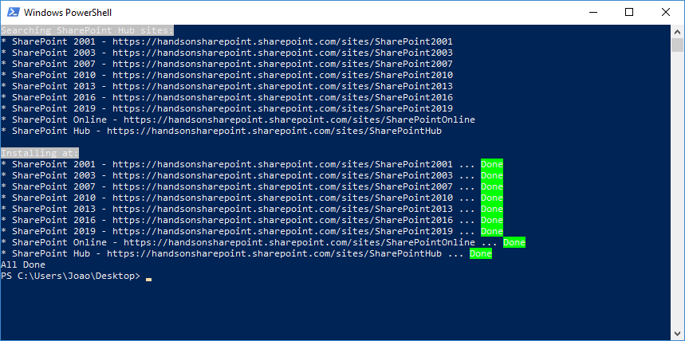
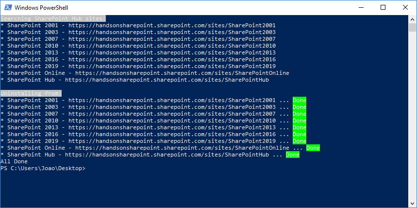

Hub sites brig a set of common functions to all sites that belong the hub, but extensions are not propagated to all sites automatically. With PnP PowerShell is possible to automate the installation of Application Customizers through the sites, the script below search for all sites associated with hub and apply the custom action to all of them.

Before running the script, you will need to have PnP PowerShell installed, the latest version can be installed from [here](https&#58;//github.com/SharePoint/PnP-PowerShell/releases). The scripts will not install the extension using ALM APIs, to get this working, you need to install the extension manually on the global app catalog.

**Installing**

Before running the script, you need to adjust the main variables to your own values:

·        **tenantAdmin**= "https://contoso-admin.sharepoint.com"

·        **hubSite**= "https://contoso.sharepoint.com/sites/hub"

·        **extensionGUID**= "6da1a9e8-471d-4f39-80e6-a7ded02e8881"

·        **extensionName**= "Extension Name"

·        **extensionTitle**= "Extension Title"

You can get your extension GUID from the extension project, open the manifest.json and copy the id value.

```
cls    $tenantAdmin = "https://contoso-admin.sharepoint.com"$hubSite = "https://contoso.sharepoint.com/sites/hub"$extensionGUID = "6da1a9e8-471d-4f39-80e6-a7ded02e8881"$extensionName = "Extension Name"$extensionTitle = "Extension Title"    try{       Connect-PnPOnline -Url $tenantAdmin -UseWebLogin} catch {       Write-Host "Unable to connect."       exit}  $HubSite = Get-PnPHubSite $hubSite$HubSiteId = $HubSite.SiteId$ModernSites = (Get-PnPTenantSite -Template 'GROUP#0') + (Get-PnPTenantSite -Template 'SITEPAGEPUBLISHING#0')$SitesFromHub = New-Object System.Collections.ArrayList  Write-Host ("Searching {0} sites:" -f $HubSite.Title) -BackgroundColor Grayforeach ($ModernSite in $ModernSites){         $site = Get-PnPHubSite $ModernSite.Url         if($site.SiteUrl){                                      if($site.SiteId -eq $HubSiteId){                            Write-Host ("* {0} - {1}" -f $ModernSite.Title, $ModernSite.Url)                            $SitesFromHub.Add($ModernSite) | Out-Null                   }         }}  Write-Host ""Write-Host "Installing at:" -BackgroundColor Grayforeach ($SiteHub in $SitesFromHub){         Write-Host ("* {0} - {1} ... " -f $SiteHub.Title, $SiteHub.Url) -NoNewline                Connect-PnPOnline -Url $SiteHub.Url -UseWebLogin         Add-PnPCustomAction -ClientSideComponentId $extensionGUID -Name $extensionName -Title $extensionTitle -Location ClientSideExtension.ApplicationCustomizer -Scope site         Write-Host "Done" -BackgroundColor Green         Disconnect-PnPOnline}  Write-Host "All Done"
```

The execution of the script will identify all the sites belonging to the Hub and will print if the installation was achieved with success.



**Uninstalling**

In case you want to remove the extensions from all the hub sites I'm also providing a script to do it, but the extension must be installed with the same name in all sites. Every time an extension is installed a new identifier for the extension is generated and the removal requires that id, it can be retrieve using PowerShell if we know in advance what was the installation name.

Before running the script, you need to adjust the main variables to your own values:

·        **tenantAdmin**= "https://contoso-admin.sharepoint.com"

·        **hubSite**= "https://contoso.sharepoint.com/sites/hub"

**·        extensionName**= "Extension Name"

```
cls $tenantAdmin = "https://contoso-admin.sharepoint.com"$hubSite = "https://contoso.sharepoint.com/sites/hub"$extensionName = "Header" try{             Connect-PnPOnline -Url $tenantAdmin -UseWebLogin} catch {             Write-Host "Unable to connect."             exit}             $HubSite = Get-PnPHubSite $hubSite$HubSiteId = $HubSite.SiteId$ModernSites = (Get-PnPTenantSite -Template 'GROUP#0') + (Get-PnPTenantSite -Template 'SITEPAGEPUBLISHING#0')$SitesFromHub = New-Object System.Collections.ArrayList Write-Host ("Searching {0} sites:" -f $HubSite.Title) -BackgroundColor Gray foreach ($ModernSite in $ModernSites){             $site = Get-PnPHubSite $ModernSite.Url             if($site.SiteUrl){                                         if($site.SiteId -eq $HubSiteId){                                Write-Host ("* {0} - {1}" -f $ModernSite.Title, $ModernSite.Url)                                $SitesFromHub.Add($ModernSite) | Out-Null                      }             }} Write-Host ""Write-Host "Uninstalling from:" -BackgroundColor Grayforeach ($SiteHub in $SitesFromHub){             $removed = $false             Write-Host ("* {0} - {1} ... " -f $SiteHub.Title, $SiteHub.Url) -NoNewline              Connect-PnPOnline -Url $SiteHub.Url -UseWebLogin                                         $customActions = Get-PnPCustomAction -Scope site             foreach ($customAction in $customActions){                      if($customAction.Name -eq $extensionName){                                Remove-PnPCustomAction -scope site -identity $customAction.Id -Force                                $removed = $true                      }             }                                        if($removed){                      write-host "Done" -BackgroundColor Green             } else {                      write-host "Not found" -BackgroundColor Yellow -ForegroundColor Black             }             Disconnect-PnPOnline}  Write-Host "All Done"​
```

The execution of the script will identify all the sites belonging to the Hub and will print if the uninstall was achieved with success.



**Conclusion**

PnP PowerShell comes handy to automate processes on modern SharePoint especially when there are no graphical interfaces available, a must-have for every SharePoint administrator.


**Joao Ferreira**

SharePoint Team Lead at BindTuning | @joao12ferreira​

