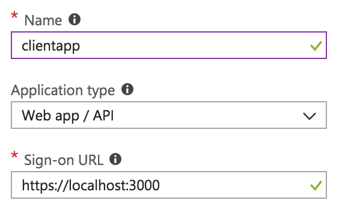
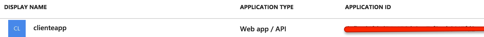
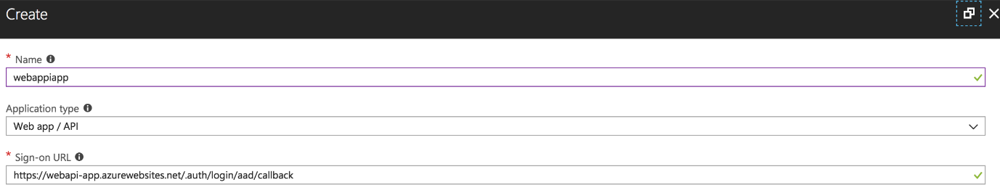
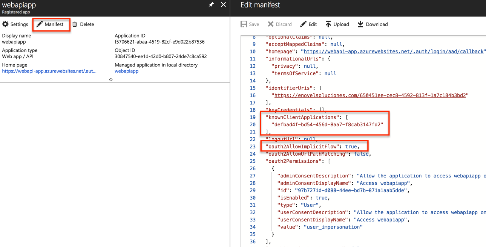
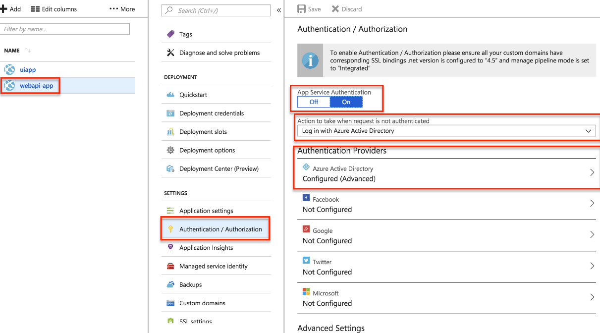
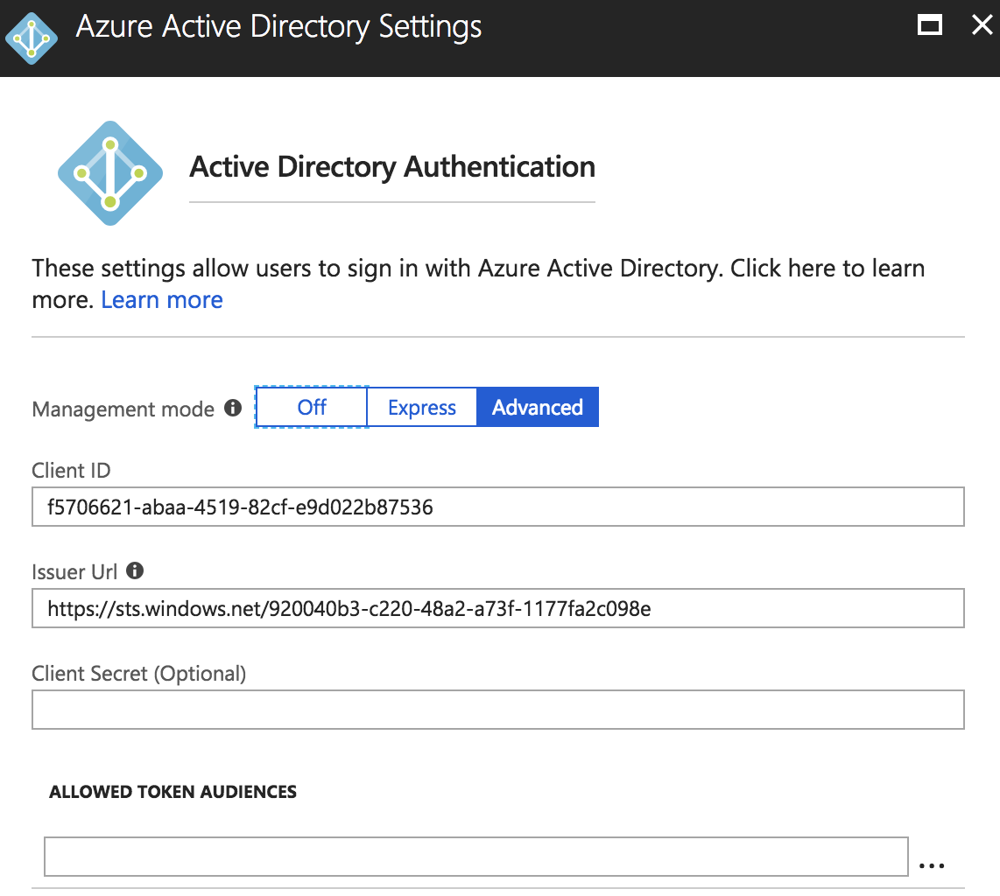
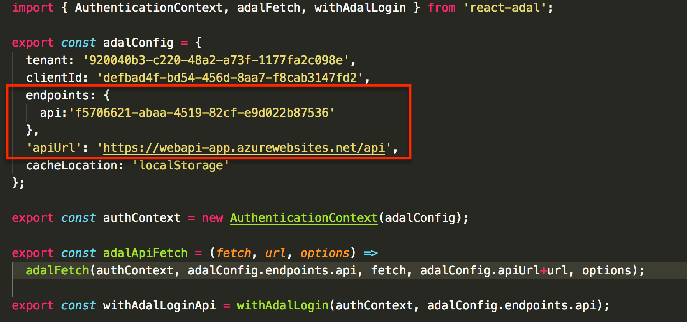

La mayoría de los desarrolladores, actualmente han estudiado las tecnologías ReactJS, Angular y VUE como fundamentales para la creación de nuevas aplicaciones. Esta información es de conocimiento de programadores incluso de los que trabajan en ASP.NET, para crear aplicaciones que hagan más ágil la transmisión de información, ya que la aplicación no se refrescaría constantemente del lado del servidor. Desde mi punto de vista, crear aplicaciones ASP.NET MVC ya no es suficiente para tener una buena experiencia de usuario, es necesario tener un framework del lado del cliente para hacer una experiencia que agrade al usuario final.

A pesar de la diversidad de textos, artículos, blogs y manuales, aún existen lagunas en la información. Al no encontrar alguna publicación con las explicaciones que necesitaba surgió la idea de este artículo. El presente texto es creado con el objetivo de mostrar cómo se configurar una aplicación ReactJS que consume un Web API para que se autentique con usuarios creados en el directorio Activo de Azure (el WebAPI también está protegido por Azure AD).


Lo primero que debemos hacer es crear un registro de aplicación en el directorio activo de Azure, como se muestra en las imágenes siguientes:


Luego creamos una aplicación con los siguientes datos:



Al terminar de crear la aplicación, debemos tomar nota del App Id:



Para este articulo asumimos que el lector tiene conocimientos básicos en ReactJS y que ya tiene una aplicación básica creada.


Ahora en nuestra app, tenemos que instalar el paquete React-adal, las instrucciones se encuentran en este sitio web: [https://github.com/salvoravida/react-adal](https://github.com/salvoravida/react-adal)


Después de haber instalado el paquete React-adal, debemos configurarlo, para esto debemos crear un archivo adal-config.js

```
import { AuthenticationContext, adalFetch, withAdalLogin } from 'react-adal'; export const adalConfig = {  tenant: 'aaaaaaaa-c220-48a2-a73f-1177fa2c098e',  clientId: 'aaaaaaa-bd54-456d-8aa7-f8cab3147fd2',  endpoints: {    api:'aaaaaaaa-abaa-4519-82cf-e9d022b87536'  },  'apiUrl': 'https://ourfuturewebappi-app.azurewebsites.net/api',  cacheLocation: 'localStorage'}; export const authContext = new AuthenticationContext(adalConfig); export const adalApiFetch = (fetch, url, options) =>  adalFetch(authContext, adalConfig.endpoints.api, fetch, adalConfig.apiUrl+url, options); export const withAdalLoginApi = withAdalLogin(authContext, adalConfig.endpoints.api);​
```


En este archivo, debemos cambiar los valores de:

·       Tenant: es el id del directorio activo.

·       clientId: es el id del registro de la app en el directorio activo.

·       Endpoints:  es un arreglo de objetos clave valor, en este arreglo se listan los API que queremos consumir desde la aplicación React, y que también están protegidos por Azure AD. (es el ID de la App registrada en el directorio activo, no es el ID del App Service).


Después de esto y, para terminar, apiURL es la URL del web api que vamos a consumir (En un momento detallaremos mas la parte de configuración del web api). Volviendo a la aplicación React, debemos crear un archivo index.js, es en este archivo es donde utilizamos el paquete instalado anteriormente en el texto.

```
import React from 'react';import ReactDOM from 'react-dom';import DashApp from './dashApp';import registerServiceWorker from './registerServiceWorker';import 'antd/dist/antd.css';import { runWithAdal } from 'react-adal';import { authContext } from './adalConfig'; const DO_NOT_LOGIN = false;runWithAdal(authContext, () => {  ReactDOM.render(<DashApp />, document.getElementById('root'));  // Hot Module Replacement API  if (module.hot) {    module.hot.accept('./dashApp.js', () => {      const NextApp = require('./dashApp').default;      ReactDOM.render(<NextApp />, document.getElementById('root'));    });  } },DO_NOT_LOGIN); 
```

```
registerServiceWorker();​
```


En el código anterior se puede observar la utilización del método runWithAdal, y dentro del este se coloca el componente principal desarrollado en ReactJS y así concluye el proceso.


Al correr nuestra aplicación por primera vez, la app se direccionará a la página de login de Microsoft, una vez autenticados, Microsoft nos enviará de vuelta a nuestra aplicación local de React con el Bearer token, el cual será guardado en el almacenamiento local del navegador según lo configuramos en los pasos anteriores.


Hasta esta sección solo hemos hecho la parte de la autenticación de la aplicación del lado del cliente, es decir el frontend, pero como es sabido las aplicaciones tienen también funcionalidad del lado del servidor, es decir la aplicación ReactJS al procesar algo del lado del servidor a través de un Web API.  Es importante mencionar que este Web API también tiene que estar protegido para que solo puedan utilizarlos usuarios o aplicaciones registradas en el directorio activo de Azure.


Para poder realizar este procedimiento es necesario regresar al portal de Azure para registrar una segunda aplicación, esta vez, será el Reply URL,  el Web API que tiene que existir previo a este procedimiento, si no se tiene se puede referir a la página: ([Como crear un Web API](https://msdn.microsoft.com/es-es/communitydocs/web-dev/webapi/mi-primer-proyecto?f=255&amp;MSPPError=-2147217396))


Es importante que al final de la URL de nuestro Web API publicado, se agregue lo siguiente: .auth/login/aad/callback. Esto es necesario para que la autenticación del directorio activo de Azure también funcione con nuestro web api.


Después de esto se debe editar el manifiesto de nuestra aplicación registrada y es importante cambiar la configuración que se muestra a continuación, a través de KnownClientApplications. KnownClientApplications, es un arreglo de aplicaciones que pueden consumir nuestro Web API. En nuestro caso es el id de la aplicación registrada anteriormente.



No se debe dejar de lado la configuración de nuestro Web API para autenticación con el directorio activo, seleccionamos nuestra web app en el portal. Y nos aseguramos de que el Web API este configurado como se muestra a continuación:



Para proseguir, se necesita el ClientID, ya que es el id de la Web API registrada en el directorio activo de Azure, y así el Issuer Url termina con el ID del directorio activo de Azure.



Como ya se había mencionado anteriormente, en el archivo adalconfig.js debemos configurar el id del Web API registrado y la Url del api, como se observa a continuación.



Una vez realizamos esto, ya podemos utilizar un controlador del API de manera segura como en el siguiente componente:

```
import React, { Component } from 'react'; import { Row, Col } from 'antd';import PageHeader from '../../components/utility/pageHeader';import Box from '../../components/utility/box';import LayoutWrapper from '../../components/utility/layoutWrapper.js';import ContentHolder from '../../components/utility/contentHolder';import basicStyle from '../../settings/basicStyle';import IntlMessages from '../../components/utility/intlMessages';import { adalApiFetch } from '../../adalConfig'; export default class extends Component {  constructor(props) {    super(props);    this.state = {        data: []    };    }   fetchData = () => {    adalApiFetch(fetch, "/values", {})      .then(response => response.json())      .then(responseJson => {        if (!this.isCancelled) {          this.setState({ data: responseJson });        }      })      .catch(error => {        console.error(error);      });  };   componentDidMount(){    this.fetchData();  }   render() {    const { data } = this.state;    const { rowStyle, colStyle, gutter } = basicStyle;    const radioStyle = {        display: 'block',        height: '30px',        lineHeight: '30px'      };      const plainOptions = ['Apple', 'Pear', 'Orange'];      const options = [        { label: 'Apple', value: 'Apple' },        { label: 'Pear', value: 'Pear' },        { label: 'Orange', value: 'Orange' }      ];      const optionsWithDisabled = [        { label: 'Apple', value: 'Apple' },        { label: 'Pear', value: 'Pear' },        { label: 'Orange', value: 'Orange', disabled: false }      ];     return (      <div>        <LayoutWrapper>        <PageHeader>{<IntlMessages id="pageTitles.TenantAdministration" />}</PageHeader>        <Row style={rowStyle} gutter={gutter} justify="start">          <Col md={12} sm={12} xs={24} style={colStyle}>            <Box              title={<IntlMessages id="pageTitles.TenantAdministration" />}              subtitle={<IntlMessages id="pageTitles.TenantAdministration" />}            >              <ContentHolder>              <ul>                    {data && data.map(item => (                        <li>{item}</li>                    ))}                  </ul>              </ContentHolder>            </Box>          </Col>        </Row>      </LayoutWrapper>      </div>    );  }}​
```

En este último ejemplo se observa cómo se puede consumir un web api que simplemente devuelve dos valores (value1, value2), pero lo interesante de esto, es que este web api está protegido con Azure AD así como la aplicación que lo consume.  El token que se obtiene al autenticarse por primera vez en la aplicación ReactJS, es reutilizado al consumir el Web API, y por lo tanto no es necesario una segunda autenticación.


Este articulo sirve como referencia para la construcción de una aplicación ReactJS la cual consume toda su funcionalidad a través de un web api, para poder realizar cualquier aplicación, espero que sea de utilidad para el lector. En próximos textos se revisará como utilizar este conocimiento para utilizar funcionalidades de SharePoint Online con los paquetes de OfficePnP.


**Luis Valencia**

[www.luisevalencia.com](http://www.luisevalencia.com/)

@levalencia

Office Development MVP

 
 
import LayoutNumber from '../../../components/layout-article'
export default LayoutNumber
