import ArticleHeader from '../../../components/article-header'

<ArticleHeader frontmatter={props.pageContext.frontmatter} />


Nuestras aplicaciones móviles para conseguir los datos a mostrar llaman a las APIs que hayamos desarrollado para obtenerlas. Estas APIs están aseguradas para que no todo el mundo pueda consumirlas, sino solo aquellas aplicaciones que tengan permiso para hacerlo.

Por otro lado, para autenticar los usuarios en nuestra aplicación móvil lo más normal es usar un sistema de Identidad que nos permita implementar la autenticación mediante OAuth o OpenId Connect, y que nos permita obtener el token correspondiente para poder enviar a nuestras APIs.

Un sistema de identidad fácil de usar y bastante extendido es Azure AD, que nos permite realizar todas las operaciones anteriormente mencionadas y muchas otras ([https://docs.microsoft.com/es-es/azure/active-directory/](https&#58;//docs.microsoft.com/es-es/azure/active-directory/)). Vamos a ver cómo podemos autenticar mediante OAuth una aplicación Xamarin Forms, solo en versión Android, y que llame a una API alojada en una WebApp de Azure asegurada mediante Azure AD.

**Creando las aplicaciones en Azure AD**

Primero deberemos crear dos aplicaciones en Azure AD que serán las que provean la identidad a nuestra aplicación móvil y a nuestra API REST. Empezaremos creando la aplicación para nuestra aplicación móvil.

Para ello iremos a Azure Active Directory – App Registrations y le daremos a New Application Registration.

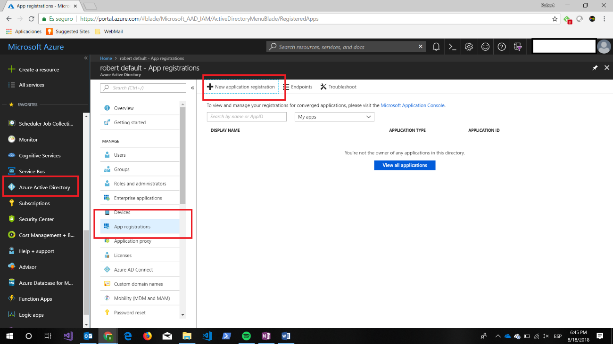

Nos aparecerá la pantalla para añadir la información de nuestra aplicación:

·       Name à Nombre de nuestra aplicación.

·       Application Type à Combo con dos opciones. En este caso seleccionaremos la opción de Native.

·       Redirect URI à Dirección de retorno, en nuestro caso pondremos una url cualquiera con formato válido.

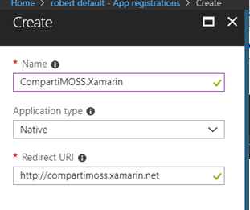

Ahora nos guardaremos el Application ID que lo necesitaremos más adelante.

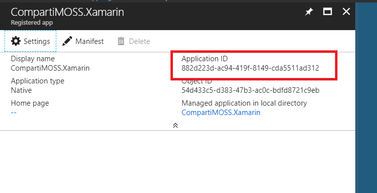

Ahora vamos a crear la aplicación para la API REST. Seguimos los mismos pasos que en el caso anterior para crearla. Y en el punto de añadir la información en la opción de Application Type seleccionamos la opción WebApp / WebAppi y en la rediret URI ponemos la URL donde alojaremos nuestra API Rest

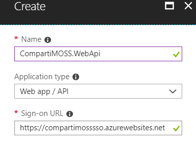

Una vez creado nos guardaremos el Application ID como anteriormente, y además crearemos una key que será la secret key para la Web API.

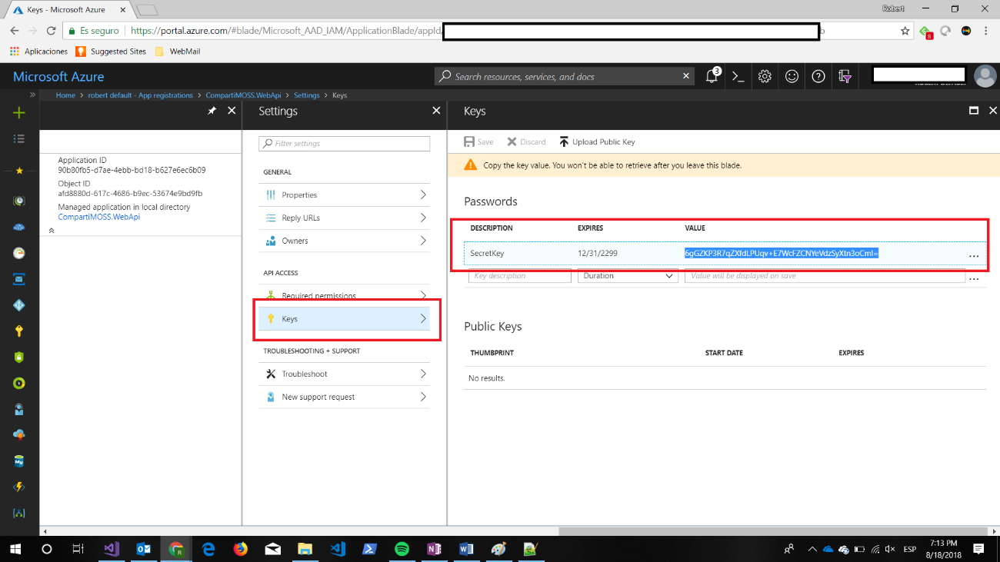

Estos valores nos servirán para configurar la autenticación de nuestra API REST. Ahora le daremos permiso a Read Directory Data, para ello le damos a la opción Required Permisions, seleccionamos Windows.Azure.Active.Directory y en Delegated Permissions seleccionamos Read Directory Data.

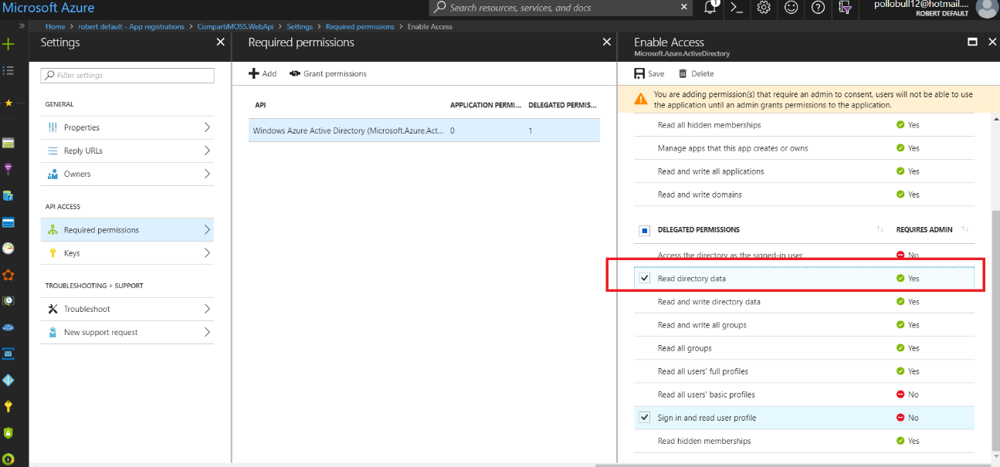

Después de ello le daremos Grant Permissions a la aplicación.

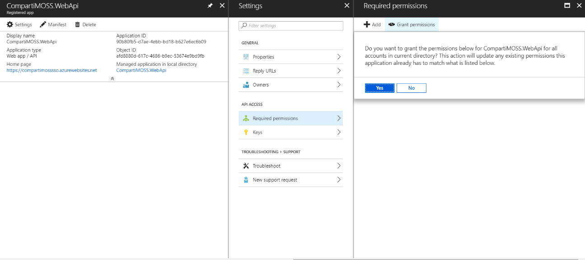

Ahora lo que debemos hacer es dar permisos a las aplicaciones la una a la otra para que tengan acceso entre ellas. Primero le daremos permisos de la aplicación de la API a la aplicación Mobile. Para ello, iremos a la aplicación que hemos creado anteriormente CompartiMOSS.Xamarin, seleccionaremos Settings y le daremos a la opción Required Permissions

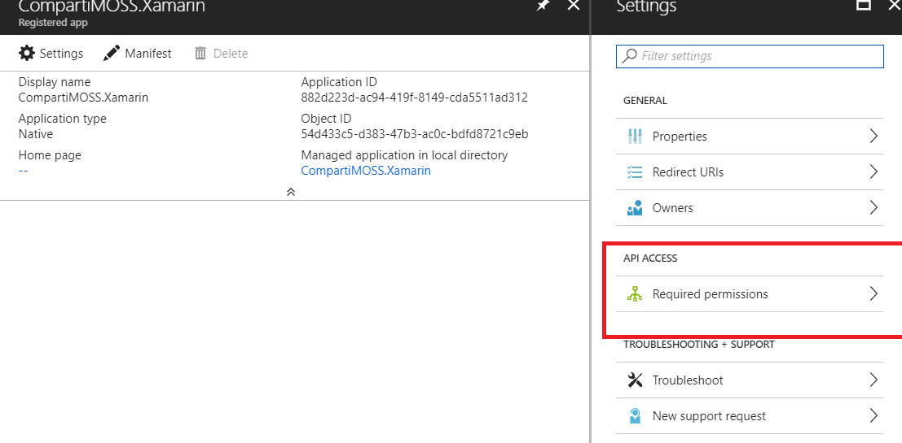

​Le daremos a Add, buscaremos nuestra aplicación API, la seleccionamos y le daremos los permisos.

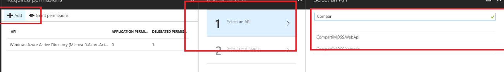

Ahora haremos lo miso con la aplicación de la API, pero el procedimiento es diferente. Buscaremos la aplicación y le daremos a Manifest, y en la sección knownClientApplications. Añadiremos el Application Id de la aplicación Mobile.​

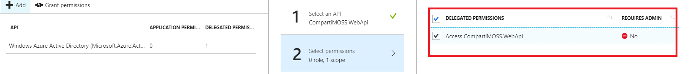

```
 Una vez esto hecho, solo nos faltará conocer un parámetro para nuestra configuración, el Id de nuestro tenant de Azure AD. Para ello en la opción de Azure Active Directory, seleccionamos Properties y nos apuntamos el Directory Id 
```

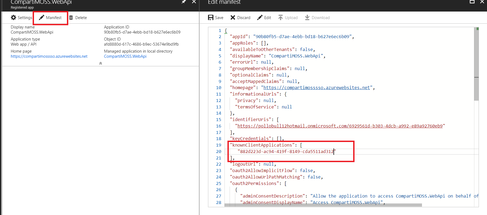

**Añadiendo autenticación en Xamarin.Forms**

Primero crearemos una aplicación Xamarin.Forms (shared Project), para este ejemplo seleccionamos únicamente Droid, ya que solo lo veremos para Android.

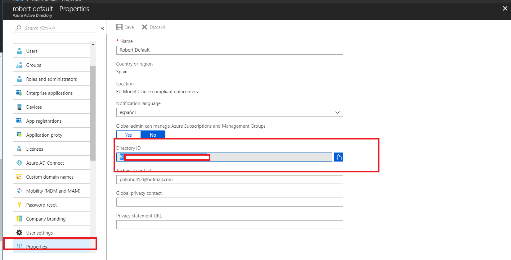

En la imagen anterior vemos la estructura de proyectos que se nos crea, ahora debemos añadir el siguiente paquete Nugget en ambos proyectos:

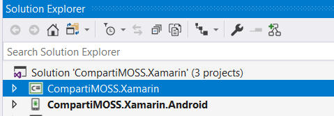

En la imagen anterior vemos la estructura de proyectos que se nos crea, ahora debemos añadir el siguiente paquete Nugget en ambos proyectos:

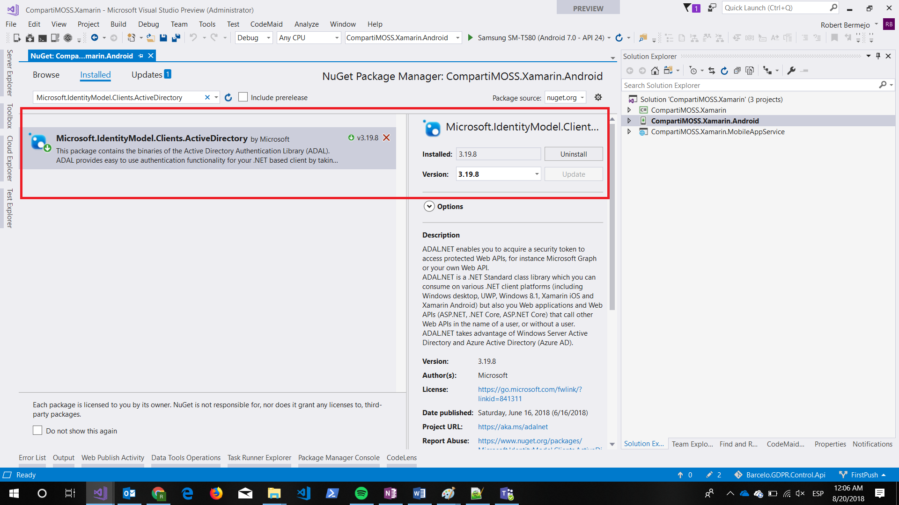

En el proyecto Android, en la clase MainActivity añadiremos la sobreescritura del método OnActivityResult:

```
protected override void OnActivityResult(int requestCode, Result resultCode, Intent data){         base.OnActivityResult(requestCode, resultCode, data);          AuthenticationAgentContinuationHelper.SetAuthenticationAgentContinuationEventArgs(requestCode, resultCode, data);}​
```

En el proyecto Shared, en este ejemplo Xamarin, crearemos la interface que especificará el los métodos para realizar la autenticación en este ejemplo:

```
public interface IADALAuthenticator{        Task<ADToken> AuthenticationAsync();}​
```

Ahora en el proyecto de Android, implementaremos la inteface anterior:

```
public class ADALAuthenticator : IADALAuthenticator    {        private const string TenantUrl = "https://login.microsoftonline.com/common";        public static string ADClientId = "882d223d-ac94-419f-8149-cda5511ad312";        public static string tenant = "xxxx-8106-48a2-a786-xxx";        public static Uri returnUriId = new Uri("http://compartimoss.xamarin.net");        public static string WebApiADClientId = "90b80fb5-d7ae-4ebb-bd18-b627e6ec6b09";         public async Task<ADToken> AuthenticationAsync()        {            try            {                var platformParams = new PlatformParameters(CrossCurrentActivity.Current.Activity);                var authContext = new AuthenticationContext(TenantUrl);                 if (authContext.TokenCache.ReadItems().Any())                {                    authContext = new AuthenticationContext(authContext.TokenCache.ReadItems().FirstOrDefault().Authority);                }                 var authResult = await authContext.AcquireTokenAsync(WebApiADClientId, ADClientId, returnUriId, platformParams);                 return new ADToken()                {                    AccessToken = authResult.AccessToken,                    TokenType = authResult.AccessTokenType,                    Expires = authResult.ExpiresOn.Ticks,                    UserName = authResult.UserInfo.DisplayableId                };            }            catch(Exception ex)            {                throw ex;            }        }    }​
```

Del código anterior, lo importante es que en el método AcquireTokenAsync el primer parámetro que es el resource donde haremos el login, ponemos el Application Id de la WebApi, de esta forma obtendremos un token válido para poder enviarlo en las peticiones. Ahora lo único que nos queda es en nuestra “page” llamar a esté método.

En este ejemplo, nuestra página principal se llama XamarinAdalPage, donde hay un botón que al hacer clic llama al método de autenticación mostrando el login de Azure AD

```
public partial class XamarinAdalPage : ContentPage{        public XamarinAdalPage()        {            InitializeComponent();        }         async void Login_Clicked(object sender, System.EventArgs e)        {            await LoginAsync();        }        private async Task LoginAsync()        { var response = await DependencyService.Get<IADALAuthenticator>().AuthenticationAsync();           if (response != null)          {App.BearerToken = response.AccessToken;                await Navigation.PushModalAsync(new MainPage());          }        } }​
```

Una vez se ha realizado la autenticación ya hemos obtenido el Bearer Token y ya lo podemos enviar en nuestras llamadas a la API.

```
HttpClient client = new HttpClient();    client.BaseAddress = new Uri($"{App.AzureBackendUrl}/");    client.DefaultRequestHeaders.Authorization = new  AuthenticationHeaderValue("Bearer", App.BearerToken);​
```

Ahora lo único que nos queda por hacer es autenticar la API que hayamos creado con Azure AD, para ello hacemos botón derecho en Connected Services y seleccionamos Authentication with Azure Active Directory.

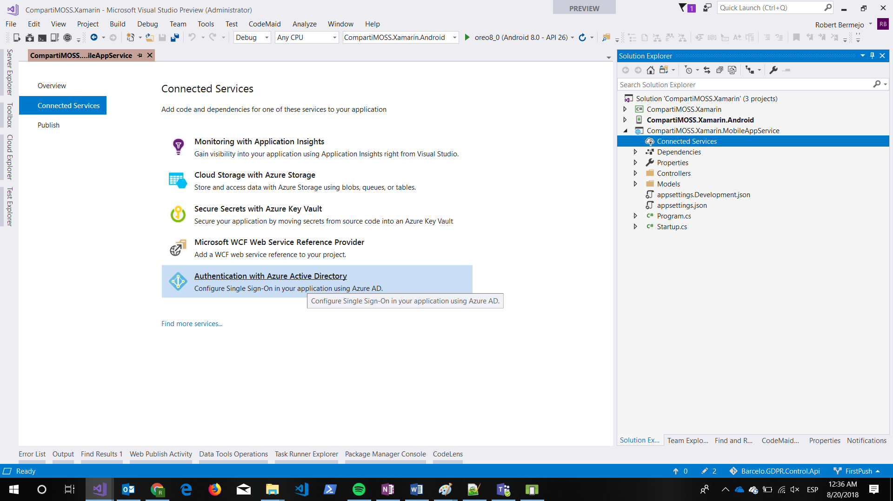

Seleccionamos la segunda opción:

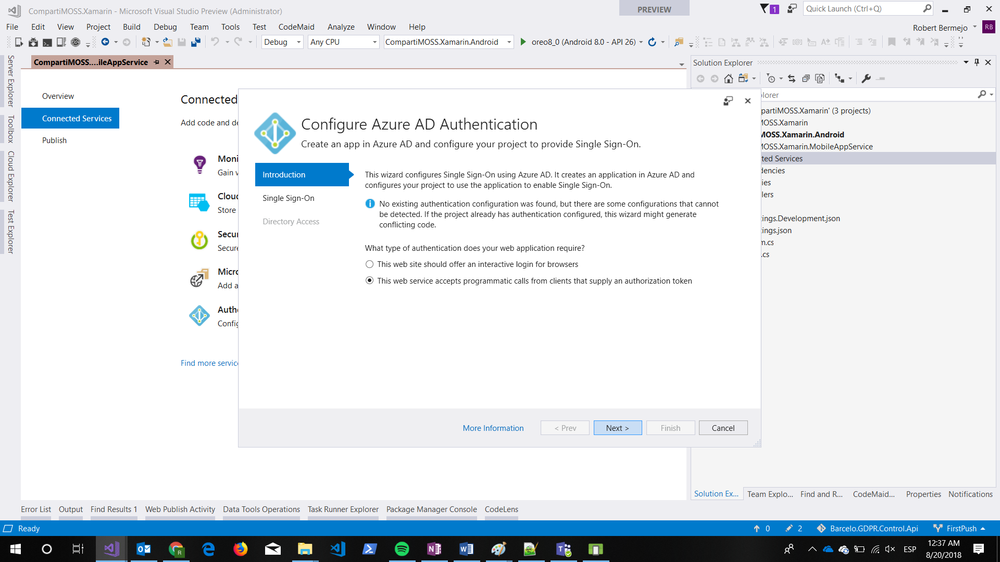


​​Seleccionamos la opción de usar settings ya existentes.​

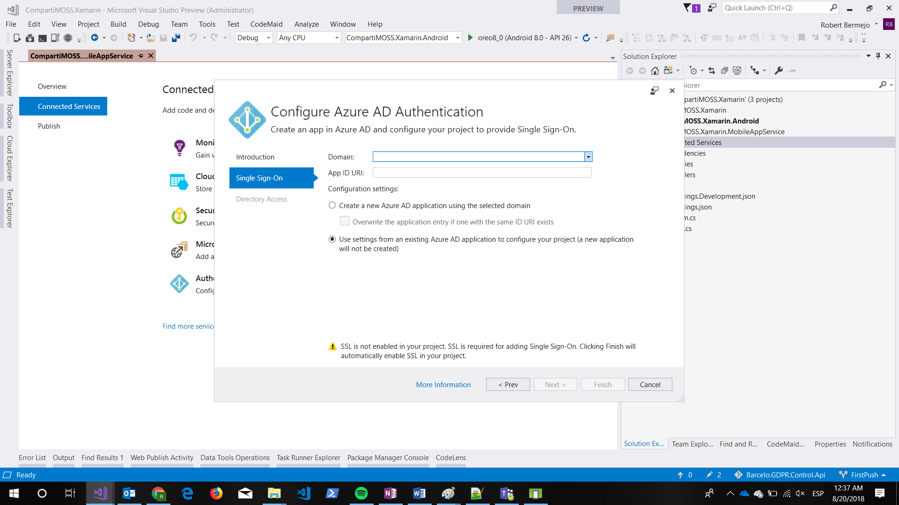

```
 A partir de este punto lo único que se debe hacer es añadir toda la información que anteriormente hemos ido apuntado. Si mediante el transcurso de esta operación os diera algún error, podéis realizar todo el proceso creando una aplicación nueva, y acto seguido en appSettings cambiar la configuración por la que hemos creado al principio. 
```

```
 Con todo esto lo único que queda es desplegar la API en Azure y llamarla desde la aplicación Xamarin de forma segura. 
```

```
 Podéis ver todo el código completo en:  https://github.com/bermejoblasco/CompartiMOSSXamarinAAD  
```


**Robert Bermejo**
 Cloud Specialist in TOKIOTA | Microsoft Azure MVP

bermejoblasco@live.com
 @robertbemejo
 www.robertbermejo.com

