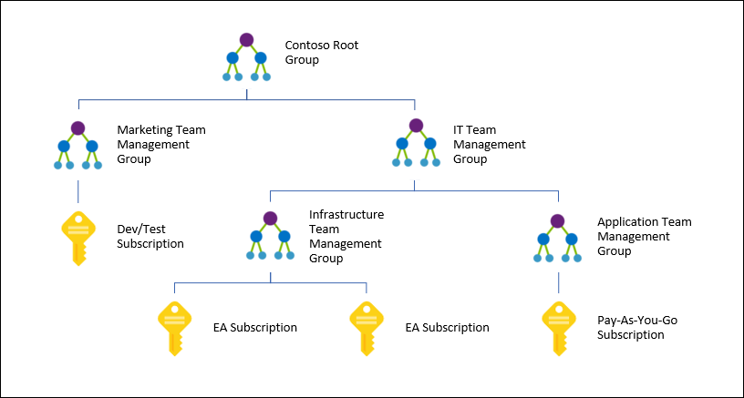
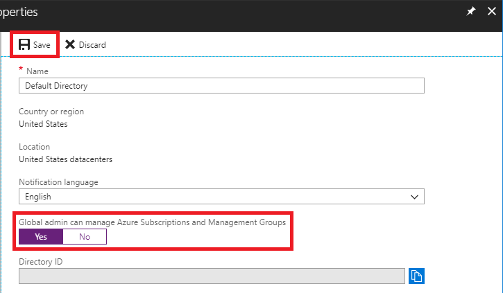
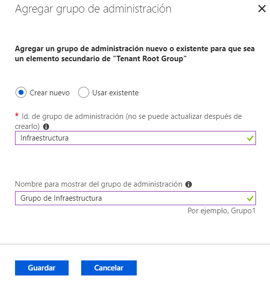
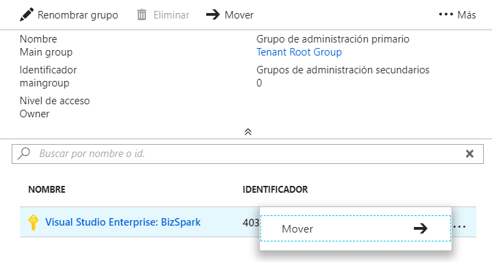
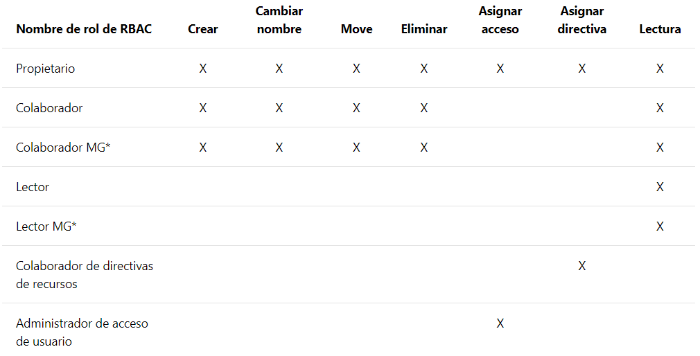

¿A quién no le ha pasado? Un cliente pide ayuda con el gobierno de Azure, tu vas y le cuentas RBAC, las directivas y el cumplimiento, además de buenas prácticas. Al cliente le va gustando, y como tiene un contrato EA (Enterprise Agreement) pregunta que cómo puede aplicar todo eso a varias suscripciones a la vez. No puedes, tienes que repetirlo todo en cada suscripción. Gesto de decepción. Pasemos a otro tema.

Pues eso acaba de cambiar radicalmente con los Azure Management Groups, o Grupos de Administración de Azure

**¿Qué es?**

Los Grupos de Administración de Azure permiten agrupar suscripciones para aplicar directivas o roles de RBAC a varias suscripciones a la vez. Todas las suscripciones (y sus recursos) dentro de un Grupo de Administración heredan automáticamente los controles aplicados al Grupo de Administración. Además de suscripciones, podemos organizar los Grupos de Administración de manera jerárquica.

Utilizando la jerarquía de grupos de la Imagen 1 podemos, por ejemplo, aplicar una directiva que permita la creación de máquinas virtuales sólo en West Europe para el grupo "Infrastructure Team Management Group". Esta directiva se heredará a las dos suscripciones EA y aplicará a todas las máquinas virtuales de esas suscripciones. Al ser una directiva heredada, ningún administrador de las suscripciones podrá alterar estas directivas, a menos que tenga el rol RBAC adecuado en el Grupo de Administración.

Los Grupos de Administración de Azure también son útiles para asignar permisos en varias suscripciones a la vez. Si damos a un usuario un rol RBAC sobre un determinado Grupo de Administración, todas las suscripciones y recursos bajo ese Grupo de Administración heredarán los permisos.

**Grupo Raíz**

Cada directorio (tenant) de Azure AD tiene un Grupo de Gestión Raíz, del cual "cuelgan" todos los demás grupos o suscripciones. El Grupo Raíz permite aplicar roles RBAC y directivas de forma global a todo el directorio.

Para acceder al Grupo Raíz, el administrador global debe elevar sus propios permisos, yendo a las propiedades de Azure AD y seleccionando la opción de gestionar suscripciones y grupos de administración. Al hacerlo, está elevando permisos a sí mismo, y no a todos los administradores globales. Se recomienda que esta elevación de privilegios sobre el Grupo Raíz sea temporal y sólo por necesidad.

El Grupo Raíz no se puede editar, borrar, ni mover.

**Crear Grupos de Administración**

La creación del primer Grupo de Administración puede llevar varios minutos, ya que al activar esta funcionalidad se disparan varios procesos, por ejemplo, la creación del Grupo Raíz, y la asignación de todas las suscripciones existentes en el tenant como herederas del Grupo Raíz.

Para crear un nuevo Grupo de Administración en el portal de Azure, buscamos en Todos los servicios -&gt; Grupos de Administración y damos a "Agregar grupo de administración"

El ID del grupo es un identificador único que se utilizará para lanzar comandos a este Grupo de Administración.

La opción de crear un nuevo grupo la encontramos tanto a nivel de Grupo Raíz, como en cualquier otro Grupo de Administración, para poder ubicar el nuevo grupo en el lugar deseado dentro de la jerarquía. Ingresando a los detalles del grupo se nos presentan más opciones, por ejemplo agregar suscripciones al grupo, renombrar o mover el grupo a otro nodo de la jerarquía (el grupo raíz no se puede renombrar ni mover).

Para crear un grupo con Powershell:

New-AzureRmManagementGroup -GroupName Madrid -DisplayName "Infra Madrid" -ParentId Infraestructura

Con este comando hemos creado un nuevo grupo bajo el grupo “Infraestructura”

Para cambiar el nombre a un grupo (sólo podemos cambiar el Display Name, el ID no se puede actualizar):

Update-AzureRmManagementGroup -GroupName Madrid -DisplayName "Infraestructura Madrid"

Para poder borrar un Grupo de Administración, no debe tener ningún grupo o suscripción en un nivel inferior.

Remove-AzureRmManagementGroup -GroupName Madrid

Para mover suscripciones entre Grupos de Administración, debemos ser Owner de la suscripción, y Owner o Contributor de los Grupos de Administración.

En Powershell harían falta dos pasos, en primer lugar, quitar la suscripción del grupo actual, y luego agregarla al nuevo grupo.

Remove-AzureRmManagementGroupSubscription -GroupName Madrid -SubscriptionId 12345678-1234-1234-1234-123456789012

New-AzureRmManagementGroupSubscription -GroupName Barcelona -SubscriptionId 12345678-1234-1234-1234-123456789012

También Podemos mover Grupos de Administración a otro lugar en la jerarquía. Al mover grupos, todos los recursos, grupos y suscripciones heredados también se moverán.

Update-AzureRmManagementGroup -GroupName Madrid -ParentId Desarrollo

**Especificaciones**

·    10,000 grupos de Administración por tenant.

·    Cada tenant puede contener 6 niveles de grupos anidados (Excluyendo el grupo raíz y las suscripciones).

·    Cada grupo y cada suscripción pertenece a un solo Grupo de Administración.

**Permisos**

La siguiente tabla muestra los roles RBAC y los permisos sobre los Grupos de Administración.

**Conclusión**

Hacía falta ya una forma de gestionar diferentes suscripciones de manera centralizada. Los Grupos de Administración vendrán de maravillas a los administradores, no sólo para reducir las tareas de gobierno, sino también para evitar errores en la asignación de controles, y crear un solo punto de mantenimiento.

Desde Microsoft dicen que esto es solo el principio, y que más funcionalidades llegarán pronto alrededor de los Grupos de Administración. ¡Estaremos atentos!

**Pablo Ortiz Baiardo**
 Infrastructure & Cloud Consultant
 ortiz.pablo@gmail.com
 @portiz2017

https://www.linkedin.com/in/portiz​

 
 
import LayoutNumber from '../../../components/layout-article'
export default LayoutNumber
