Desde el inicio de los tiempos, los seres humanos han querido organizar diferentes tipos de información de muchas maneras distintas. Desde pintando en cavernas con piedras de colores, utilizando papiro, haciendo cálculos con un ábaco, y construyendo bibliotecas de proporciones bíblicas. Conforme la humanidad ha ido avanzando, la tecnología ha ido mejorando a pasos de gigante.

Ahora hay calculadoras que valen menos que un refresco y tienen más capacidad y velocidad de cálculo que un mini ejército de matemáticos. Y ni qué decir de las computadoras, algunas iniciaron siendo del tamaño de un cuarto y ahora caben en la palma de la mano.

Y tratando de no entrar en mucho detalle para no aburrirlos y brincándome una gran parte de la historia, viajemos al punto de la historia en donde nació la inteligencia de negocios, conocida comúnmente como business intelligence o simplemente BI.

Aunque al principio no era tan sofisticado. Había aplicaciones de todo tipo, algunas complejas, algunas sencillas. Algunas tiraban tablas de texto, otras presentaban algunos gráficos. Pero lo que siempre se tenía en común era que a partir de la información que se presentaba, se tomaban decisiones informadas. Y algunas de estas herramientas utilizaban hojas de cálculo, no obstante, cuando se llegaba a cierta cantidad de datos era necesario una bases de datos.

Y las bases de datos cambiaron por completo la cantidad de información que podía ser almacenada, procesada, y clasificada!

Y hay bases de datos de todo tipo. Desde las más pequeñas como Access, algunas comerciales como Oracle y SQL Server, otras open source como MySQL y PostgreSQL. Había para todo tipo de gustos, colores, sabores, billeteras y capacidad de procesamiento. ¡Entonces llegamos a un punto de la vida en la que hacer una aplicación para inteligencia de negocios con grandes cantidades de datos era “fácil”! Los pasos eran algo como así:

1.       Se buscaba cuál era la maquina más grande que se podía comprar. Se conseguía presupuesto y se mandaba a pedir.

2.       Luego se escribía el cheque con más ceros posibles que aguantara el presupuesto para comprar la base de datos comercial más poderosa posible.

3.       Y se encerraba unos cuantos desarrolladores con mucha pizza y mucho café en un cuarto a hacer magia.

4.       “Profit”

Bueno, tal vez este cuarto paso podría variar un poco, pero esa es la idea en general. No todas las aplicaciones eran un éxito, pero aquellas que sí, daban un apoyo tremendo para tomar decisiones informadas.  Pero conforme pasó el tiempo, la cantidad de datos fue creciendo de manera exponencial. Había ya aplicaciones en las cuales una sola máquina no le hacía ni cosquillas.  ¿Como qué? Me imagino que te estás preguntando. Pues el mejor ejemplo es los motores de búsqueda de internet.

No sé si usted sabía, pero al inicio de los 80s, se tenía un archivo llamado hosts.txt en Stanford que tenía los IPs y los nombres de todas las máquinas conectadas a la internet de esa época. Ya para finales de los 90s e inicios del siglo 21 ya internet había crecido tanto que para indexar toda la información de todas las páginas era imposible hacerlo con una sola máquina, no importa el tamaño ni el presupuesto disponible.

Y entonces quitando y poniendo algunos detalles, resumiendo y tomando un poco de libertad artística en la historia - por ahí hay unas publicaciones de Google, el trabajo hecho en Yahoo, una plataforma que se llama Nutch, y algo de Lucene entre otros detalles - pero llegamos al punto importante de la historia, el nacimiento de una de las plataformas de procesamiento paralelo más importante que han existido: Hadoop.

Hadoop cambió la manera en la que se procesaban datos para siempre. Ya no era necesario comprar servidores de millones de dólares.  ¡Ahora era posible comprar servidores más estándares, conocidos principalmente como “commodity hardware”, pero comprar muchos de ellos y ponerlos a trabajar juntos! Y, además, como el proyecto fue donado de parte de Yahoo a Apache, al ser open source, ya no era necesario pagar por licencias con costos astronómicos.

Al principio se trabajaba creando aplicaciones en Java, con MapReduce. Pero esto fue evolucionando con el tiempo.

Más allá de una sola plataforma, se fue creando un ecosistema de plataformas para proveer a los distintos tipos de desarrolladores con herramientas que se ajusten a su caso de uso.  De ahí nacieron o se refinaron Pig, Hive, HBase, Solr y más. Pero había un detalle, todas estas plataformas son complejas. Llevan muchas configuraciones que deben de tener los valores correctos para poder trabajar en conjunto. Y aún más allá, se hay ciertas configuraciones que tienen ciertos valores óptimos que no son fáciles “adivinar”.

Y en ese momento, llegó una empresa a cambiar la manera en la que se trabajaba con Hadoop.  En resumen, su misión fue la de democratizar el mundo de Hadoop. ¿Y cómo lo lograron? Pues crearon la primera distribución de Hadoop, todavía open source, en la cual ellos se encargaban de hacer todas las configuraciones adecuadas y uno como usuario podía enfocarse en utilizar Hadoop, no en instalar cada plataforma por separado y ver cómo hacer para que trabajaran las plataformas en conjunto.

El nombre era CDH, que significa Cloudera Distribution including Hadoop.

Otra cosa que caracteriza a Cloudera es su compromiso con el open source. Cloudera ha contribuido a través de su historia dedicando una gran cantidad de recursos a mejorar las plataformas actuales y crear nuevas. Además, muchas de las mentes más brillantes del mundo de la programación trabajan o han trabajado en Cloudera.  Muchos de ellos han sido contratados para crear mejores a plataformas como Hadoop o Solr, y su trabajo luego se incluye en el código open source de Apache. Entre ellos podemos con el hombre que creó Hadoop, Mr. Doug Cutting. Tengo que confesarles que puedo ver venir por la calle a Cristiano Ronaldo, Shakira, David Bisbal o alguna Kardashian y ni me pasar por la mente ir a saludarlos o pedirles un autógrafo.

¡Pero a don Doug Cutting... hay que saludarlo!

Volvamos a Big Data. Crear un cluster (un grupo de máquinas que trabajan en conjunto) de Hadoop ahora es mucho más sencillo. Les voy a contar como se puede hacer de unas cuantas maneras. Veamos que sencillo. Una nota es que los pasos que voy a detallar ahora están explicados a detalle en un entrenamiento gratis que desarrollo Cloudera a petición de Microsoft, el cual pueden ver en el siguiente link:

·       Deploying and Scaling Cloudera Enterprise on Microsoft Azure:

( [https://ondemand.cloudera.com/courses/course-v1:Cloudera+Azure+180601/info](https&#58;//ondemand.cloudera.com/courses/course-v1&#58;Cloudera+Azure+180601/info) )

Si le interesa aprender cómo instalar *on-premises* en vez de Azure o incluso en AWS, tengo algunos cursos disponibles en Pluralsight que talvez le puedan interesar: [https://www.pluralsight.com/search?q=xavier+cloudera&categories=all](https&#58;//www.pluralsight.com/search?q=xavier+cloudera&amp;categories=all)

Pero bueno, vamos a lo importante. Ahora sí, veamos cuáles son las maneras en las que se puede instalar un cluster, y que tipo de clusters hay.

**#1 Instalación desde Cero Utilizando Cloudera Manager (Para Desarrollo)**
Esta es la manera más fácil para instalar un cluster de desarrollo. Digo de desarrollo pues es una instalación automatizada, que utiliza una base de datos "embedded", es decir que trae como parte de la instalación.

Lo primero que ocupamos es una máquina Linux. La recomendación es CentOS y acá hay un link con las instrucciones de cómo crear una máquina virtual en Microsoft Azure con dichas características desde ekl portal de Azure (portal.azure.com): [https://docs.microsoft.com/en-us/azure/virtual-machines/linux/quick-create-portal](https&#58;//docs.microsoft.com/en-us/azure/virtual-machines/linux/quick-create-portal) (el articulo indica Ubuntu, pero como les comente, les recomiendo utilizar CentOS).

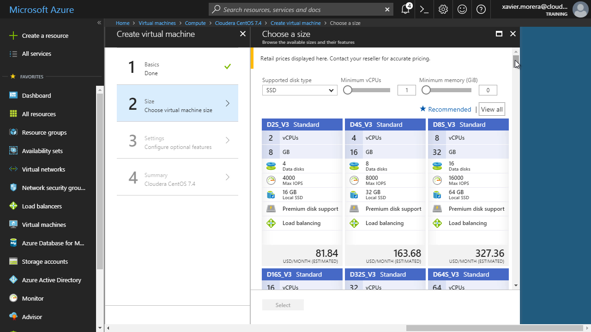

Una vez que la máquina está corriendo y se han conectado vía SSH, vamos a proceder a seguir las instrucciones para instalar Cloudera, con lo cual podemos después proceder a crear un cluster. Vamos a seguir estas instrucciones:
[https://www.cloudera.com/documentation/enterprise/latest/topics/cm\_ig\_non\_production.html](https&#58;//www.cloudera.com/documentation/enterprise/latest/topics/cm_ig_non_production.html)

Siendo tres los comandos que nos interesan:
$ wget https://archive.cloudera.com/cm5/installer/5.15.0/cloudera-manager-installer.bin
 $ chmod u+x cloudera-manager-installer.bin
 $ sudo ./cloudera-manager-installer.bin

En este punto la instalación automatizada inicia, esto es lo que se llama *Path A Install*. Cuando ya está instalado Cloudera Manager, inicia el proceso  de "bootstrap", en el cual se utiliza este servidor para instalar agentes en otras máquinas.

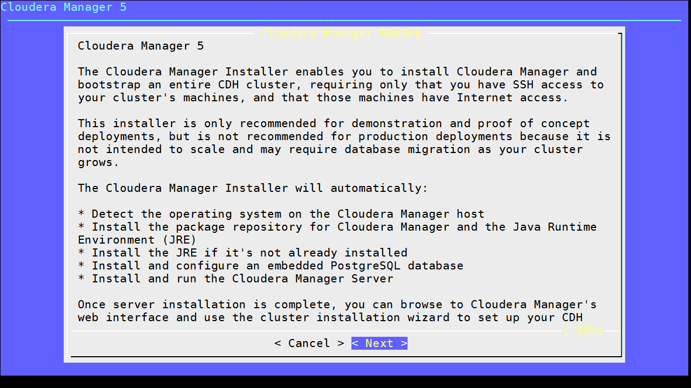

Se sigue el “wizard” de instalación, y se seleccionan cuáles son los servicios deseados:

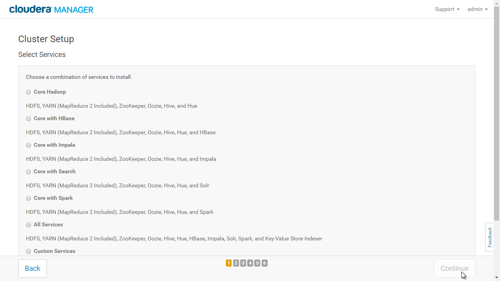

Y finalmente tendremos un cluster donde podemos ya usar Hive, Impala, Spark, Hue, Oozie, MapReduce 2, Solr, o cualquiera de los otros servicios disponibles.

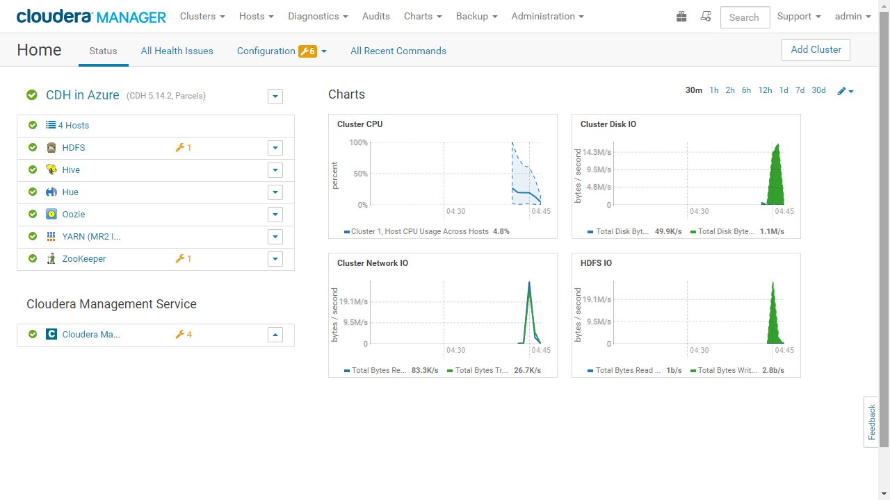

Y así de fácil, logramos instalar un cluster de desarrollo en Microsoft Azure. ¿Y qué tal si quisiéramos un cluster ya de producción? Los pasos están bien documentados, aunque son un poco más largos. Esto es lo que se llama un *Path B Install*, y la principal diferencia con el paso anterior es que es necesario crear una base de datos que puede ser MySQL, MariaDB, PostgreSQL, u Oracle. Estos son los pasos por si les interesa conocer más a fondo: [https://www.cloudera.com/documentation/enterprise/latest/topics/installation.html](https&#58;//www.cloudera.com/documentation/enterprise/latest/topics/installation.html).

No obstante, hay una forma todavía más sencilla de instalar un cluster de producción, el Enterprise Data Hub, en Microsoft Azure.  Esta metodología utiliza Azure Resource Manager para crear un cluster a base de una plantilla. Acá está el link por si desean hacer la instalación ustedes mismos: [https://azuremarketplace.microsoft.com/en-us/marketplace/apps/cloudera.clouderaedh](https&#58;//azuremarketplace.microsoft.com/en-us/marketplace/apps/cloudera.clouderaedh)

Pero, en resumen, los pasos son sencillos. Se carga la plantilla de Azure Resource Manager, se especifica los detalles de las máquinas a utilizar, se le da un nombre a un cluster, se seleccionan los servicios y al finalizar de llenar la información, se espera aproximadamente 30 minutos para tener un cluster de Hadoop en la nube.

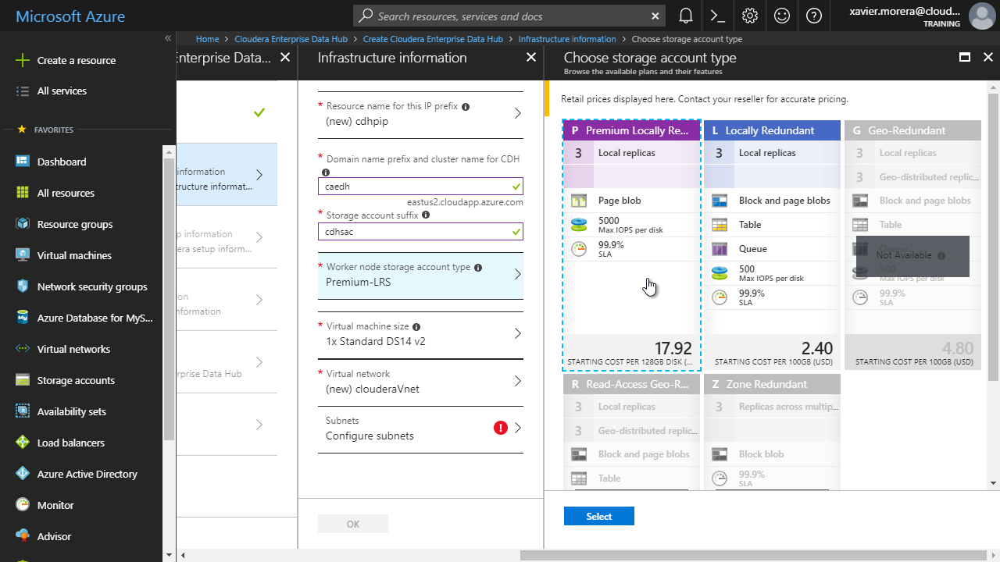

Y luego, se puede ir uno a tomar un café, ¡y al regresar tiene un cluster corriendo!

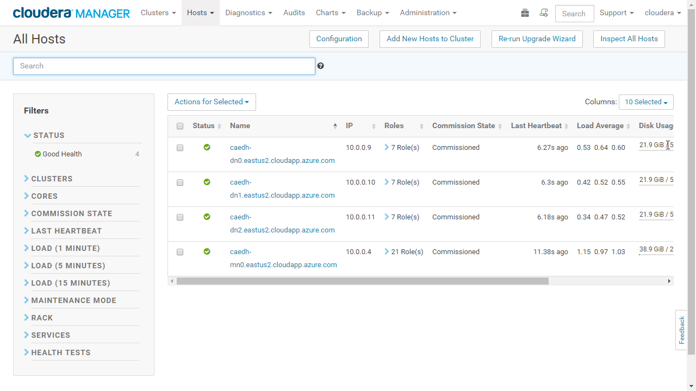

Y todos los pasos anteriores hacen la vida dentro del mundo de Big Data más fácil, **un** cluster a la vez. Qué tal si uno lo que necesita es tener una forma fácil de crear clusters bajo demanda. Es decir, cada vez que un equipo o departamento ocupa un cluster, ojalá fuera tan fácil como apretar un botón y tener un cluster nuevo. Pues eso, damas y caballeros, es lo que se llama Cloudera Director. Con Cloudera Director se automatiza la creación de clusters en Microsoft Azure. Se configura las credenciales apropiadas, se crean unas plantillas para especificar el tipo de instancia que se desea utilizar y con solo apretar un par de botones, un cafecito, y luego ya se tiene uno o varios clusters.

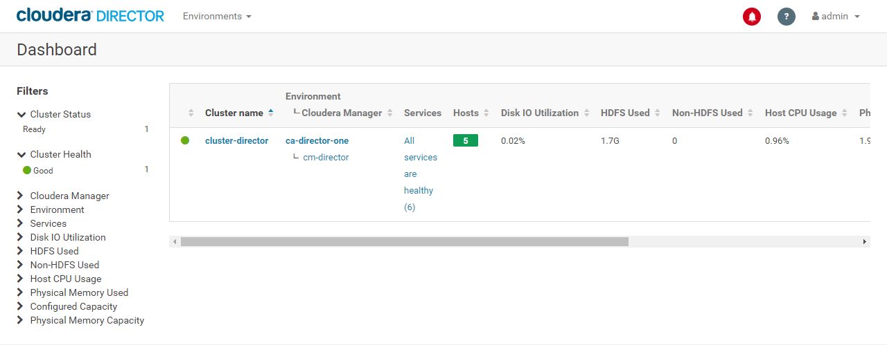

Y aunque es fácil crear (y por ende) destruir un cluster, o incluso muchos clusters, generalmente es necesario dar el mantenimiento necesario para que funcione de manera apropiada. Acá es generalmente donde se necesita personal de IT que instale actualizaciones, monitoree espacio disponible, y en general se encargue de todas las tareas normales cuando se administran servidores.

Pero hay un detalle que tenemos que tomar en cuenta.  Si uno ve una gran cantidad de los servicios disponibles ahora, la gran mayoría ofrecen software-as-a-service, lo cual es fenomenal. Es un concepto tan fácil de entender utilizando la analogía de alquilar un carro. Uno lo reserva para el periodo que lo necesita, lo utiliza y luego lo devuelve. No tiene que preocuparse del mantenimiento del mismo ni de otros aspectos mundanos.

  Y es así como Cloudera cambió la forma en la que se trabaja con Big Data, al llegar a la era de Big Data como platform-as-a-service, ¡una era de managed Big Data! Y esta plataforma se llama Cloudera Altus. 
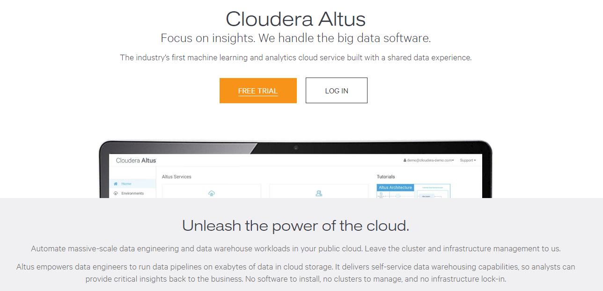

Con Altus, el foco de una aplicación de Big Data es el “job”, es decir la ejecución de una aplicación en un cluster.  Los “jobs” pasaron a ser el ente principal de una aplicación. Ya no es necesario darle mantenimiento a un cluster. Simplemente se crean para ejecutar código y se desechan al terminar o incluso se especifica que un cluster nuevo tiene que crearse durante la duración de la ejecución del código.

Lo primero que se necesita con Altus es tener un ambiente, o un “environment”. Dentro de un environment especificamos las credenciales necesarias para conectarse a Microsoft Azure y poder hacer instalaciones de clusters. Por dicha hay un “wizard” que es fácil de seguir.

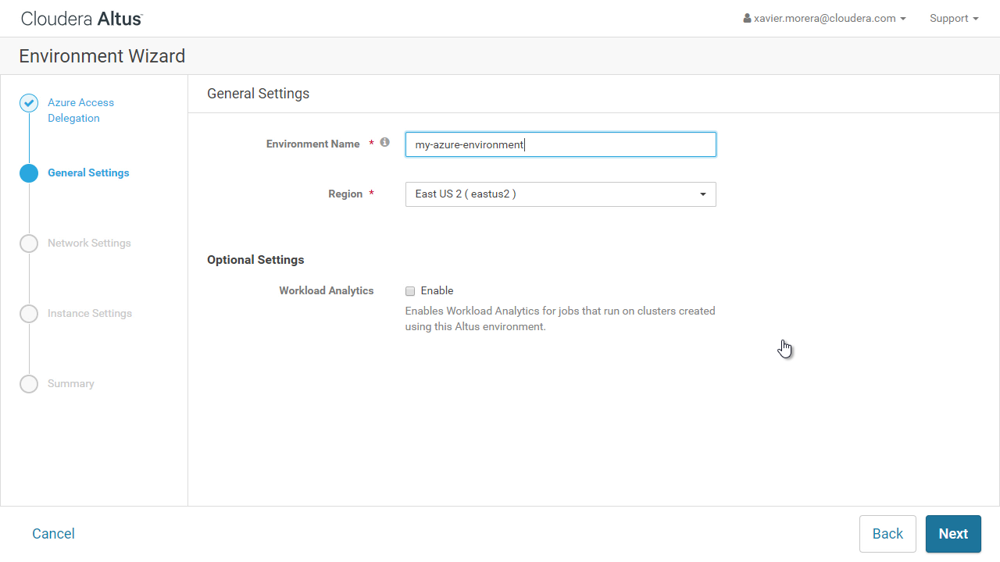

Una vez que se tiene un “environment”, y verificamos que tenemos las credenciales apropiadas, podemos crear un cluster. ¡El proceso de iniciar la creación de un cluster dura menos de 1 minuto! Solo se ocupa proveer un nombre, el tamaño, cual es el motor de ejecución - se puede seleccionar MapReduce v2/Spark/Hive/entre otros - y una información de seguridad. Después de eso, nada más es cuestión de dejarlo correr y al final tendrá un cluster de Hadoop del tamaño deseado. Pueden ser 3 nodos o 10 o 50. No importa cuantos sean, eso es solo un parámetro que uno especifica. No obstante, acuérdense de tener cuidado pues esos nodos cuestan dinero al correr en la nube.

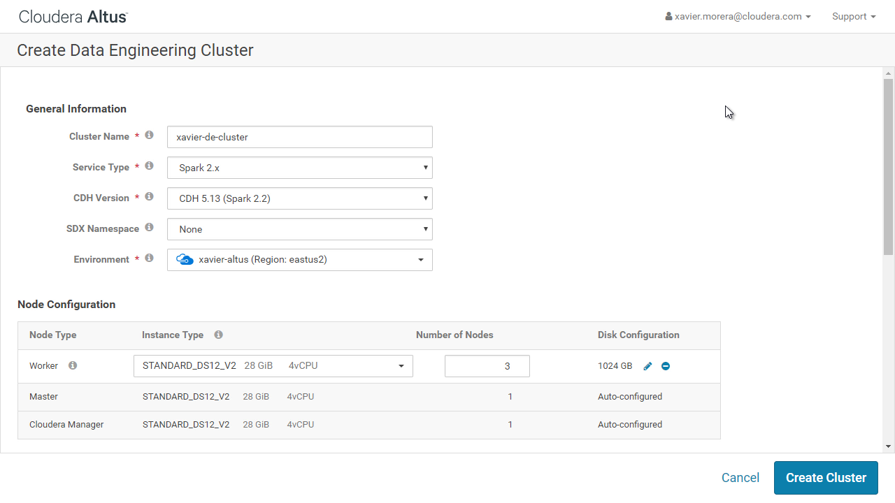

Ya con un cluster arriba podemos pasar a la siguiente etapa, le de ejecutar una aplicación. Ahora podemos enviar un “job” a ser ejecutado. Este es el “secreto” de Altus, su valor agregado, el motivo principal por el que utilizamos Altus.  El cluster está corriendo, pero no nos tenemos que preocupar de que este bien configurado. Los expertos de Cloudera configuran el cluster de acuerdo con su experiencia en el campo, con los parámetros más convenientes para el tipo de código a ejecutar, por ejemplo, Apache Spark.

Y este paso es muy sencillo, se indica cual es el código a ejecutar, se especifica cualquier dependencia, y en cual cluster se va a ejecutar. Mejor aún, si no tiene un cluster corriendo, se puede especificar que el “job” corre sobre un cluster que se levanta exclusivamente para la ejecución y al terminar se destruye. Así se paga únicamente por el tiempo en el que la aplicación corre.

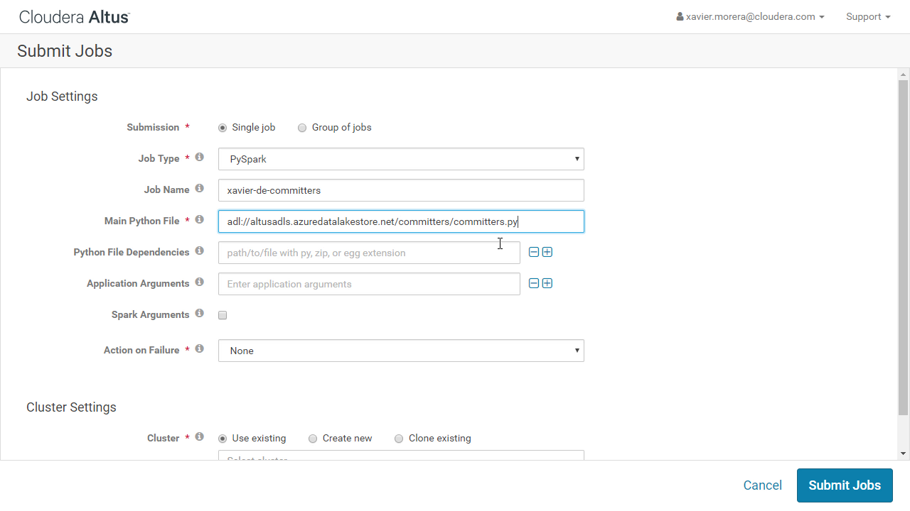

Y hablando de aplicaciones, en este caso estoy ejecutando código Python. Pero también podría ser Scala, o MapReduce, o Hive, o, en fin, cualquiera de los motores de ejecución disponibles. Y me imagino que se están preguntando, si estoy levantando un cluster, utilizándolo y destruyéndolo, ¿Dónde estoy guardando mi información? Bueno, la respuesta es muy fácil. Hay muchas opciones, pero en este caso en particular estoy utilizando Azure Data Lake Store, HDFS en la nube.
 
**Conclusión**
Y esas son damas y caballeros, las múltiples opciones que hay para correr Hadoop con Cloudera, ya sea on-premises o en la nube. Todas son opciones útiles y funcionales, no obstante, la posibilidad de utilizar Big Data manejado en la nube, es decir platform-as-a-service, nos da la opción de olvidarnos por completo de la parte de administración y enfocarnos exclusivamente en el código a ejecutar y en nuestros datos.

¡Para mi eso es innovación y de la buena!

**Xavier Morera**
xavier@familiamorera.com
@xmorera
http://www.xaviermorera.com
https://app.pluralsight.com/profile/author/xavier-morera ​​

