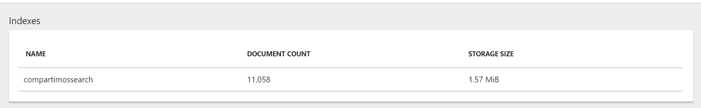

**Múltiples orígenes de datos, múltiples opciones**

La intención de este artículo es la de explorar las opciones de Indexado y rastreo en Azure Search, desde orígenes de datos diversos como bases de datos SQL en Azure, Azure Cosmos DB, ficheros alojados en un blob o bien desde un proceso propio en .Net.

Aunque repasaremos conceptos básicos del servicio, para los que no estén del todo familiarizado con el mismo recomiendo echar un vistazo a artículos anteriores de la revista que detallan a más bajo nivel el uso del servicio desde el propio portal de Azure.

**Un poco de repaso, ¿Qué es Azure Search?**

Si pudiéramos resumir en muy pocas líneas que es y para que podemos usar este servicio englobado en el catálogo de servicios PaaS de Azure, podríamos definir las siguientes características:

·       Servicio de búsqueda en la nube.
·       Ofrece a los desarrolladores las APIS y herramientas necesarias para agregar una experiencia de búsqueda enriquecida y de fácil integración en las aplicaciones. 
·       Filtros y búsquedas de texto en función de como se configure el índice.
·       Permite aplicar algoritmos de inteligencia artificial a nuestros rastreos y búsquedas mediante el uso de Cognitive services de Azure.
·       Integración con datos de cualquier origen siempre que se envíe como una estructura JSON.
·       Utilización de Indexadores para configurar rastreos automáticos desde orígenes de datos concretos como Azure SQL, Azure Cosmos DB o Azure Blob Storage.
·       Configuración del servicio para mejorar la experiencia de usuario con funciones de autocompletar, sugerencias de búsqueda, ofrecimiento de sinónimos, ordenaciones o navegación por facets por categorías para el filtrado dirigido por intervalos.

En resumen, es un servicio PaaS de Azure, que podemos integrar en nuestras aplicaciones vía bien API Rest o SDK en .Net, el cual recibe documentos JSON con la información a Indexar y que permite dar forma a un buscador con el comportamiento que lleguemos a necesitar.

**Empezando a trabajar con el servicio: Indexando los premios OSCARS**

Con los siguientes ejemplos vamos a intentar ver las diferentes opciones de indexación que nos aporta el servicio, para preparar nuestros datos de cara a montar un buscador en nuestras aplicaciones. Para ello he dejado una sencilla solución de Visual Studio en [**GitHub**](https://github.com/tbsng15/CompartimossSearch), que podéis descargar y trabajar con ella.

La solución va a trabajar con dos ficheros que contienen la información histórica de los premios Oscars:

·       Data\_oscars.csv
·       Data\_oscars.json

Por ver varios con los ejemplos, el primer fichero está en formato CSV para poder indexarlo desde un servicio de Cosmos DB en Azure Search con un indexador automático, y el segundo está en formato JSON para poder crear y subir un índice vía SDK de forma sencilla con un proyecto 100% en Visual Studio.

**Creando y cargando nuestro primer Índice vía SDK de .Net en Azure**

La primera opción y la más sencilla para empezar a trabajar con el servicio, es construir un pequeño proceso de Indexado con .Net Core y el SDK de Azure, con el que podremos subir nuestros datos vía JSON para posteriormente indexarlos en el servicio.

Vamos a crear un proceso que realice las siguientes tareas:

·       Serializar toda la información de nuestro fichero JSON de datos en una clase AzureSearchModel.cs 
·       Crear un índice en un servicio de Azure Search (previamente creado).
·       Subir un documento JSON con la información serializada.

Una vez concluido el proceso podremos ir al portal de Azure y realizar una pequeña consulta, para ver que la información esta correctamente indexada. Del proyecto descargado debemos fijarnos en la clase AzureSearchService del proyecto Services que nos va a permitir interactuar con el servicio de búsqueda de Azure, y la clase AzureSearchModel del proyecto Models que define la naturaleza de nuestro índice y como vamos a poder consultarlo.

**AzureSearchService**

Contiene dos métodos con los que crearemos el índice y subiremos el modelo generado desde nuestro fichero JSON de datos.

·       **Create index:**Nos permite generar un nuevo index en el servicio, en el cual subiremos documentos con una estructura JSON y sobre los cuales haremos las consultas.

public async Task&lt;Index&gt; CreateIndexAsync&lt;T&gt;(string indexName, bool overwriteIfExists, List&lt;Suggester&gt; suggesters) where T : class

·       **Upload Document:**Este método permite subir los modelos obtenidos desde el fichero JSON con los premios Oscars desde el origen de la academia.

public async Task&lt;KeyValuePair&lt;bool, IndexBatch&lt;T&gt;&gt;&gt; UploadDocuments&lt;T&gt;(string indexName, T[] array) where T : AzureSearchModel

**AzureSearchModel**

```
public class AzureSearchModel

{

static int NextId = 0;

[IsRetrievable(true), IsSearchable, IsSortable]

public string Category { get; set; }


[System.ComponentModel.DataAnnotations.Key]

public string Id { get; private set; }


[IsRetrievable(true), IsSearchable, IsSortable]

public string Entity { get; set; }


[IsRetrievable(true)]

public bool Winner { get; set; }


[IsRetrievable(true), IsSearchable, IsSortable]

public string Year { get; set; }


public AzureSearchModel()

{

this.Id = NextId++.ToString();

}


}
```
​​​ Como se ve en la clase, le podemos especificar al servicio de búsqueda que campos de nuestro modelo son filtrables, o buscables. Para implementar este proyecto de forma correcta necesitaremos hacer uso del paquete nuget:


Para poder de forma correcta el proceso y subir nuestro juego de datos al servicio de búsqueda, debemos configurar de forma correcta nuestro proyecto de consola, y para ello debemos editar los datos de conexión al servicio de búsqueda, en el Program.cs del proyecto Compartimoss.Indexation.Console

```
static void Main(string[] args)

{

string searchServiceName = "\*\*\*\*\*";

string adminApiKey = "\*\*\*\*\*";


}​
```

​ Los datos necesarios los podremos obtener desde el portal de Azure, accediendo a nuestro servicio de Búsqueda en el apartado de Keys.


Una vez configurada la consola, podemos lanzar una ejecución desde local y comprobar que termina con éxito la subida, accediendo al portal de Azure y realizando una simple consulta, por ejemplo, por Tom Hanks.


Por terminar este apartado, aclarar el funcionamiento del proceso. Dado que utilizamos la clase IndexBatch en el método UploadDocuments y este tiene un límite de 1000 elementos por subida, vamos a subir los documentos agrupando por año del evento, tal y como vemos en el siguiente código de nuestra consola.


Así podremos subir todos nuestros datos a nuestro índice de pruebas.



**Indexadores, rastreando e indexando desde un origen de datos**

Hemos visto como cargar nuestro índice desde código con el SDK de .Net Core, esto nos va a ser muy útil para poder hacer procesos que requieran cierta lógica de transformación del dato, o que tengamos que integrar sistemas que poco tengan que ver con Azure, por ejemplo. Pero si nuestro dato se encuentra en sistemas más conocidos de bases de datos como Azure SQL o Azure DocumentDB, vamos a poder hacer uso de los llamados Indexadores.

El indexador es un rastreador (crawler) que extrae datos y metadatos útiles para nuestras búsquedas, y se puede usar bajo petición de rastreo o por el contrario dejar una programación del mismos, para que se ejecute de forma desatendida.

Se puede utilizar el indexador como único medo de ingesta de un índice desde un origen, o bien solo escoger unos pocos campos del índice.

Actualmente con estos indexadores podemos obtener datos desde:

·       SQL de Azure.
·       Azure Cosmos DB.
·       Azure Table Storage.
·       Azure Blob Storage.

Para crear un indexador, como veremos en el siguiente punto podremos hacer uso del portal de Azure, del API Rest de Azure Search o del SDK de .Net

**Conectando un CosmosDB con Azure Search vía Portal de Azure**

Vamos a ver en este ejemplo como subir nuestros datos sobre los Premios Oscars a un CosmosDB y posteriormente mediante un indexador de Azure Search, indexar esta información como hemos conseguido en el primer ejemplo.

Antes de empezar necesitamos tener creado:

·       Un servicio de Cosmos DB del tipo SQL API (la única que tiene soporte en producción ahora mismo).
·       Subir la información de nuestro Cosmos DB desde el CSV de prueba o bien vía SDK de .Net subir el JSON vía la [herramienta de migración de datos](https://github.com/azure/azure-documentdb-datamigrationtool). 
·       Crear un nuevo índice sobre el servicio de Search que utilizamos en el primer ejemplo.

**Importar el CSV a CosmosDB**

En este caso vamos a optar por utilizar la herramienta de importación de datos que nos podemos descargar desde el portal de Azure, y que nos va a permitir subir nuestro documento CSV a una colección de Cosmos DB que llamaremos OscarAdwards.

Es una herramienta bastante intuitiva, deberemos configurar la subida para que no tengamos error, de la siguiente forma:

- **Datos de origen:**Seleccionamos el fichero CSV que descargamos con la solución.


- **Datos de destino:**Debemos rellenar tanto la cadena de conexión que podemos obtener desde el portal de Azure con el servicio de Cosmos DB en el apartado Keys, como el nombre de la colección que en este caso decidimos llamarla compartimossSearch.


Como observación, si copiamos la cadena de conexión desde las claves del portal decir que este no añade el nombre de la base de datos y es necesario que tenga una estructura similar a la siguiente:

*AccountEndpoint=&lt;Endpoint CosmosDB&gt;;AccountKey=&lt;Clave primaria&gt;;Database=&lt;Nombre database&gt;;*

Al terminar el proceso de subida, si accedemos a la colección de cosmos DB y lanzamos una query podremos ver que nuestros datos se han subido de forma correcta. Vamos a obtener todos los registros de Tom Hanks, tal y como se ve en la siguiente imagen.


**Crear el indexador con Cosmos DB como Origen**

Una vez se han cargado los datos desde el CSV de forma correcta, vamos a proceder a configurar el indexador, de forma que los datos se repliquen de forma correcta en un nuevo índice del servicio de búsqueda. Para crear el indexador, necesitamos seleccionar dentro del servicio de Cosmos DB la opción "Add Azure Search" dentro del panel de opciones del servicio.


En esta nueva pantalla debemos seleccionar primero el servicio de búsqueda que hemos utilizado hasta ahora.


El segundo paso seleccionamos la instancia y la colección de Cosmos DB en la cual hemos importado los datos desde el CSV de datos.


Podríamos insertar alguna Query si queremos por ejemplo que no suban todos los datos Indexados, por ejemplo, filtrar por un año, o por un actor en concreto, pero en nuestro caso por dejarlo igual que el primer ejemplo no vamos a filtrar nada. No vamos a incluir servicios cognitivos en el indexador, pero recordar que ahora mismo solo están disponibles en las regiones de South Central y West Europe, por tenerlo en cuenta.


Por último, debemos configurar el índice nuevo que vamos a crear con los datos recuperados desde Cosmos DB, y para que sea idéntico al de nuestro proceso batch lo dejaremos como en la siguiente imagen.


El último paso y no el menos importante, es configurar el proceso de rastreo. Como hemos nombrado con anterioridad lo podemos lanzar bajo demanda o bien programar una ejecución, en este caso lo dejaremos en modo manual.


Además, podemos configurar el número de fallos que permitimos en el proceso de indexado, vamos a pensar que no falla y que no permitimos ninguno. Una vez configuremos el indexado se va a lanzar una primera ejecución, para ver si ha funcionado o no, deberemos acceder al propio servicio de búsqueda y en la pestaña Overview encontraremos los Indexadores que tenemos configurados.

Si hemos seguido la configuración de la pantalla anterior, deberéis tener una ejecución que ha fallado ya que ha excedido el número de documentos por batch, que si recordamos tiene un máximo de 1000 elementos por lote.


Para resolver este problema debemos volver a editar el indexador y dejar el tamaño máximo del batch en 1000 elementos. Si volvemos a lanzar el proceso podremos ver que ahora si es correcto y ha dejado en el índice todos los documentos.


Si analizamos el número de documentos cargados tanto desde el CSV como desde el .JSON con el proceso de consola vemos que el resultado es totalmente el mismo.


Es cierto que el peso del índice del proceso automático es ligeramente superior, ya que por ejemplo el campo ID usa un hexadecimal el proceso para rellenarlo y nosotros en el batch hemos optado por un entero, pero el número de documentos son los mismos, y por tanto no hemos perdido datos.

Para verificarlo vamos hacer la misma consulta sobre Tom Hanks y vemos que obtenemos el mismo resultado.


**Conclusiones de nuestros rastreos**

Siempre es bueno empezar por un rastreo o carga manual para conocer el servicio, es más en casos puntuales lo tendremos que hacer así ya que se cargarán desde orígenes de datos poco accesibles o amigables. ¿Quién no sufre de vez en cuando algún que otro fichero desde un FTP y que es capital para la organización?

Pero por otro lado esto nos deja un mundo de posibilidades para por un lado tener una programación de nuestros datos y una actualización de los mismos de forma desatendida, que permita hacer un incremental y un ALM correcto no solo de nuestros desarrollos sino también del dato que exponemos.

Además, poder tener en medio un Azure SQL o un Azure Cosmos DB y usarlo como backup de nuestros maestros de datos, nos permite entre otras cosas tener servicios de búsqueda en alta disponibilidad y en regiones diferentes, consumiendo una misma o distintas bases de datos. Este no es un modelo para nada novedoso en tecnología, pero del que si carecíamos no hace mucho para este tipo de servicios en Azure.

En mi opinión con los indexadores y los rastreadores que nos aporta Azure Search vamos a poder importar miles de datos de forma segura, controlada y con un rendimiento altísimo, y al otro lado de la balanza el esfuerzo para conectar nuestros maestros a nuestros índices es mínimo si lo comparamos con hacer procesos de transformación en .Net.

Como siempre digo programar es necesario, y casi obligatorio, pero hagámoslo donde aportemos valor, y que el código que tiremos sea para mejorar si cabe los servicios que ya nos aporta el portal de Azure.


**Sergio Hernández Mancebo**

Principal Team Leader en ENCAMINA

Microsoft Azure MVP

@shmancebo​

 
 
import LayoutNumber from '../../../components/layout-article'
export default LayoutNumber
