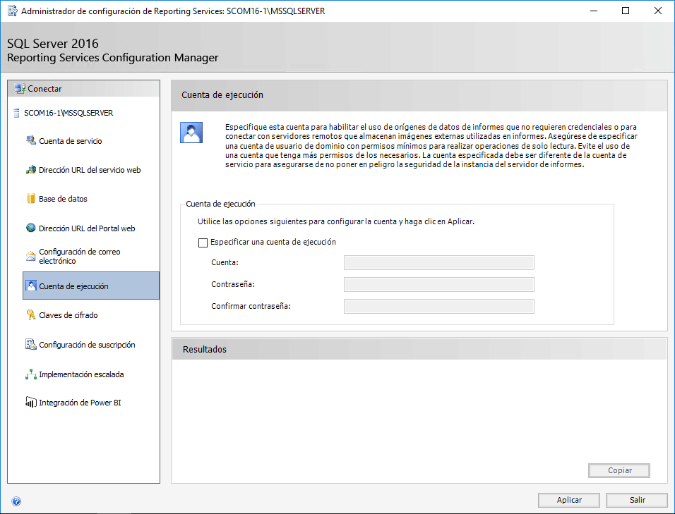

Tras haber visto que es System Center Operations Manager (SCOM) y que ventajas nos aporta su instalación, así como haber tratado brevemente los requisitos que tenemos que instalar previamente para poder desplegar esta solución de monitorización en nuestra infraestructura, en este pequeño artículo vamos a hablar de algunos temas peliagudos que debemos solventar y tener en cuenta para que no nos de problemas la instalación de la solución en sí.

En concreto, en este artículo vamos a tratar la configuración de Reporting Services, o mejor dicho, la revisión de la configuración de Reporting Services que habremos hecho previamente durante la instalación del SQL Server que usa SCOM.

Es importante que comprobemos esto porque RS es uno de los principales quebraderos de cabeza de los administradores de SCOM cuando están en fase de despliegue.

Sin ir más lejos, hace unos años, cuando salió la versión SCOM 2012 existía un pequeño bug que hacía que Reporting Services se comportara de manera anómala en caso de darse una serie de factores en concreto. Aunque el bug fue reparado por Microsoft, muchas organizaciones siguieron teniendo problemas por no haber actualizado sus sistemas debidamente.

**Premisas**

En este caso suponemos que los requisitos del sistema han sido instalados ya que se vieron en la revista número 34 y que hemos instalado dentro de esos requisitos el Reporting Services de SQL. De todas maneras, estas configuraciones pueden ser tenidas en cuenta durante el proceso de instalación de SQL Server.

**Nota:**

En este caso vamos a dividir el artículo en las distintas secciones que tiene el wizard de configuración de Reporting Services.

**Acceso a la configuración de Reporting Services**

Para comprobar que la configuración de Reporting Services de SCOM o reconfigurar aquellas partes que sea necesario modificar, podemos acceder a través del administrador de configuración de Reporting Services. Para ello vamos a todos los programas y buscamos "Microsoft SQL Server 2016 – Administrador de configuración de Reporting Services".

Para acceder a la aplicación de configuración de SQL Server 2016 Reporting Services debemos seleccionar el nombre del servidor y el nombre de la instancia que usa el servidor de informes. A continuación, haremos clic en “Conectar” y tras un breve momento estaremos conectados a la instancia de RS del servidor para poder comprobarla y reconfigurarla.

En cuanto nos validamos en el configurador de SQL Server 2016 Reporting Services deberemos recorrer distintos apartados para comprobarlos y configurarlos de la manera apropiada para que puedan dar ser vicio a SCOM. De entrada, aterrizamos en una ventana de bienvenida donde se muestra el estado del servidor y además se muestran datos del producto, informando de la versión y la edición. También obtenemos el nombre de la instancia, el nombre de la base de datos, el modo en que se está ejecutando el servicio y el estado del mismo. Por último, desde esta ventana podemos gestionar el estado del servicio; arrancándolo o deteniéndolo. Esto puede ser recomendable tras los cambios que realizaremos a continuación.

**Configuración de cuenta de usuario**

En la sección "Cuenta de servicio" que podemos seleccionar a través del menú de parte izquierda de la ventana, podemos especificar la cuenta usada para ejecutar el servicio del servidor de informes de Reporting Services para SQL Server. Disponemos de dos opciones que deben satisfacer cualquier modelo de RS que ejecutemos, fuera cual fuere su propósito.

Las opciones disponibles son:

·       Usar cuenta integrada, que a su vez nos permitirá seleccionar una de las siguientes opciones: Sistema local, servicio de red, cuenta de servicio virtual.
·       Usar otra cuenta: Para la que tendremos que dar una cuenta de dominio con el formato "dominio\cuenta" junto con su contraseña.

En nuestro caso dejamos la cuenta integrada que es la opción por defecto.

**Configuración de web de Reporting Services**

Después de esto, nos desplazamos a la sección "Dirección URL del Servicio Web" situada en la parte lateral izquierda de SQL Server 2016 Reporting Services Configuration Manager. Dentro de esta sección cambiamos "Directorio virtual" y podemos ver que conforme lo cambiamos se cambia la dirección URL. Lo podremos configurar para que se adapte a las necesidades de nuestra infraestructura, pudiendo cambiar el puerto, o asignando un certificado para que se pueda acceder de manera segura.

Básicamente, en este apartado podemos configurar distintas opciones:

·       Dirección IP: En este apartado configuraremos la IP a través de la que dará servicio Reporting Services. Por defecto está configurado como "Todas asignadas (Recomendado)". Después tendremos que tener en cuenta esto de cara a las configuraciones de los Firewall de nuestra infraestructura. 
·       Puerto TCP: Al igual que hemos configurado la IP, debemos configurar el puerto a través del que da servicio el servicio web. En nuestra infraestructura, en vez de trabajar con el puerto 80 solemos trabajar con el 8080.
·       Certificado HTTPS: Podemos seleccionar el trabajar con puertos seguros, pero en nuestro caso, para empezar y ver que todo está correcto solemos trabajar con HTTP para evitar una capa de problemas, pasando a HTTPS posteriormente. 
·       Puerto HTPS: No lo utilizamos en esta primera fase, aunque lo cambiaremos posteriormente. Hay que recordar que ésta es una capa más que necesitará de certificados y configuraciones adicionales.

Si hacemos modificaciones y con el objetivo de que el cambio sea efectivo deberemos hacer clic en "Aplicar".

**Configuración de Base de Datos**

Una vez terminada la configuración de la dirección de servicio pasamos a revisar la configuración de la base de datos de Reporting Services y si es necesario a cambiar algunos parámetros. La "base de datos del servidor de informes actual" tiene tres propiedades básicas, igual que cualquier BBDD de RS y la identifican de manera unívoca. Las opciones son:

·       Nombre de SQL Server.
·       Nombre de la base de datos.
·       Modo del servidor de informes.

En este caso, todas estas opciones pueden ser modificadas mediante los botones "Cambiar base de datos". En la sección de "credencial actual de la base de datos del servidor de informes" tenemos los siguientes puntos a revisar, que deberemos tener claros de la parte en la que planificamos la configuración de SCOM y que hablamos en el artículo anterior. En caso de ser necesario deberemos cambiarlo, y en el proceso de cambio se producirá un test destinado a evitar malos funcionamientos posteriores. Las opciones de configuración son sencillas:

·       Credencial.
·       Inicio de sesión.
·       Contraseña.

Para realizar el proceso de cambio bastará con hacer clic en "Cambiar credenciales" y seguir las indicaciones.

**Configuración de portal de Reporting Services**

Seguimos con las configuraciones dentro de SQL Server 2016 Reporting Services Configuration Manager y en este caso accedemos a la sección "Dirección URL del Portal Web", donde queremos revisar y si es necesario cambiar el "Directorio virtual". En este caso, conforme lo vamos modificando, podremos ver como a su mismo tiempo va cambiando la dirección URL a la que hace referencia. Este cambio será efectivo tras hacer clic en "Aplicar". Esta parte es donde se realizan las consultas y se muestran los informes de RS y deberemos tenerla en cuenta también de cara a las configuraciones del cortafuegos cuando queramos que se publique de cara a las distintas redes de nuestra organización. Dentro de las opciones avanzadas podemos encontrar configuraciones adicionales sobre puertos, certificados, etc.

**Configuración de correo electrónico**

Ahora pasamos a la "Configuración de correo electrónico" que nos permitirá configurar una cuenta de comunicación de cara a informaciones varias de RS. En esta sección, como no podía ser de otra manera trataremos de configurar la cuenta de correo SMTP. 
Para llevar a cabo esta tarea tenemos que rellenar los siguientes campos:

·       Dirección del remitente.
·       Método de entrega SMTP actual.
·       Servidor SMTP.
·       Autenticación.

No hace falta mucha más explicación ya que son campos de sobra conocidos por todos.  Nuestra organización utiliza correo de Office 365 por lo que mi servidor de SMTP es smtp.office365.com, pero no da problema con ningún correo que haya probado, a diferencia de SCSM, que para la generación de incidencias automáticas desde correos electrónicos es bastante más sensible.

Tal como se puede ver en la captura, podemos seleccionar distintos tipos de "autenticación". Concretamente podemos seleccionar una de las tres opciones siguientes:

·       Sin autenticación.
·       Nombre de usuario y contraseña (básico).
·       Cuenta de servicio del servidor de informes (NTLM).

Podemos ver que se nos da la opción de no utilizar autenticación. Esta opción es poco segura y no está soportada por muchos servidores de correo. Por estas dos razones y sobre todo por la seguridad, no dejaremos esta opción como no autenticada. Una vez configurada la opción que más se acerque a nuestras necesidades y para que el cambio sea efectivo, deberemos hacer clic en "Aplicar".

**Cuenta de ejecución**

A continuación, configuramos la "cuenta de ejecución" que nos permite especificar la cuenta que se utilizará para el uso de orígenes de datos de informes que no requieren validación y también para que se puedan extraer informaciones adicionales de servidores para la generación de los informes presentados. 
En esta parte debemos asegurarnos de especificar una cuenta de usuario de dominio con los permisos mínimos para realizar sólo aquellas operaciones de lectura requeridas. De esta manera evitaremos el acceso a información que no queramos que sea accedida. Debemos recordar que System Center está diseñado para la gestión de la seguridad de nuestra infraestructura y este tipo de temas debemos cuidarlos siempre. Deberemos especificar la cuenta de ejecución, proporcionando el nombre de usuario y la contraseña.

**Claves de cifrado**

Ahora pasamos a configurar las "claves de cifrado" que Reporting Services utiliza para cifrar las credenciales, cadenas de conexión y otra información confidencial almacenadas en la base de datos del servidor de informes. Reporting Services utiliza claves simétricas. Durante la configuración podemos realizar una copia de seguridad de la clave de cifrado, restaurar una clave, cambiar la clave en uso por otra o eliminar el contenido cifrado.

Hay que tener cuidado con la última opción, ya que, en caso de eliminar el contenido cifrado, se eliminarán también las cadenas de conexión, las credenciales y todos los valores cifrados que se han almacenado en la suscripción, lo cual puede ocasionarnos problemas en caso de no hacerlo de manera consciente. Además, si nosotros eliminamos el contenido cifrado debemos definir conexiones, suscriptores, etc. de nuevo.

**Configuración de suscripción**

La "Configuración de suscripción", que es el siguiente paso a configurar, sirve como cuenta de recurso compartido de archivos y nos permite ver la información de una implementación escalada. Este tipo de despliegues puede contener datos cifrados en una base de datos de informes común, por lo que necesitaremos este tipo de suscripciones. Dicho de otra manera, esta cuenta usará las suscripciones que tenga configuradas para tener acceso a los recursos compartidos de archivos. Nuevamente, tenemos que tener en cuenta el usar una cuenta con pocos privilegios para cumplir con las necesidades de seguridad de nuestra organización. En este caso debemos dar un nombre de usuario, una contraseña y la validación de esta.

**Integración de Power BI**

En la sección de "Integración de Power BI" tenemos la posibilidad de establecer el registro del servidor de informes contra el Power BI, esto permite que los usuarios puedan anclar elementos del informe a los paneles de Power BI. En esta fase del proyecto no estamos interesados en este punto, aunque puede ser interesante de cara a estudiar y analizar los datos de nuestras incidencias y sobre todo buscar tendencias. En nuestro caso lo dejamos por defecto.

**Conclusión:**

El Reporting Services de System Center Operations Manager es de sumo interés para el correcto funcionamiento de nuestra organización ya que nos permite generar informes, hacer estudios de incidencias, buscar tendencias, etc. Debemos tener sumo cuidado en las modificaciones ya que es uno de los puntos críticos en la configuración y mantenimiento de SCOM y más, tras pequeños bugs que se han dado en el pasado.

**Juan Ignacio Oller Aznar** 
 MVP Cloud and Datacenter Management 
 jioller@live.com
 @jioller
 [http://blogs.itpro.es/jioller](http://blogs.itpro.es/jioller) 
 [http://dtc2mobility.com](http://dtc2mobility.com/)

 
 
import LayoutNumber from '../../../components/layout-article'
export default LayoutNumber
