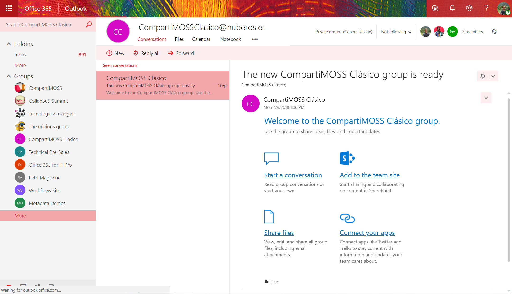

Por defecto, en SharePoint Online (SPO) podemos tener distintos tipos de sitios en función del tipo de plantilla que se ha elegido en el momento de creación. Podemos decir que las plantillas disponibles se ubican en dos grandes categorías: plantillas para sitios clásicos de SPO y plantillas para sitios modernos de SPO. En el caso de sitios modernos de SPO, actualmente tenemos dos tipos de plantillas: Sitio moderno de Grupo y Sitio de Comunicación. Ahora bien: ¿Es posible "modernizar" un sitio clásico de SPO de forma rápida de forma que podamos tener todas las características que aportan a los sitios modernos, pero en nuestros sitios clásicos? La respuesta es sí y en este artículo veremos una de las posibilidades de modernización de un sitio clásico de SPO a través de añadir un nuevo Grupo de Office 365.

**Preparando el escenario**

Lo primero que necesitaremos para hacer uso de la característica de añadir un nuevo Grupo de Office 365 a un sitio clásico de SPO es disponer de ese sitio clásico:


Este sitio lo tendremos configurado de acuerdo con nuestros requerimientos. Por ejemplo, en mi caso he configurado dos usuarios adicionales en el sitio:

·       Un usuario con rol de propietario del sitio.

·       Otro usuario con rol de integrante del sitio.

Como veréis más adelante, os detallo este setup en la configuración del sitio porque el proceso de añadir un nuevo Grupo de Office 365 al sitio clásico tiene que tener en cuenta (y respetar) las configuraciones de mi sitio clásico. En concreto:

·       Cuando se añada el Grupo de Office 365 al sitio, los usuarios propietarios del sitio pasarán a ser propietarios del Grupo de Office 365.

·       De la misma forma, los usuarios integrantes del sitio pasarán a ser integrantes del Grupo de Office 365.


**Añadiendo un nuevo Grupo de Office 365 a un sitio clásico de SPO**

Una vez que tenemos nuestro escenario de sitio clásico de SPO a conectar con un Grupo de Office 365, ya estamos listos para añadir un Grupo al sitio. Para hacer esta operación, tenemos dos posibilidades:

- La interfaz de usuario.
- PowerShell.


Para conectar un sitio clásico (**Nota:** Aunque estoy en todo momento hablando de sitio clásico, es importante tener en cuenta que sólo es posible añadir Grupos de Office 365 a Colecciones de Sitios de SPO, no a subsitios de una colección) de SPO por medio de la interfaz de usuario:

- Desde cualquier página del sitio, hacemos clic en el icono de configuración de la barra superior y a continuación en "Conectar a un nuevo grupo de Office 365":


·       A continuación, se muestra un panel que da inicio al asistente para configurar el nuevo Grupo de Office 365 a añadir al sitio. Como se aprecia en la Imagen 4, el primer panel del asistente muestra información relativa a lo que supone añadir un nuevo Grupo de Office 365 al sitio:

o   El contenido del sitio y configuraciones se mantiene.

o   Se crea una nueva página principal para el sitio que es una página moderna.

o   Se crea un Grupo de Office 365 que aporta todos los elementos propios de Grupos:

§  Un buzón de correo dónde tienen lugar las conversaciones del Grupo.

§  Un calendario del Grupo de Office 365 para realizar convocatorias de este.

§  Un Plan de Planner para planificar el trabajo de los integrantes del Grupo.

§  La posibilidad de añadir un Team de Microsoft Teams a partir del Grupo.


·       Para iniciar el siguiente paso del asistente, hacemos clic en “Empecemos” de forma que se muestra un nuevo panel en el que podemos configurar aspectos relativos tanto al Sitio de SPO como al Grupo de Office 365 a crear. En concreto (Imagen 5) podremos configurar lo siguiente:

o   El nombre del Grupo de Office 365 a crear.

o   El alias del Grupo de Office 365 a crear.

o   La descripción del Sitio de SPO.

o   La privacidad del Grupo de Office 365 a crear (Público o privado).

o   En el caso en el que se haya configurado en el tenant de Office 365, el grado de confidencialidad de los datos del Grupo.


·       A continuación, hacemos clic en “Conectar el grupo” para desencadenar la creación del Grupo de Office 365. Esta acción supone que se muestre un nuevo panel en el que podemos configurar los propietarios e integrantes del Grupo que se va a crear. Como se aprecia en la Imagen 6, el proceso por defecto configura a los usuarios en el grupo de propietarios del sitio como propietarios del Grupo y a los usuarios del grupo de integrantes del sitio como integrantes del Grupo:


·       Para finalizar, haremos clic en el botón “Finalizar” del panel de forma que se muestra la nueva página principal (y moderna) del sitio desde la que podremos acceder al resto de recursos del Grupo creado:


Como se puede apreciar, la página principal cuenta con varias páginas modernas que se han añadido de forma automática en el proceso de creación del Grupo (Noticias, Enlaces rápidos, Actividad y Documentos).

**Elementos que se añaden al sitio moderno cuando se crea el Grupo**

Además de la nueva página principal moderna añadida al Sitio, podremos comprobar que los siguientes elementos asociados al Grupo de Office 365 han sido creados/configurados:

Un buzón de correo para las conversaciones del Grupo y un calendario para las reuniones en las que participen los miembros del Grupo (**Nota:** Es posible que el buzón del Grupo no esté disponible de forma automática una vez acabe el proceso. Eso se debe a que el proceso de creación del Grupo y los elementos asociados se realiza en hilos diferentes):



·       Un plan de Planner.


·       Los usuarios propietarios e integrantes del sitio se añaden como propietarios e integrantes del Grupo respectivamente.


**Añadiendo un nuevo Grupo de Office 365 a un sitio clásico de SPO con PowerShell**

Como alternativa a añadir un nuevo Grupo de Office 365 a un sitio clásico existente mediante la interfaz de usuario, podemos hacer uso de PowerShell:

- En primer lugar, necesitaremos descargar e instalar la última versión disponible del SharePoint Online Management Shell del siguiente enlace: [https://www.microsoft.com/en-us/download/details.aspx?id=35588](https://www.microsoft.com/en-us/download/details.aspx?id=35588)
- A continuación, bien en el propio SharePoint Online Management Shell o bien en nuestro entorno PowerShell favorito (Visual Studio Code  por ejemplo), pegamos el siguiente código PowerShell que permite añadir un Grupo de Office 365 a un sitio existente de SPO:


```
$sUserName="<Office365_User>@<Office365_Domain>.onmicrosoft.com"$sMessage="Type your Office 365 Credentials"$sSPOAdminCenterUrl="https://<Office365_Domain>-admin.sharepoint.com"$sClassicSPOSite="https://<Office365_Domain>.sharepoint.com/sites/<Site_Name>/"$O365Cred=Get-Credential -UserName $sUserName -Message $sMessageConnect-SPOService -Url $sSPOAdminCenterUrl -Credential $O365Cred$sGroupDisplayName="<Group Display Name>"$sGroupAlias="<GroupAlias>"Set-SPOSiteOffice365Group -Site $sClassicSPOSite -DisplayName $sGroupDisplayName -Alias $sGroupAlias -IsPublic $true​
```

- Y como resultado, obtendremos los mismos elementos ya vistos al añadir un Grupo de Office 365 a un sitio de SPO haciendo uso de la interfaz de usuario.


**Algunos puntos de mejora en la creación del Grupo**

Algunos puntos de mejora en la creación del Grupo que podréis comprobar son los siguientes:

- Si el Sitio a conectar cuenta con un logo para el sitio, este logo no se traslada al Grupo de Office 365 como cabría esperar.


- En la parte de Membership, inicialmente veréis que los usuarios propietarios del sitio no aparecen como propietarios del Grupo de Office 365.


**Conclusiones**

Tal y como se había anunciado en Microsoft Ignite 2017, desde hace unos meses tenemos de forma nativa la posibilidad de modernizar sitios clásicos de SPO a través de añadir un nuevo Grupo de Office 365 a dichos sitios. Microsoft proporciona dos mecanismos para añadir un nuevo Grupo de Office 365 a un sitio: la interfaz de usuario y PowerShell.


**Juan Carlos González**

Cloud & Productivity Advisor | Office Servers & Services MVP

jcgm1978 | [https://jcgonzalezmartin.wordpress.com/](https://jcgonzalezmartin.wordpress.com/)

 
 
import LayoutNumber from '../../../components/layout-article'
export default LayoutNumber
