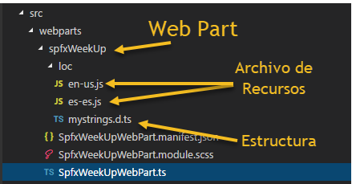

Estimados colegas programadores SharePoint es un gusto para mí poder colaborar para esta revista nuevamente después de varios años de ausencia. En fin, vámonos directo al tema en cuestión. Estaremos dando a conocer las características multilenguaje de SharePoint Framework mediante una revisión de los elementos de código necesarios para implementar soporte multi idioma.

Si eres un programador experimentado sabrás que mediante archivos de recursos y con una programación completamente libre de textos escritos en controles y/o código es que podemos lograr que nuestras aplicaciones funcionen a manera de multi idioma.



La buena noticia es que en SharePoint Framework no es la excepción, básicamente usamos archivos JavaScript por cada lenguaje que queremos implementar en nuestra aplicación, evidentemente cada archivo de lenguaje contendrá los textos en el idioma correspondiente. Para nuestra suerte la plomería de configuración generada por la plantilla de proyecto Yeoman mediante el famoso comando “yo @microsoft/sharepoint” ya incluye el soporte multi idioma en cada WebPart o extensión generada, solo es cuestión de que nosotros:
 1. Definimos la estructura que represente los datos que queremos manejar, claro que esta estructura de datos será utilizada por los archivos de recursos que generaremos por cada idioma y que además será importada para poder hacer referencia a los valores correspondientes desde nuestro código del WebPart. En el archivo mystrings.d.ts ya tiene la interface que podemos utilizar, solo agregamos nuestras variables de tipo string por cada valor que necesitamos manejar en multi idioma.

```
declare interface ISpfxWeekUpWebPartStrings {   WPTitleText:string;  WPSubtitleText:string;  WPSubtitleSuffixText:string;  WPFormat:string;}​
```

2. Crear los archivos de recursos por cada idioma a implementar, en este caso en-us.js para idioma ingles y es-es.js para idioma español, pt-br.js para portugués, etc. Cada WebPart y extensión creados con el generador de Yeoman cuenta con una carpeta llamada “loc” en donde ya reside un archivo de recurso en ingles en-us.js, solo tenemos que crear archivos adicionales por cada idioma que queremos implementar utilizando como nombre la típica nomenclatura de región como es-es, pt-br, en-us, etc.  En el siguiente fragmento vemos un ejemplo de dos archivos de recursos usando la estructura de datos definida en la interface mencionada anteriormente:

**en-us.js**


```
define([], function() {  return {       "WPTitleText":"Good day, today is",    "WPSubtitleText":"week",    "WPSubtitleSuffixText":"of the year",    "WPFormat":"dddd MMMM D"  }});​
```

**es-es.js**

```
define([], function() {    return {         "WPTitleText":"Buen día, hoy es",      "WPSubtitleText":"semana",      "WPSubtitleSuffixText":"del año",      "WPFormat":"dddd D MMMM"    }  });​
```

Ya dentro del código de nuestro WebPart se encuentra la instrucción que importa la definición de nuestra estructura de datos:

```
import * as strings from 'SpfxWeekUpWebPartStrings';​
```

Y gracias a ello podemos hacer referencia programáticamente a los valores de nuestra estructura de datos que existen dentro de cada archivo de recursos. La magia sucede en tiempo de ejecución ya que el SharePoint Framework analiza el idioma con el que se está ejecutando nuestro WebPart y retorna los valores del archivo de recursos JavaScript como instancia de la interface, de esa forma hacemos referencia a los campos de nuestra estructura de datos mediante el código y obtenemos su valor en el idioma en cuestión:

```
${strings.WPTitleText}​
```

Importante mencionar que podemos recurrir a clases y métodos JavaScript existentes en el contexto de ejecución que nos permiten saber el idioma con el que se está ejecutando nuestro código, por ejemplo:

```
this.context.pageContext.cultureInfo.currentCultureName.toLowerCase()​
```

Si quieres hacer pruebas en tiempo de desarrollo puedes utilizar el archivo config\write-manifests.json para forzar al Workbench que se ejecute en el idioma que necesitas probar, solamente agrega una entrada más al código json llamada “debugLocale” y define el idioma que necesitas:

```
{  "$schema": "https://developer.microsoft.com/json-schemas/spfx-build/write-manifests.schema.json",  "debugLocale": "es-es",  "cdnBasePath": "<!-- PATH TO CDN -->"}​
```

Necesitaras detener la ejecución de gulp serve e inicializarla de nuevo.

**Conclusión**

Ahora si como dicen las personas de Estados Unidos, "in a nutshell" que más o menos quieren decir "en resumen", esto es lo que tienes que saber para tomar ventaja de las características de programación multi idioma en SharePoint Framework.

1.       Definir la estructura de datos.

2.       Crear archivos de recursos.

3.       Invocar la estructura en el código en tu WebPart o extensión.

Bien colegas, con esto me despido esperando que haya sido de tu agrado esta breve explicación. Si necesitas ver el ejemplo paso a paso que mencione al iniciar este articulo te invito a que:

1.       Veas este video de Youtube donde demuestro paso a paso como construir un WebPart con soporte multi idioma - [https://tinyurl.com/video-multi-idioma](https://tinyurl.com/video-multi-idioma)

2.       Que descargas de mi perfil de GitHub una copia del código de ejemplo - [https://tinyurl.com/code-multi-idioma](https://tinyurl.com/code-multi-idioma)


**Haaron Gonzalez**
 Consultor SharePoint y Office 365
 haaron.gonzalez@sharepoint.com.mx
 @helpdsp​

