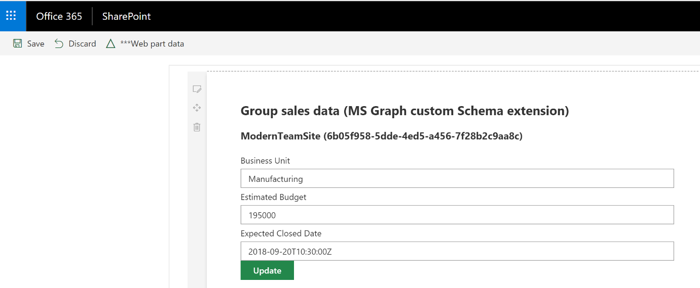
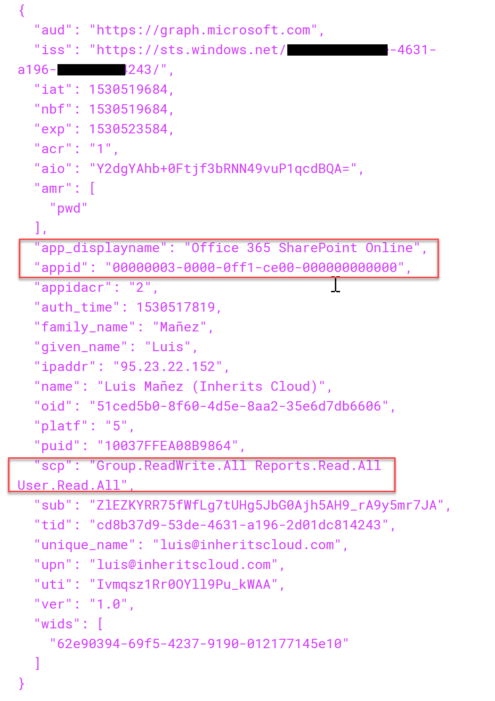

import ArticleHeader from '../../../components/article-header'

<ArticleHeader frontmatter={props.pageContext.frontmatter} />


En el número anterior de la revista, vimos como podemos extender MS Graph para almacenar nuestros propios datos ([http://www.compartimoss.com/revistas/numero-36/microsoft-graph-api-extensions](/revistas/numero-36/microsoft-graph-api-extensions)). Partiendo de lo que aprendimos en ese artículo, vamos a ver como podemos utilizar una Schema Extension de MS Graph desde una WebPart del SharePoint Framework (SPFx).

Un posible escenario de negocio sería la necesidad de extender la información relativa a un sitio de SharePoint, con algunos metadatos adicionales. Por ejemplo, imaginemos que creamos un Team site de SharePoint para toda la información relativa a una oferta para un proyecto que nuestra empresa quiere conseguir. Sería bastante útil si en el sitio de SharePoint podemos almacenar información relativa a la “Bid”, como por ejemplo el Budget estimado, la Unidad de negocio donde entraría el proyecto, o la fecha prevista de cierre de la bid.

Para conseguir esto, podemos crear un Schema Extension en Graph, específico para Grupos de Office 365 (recuerda que todo Team Site moderno de SharePoint tiene por debajo un grupo de Office 365), y almacenar esos datos en la extensión. Para mostrar y editar esa información haríamos uso de un webpart SPFxx.



**Limitación de permisos a la hora de usar Spfx GraphHttpClient**

A la hora de usar la MS Graph API desde SPFx, el Framework nos provee de un objeto *GraphHttpClient*, dentro del contexto del webpart.

context.graphHttpClient

Sin embargo, hay ciertas limitaciones en los permisos, por lo que solo determinadas acciones son permitidas para ese cliente. Al fin y al cabo, el GraphHttpClient obtiene un Token oAuth2 para comunicarse con Graph. Dicho token se obtiene utilizando una Aplicación registrada en el Azure Active Directory del tenant de Office 365. Dicha aplicación viene pre-registrada por Microsoft, aunque no está visible desde el portal. Sin embargo, podemos utilizar las Developer tools del navegador para cazar la petición que hace el GraphHttpClient, y descodificar el Token utilizado. La siguiente imagen muestra parte de la información disponible en un Token utilizado por GraphHttpClient



En la imagen podemos ver el nombre de la Aplicación de Azure AD junto a su ID, y si nos fijamos en el Scope, vemos que los permisos disponibles son:

·       Group.ReadWrite.All
·       Reports.Read.All
·       User.Read.All

Básicamente, lo que podemos realizar es obtener información del usuario logado, y realizar operaciones con Grupos de Office 365, tanto de lectura como escritura. Gracias a este último permiso, podemos extender la información del Grupo utilizando una custom Schema extensión.

**Nota**: podemos actualizar la extensión de un grupo, pero NO podemos crear la custom Schema Extension, para ello tendremos que utilizar otra Aplicación, bien desarrollada por nosotros, o podemos hacer uso del sitio web de MS Graph Explorer ([https://developer.microsoft.com/en-us/graph/graph-explorer](https&#58;//developer.microsoft.com/en-us/graph/graph-explorer)).

En el artículo del número anterior ([http://www.compartimoss.com/revistas/numero-36/microsoft-graph-api-extensions](/revistas/numero-36/microsoft-graph-api-extensions)), podemos ver cómo crear la custom Schema Extension.

Para obtener la información de una Schema Extensión, podemos utilizar el siguiente código:​

```
private async _getCustomExtension(): Promise<ISalesDataSchemaExtension> {    const groupId: Guid = this.props.context.pageContext.site.group.id;     const response: HttpClientResponse = await this.graphClient.get(      `v1.0/groups/${groupId}/?$select=id,displayName,inheritscloud_SalesCustomData`,      GraphHttpClient.configurations.v1);     const responseJson: any = await response.json();     const groupSchemaExtenion: ISalesDataSchemaExtension = {      id: responseJson.id,      displayName: responseJson.displayName,      expectedClosedDate: responseJson.inheritscloud_SalesCustomData &&        responseJson.inheritscloud_SalesCustomData.expectedClosedDate,      estimatedBudget: responseJson.inheritscloud_SalesCustomData &&        responseJson.inheritscloud_SalesCustomData.estimatedBudget,      businessUnit: responseJson.inheritscloud_SalesCustomData &&        responseJson.inheritscloud_SalesCustomData.businessUnit    };     return groupSchemaExtenion;  }​
```

Básicamente, tenemos que hacer una petición GET al endpoint de groups, pasando el ID del grupo específico, que está disponible en la información de contexto de la WebPart, y asegurándonos de que incluimos la extensión como un campo más, usando $select
Con la información retornada, simplemente la devolvemos usando una Interfaz custom que modela dicha información

```
export interface ISalesDataSchemaExtension {  id: string;  displayName: string;  expectedClosedDate?: Date;  estimatedBudget?: number;  businessUnit?: string;}​
```


Para actualizar el valor de la Schema Extension del grupo, podemos usar el siguiente snippet:

```
private async _updateExtensionInGroup(): Promise<any> {    console.log("About to update Extension with data: ", this.state.data);     const httpClientOptions: IGraphHttpClientOptions = {      method: "PATCH",      body: JSON.stringify({        "inheritscloud_SalesCustomData": {          "businessUnit": this.state.data.businessUnit,          "estimatedBudget": this.state.data.estimatedBudget,          "expectedClosedDate": this.state.data.expectedClosedDate        }      })    };     const groupId: Guid = this.props.context.pageContext.site.group.id;     const response: HttpClientResponse = await this.graphClient.fetch(      `v1.0/groups/${groupId}`,      GraphHttpClient.configurations.v1,      httpClientOptions);     return response.status;  }​
```


En este caso, se trata de enviar una petición PATCH a la url del grupo (misma URL que para obtener la información), y enviar en el *Body* un string JSON que especifique el ID de la extensión, y los valores de cada propiedad.

Tenéis disponible el ejemplo concreto incluido en el repositorio del PnP de SPFx webparts:

[https://github.com/SharePoint/sp-dev-fx-webparts/tree/master/samples/react-graph-schema-extensions](https&#58;//github.com/SharePoint/sp-dev-fx-webparts/tree/master/samples/react-graph-schema-extensions)

Además, tuve la suerte de poder hacer una demo del proyecto durante una de las Community Call del PnP, así que podéis ver la grabación en el siguiente link (idioma inglés).

[https://youtu.be/44Er83s9SW8?t=1526](https&#58;//youtu.be/44Er83s9SW8?t=1526)

Nada más, de esta forma podemos incluir nuestra propia información personalizada en grupos de Office 365, y hacerlo disponible desde un WebPart de SPFx.


**Luis Mañez**

SharePoint / Cloud Solutions Architect en ClearPeople LTD
 @luismanez
 [https://medium.com/inherits-cloud](https&#58;//medium.com/inherits-cloud)​

