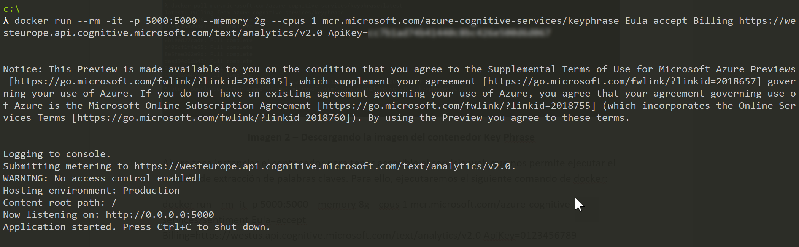

import ArticleHeader from '../../../components/article-header'

<ArticleHeader frontmatter={props.pageContext.frontmatter} />

​No todo en Inteligencia Artificial es trabajar con Machine Learning definiendo y entrenando nuestros propios algoritmos para resolver el problema que nos plantean desde negocio. Existen diversos servicios con inteligencia artificial pre-construida que nos pueden ayudar a acercarnos a esos escenarios que no necesitan de algún tipo algoritmo específico. Me estoy refiriendo a los servicios cognitivos de Microsoft y las diferentes posibilidades que nos ofrece para hacer nuestras aplicaciones más inteligentes.

Estos servicios nos permiten consumir un modelo de inteligencia artificial que es capaz de analizar o predecir el contenido que le enviemos a través de su interfaz REST. Ahora bien, ¿qué pasa en aquellos escenarios que por privacidad no podemos hacer compartir esa información con un servicio externo? ¿qué pasa en escenarios con conectividad escasa de internet? ¿qué hacemos con los escenarios en los que tenemos que resolver al instante y no podemos esperar a que los datos suban a la nube y vuelva nuestra predicción?

Siguiendo con la misma filosofía de utilizar inteligencia artificial pre-construida, ahora podemos ejecutar estos servicios cognitivos en un contenedor, casi de forma aislada, para que podamos hacer predicciones o análisis de nuestros datos en el Edge o manteniendo los datos bajo nuestro control, cumpliendo con la legislación necesaria.

**¿Qué servicios cognitivos tenemos disponibles como contenedores?**

Desde el equipo de producto de Azure Cognitive Services, han dispuesto los siguientes contenedores:

- Text Analytics Containers, con los servicios de extracción de frases claves, detección de idioma y análisis de sentimiento.
- Face Containers que permite hacer una detección de caras, verificación y análisis de sentimiento.
- Recognize Text Containers, un servicio de visión, para detectar y extraer texto impreso de imágenes.

**Probamos el Text Analytics Container**

Para empezar con estos contenedores, necesitamos algún servicio local o remoto que permita ejecutar contenedores Docker, además, este debe permitir conectarse a Azure para que se pueda enviar los datos de facturación del servicio y validar su clave.

Dependiendo del servicio que vayamos a utilizar, tendremos unos requisitos mínimos para el contenedor, por ejemplo, para ejecutar el contenedor de Key Phrase Extraction necesitamos como mínimo 1 core y 2GB de memoria y como recomendado 1 core y 4GB de memoria. Tenedlo en cuenta porque, además, dependiendo del número de peticiones que hagamos, vamos a tener que ser capaces de escalar horizontalmente el número de instancias del contenedor.

Los contenedores se encuentran en un servicio de registro de Microsoft, para el Key Phrase Extraction tenemos disponible la imagen en la siguiente URL: mcr.microsoft.com/azure-cognitive-services/keyphrase.

Si vamos a trabajar desde local, tenemos que hacer un Docker pull para que se descargue la imagen y la tengamos disponible para instanciarla.

docker pull mcr.microsoft.com/azure-cognitive-services/keyphrase:latest

Ahora toca instanciar el contenedor para tener accesible el servicio web que nos permite ejecutar el modelo de extracción de palabras claves. Para ello, ejecutaremos el siguiente comando de docker:

docker run --rm -it -p 5000:5000 --memory 8g --cpus 1 mcr.microsoft.com/azure-cognitive-services/sentiment Eula=accept Billing=https://westus.api.cognitive.microsoft.com/text/analytics/v2.0 ApiKey=0123456789

Importante el parámetro Eula, Billing y ApiKey, que nos permiten ejecutar el servicio en el contenedor, pero con la información de facturación necesaria. Para esto, tenéis que crearos un servicio de Text Analytics creado en una de vuestras suscripciones de Azure de la que vamos a utilizar el Endpoint como valor del parámetro Billing y una de las Keys como valor del parámetro ApiKey.

**Haciendo predicciones**

Ya tenemos disponible el servicio de extracción de frases claves con toda su especificación, que se ejecuta en Azure. Aún así, si navegamos a la URL [http://localhost:5000/swagger/](http&#58;//localhost&#58;5000/swagger/) podemos ver la especificación OpenAPI con la descripción de las operaciones disponibles. ​

Probamos el servicio, haciendo una petición POST con el texto a analizar con el siguiente resultado:

**Conclusiones**

A partir de aquí, os toca experimentar con el resto de los servicios y ver cuando es necesario ejecutarlo en local, teniendo claro el abanico de escenarios posibles que esto nos habilita. Seguro que Microsoft ya está trabajando en publicar más de estos servicios como contenedores, aunque siempre nos queda preparar nuestro propio algoritmo, entrenarlo y publicarlo en nuestro contenedor de AI personalizado.

**Alberto Diaz Martin**
 MVP Azure
 adiazcan@hotmail.com
 @adiazcan

[http://blogs.encamina.com/por-una-nube-sostenible/](http&#58;//blogs.encamina.com/por-una-nube-sostenible/)

