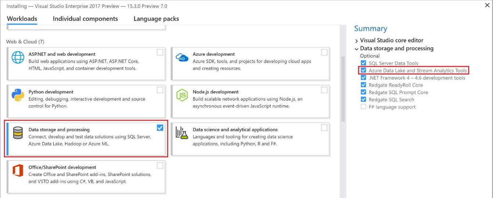
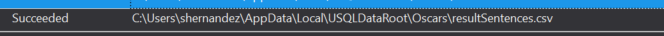

**El reducto del programador C# en Big Data**

No aun no me he vuelto loco (darme tiempo), y no, no quiero aportar al mundo un artículo de protesta o queja alguna, pero si me gustaría dejar constancia con las siguientes páginas, de que vivimos en un mundo tecnológico apasionante, lleno de evolución y de cambios, pero que a su vez no deja enemigos vivos. Un claro ejemplo es toda la rama Data Plattform, AI y Big Data que ya está en nuestro día a día, y que sin darnos cuenta nos rodea, nos absorbe y nos hace evolucionar.

En el pasado SQL Saturday de Madrid, pude ver como lenguajes T-SQL, C# o DAX, van perdiendo peso respecto a otros como SCALA o Python, y no hace más que marcar la tendencia de Microsoft a abrir su abanico y sus tools de desarrollo incorporando tecnologías como Databricks o Hadoop a su oferta. Pero aún nos queda un pequeño reducto a los programadores de C#, que incluso también puede resultar cómodo a los programadores de T-SQL, y no es otro que Data Lake Analitycs y el lenguaje U-SQL.

**¿Qué es Azure Data Lake Analitycs?**

Data Lake Analitycs, lo encontramos como un servicio de Azure en modo PaaS, y que se engloba dentro de Data Lake. Azure Data Lake lo podríamos entender como un catálogo de servicios y herramientas que Azure nos ofrece y que da servicio tanto a desarrolladores como a científicos de datos, permitiendo almacenar datos de cualquier tamaño, forma y tipo, sin importar su volumen.


Dentro de los servicios como hemos dichos encontramos Spark, Hadoop y por supuesto el que nos ocupa Data Lake Analytics Service. Se puede decir que Data Lake Analytics nos va a permitir analizar mediante la ejecución de trabajos en U-SQL, aquella información ya sea estructurada como una tabla en SQL, o semiestructurada como un fichero de texto, imágenes, y que almacenaremos en Data Lake Store.


**U-SQL, conociendo el lenguaje**

Todos los ejemplos que vamos a ir viendo a continuación parten de unos datos almacenados en un Data Lake Store, y mediante el diseño de trabajos con U-SQL, podremos analizar dichos datos. Por ello, aunque no lo expliquemos en este artículo, recordar que es necesario tener creado el servicio de Data Lake Store, para poder empezar a trabajar con Data Lake Analitycs. Aunque es cierto que podríamos usar otros orígenes de datos como un Blob Storage o un Azure Data Warehouse.


Lo más importante es empezar a familiarizarnos con U-SQL, aunque ya anticipo que es muy intuitivo y en pocos minutos estamos trabajando con soltura. En origen U-SQL nació en Microsoft, y se pensó en él como un lenguaje sobre el que ejecutar el Framework de Big Data.


Incluía todo lo bueno del T-SQL, acercando así a los desarrolladores de SQL Server, y por otro lado a los programadores de C#, permitiendo dar forma a un lenguaje poderoso con muchas similitudes en sintaxis tanto con SQL como con lenguajes de desarrollo en .Net. Tranquilos que no es una mezcla de T-SQL con C#, sin orden, sino que permite declarar un .USQL, que en sintaxis es muy similar a SQL, e incorporar DLL 's en C# y hacer referencias a funciones y objetos.

**Desarrollando el primer código .USQL**

Vamos a explicar un pequeño código en U-SQL, que obtiene desde un fichero CSV alojado en Data Lake Store, todos los premiados, y ganadores de los premios Oscars, desde su creación.

@data =

EXTRACT year          string,

category      string,

winner        string,

entity        string

FROM @"/Oscars/dataOscars.csv"

USING Extractors.Csv(silent:true);

Como podemos observar en el código anterior, definimos un proceso de extracción con la sentencia EXTRACT, e indicamos los campos de dentro del CSV que queremos mapear en una variable @data. En este caso estamos usando un Extractor ya existente como es el de CSV, pero más adelante veremos cómo podemos crearnos nuestros propios extractores.

El siguiente fragmento del script, nos sirve para trabajar en memoria con el resultado de la extracción, que recordemos estaba en @data. En este caso se parece mucho a una SELECT en T- SQL, y simplemente vamos a filtrar los datos por el año 2000, asignándosela a la variable @result

@result =

SELECT  year,category,winner,entity

FROM @data

WHERE year == "2000";

Por último, tenemos que dar una salida a nuestra query, y para eso usamos la sentencia OUTPUT, y un operador de salida como Outputters.csv, que en este caso nos parsea el dato obtenido a un fichero CSV en nuestro Store.

OUTPUT @result

TO @"/Oscars/resultFiltered.csv"

USING Outputters.Csv();

Como aclaración, hay que recordar que el dato que recibe nuestro operador de salida, en este caso al ser un CSV, tiene que ser una colección de datos, o lo que es lo mismo debe tener estructura de tabla.

**Ejecutando trabajos desde el portal de Azure**

Una vez hemos visto un ejemplo muy sencillo de proceso en U-SQL, vamos a ver como ejecutar este en Data Lake Analytics. Para ello debemos acceder al servicio en el portal de Azure, y seleccionar el apartado New Job. Como podemos ver en la imagen siguiente, basta con pegar el código anterior en el editor de trabajos, darle un nombre a nuestro nuevo JOB y elegir las unidades de procesamiento AUs.

Antes de poner un número de AUs a lo loco debemos entender que esto nos va a permitir paralelizar nuestros procesos, en tanto que añadamos más unidades de procesamiento.


Como vemos en la siguiente imagen, un proceso de Extracción por ejemplo de una biblioteca de imágenes puede tener implícito 70 extracciones por ejemplo porque tenga varios ficheros. Cada proceso lo podemos representar como un **vértice**, por lo que en este caso si sería bueno procesar en paralelo ya que reduciríamos el tiempo global de la extracción.


Dicho todo esto, tener en cuenta que a mayor número de procesos en paralelo, mayor coste tiene la ejecución de este trabajo, ya que el principal coste de este servicio es en ejecución. Para nuestro ejemplo nos vale con configurar un único AuS, y el coste por minuto sería de **0,03 € / min**

Para comprobar si todo es correcto, y no tenemos errores en el código, pulsaríamos sobre Submit y este empezaría su ejecución.


Si todo es correcto, podremos ver un mapa del proceso y el tiempo de ejecución de cada fase. Además, desde el resumen de ejecución también podemos ver el fichero de salida, en este caso un CSV que filtra por el año 2000 todos los premios Oscars.


**Extendiendo con código C# nuestros trabajos en Visual Studio: UDOs**

Bueno por ahora hemos visto como ejecutar trabajos de análisis de datos desde el servicio contra nuestro almacén de datos. Pero ¿dónde está el prometido código en C#? ¿Qué nos puede aportar? No siempre vamos a poder alcanzar nuestro objetivo con las operaciones que U-SQL nos trae de base, y podemos llegar a extender esta funcionalidad con código personalizado en este caso en C#.

Una primera forma para poder incorporar código C# a nuestro U-SQL es mediante los User – define – operations (UDOs).

Estos nos permiten extender las operaciones básicas como extracciones, operadores de salida, procesadores…, algunos ya los hemos visto como el extractor de CSV o el operador de salida hacia CSV. Antes de nada, deberemos instalar las tools de Azure Data Lake y Stream Analytics, para poder depurar y ejecutar desde nuestra máquina local.



Para empezar, vamos a escribir el código U-SQL, que se va poder dividir en tres fases:

1.       Extracción: Mismo código que en el ejemplo anterior, extraemos los datos desde el CSV de los premios Oscars.

@data =

EXTRACT year          string,

category      string,

winner        string,

entity        string

FROM @"Oscars/dataOscars.csv"

USING Extractors.Csv(silent:true);


2.       Procesamiento: Este operador no lo utilizamos antes, y ahora nos va a permitir invocar un proceso en backend C#, y modificar nuestra colección de datos @data.


@dataSentences =

PROCESS @data

PRODUCE year string,

category string,

winner string,

entity string,

sentence string

USING new USQL\_UDO.ActorDetails();

Como novedad debemos fijarnos en la instrucción PROCESS y PRODUCE, que nos van a permitir procesar la colección @data con el proceso que inyectamos con la sentencia USING, y que va a ser nuestro UDO de procesamiento.


3.       Filtrado y procesado: Esta fase de ejecución es muy similar al primer ejemplo, filtramos por el campo sentence para asegurarnos que no es nulo, y lo exportamos a un fichero CSV de salida en el Store.


@dataSentencesWithData =


SELECT year,

category,

winner,

entity,

sentence


FROM @dataSentences

WHERE sentence != "";


OUTPUT @dataSentences

TO "Oscars/resultSentences.csv"

USING Outputters.Csv();


**Construyendo el procesador U-SQL UDO Actor Details**

Una vez como hemos visto como instanciar un UDO en un código U-SQL, vamos a ver brevemente como crearlo en Visual Studio. Lo primero es crear un proyecto del tipo U-SQL Project, para poder dar de alta nuestro código de extensión.


Añadimos un nuevo elemento del tipo U-SQL Script, y sobre este en el Solution Explorer con el botón derecho seleccionamos **Add-&gt; User Code -&gt; Add C# UDO** . Esta acción no va a generar un .**cs relacionado con el .usql**, este nuevo .cs va a tener el código en C# que podremos añadir a nuestro script U-SQL.


En este caso como nuestro UDO va a extender a un **PROCESSOR**, debemos tener una clase en C# que implemente la interfaz **IProcessor**.

```
namespace USQL\_UDOagen

{

public class ProcessosTesting : **IProcessor**
```

Nuestra clase básicamente va a tener un método **Process**,que va a recorrer todas las filas de nuestro CSV en memoria, y si la película se encuentra en un diccionario de frases célebres, va a añadir una columna **SENTENCE** a nuestra colección, con la frase en cuestión.


```
public override IRow Process(IRow input, IUpdatableRow output)

{

string year = input.Get&lt;string&gt;("year");

string category = input.Get&lt;string&gt;("category");

string winner = input.Get&lt;string&gt;("winner");

string entity = input.Get&lt;string&gt;("entity");

string sentence = string.Empty;


var current = string.Empty;

if (Sentence.TryGetValue(entity, out current))

{

sentence = current;

}


output.Set&lt;string&gt;(0, year);

output.Set&lt;string&gt;(1, category);

output.Set&lt;string&gt;(2, winner);

output.Set&lt;string&gt;(3, entity);

output.Set&lt;string&gt;(4, sentence);

return output.AsReadOnly();

}
```


Este método es invocado por nuestro script U-SQL una vez por cada fila en la colección de datos, así conseguimos iterar. Si volvemos al script U-SQL podemos recordar que la forma de instanciar este UDO, es invocarlo como si incluyéramos un objeto de clase en C#, con la sentencia **USING**.

**USING** **new** **USQL\_UDO.ActorDetails****();**


**Por último, solo nos queda probarlo y depurarlo**

Podemos ejecutarlo en local, o contra el servicio de Azure Data Lake, todo desde el Visual Studio. Pero primero vamos a depurarlo, para ello necesitamos que tengamos seleccionado en el Solution Explorer el U-SQL Script a ejecutar, se marcará con un símbolo de Play, y posteriormente seleccionar F5 o Debug en la ribbon superior.


Se va a inicializar una aplicación de consola si todo es correcto, y si añadimos un brakepoint en el .cs de nuestro UDO recién implementado, veremos que se detiene la ejecución, tal y como estamos acostumbrados con aplicaciones de backend en .Net​


De este modo podemos depurar e inspeccionar nuestros scripts en tiempo real, sin necesidad de añadir trazas o depuración en remoto. Si el resultado es correcto, en el propio Visual Studio podremos ver los Outputs, en este caso un fichero .csv



Como **nota muy importante** para que funcione en local, y podamos simular el Data Lake Store, deberemos configurar un path del cual van a extraerse los ficheros, y se van a dejar los outputs. Para ello en **Tools-&gt;Options-&gt;Azure Data Lake**, deberemos configurar el fichero **DataRoot**, tal cual se ve en la siguiente figura.


**Ejecutando el trabajo desde el Visual Studio**

Como hemos dicho en el apartado de depuración podemos ejecutar el Script bien contra el servicio de Azure, o contra el simulador de Data Lake en local. En cualquier caso, escogemos el script a ejecutar del solution explorer, y observamos que sobre el editor del fichero U-SQL se nos presenta la siguiente ribbon:


Casi ya no es ni necesario explicarla, ya que es muy parecido al panel de configuración de trabajos que vimos en Azure, simplemente añade el desplegable para escoger entre una cuenta Azure Data Lake o en Local. Hay que recordar que, si escogemos una cuenta de Azure, se nos va a cobrar por ejecución, ya que realmente estamos mandando la ejecución de un nuevo trabajo. Vamos a seleccionar local-machine, vemos que por defecto nos permite como máximo 6 unidades de procesamiento o AU, y seleccionamos Submit para arrancar la ejecución en local.

Si la compilación es correcta, se nos va a arrancar de nuevo la consola de ejecución, y se nos va a presentar además de los resultados de salida como en la depuración, el mapa de ejecución y el detalle de tiempos, a un estilo muy similar del primer ejemplo sobre Azure.


**Conclusiones de Azure Data Lake Analytics**

Evidentemente con este artículo estamos muy lejos de dominar el servicio, ya que nos queda mucho que tratar, pero ya podemos ver un poquito mi idea inicial, que no era otra de dar una herramienta de trabajo y más que útil a los desarrolladores de C# que necesiten hacer análisis de datos. Debo de ser sincero, y no sé cómo va a evolucionar esto, ya que otras herramientas como Spark o Databricks están pasando como cohetes, y posiblemente Data Lake Analitycs no tenga mucho más recorrido, pero con lo que tenemos ya podemos plantearnos hacer trabajos interesantes.

Como empecé diciendo, es nuestro reducto, y si lo utilizamos posiblemente lo mantengamos más de lo que nos creemos, ***¡¡¡¡y si no siempre tendremos el Python o Scala for Dummies!!***


**Sergio Hernández Mancebo**

Principal Team Leader en ENCAMINA | Azure MVP

@shmacenbo

