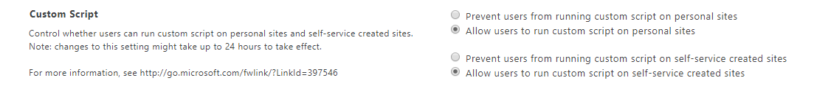

import ArticleHeader from '../../../components/article-header'

<ArticleHeader frontmatter={props.pageContext.frontmatter} />

​

Let me start with a HUGE disclaimer: even though it is possible to enable custom scripts on modern SharePoint, you should only consider using it when there is no other alternative.

Having custom script disabled by default on SharePoint removes functionalities that *old school* users miss, such as list templates and the solution gallery, among several others. Most of the features removed by custom scripts can be achieved using PnP and SharePoint Online Cmdlets.

If you need to bring back any of the functionalities listed below you will need to follow the steps described in the article below:

1. Enable custom scripts on tenant level
2. Enable custom script on SharePoint sites

| **Site feature** | **Behaviour** | **Notes** |
| --- | --- | --- |
| Save Site as Template  | No longer available in Site Settings  | Users can still build sites from templates created before custom script was blocked.  |
| Save document library as template  | No longer available in Library Settings  | Users can still build document libraries from templates created before custom script was blocked.  |
| Solution Gallery  | No longer available in Site Settings  | Users can still use solutions created before custom script was blocked.  |
| Theme Gallery  | No longer available in Site Settings  | Users can still use themes created before custom script was blocked.  |
| Help Settings  | No longer available in Site Settings  | Users can still access help file collections available before custom script was blocked.  |
| HTML Field Security  | No longer available in Library Settings  | Users can still use HTML field security that they set up before custom script was blocked.  |
| Sandbox solutions  | Solution Gallery is no longer available in Site Settings  | Users can't add, manage, or upgrade sandbox solutions. They can still run sandbox solutions that were deployed before custom script was blocked.  |
| SharePoint Designer  | Pages that are not HTML can no longer be updated.   Handling List: **Create Form**and **Custom Action** will no longer work.   Subsites: **New Subsite** and **Delete Site** redirect to the **Site Settings** page in the browser.   Data Sources: **Properties**button is no longer available.  | Users can still open data sources.  |
| Uploading files that potentially include script  | The following file types can no longer be uploaded to a library   .asmx   .ascx   .aspx   .htc   .jar   .master   .swf   .xap   .xsf  | Existing files in the library are not impacted.  |

Source - [https://docs.microsoft.com/en-gb/sharepoint/allow-or-prevent-custom-script?redirectSourcePath=%252fen-us%252farticle%252fAllow-or-prevent-custom-script-1F2C515F-5D7E-448A-9FD7-835DA935584F](https&#58;//docs.microsoft.com/en-gb/sharepoint/allow-or-prevent-custom-script?redirectSourcePath=%252fen-us%252farticle%252fAllow-or-prevent-custom-script-1F2C515F-5D7E-448A-9FD7-835DA935584F)

**​Enable custom scripts on tenant level**

Before getting custom script running on your modern site, you need to make sure it is already enabled at tenant level.  To verify or enable it, you should follow these steps:

1 – From your SharePoint site, click on the waffle icon

2 – Click on Admin

3 – Expand Admin centers and click on SharePoint

4 – On the SharePoint Admin Center click on Settings

5 – Scroll down and locate the Custom Script

6 – Click on Allow users to run custom script on personal sites

7 – Click on Allow users to run custom script on self-service created sites

9 – Click OK

Note: Changes to the tenant settings can take up to 24 hours to be applied.

**Enable custo​​m script on SharePoint sites**

To enable custom scripts on modern sites, you will need to use SharePoint Online Cmdlets. If you don't have it installed download it from here.

[https://www.microsoft.com/en-us/download/details.aspx?id=35588](https&#58;//www.microsoft.com/en-us/download/details.aspx?id=35588)

Once installed:

1 – Open the PowerShell console

2 – Execute the command
  Connect-SPOService -Url [https://tenant-admin.sharepoint.com](https&#58;//tenant-admin.sharepoint.com/)

3 – Execute the command bellow with the url for the modern site collection

Set-SPOSite -Identity https://tenant.sharepoint.com/sites/contoso -DenyAddAndCustomizePages 0

**Conclus​​ion**

Don't enable custom scripts unless it's your last option to recover a feature, having custom scripts enabled can put your tenant at risk.

**Joao Ferreira**

SharePoint Team Lead at BindTuning | @joao12ferreira​​

