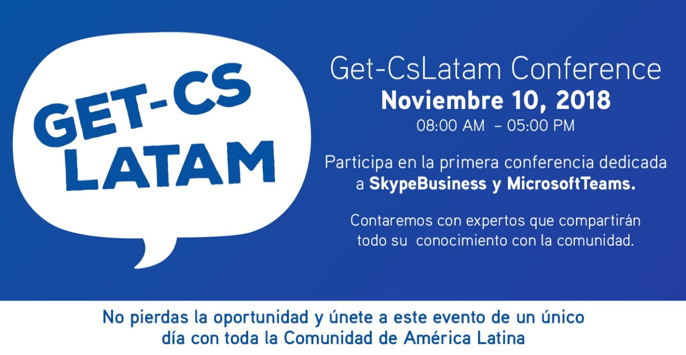
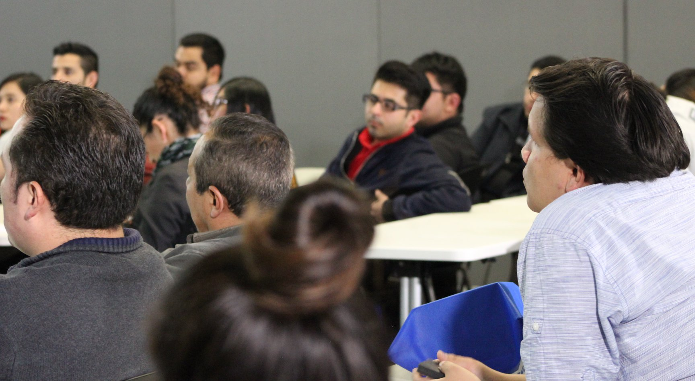
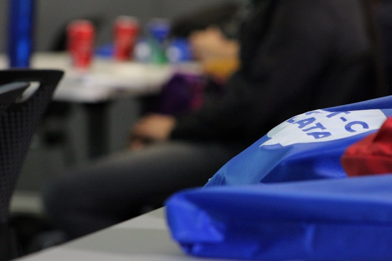
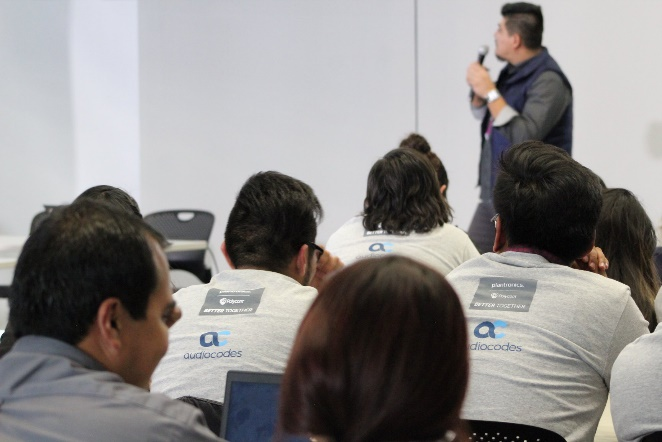
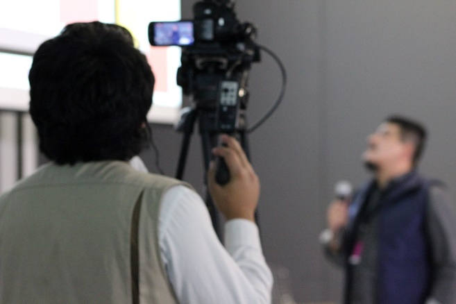

​

Más de 6 meses de planeación, nos llevaron a tener una conferencia de calidad. Una conferencia como la que desde hace mucho tiempo se merecía la comunidad de Skype y Teams en español. Fue una larga jornada, pero valió la pena.

Al hacer el Call for Speakers, tuvimos que rechazar a algunos, no porque su contenido no fuera el que buscábamos, sino que por ser nuestra primera edición no contábamos con tanto patrocinio como para traer gente de otros países. Cada uno de nuestros speakers hicieron el esfuerzo por buscar los recursos para venir hasta la ciudad de México y presentar su sesión. De antemano agradezco a todos y cada uno de ellos.

¿A quién tuvimos como speaker? Aquí la lista y los temas que cada uno de ellos presento. (Ordenados de acuerdo al horario de su charla)

**Leonardo Cruz** - Arquitecto Tecnológico para Socios para Latinoamérica en Microsoft. Fue el encargado de abrir el evento, fue nuestro Keynote speaker. Con su charla de Modern Workplace con MS Teams, fue quien abrió el espacio para todos los asistentes.

**Vicente Guzmán** - rMVP Windows Development, con su sesión creando Bots para Microsoft Teams. Toda la gente interesada en la creación de bot y desarrollo sin dudarlo asistió a la charla de Vicente, quien como lo vemos tiene experiencia siendo un rMVP.

**Rodolfo Castro**– MVP Office Apps and Services. Actualmente único MVP en LATAM totalmente enfocado a Skype y Teams. Brindo la charla Monitoring y QoS en Microsoft Teams, donde nos mostró que tan importante es poner etiquetado en la red, para dar una mejor experiencia al usuario.

**Haaron González** – MVP especialista en SharePoint. Nos visitó desde Mexicali, para brindarnos su charla SharePoint y Teams, creando aplicaciones empresariales. Actualizando su sesión un día antes, para que los asistentes tuvieran la información más reciente, Haaron cautivo a la audiencia developer con su charla.

**Christian Romano**– rMVP Office Server and Services. Christian además de speaker también es uno de los organizadores del evento, la charla que nos dio fue Troubleshooting MS Teams, vimos las herramientas necesarias para resolver problemas con Teams y cuando ocuparlas.

**Geovany Acevedo**– rMVP Office Server and Services, Geovany ha estado trabajando con la parte de adopción, governance, security y compliance para su empresa, para poder adoptar de la mejor manera MS Teams. Toda esa experiencia nos la transmitió en su sesión "Security and Compliance en MS Teams"

**Fernando Chiquiza**– MVP Office Apps and Services, viajando desde su natal Bogotá en Colombia, nos apoyó con la participación de su charla "Teams como ambiente colaborativo", con su manera peculiar de impartir su sesión, Fernando tuvo a la audiencia siempre atenta a su sesión, y aprendieron mejor como funciona Teams, SharePoint y OneDrive.

**Jose Luis Arroyo**– Líder UC and O365 Product Owner para una entidad de gobierno, Jose Luis es el único de los speakers que tiene la visión del cliente, él no es parte de Microsoft, ni de algún partner o vendor. El sí es un cliente final, el cual ve los pros y los contras desde su perspectiva. Fue un placer verlo en su charla "Transformación Digital y Productividad Dia 0"

**Juan Camilo Martinez**– Nuestro speaker paisa, traído desde la hermosa ciudad de Medellín en Colombia. Camilo tiene la experiencia de muchos años en Comunicaciones Unificadas de Microsoft, trabajando para uno de los Partners más grandes en Colombia y Latam, nos hace el honor de mostrarnos su charla "Voice Routing en MS Teams". Camilo fue uno de los organizadores del evento, aun estando remoto fue de gran ayuda a la realización del evento.

**Jose Roberto Correa**– Ingeniero en Sistemas, Gerente de IT en sector gobierno. Otro de los organizadores de este gran evento, nos guio en el camino para movernos de Skype a Microsoft Teams con su charla "Adopción en Microsoft Teams" donde pudimos ver, donde ha estado Microsoft con anterioridad, donde está ahora, y a donde podemos llegar. Excelente sesión para cerrar.

El evento abrió sus puertas a las 8 am para los asistentes, donde pudieron convivir con la comunidad, hacer networking y ver a nuestros patrocinadores. Tuvieron un rico desayuno con comida típica mexicana.

Frijoles, Chilaquiles, chile poblano, y huevo.

También nuestros patrocinadores son dignos de reconocer, ya que confiaron en este evento, siendo el primero que se hace, y ellos nos apoyaron en todo momento. Gracias Polycom, Plantronics, Audiocodes y C3ntro Telecom.

Para finalizar el evento tuvimos una pequeña happy hour en un restaurante cercano, donde igualmente tuvimos una excelente cena rodeada de antojitos mexicanos como sopes, tacos de lengua, arrachera, cochinita, huaraches, frijoles y cervezas.

El evento fue un éxito de inicio a fin, gracias a los speakers, patrocinadores y a los asistentes en general.

Pueden ver más del evento en     [https://get-cslatam.com](https://get-cslatam.com/), o en sus redes sociales     [https://twitter.com/getcslatam](https://twitter.com/getcslatam) .

Les dejo con algunas fotos del evento, pero pueden buscar el hashtag #GetCsLatam donde podrán encontrar todo lo que compartió la comunidad ese día. Espero que con las fotos se motiven y ¡esperamos contar con la presencia de ustedes estimados lectores para GetCsLatam 2019!

Esten pendientes

**Rodolfo Castro Aguilar**

MVP Office Apps and Services

Twitter : @ucblogmx

facebook.com/groups/SkypeTeamsUG/

ucblogmx.com

 
 
import LayoutNumber from '../../../components/layout-article'
export default LayoutNumber
