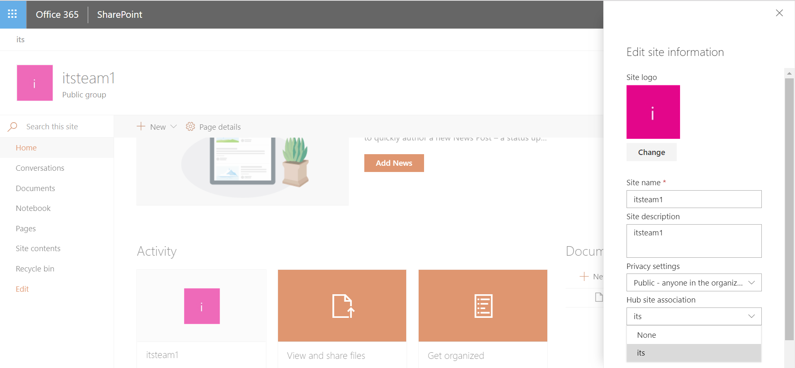
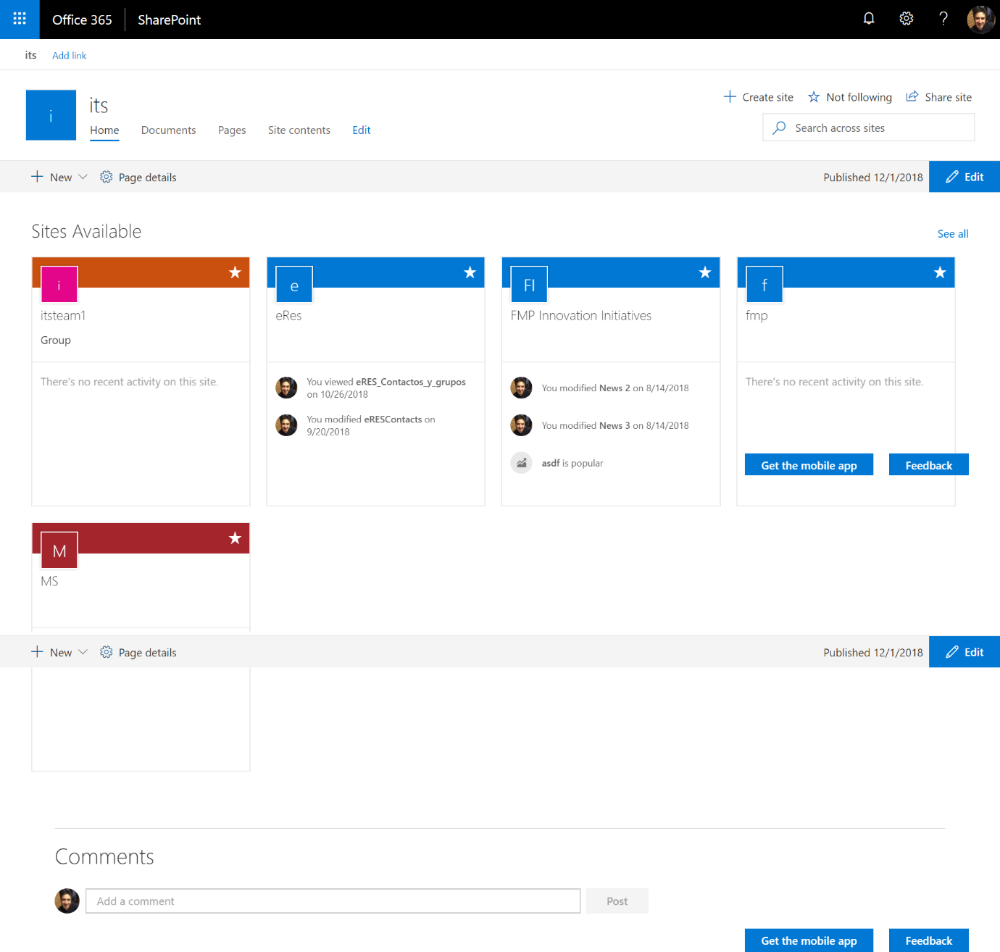

import ArticleHeader from '../../../components/article-header'

<ArticleHeader frontmatter={props.pageContext.frontmatter} />

Nadie puede negar que el crecimiento de Office 365 en los últimos años ha sido exponencial y cada vez son más las organizaciones, públicas, privadas y educativas que están adoptando la plataforma colaborativa como la solución integral para el manejo de información y procesos. También es bien sabido que cuanto más grande es la organización, la gobernabilidad se hace una tarea titánica e incluso a los usuarios no se les hace nada fácil acceder a la información que necesitan debido a que no conocen en que sitio/área/departamento, o como se llamé dentro de la organización a la que pertenezca, se encuentra guardada. Bueno para facilitar la tarea de brindar acceso a los sitios, es que llegaron los Hub Sites.

¿Qué son? Básicamente son concentradores de sitios, es decir, permiten crear un sitio y configurarlo para que sea por así decirlo la página de llegada de un conjunto de sitios. Imaginen una organización determinada por gerencias y cada gerencia cuenta con una determinada cantidad de departamentos y cada departamento con secciones. Una primera solución sería armar una colección de sitios y dentro de la misma, ir armando un árbol de subsitios, así hasta lograr configurar la estructura organizacional. Pero está solución tiene un problema: que pasaría si mañana un departamento de una gerencia es movido a otra gerencia o si una gerencia es partida en dos.

La recomendación en Office 365, es evitar tener muchas anidaciones de sitios en una misma colección de sitios, y crear tantas colecciones de sitios como sean necesarias. Esto permite tener una gobernabilidad más descentralizada, incluso permite delegar la misma sin tener que andar haciendo grandes configuraciones de permisos y brindar así responsabilidades claras a los usuarios. Siguiendo con esta línea, se crearían una colección de sitios para gerencia, para cada departamento e incluso se podría llegar a pensar en que cada sección fuera también una colección de sitios dentro de nuestro Office 365, pudiendo así tener sitios raíz de colaboración moderna o comunicación.

En Office 365 no existe aún una opción o plantilla para crear un sitio del tipo Hub Sites e incluso no es algo que sea estrictamente necesario, debido a que la configuración se podría realizar por única vez y no volver a necesitarla. Cualquier sitio de comunicación o colaboración (experiencia moderna) puede ser configurado como un Hub Site dentro de Office 365. Entonces para poder armar la solución descrita anteriormente lo que se debería hacer primero es crear todas las colecciones de sitios que se necesitan utilizando algunas de las plantillas mencionadas. Una vez creada la estructura de colecciones de sitios, el próximo paso es crear nuestros concentradores de sitios (Hub Sites), para lo cual se utilizará un comando PowerShell que lo que hace es indicar que el sitio se transformará en un Hub Sites dentro de Office 365, pero que además se podrá seguir usando como sitio.

Ejecute la siguiente línea de PowerShell conectado a Office 365:

Register-SPOHubSite URL or Site ID

Al comando debe proporcionarle la URL de la colección de sitios o bien el ID (GUID) para que se ejecute correctamente, en el siguiente enlace puede acceder a más información del comando: [https://docs.microsoft.com/es-mx/sharepoint/create-hub-site](https&#58;//docs.microsoft.com/es-mx/sharepoint/create-hub-site).

El próximo paso es configurar en cada sitio que pertenece a la Hub Site. Lo bueno es que para esta configuración no se debe ejecutar ningún comando y se pude hacer desde el propicio sitio. Acceda a una colección de sitios, seleccione la opción de "Configuración del Sitio" y luego seleccione la opción "Información del Sitio", donde se puede ver una opción de configuración para seleccionar un Hub Site disponible para establecer donde se quiere que la colección de sitios sea mostrada.

Una vez que los sitios fueron configurados, en cada Hub Site se dispone de una WebPart llamada Sitios (Sites) la cual, al agregarla a una página, nos permite listar todos los sitios asociados con dicho Hub Site y brindar así un acceso rápido. Los permisos se tienen en cuenta, es decir que, si un usuario no tiene permisos para ver un sitio, este no se le mostrara en el Hub Site. Ahora, siguiendo con nuestro ejemplo, se puede ver lo fácil que es armar la estructura organizacional planteada al principio y bridar una navegación sencilla a los usuarios como se puede ver en la siguiente imagen.

Como se ha podido ver, está solución de diseño utilizando Hub Site es sencilla y fácil de implementar. Pero también permite acceder a las colecciones de sitios de forma programática a través de un punto de acceso REST recientemente liberado en Office 365. Esto, que parce algo natural para cualquier programador, en el pasado no era tan sencillo, ya que para poder acceder al listado de una colección de sitios en Office 365 programáticamente se requería contar con permisos de administración y solo se podía a través de PowerShell o una librería de clases en CSOM. Bueno, esto si bien no brinda acceso a la lista completa de colecciones de sitios en Office 365, si deja acceder a todas las colecciones de sitios asociadas a un Hub Site determinado, lo cual permite construir componentes que accedan a información más allá de la colección de sitios donde se están ejecutando.

Se debe tener en cuenta que estos puntos de acceso en REST se encuentran en BETA y no se deben usar en desarrollos que van a ser puestos en producción antes que sean liberados debido a que pueden tener cambios y esto afectar el componente que se esté realizando.

El primer punto de acceso se llama "HubSites" y se puede consultar utilizando el verbo GET de REST, como toda consulta es relativa y la URL al punto de acceso es la siguiente \_api/HubSites y nos devolverá el lista de sitios que fueron creados como HubSites, en el siguiente enlace se puede acceder a más información del punto de acceso REST [https://docs.microsoft.com/es-mx/sharepoint/dev/features/hub-site/rest-hubsites-method](https&#58;//docs.microsoft.com/es-mx/sharepoint/dev/features/hub-site/rest-hubsites-method)

El otro punto de acceso interesante se llama "HubSiteData" y este devuelve información relativa a un HubSite determinado, la URL al punto de acceso es un poco diferente \_api/web/HubSiteData y también se utiliza el verbo GET para poder acceder, en el siguiente enlace podrán tener más información con respecto al este punto de acceso [https://docs.microsoft.com/es-mx/sharepoint/dev/features/hub-site/rest-hubsitedata-method](https&#58;//docs.microsoft.com/es-mx/sharepoint/dev/features/hub-site/rest-hubsitedata-method)

Ahora, si combinamos estos dos puntos de acceso, con el del motor de búsqueda, \_api/search se podrá construir una consulta en el sitio hub que se desea y poder acceder al listado de sitios que el Hub Site tiene asociado. A modo de ejemplo la siguiente consulta devuelve el listado de sitios asociado a un un Hub Site:

/\_api/search/query?querytext='DepartmentId:{bef2fc44-6c1a-4dc2-ba96-fdfd4424cecd} contentclass:STS\_Site'&selectproperties='Title,Path,DepartmentId,SiteId'

La clave en esta consulta está en la propiedad DepartamentId, la cual almacena el ID del sitio Hub Site asociado, esto nos permite hacer la consulta pidiendo todos los sitios donde el valor de dicha propiedad sea la del Hub Site que se desea.

**Conclusiones**

En este artículo se trató de demostrar como utilizando la característica de HubSites se puede construir estructura organización de forma rápida y sencilla. Pero también se vio que utilizando los nuevos puntos de acceso REST se pueden crear componentes transversales a la organización para que los usuarios accedan a la información.

**Fabián Imaz**
 Office Apps and Services MVP
 fabiani@siderys.com.yi
 @fabianimaz

