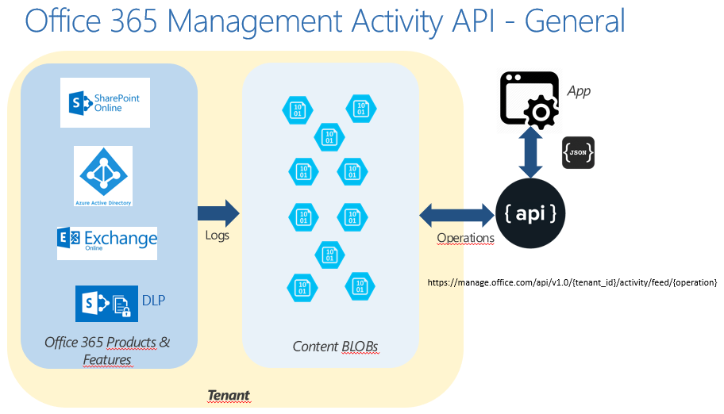
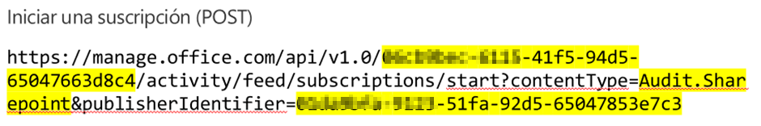
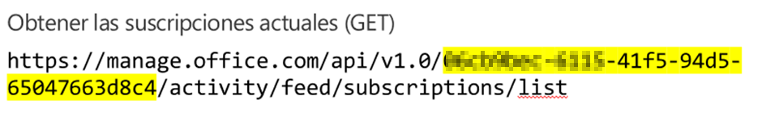
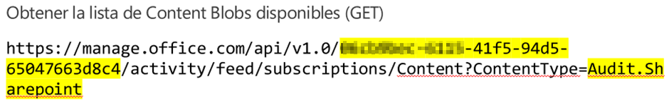
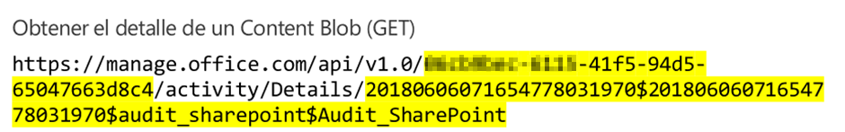
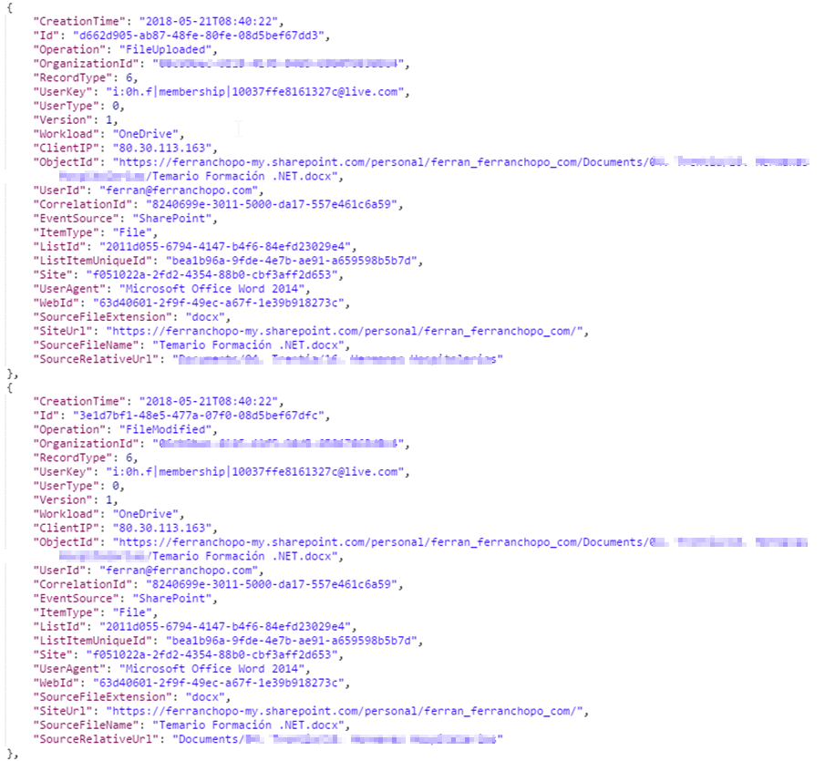
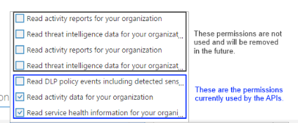
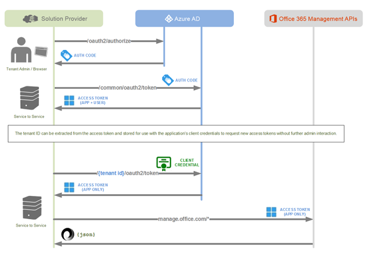
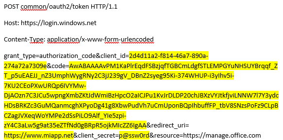
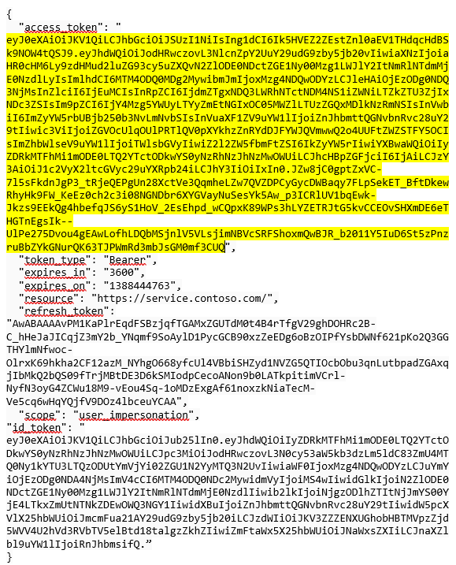

**Conceptos generales**

*Office 365 Management Activity API* proporciona una serie de operaciones que permiten acceder a la información de actividad de un *tenant* de Office 365. Esta información se almacena en conjunto de *Content BLOBs*, de los cuales podemos extraer la información que nos interesa, tal y como se muestra en la siguiente figura:

Como se puede observar, existen hasta 4 tipos de contenido que se pueden consultar:

- Audit.AzureActiveDirectory: Actividades relacionadas con Azure Active Directory, como puede ser el *login* o el *logout* de los usuarios.
- Audit.Exchange: Actividades relacionadas con Exchange, como puede ser el envío o la recepción de correos electrónicos.
- Audit.Sharepoint: Actividades relacionadas en SharePoint, como pueden ser la visualización de una página o la descarga de un fichero.
- Audit.General: Actividades que no se incluyen en los tipos de contenido previos.
- DLP.All: Actividades relacionadas con las políticas de *Data Loss Prevention*, como por ejemplo el intento de compartición de ficheros con usuarios no autorizados.

Es importante notar que desde que se produce una actividad hasta que ésta se almacena en un *Content BLOB* pueden pasar hasta 24h, con lo que la información almacenada en éstos no tiene por qué estar ordenada cronológicamente.

**Operacion​es**

Para poder empezar a trabajar con la API necesitamos saber las operaciones actualmente existentes[\[1\]](file&#58;///C&#58;/compartimoss/Ferr%C3%A1n%20Chopo%20-%20Office%20365%20Management%20Activity%20API/Ferr%C3%A1n%20Chopo%20-%20Office%20365%20Management%20Activity%20API.docx#_ftn1), y que se presentan a continuación:

- *Iniciar una suscripción*, de forma que podamos empezar a guardar la información del registro de auditoría de un tipo de contenido definido en los *Content BLOBs*.
- *Parar una suscripción*, para dejar de guardar la información del registro de auditoría del tipo de contenido seleccionado.
- Obtener una lista de las suscripciones actuales, ya que podemos tener distintas suscripciones (una por tipo de contenido).
- Obtener la lista de contenido disponible, mediante la cual podremos consultar la información almacenada en los distintos *Content BLOBs* (mediante unas *URLs*).
- Recibir notificaciones cuando existe nuevo contenido disponible para la consulta y mediante el uso de un *webhook*.
- Ver el contenido que hay dentro de un *Content BLOB* (mediante su *URL*), con la información concreta según el tipo de contenido de la suscripción.
- Obtener una lista de notificaciones enviadas por un *webhook*.
- Obtener los nombres descriptivos de un recurso mediante su *GUID*.

**Un ejemplo práctico**

Seguidamente presentaremos un ejemplo de cómo usar algunas de las operaciones introducidas anteriormente. En primer lugar, deberíamos iniciar una suscripción:

Donde el primer parámetro corresponde al identificador del *tenant* en el que queremos iniciar la operación, mientras que el *publisherIdentifier* es un identificador que sirve para controlar quien está haciendo la operación, y que sirve para controlar el número de llamadas realizadas a la API (actualmente el límite se encuentra en 60K por minuto[\[2\]](file&#58;///C&#58;/compartimoss/Ferr%C3%A1n%20Chopo%20-%20Office%20365%20Management%20Activity%20API/Ferr%C3%A1n%20Chopo%20-%20Office%20365%20Management%20Activity%20API.docx#_ftn1)). Si no se indica este parámetro, se comparte la cuota con las otras peticiones que tampoco lo indiquen.

A continuación, podríamos consultar las suscripciones actuales:

Como en todas las operaciones, necesitaremos el identificador del *tenant* para poder ejecutar la operación.

Un tercer paso posible sería la obtención de los *Content BLOBs*disponibles, tal y como se muestra en la siguiente imagen:

Como en casos anteriores, en la URL de la petición se indica el identificador del *tenant*, así como el tipo de contenido sobre el que queremos realizar la consulta.

Finalmente, podríamos ver el contenido de un *Content BLOB* mediante la siguiente petición:

En este caso, a parte del identificador del *tenant* también necesitamos el identificador del *Content BLOB* que queremos consultar, y que hemos obtenido con la operación de obtener la lista de contenido disponible.

El resultado obtenido de esta operación, y que es lo que realmente nos importa obtener al final de todo el proceso sería algo como lo que muestra la imagen siguiente:

En el detalle del resultado se puede observar como tenemos el resultado de dos operaciones (*FileUplodaded* y *FileModified*), así como el servicio utilizado (*Workload: Onedrive*), la dirección IP desde la que se realizó la acción, el nombre del fichero, el usuario y otros datos adicionales.

Es importante saber que existen diferentes esquemas según el tipo de contenido[\[3\]](file&#58;///C&#58;/compartimoss/Ferr%C3%A1n%20Chopo%20-%20Office%20365%20Management%20Activity%20API/Ferr%C3%A1n%20Chopo%20-%20Office%20365%20Management%20Activity%20API.docx#_ftn1), con lo que la información obtenida difiere entre éstos. Finalmente, y para acabar con este apartado, es muy importante notar que los *Content BLOBs* solo están disponibles para la consulta durante 7 días desde su fecha de creación.

**Seguridad**

Es obvio que para poder trabajar con la API en cualquier *tenant* necesitamos tener permiso para acceder a estos recursos. Por ello, en primer lugar, deberemos dar de alta nuestra aplicación en *Azure*

*AD* (de nuestro *tenant*, ¡y no del cliente que queramos monitorizar!), y que solicitará los siguientes permisos[\[1\]](file&#58;///C&#58;/compartimoss/Ferr%C3%A1n%20Chopo%20-%20Office%20365%20Management%20Activity%20API/Ferr%C3%A1n%20Chopo%20-%20Office%20365%20Management%20Activity%20API.docx#_ftn1) al *tenant* que queramos monitorizar:

El segundo paso consistirá en obtener un *token* para poder realizar cualquiera de las operaciones presentadas anteriormente (deberá ser un parámetro más de la llamada). Para ello se pueden usar dos mecanismos: El flujo de concesión de código de autorización o el flujo de credenciales de cliente[\[5\]](file&#58;///C&#58;/compartimoss/Ferr%C3%A1n%20Chopo%20-%20Office%20365%20Management%20Activity%20API/Ferr%C3%A1n%20Chopo%20-%20Office%20365%20Management%20Activity%20API.docx#_ftn1).

En nuestro caso elegimos la primera opción, con lo que deberemos hacer una petición como la siguiente:

GET

https://login.windows.net/common/oauth2/authorize?response\_type=code&client\_id=2d4d11a2-f814-46a7-890a-274a72a7309e&resource=https://manage.office.com&redirect\_uri=https://www.miapp.net

En esta petición indicaremos el *client\_id* de nuestra aplicación registrada previamente, así como la URL a la que se debe redirigir cuando se obtenga el código de autorización. De esta manera obtendremos un código de autorización, con el que haremos otra petición para obtener un *token*, que será el que usaremos para hacer las peticiones a la API, tal y como se muestra seguidamente:​

En este caso deberemos indicar el *client\_id* y el *client\_secret* obtenidos al registrar la aplicación en *Azure AD* (primer paso) y el código de autorización (obtenido en el anterior).

Finalmente obtendremos un token, con el que podremos hacer las llamadas a la API:

Para poder hacer las llamadas a la *Office 365 Management Activity API* únicamente hará falta añadir este token en la llamada con el formato *Authorization: Bearer &lt;token&gt;*.

Puedes encontrar un ejemplo de utilización de la API en el siguiente repositorio de GitHub: [https://github.com/fchopo/BigBrotherOffice365](https&#58;//github.com/fchopo/BigBrotherOffice365).

**Conclusión**

En este artículo hemos visto cómo es posible consultar el registro de actividad de cualquier *tenant* de Office 365 mediante la *Management Activity API*. A partir de los tipos de contenido y las operaciones existentes podemos extraer valiosa información que nos puede servir para realizar informes o llevar a cabo auditorias sin los límites de tiempo que nos implica la consulta desde la interfaz gráfica del *Office 365 Security & Compliance* o el comando PowerShell *Search\_UnifiedAuditLog*[***\[6\]***](file&#58;///C&#58;/compartimoss/Ferr%C3%A1n%20Chopo%20-%20Office%20365%20Management%20Activity%20API/Ferr%C3%A1n%20Chopo%20-%20Office%20365%20Management%20Activity%20API.docx#_ftn1).

Como posibles mejoras propondríamos la incorporación de nuevos tipos de contenido, e incluso un período más extenso para la retención de los *Content BLOBs*.

**Ferran Chopo Garcia**

*IT Consultant & Trainer*

[ferran@ferranchopo.com](mailto&#58;ferran@ferranchopo.com)

@fchopo
 [http://www.ferranchopo.com](http&#58;//www.ferranchopo.com/)

[\[1\]](file&#58;///C&#58;/compartimoss/Ferr%C3%A1n%20Chopo%20-%20Office%20365%20Management%20Activity%20API/Ferr%C3%A1n%20Chopo%20-%20Office%20365%20Management%20Activity%20API.docx#_ftnref1) [*https://msdn.microsoft.com/en-us/office-365/office-365-management-activity-api-reference*](https&#58;//msdn.microsoft.com/en-us/office-365/office-365-management-activity-api-reference)

[2]​ [https://docs.microsoft.com/en-us/office/office-365-management-api/troubleshooting-the-office-365-management-activity-api](https&#58;//docs.microsoft.com/en-us/office/office-365-management-api/troubleshooting-the-office-365-management-activity-api)

[\[3\]](file&#58;///C&#58;/compartimoss/Ferr%C3%A1n%20Chopo%20-%20Office%20365%20Management%20Activity%20API/Ferr%C3%A1n%20Chopo%20-%20Office%20365%20Management%20Activity%20API.docx#_ftnref1) [https://msdn.microsoft.com/en-us/office-365/office-365-management-activity-api-schema](https&#58;//msdn.microsoft.com/en-us/office-365/office-365-management-activity-api-schema)

[\[4\]](file&#58;///C&#58;/compartimoss/Ferr%C3%A1n%20Chopo%20-%20Office%20365%20Management%20Activity%20API/Ferr%C3%A1n%20Chopo%20-%20Office%20365%20Management%20Activity%20API.docx#_ftnref1) [https://docs.microsoft.com/en-us/office/office-365-management-api/get-started-with-office-365-management-apis](https&#58;//docs.microsoft.com/en-us/office/office-365-management-api/get-started-with-office-365-management-apis) ​

[\[5\]](file&#58;///C&#58;/compartimoss/Ferr%C3%A1n%20Chopo%20-%20Office%20365%20Management%20Activity%20API/Ferr%C3%A1n%20Chopo%20-%20Office%20365%20Management%20Activity%20API.docx#_ftnref1) [https://docs.microsoft.com/en-us/office/office-365-management-api/get-started-with-office-365-management-apis](https&#58;//docs.microsoft.com/en-us/office/office-365-management-api/get-started-with-office-365-management-apis)

[\[6\]](file&#58;///C&#58;/compartimoss/Ferr%C3%A1n%20Chopo%20-%20Office%20365%20Management%20Activity%20API/Ferr%C3%A1n%20Chopo%20-%20Office%20365%20Management%20Activity%20API.docx#_ftnref1) [https://docs.microsoft.com/en-us/powershell/module/exchange/policy-and-compliance-audit/search-unifiedauditlog?view=exchange-ps](https&#58;//docs.microsoft.com/en-us/powershell/module/exchange/policy-and-compliance-audit/search-unifiedauditlog?view=exchange-ps) ​

