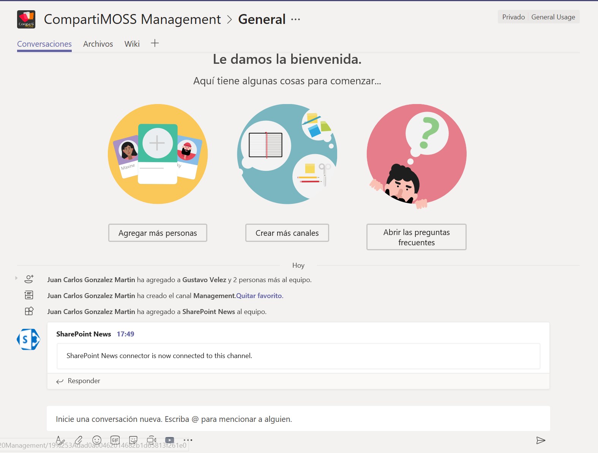

import ArticleHeader from '../../../components/article-header'

<ArticleHeader frontmatter={props.pageContext.frontmatter} />

SharePoint Online (SPO) es un elemento fundamental en Microsoft Teams que proporciona no solo capacidades de almacenamiento de archivos y gestión documental, sino también características de integración que permiten que cualquier usuario pueda visualizar e interactuar directamente en Teams con páginas de SPO, listas o aplicaciones de la misma forma que lo harían desde un sitio de SPO. En este artículo vamos a revisar las posibilidades de integración entre ambas plataformas.

**SPO como elemento fundamental de Microsoft Teams**

SPO es uno de los bloques claves de la arquitectura de Microsoft Teams proporcionando funcionalidad de almacenamiento de documentos para los canales que forman parte de un equipo de Microsoft Teams. Cuando se crea un Team de Microsoft Teams, se crea un sitio moderno de SPO que proporciona estas características.

Además de la integración nativa de SPO en Microsoft Teams, es posible integrar ambas plataformas de forma directa a través de los elementos que se indican a continuación:

- Pestañas, que permiten añadir acceso a páginas de SPO y listas en canales de Microsoft Teams.
- Conectores, que permiten recibir notificaciones de acciones ocurridas en SPO (Por ejemplo, noticias publicadas) en canales de Microsoft Teams.
- Cloud Storage, que permite añadir en la pestaña "Archivos" un acceso a otra biblioteca de documentos de nuestro tenant de SPO.
- Flow, a través de la creación de pequeños procesos que permitan por ejemplo enviar mensajes a un canal de Microsoft Teams cuando se crea un documento o un elemento de lista en un sitio de SPO.
- PowerApps, a través de añadir una PowerApp a un canal de Teams que facilite interactuar con datos de SPO.
- Las pestañas de OneNote y Wiki que permiten tomar notas en canales de Teams y que se almacenan en el sitio asociado al Team.
- 

**Integración de SPO y Microsoft Teams por medio de pestañas**

La primera posibilidad más clara de integrar ambas plataformas es a través de pestañas que permiten agregar de forma nativa en Teams el acceso a elementos de SPO como páginas, listas o bibliotecas de documentos. En el momento de redacción de este artículo, disponemos de las siguientes pestañas para añadir páginas, listas o bibliotecas en canales de Teams:

- Biblioteca de documentos, permite añadir una biblioteca de documentos al canal de Microsoft Teams. Se puede seleccionar una biblioteca de un sitio relevante (esta información es provista por el Graph) al que tiene acceso el usuario o bien agregando directamente el enlace a la biblioteca de documentos.
- SharePoint, permite añadir a un canal de Microsoft Teams una página o una lista del sitio asociado al Team.
- Sitio web, permite añadir cualquier página, lista o biblioteca de documentos a un canal de Microsoft Teams.

Si hacemos uso de la pestaña Biblioteca de documentos, el resultado tras seleccionar una biblioteca de documentos a la que tengamos acceso es el siguiente:

Como se puede apreciar, la pestaña muestra el contenido de la biblioteca de documentos que se ha añadido, aunque no se muestran la barra de opciones nativa de bibliotecas de documentos o los metadatos que se hayan podido configurar (Nota: Esta es una mejora que está previsto que sea liberada por Microsoft antes de que acabe el año).

En cambio, la pestaña SharePoint nos permite agregar cualquier página o lista del sitio asociado al Team y el resultado que se obtiene es el siguiente:

- Visualización de una página moderna en Teams: La página se muestra de la misma forma que si se accede a esta desde la interfaz de usuario de SPO.

- Visualización de una lista del sitio en SPO: La experiencia de visualización de la lista en Teams es similar a la que tenemos en la interfaz de usuario de SPO con la diferencia de que la barra de acciones no dispone de todas las acciones disponibles. Si se ha aplicado formato a la lista haciendo uso del formato de columnas y/o formato de vistas, la personalización se muestra también en Teams.

Finalmente, la pestaña Sitio web permite visualizar una página, una lista o una biblioteca de documentos en SPO en Microsoft Teams de la misma forma que con las pestañas Biblioteca de documentos y SharePoint.

**Integración mediante Almacenamiento en la nube**

Desde la pestaña "Archivos" de un canal de Microsoft Teams es posible añadir el acceso a cualquier biblioteca de documentos de nuestro tenant de SPO haciendo uso de la opción "Almacenamiento en la nube".

Tras hacer clic en SharePoint, podremos seleccionar el acceso a la Biblioteca de documentos que se desea añadir bien desde la lista de Sitios sugeridos que se presenta o bien añadiendo manualmente la URL de la biblioteca. El resultado que se obtiene es un acceso directo a la biblioteca que se muestra como una carpeta más del canal.

**Integración mediante Conectores**

Los conectores en Microsoft Teams habilitan integrar datos procedentes de fuentes o servicios externos en conversaciones en canales de Microsoft Teams. Una de esas fuentes externas puede ser SharePoint y en concreto, disponemos por defecto de un Conector de noticias que permite notificar, una vez se ha configurado, que se ha publicado una nueva noticia en un sitio de SharePoint. Para añadir el Conector de Noticias de SharePoint:

- Hacemos clic en los "…" al lado del nombre del canal donde queremos añadir el conector. A continuación, hacemos clic en "Conectores" para que se muestre el diálogo de selección de conector en el que buscaremos el conector de "Noticias de SharePoint".

- Hacemos clic en el botón "Agregar" y a continuación, en la nueva ventana que se muestra haremos clic en "Instalar" para que se añada el conector al canal. Para finalizar, haremos clic en "Guardar" (Nota:  Es posible que la primera vez que añadáis el conector de "Noticias de SharePoint" os de un error tras seguir estos pasos, por lo que tendréis que volver a seguir los pasos para añadir el conector con la diferencia de que solo será necesario realizar el paso de "Configurar").
- Una vez configurado el conector, se debería ver en el canal un mensaje indicando que se ha agregado al mismo y que el conector está "contectado".

- Finalmente, para probar el conector simplemente publicamos una noticia en el sitio y comprobamos que el conector añade un mensaje relativo a la misma en el canal.

**Integración con PowerApps y Flow**

Para finalizar el artículo, veremos la integración de Microsoft Teams y SPO por medio de PowerApps y de Flow. En el caso de PowerApps, se puede añadir cualquier PowerApp como una pestaña de Microsoft Teams lo que incluye una PowerApp que se haya creado a partir de una lista de SPO.

Finalmente, en el caso de Flow disponemos de plantillas predefinidas que hacen uso de acciones de SPO y Teams o bien podemos crear un Flow desde cero. A modo de ejemplo, la siguiente imagen muestra las plantillas de Flow disponibles por defecto para Microsoft Teams algunas de las cuales incluyen acciones con SPO.

**Conclusiones**

SharePoint Online no solo es una pieza clave de Microsoft Teams, sino que también se puede integrar con la plataforma por medio de distintas posibilidades: pestañas, almacenamiento nube, conectores, Flows de Microsoft Flow o PowerApps. En el futuro, Microsoft seguirá mejorando las características de integración a la vez que habilitará que los desarrolladores puedan construir aplicaciones que muestren información de SPO en Teams y a la inversa.

**Juan Carlos González**

Cloud & Productivity Advisor | Office Apps & Services MVP

jcgm1978 | [https://jcgonzalezmartin.wordpress.com/](https&#58;//jcgonzalezmartin.wordpress.com/)

