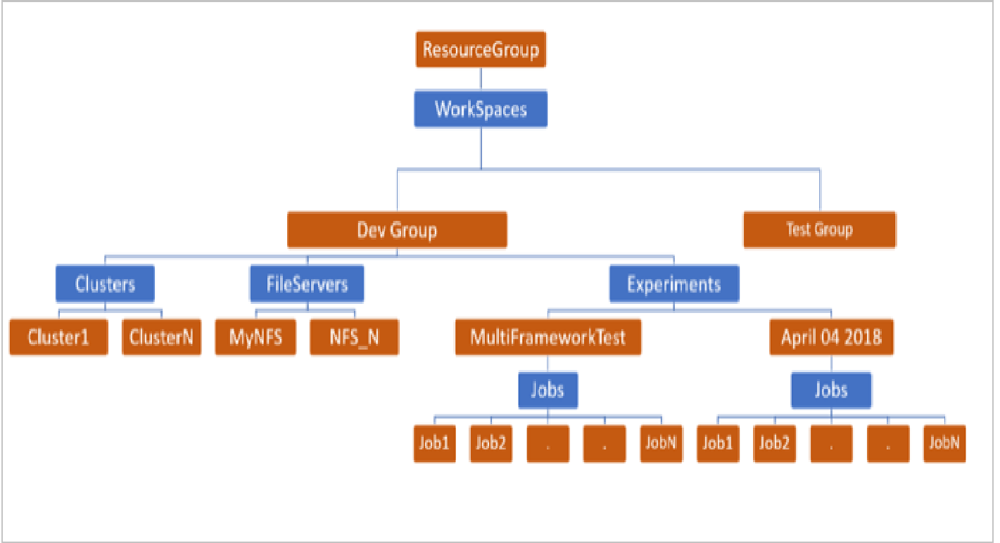
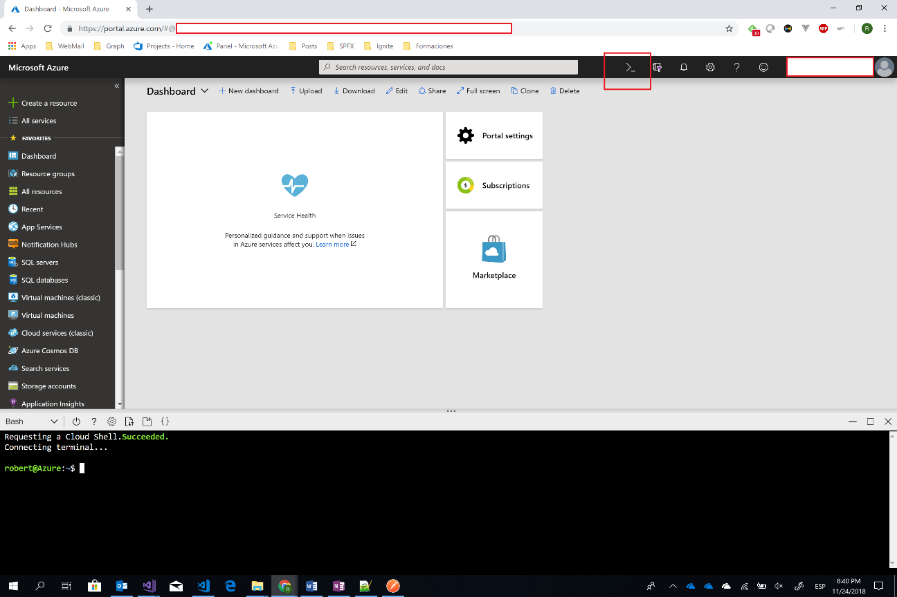
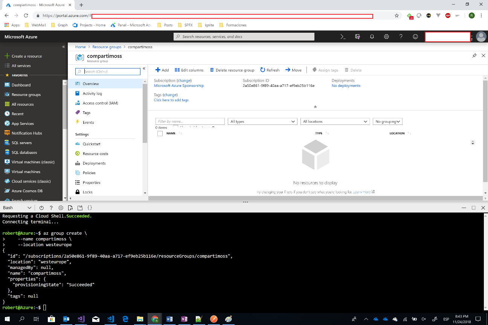
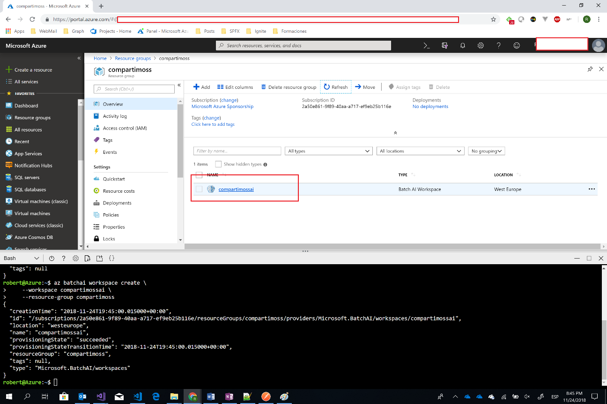
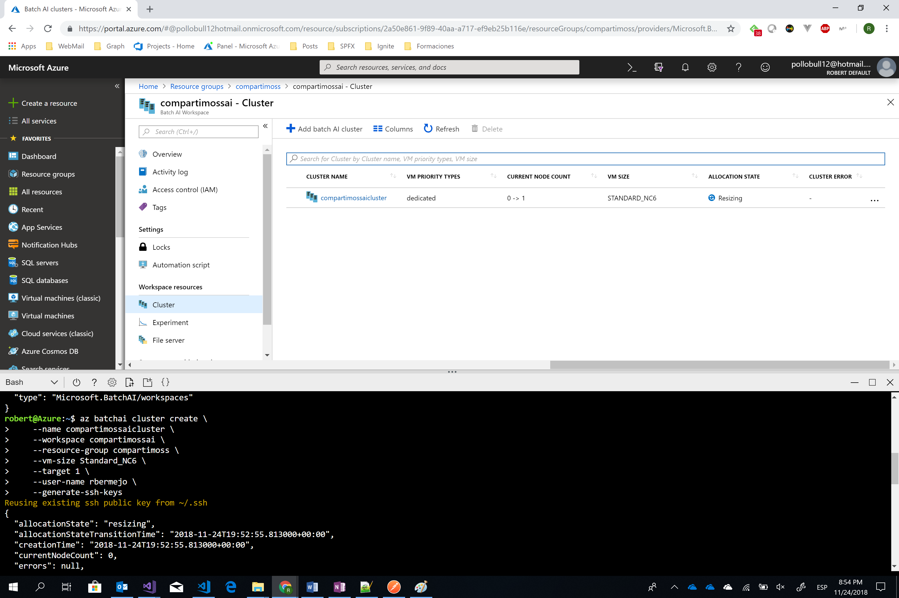

import ArticleHeader from '../../../components/article-header'

<ArticleHeader frontmatter={props.pageContext.frontmatter} />

La inteligencia artificial ya hace un tiempo que están entre nosotros, ¿quién no ha oído hablar de los cognitive services, bots, machine learning o ML.Net entre otros? La base de la AI son los modelos de datos que la alimentan, estos modelos suelen ser diseñados por expertos en AI o Data Scientists. Pero estos modelos hay que entrenarlos y para hacerlo se requiere de mucho hardware y tiempo.

Azure Batch AI es un servicio PaaS de Azure creado para ayudar a entrenar y probar estos modelos en Azure sin la necesidad de administrar la complejidad de la infraestructura que requiere este tipo de procesos.

Con Azure Batch AI de lo único que nos debemos preocupar es de:

- Seleccionar los recursos necesarios.
- Donde almacenar los inputs de entrada del modelo.
- Donde almacenar los outputs de salida del modelo.

**Usos de Azure Batch AI**

Se puede usar Azure Batch AI en dos escenarios:

1. Crear una instancia para entrenar, probar y puntuar modelos de AI y aprendizaje automático en clusters utilizando GPUs o CPUs.
2. Seleccionando un cluster como destino de un workflow con Azure Machine Learning u otro servicio o herramienta de Azure AI.

**Training**

Como hemos comentado, Azure Batch AI nos ayuda a entrenar modelos de Machine Learning como redes neuronales y/u otras aproximaciones del mundo AI. Además, soporta las librerías open source más conocidas y extendidas en el mundo AI como TensorFlow, PyTorck, Chainer o Microsoft Cognitive Toolkit (CNTK).

Azure Batch AI nos ayuda a entrenar nuestros modelos gracias las siguientes características:

- Distribute Training à Permite escalar verticalmente jobs en diferentes GPUs dentro de una misma red permitiendo entrenar grandes redes con grandes volúmenes de datos.
- Experimental à Permite entrenar varios trabajos a la vez, escalado horizontal, permitiendo probar nuevas ideas o ajustar y/u optimizar los Jobs.
- Execute in Parallel à Nos permite puntuar o entrenar varios modelos en paralelo permitiendo que los trabajos se realicen más rápidamente.

**Cómo funciona**

Azure Batch AI se puede crear y administrar a partir de:

- SDK de Azure Batch AI.
- Azure CLI.
- Powershell.
- Azure Portal

Estas herramientas no permitirán:

- Aprovisionar y escalar clusters à Podemos elegir el tipo de VM que queremos utilizar, así como el número de nodos, también podemos configurar escalado vertical de forma automática o manual.
- Administración de las dependencias y los contenedores à Por defecto las VM que utiliza el servicio son VM Linux con una configuración predeterminada. Esta configuración puede modificarse o extenderse mediante scripts de inicio y se pueden personalizar imágenes en caso de querer utilizar otro tipo de VM.
- Distribución de datos à Para administrar los datos de entrada, salida y scripts, se puede utilizar:
    - Azure Files
    - Azure Blob Storage
    - Servidor NFS

También permite soluciones de almacenamiento personalizadas que pueden configurarse en los nodos del cluster y los contenedores.

- Programación de trabajos à Se pueden encolar trabajo y priorizarlos, de esta forma se pueden compartir recursos.
- Control de errores à Podemos ver en qué estado están nuestros Jobs y en caso de error podemos reiniciarlos.

**Jerarquía de recursos**

Al crear el servicio de Azure Batch AI en Azure, este se creará en uno o más recursos. Cada recurso creado contendrá una estructura como la que muestra la siguiente imagen:

- WorkSpace à Los WorkSpaces ayudan a separar el trabajo en diferentes grupos o proyectos. Es una colección de alto nivel del resto de recursos.
- Clúster à Es la agrupación de VM que ejecutarán los Jobs. El tamaño de las VM en un cluster es el mismo, así como todas son del mismo tipo. Generalmente se configuran diferentes clusters para cada categoría o tipo de trabajo a realizar.
- Servidor de archivos à Se puede crear un servidor de archivos donde almacenar datos de entrada, de salido o los scripts de aprendizaje. Por defecto se crea un servidor de ficheros NFS administrado en un solo nodo que se pueden montar en los diferentes clusters proporcionando una ubicación de almacenamiento centralizada, accesible y sencilla. Si esta opción no cumple con las necesidades también se pueden configurar otras opciones como Azure Storage, Azure Files o alguna solución personalizada.
- Experimento à Agrupación de Jobs relacionados que se administran conjuntamente y que intentan resolver un problema específico.
- Job à Son las tareas o scripts que entrenarán nuestros modelos. Cada job ejecuta un único script en un cluster y workspace

**Creando nuestro primer servicio Azure Batch AI**

Una vez ya tenemos la visión global de lo que el servicio nos proporciona y como se estructura vamos a crear nuestro primer servicio. Como ya hemos comentado se puede crear mediante:

- Azure CLI.
- Powershell.
- Portal.

En nuestro caso vamos a ver como se crea mediante Azure CLI del Portal:

- Entramos en el portal y abrimos la CLI:

- Ahora creamos el recurso que vamos a usar:

az group create \

--name compartimoss \

--location westeurope

- Ahora crearemos el servicio de Azure Batch AI dentro de este recurso:

az batchai workspace create \

--workspace compartimossai \

--resource-group compartimos

- Una vez tenemos creado el workspace creamos el cluster con las VM que utilizaremos para el entrenamiento, en nuestro caso VM Stantdard\_NC6:

az batchai cluster create \

--name compartimossaicluster \

--workspace compartimossai \

--resource-group compartimoss \

--vm-size Standard\_NC6 \

--target 1 \

--user-name rbermejo \

--generate-ssh-keys

Como se ve en la imagen cuando se crea el cluster este se crea en estado resazing, al cluster estará creado y activo cuando pase a estado Steady. Ahora ya tenemos el entorno creado para poder empezar a trabajar con él.

**Conclusiones**

En este artículo se ha intentado hacer un overview de que es Azure Batch AI, cuáles son sus características, que nos proporciona y como lo podemos crear.

Podemos ver que es un servicio muy potente que nos ayudará a la hora de conseguir recursos para entrenar nuestros modelos de forma rápida y controlando nuestros costes, lo que nos permitirá reducir de forma exponencial el tiempo de mejora de estos.

**Robert Bermejo**
 Cloud Architect & Technical Lead Consultant in TOKIOTA | Microsoft Azure MVP

bermejoblasco@live.com
 @robertbemejo
 www.robertbermejo.com

