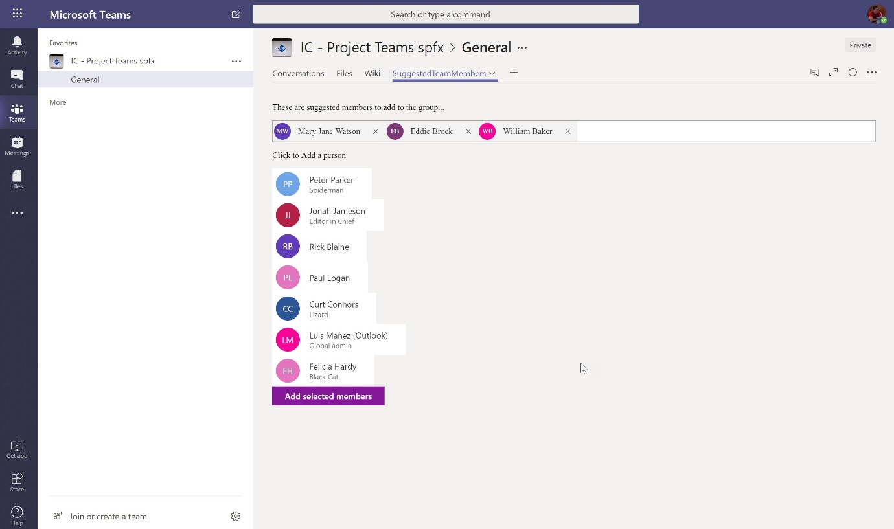
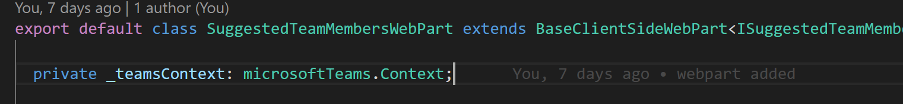
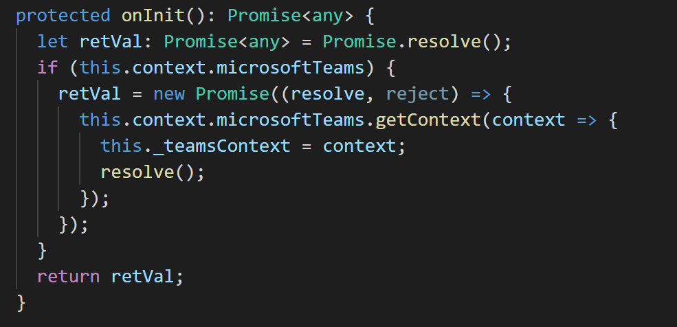
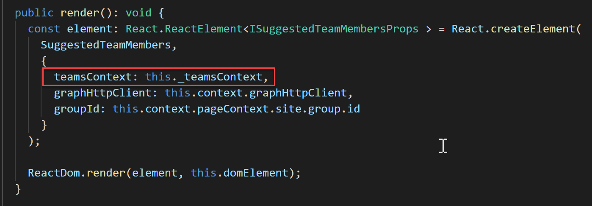

El pasado 8 de noviembre fue un día importante en el calendario SharePoint, ya que se liberó la esperada nueva versión del SharePoint Framework (SPFx), la 1.7.0, como ellos mismos dicen, probablemente la mayor release desde que apareció el SPFx.

**Novedades incluidas en 1.7.0**

Algunas *features* que han pasado a GA (Generally Available):

- **Dynamic Data**: también conocidos como WebParts conectados. Esta feature, que ya pudimos ver en la release anterior en forma de *preview*, permite conectar e intercambiar datos entre diferentes WebParts.
- **Soporte para SharePoint Server 2019**: Ahora podemos apuntar a SharePoint Server 2019 al crear el proyecto con el generador de *Yeoman*.
- **React v16**: por fin podemos trabajar con una versión más reciente de ReactJS, aunque todavía por detrás de la última versión desarrollada por los chicos de Facebook.

Además, las siguientes features se han agregado en forma de preview:

- **SPFx como Tabs de Teams**: Ahora podemos desarrollar soluciones SPFx, y ejecutarlas en Teams, como una Tab más. Esto es una gran mejora, ya que podemos extender Teams, y reutilizar nuestros skills de SPFx para ello.
- **Apps basadas en Teams dentro de SharePoint**: si estas creando provider-hosted apps para Teams, ahora también puedes usarlas en SharePoint (seria lo contrario al punto anterior, lo que demuestra que hay gran compatibilidad ahora entre Teams y SharePoint en cuanto a soluciones desarrolladas se refiere).
- **Apps a página completa**: este feature permite desarrollar páginas modernas donde el WebPart ocupa el cuerpo principal de la página.
- **WebParts aislados**: Otra de las peticiones mas esperadas era poder desarrollar WebParts que a nivel de permisos quedaran aislados unos de otros. En versiones anteriores, si un WebPart tenía permisos para llamar, por ejemplo, a Graph Api con permisos para leer el email del usuario, cualquier otro WebPart de la página tenia ese mismo permiso, lo necesitase o no.
- **Suscripciones a Lista en el navegador**: Ahora podemos obtener en nuestro componente, notificaciones "en tiempo real" cuando hay algún cambio a nivel de lista.
- **Mejoras en el ciclo de vida de los ContentPlaceHolder**: no hay mucho que destacar aquí. Básicamente Microsoft reconoce que no lo estaba haciendo muy bien en el ciclo de vida de los ContentPlaceHolder, asi que ha mejorado y re-hecho algunas de estas partes.

**Creando proyectos (o actualizando) a 1.7.0**

Para poder crear proyectos SPFx basados en el 1.7.0, primero debemos actualizar la versión del generador de Yeoman, ejecutando el siguiente comando:

*npm install @microsoft/generator-sharepoint –global*

Si lo que queremos es crear un proyecto nuevo, y utilizar las features en preview, acordaos de añadir la opción --plusbeta:

*yo @microsoft/sharepoint --plusbeta*

Si lo que queremos es actualizar un proyecto existente a la 1.7.0, recomendamos hacer uso de la herramienta Office365 CLI, con el comando *Project-update* ([https://pnp.github.io/office365-cli/cmd/SPFx/project/project-upgrade/](https://pnp.github.io/office365-cli/cmd/spfx/project/project-upgrade/)).

Este comando nos dará un reporte de todos los cambios que debemos aplicar, que, a groso modo, consisten en editar el fichero *package.json* y:

- Cambiar la versión de todos los paquetes de SPFx a 1.7.0.
- Actualizar la versión del paquete *react* y *react-dom* a la versión 16.3.2.
- Actualizar el paquete *@types/react* a v16.4.2.
- Actualizar el paquete *@types/react-dom* a v16.0.5.

Una vez realizados los cambios, se recomienda eliminar el directorio node\_modules y volver a descargar todos los paquetes (bien sea con npm, yarn o el gestor que utilicéis).

**Un par de notas no tan buenas**

Conviene destacar que no todo son buenas noticias en cuanto a esta versión, ya que hay algunas cosas que esperábamos que se hubieran resuelto de otra manera, como, por ejemplo:

- El generador de Yeoman hace preguntas sobre preview features (como Teams), incluso si no especificas la opción de usar las features en Preview.
- La versión de React, es la liberada en marzo 2018, por lo que es ya algo "vieja".
- La versión de React Fabric está todavía en la v5, y esto es un poco decepcionante, ya que esta versión tiene bastantes issues conocidos que se solucionan en la v6.\*.
- La versión de webpack también es algo antiguada, ya que sigue en la 3, y debería estar en la 4.\*.
- Lo mismo con la versión de TypeScript, la 2.4.2 fue liberada en Julio 2017, por lo que llevamos mas de 1 año de retraso (actualmente TS esta en la v 3.1.6).

Aun así, no nos desanimemos, la 1.7.0 es una gran release, y teniendo en cuenta que ya estamos en la v16 de React, es muy posible que los updates ahora sean más rápidos y en breve estemos en versiones mas actuales.

**Ejemplo de Teams-tab usando React**

Pero basta de cháchara y vamos a ver un ejemplo de una de las features más esperadas de esta release, que es la posibilidad de desarrollar un WebPart y agregarlo a un Teams como una Tab más dentro de un Channel.

Como parte del repositorio en GitHub de SPFx, he creado un proyecto bastante completo que podéis descargar desde este link:

[https://github.com/SharePoint/sp-dev-fx-WebParts/tree/master/samples/react-teams-tab-suggested-members](https://github.com/SharePoint/sp-dev-fx-webparts/tree/master/samples/react-teams-tab-suggested-members)

Para este artículo vamos a simplificarlo un poco, y explicaremos los fragmentos de código más importantes.

Partimos de un proyecto WebPart SPFx creado con la 1.7.0 y activando las features en *preview*.

Ahora disponemos de un namespace *microsoftTeams*, que ofrece un objeto *Context*, que nos va a ofrecer información del contexto de Teams, en el caso de que el WebPart se ejecute como una Tab de Teams. Así que lo primero en nuestro WebPart será instanciar ese contexto:

Para cargar el contexto, tenemos que hacerlo en el *onInit* del WebPart. Quiza aquí, usando React, estéis pensando en hacer esto dentro del *componentDidMount*, pero a mí no me ha funcionado ahí, al parecer en ese punto del ciclo de vida del WebPart ya no podemos acceder al contexto de Teams, así que hay que cargar el contexto en el *onInit*, y pasarlo al componente de React en sus *props*.

En principio, hasta que no se resuelve la Promise del evento OnInit, no se ejecutara el render del WebPart, por lo que en ese momento podemos pasar el contexto al componente "*hijo*" del WebPart (el componente React).

Llegado a este punto, en el *Render* del componente de *React*, podemos acceder al contexto de Teams con:

*this.props.teamsContext*

Y acceder a diferentes propiedades como:

*this.props.teamsContext.teamId*
*this.props.teamsContext.teamName*
*this.props.teamsContext.channelId*
*this.props.teamsContext.channelName*

Fijaros en la potencia de esto, ya que conociendo estas propiedades del Team, podemos acceder a la Graph API (usando el conocido *graphHttpClient*), y poder extender la funcionalidad de Teams.

**Conclusión**

Como hemos comentado durante el artículo, estamos ante una de las actualizaciones mas esperadas, y que abre un importante abanico de posibilidades de desarrollo y extensión, no ya sólo de SharePoint, sino ahora también de Teams. Animaros a probarlo. Por nuestra parte, en los siguientes números iremos viendo con más detalle todas las novedades del 1.7.0.

**Luis Mañez**

SharePoint / Cloud Solutions Architect en ClearPeople LTD
 @luismanez
 [https://medium.com/inherits-cloud](https://medium.com/inherits-cloud)

 
 
import LayoutNumber from '../../../components/layout-article'
export default LayoutNumber
