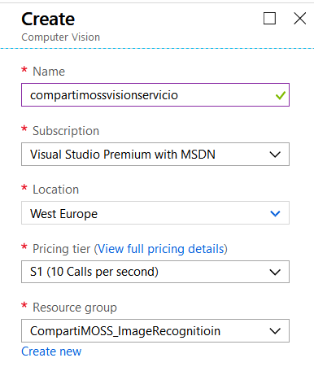
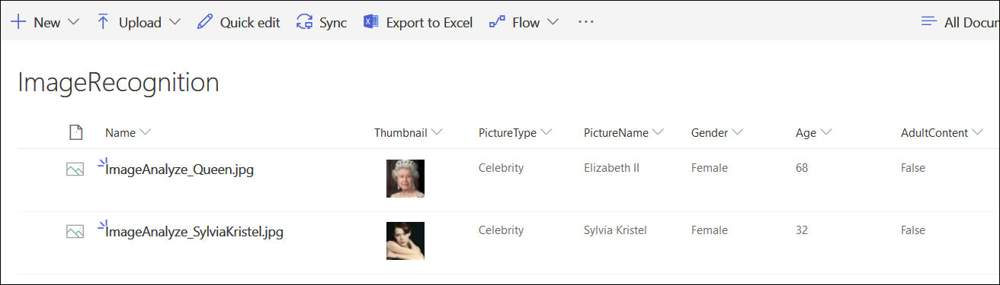

​

El servicio de Reconocimiento de imágenes de Azure forma parte del grupo de Servicios de Conocimiento (Cognitive Services), bajo los servicios de Visión Computarizada (Computer Vision). El servicio ofrece ayuda con diferentes tareas:

- Análisis de imágenes:  Esta función devuelve información sobre el contenido visual que se encuentra en una imagen, ofreciendo etiquetado, descripcion en cuatro idiomas para identificar el contenido, ayuda a detectar contenido potencialmente para solo adultos, tipos de imágenes y esquemas de color.
- Reconocimiento de celebridades y sitios importantes: reconoce imágenes de aproximadamente 200.000 personalidades mundiales y 9.000 sitios importantes. Utiliza el servicio de "Análisis de imágenes" descrito en el punto anterior.
- OCR: Detección de texto en una imagen usando Optical Character Recognition (OCR). Vea el articulo "SharePoint y Azure: Reconocimiento Óptico de Caracteres (OCR)" en CompartiMOSS número 37 de septiembre 2018 ([http://www.compartimoss.com/revistas/numero-37/sharepoint-y-azure-ocr](/revistas/numero-37/sharepoint-y-azure-ocr)).
- Reconocimiento de texto manual: Similar al servicio de OCR, pero para texto escrito a mano en una imagen.
- Análisis de video: analiza frames de videos en tiempo (casi) real y los envía a otro servicio para presentación y análisis.
- Generación de thumbnails: modifica el tamaño y estilo de imágenes.


**Azure Image Recognition y SharePoint**

El servicio de Reconocimiento de imágenes del Azure Computer Vision API se puede utilizar en SharePoint para enriquecer automáticamente la información en el sistema. Cuando se suben imágenes a SharePoint, en realidad el sistema no puede indexar su contenido, solamente los metadatos que posee. Por medio de este servicio de Azure es posible encontrar información sobre la imagen, y agregarla al sistema como metadatos, permitiendo clasificarla con exactitud, y obtener resultados de búsqueda más precisos.

En el ejemplo que se va a desarrollar enseguida se utilizan los servicios del Computer Vision API para extraer información de una imagen de un personaje y agregarla a varios campos en la Librería a donde se sube, además de crear un thumbnails. La Biblioteca de SharePoint dispone para esto de campos de texto para insertar el nombre del personaje, su edad estimada en la foto, si la imagen es identificada como contenido para adultos, y un campo de imagen para el thumbnail.

**Configuración del Azure Computer Vision API**

Para utilizar el Computer Vision API es necesario crear primero el servicio en Azure. Para acceder a la página de administración de Azure ([https://portal.azure.com](https&#58;//portal.azure.com/)) necesita sus credenciales (es posible obtener una cuenta temporal de prueba de Azure desde la página de Microsoft [https://azure.microsoft.com/en-us/try/cognitive-services/](https&#58;//azure.microsoft.com/en-us/try/cognitive-services/)).

Para crear un servicio (de pago) en Azure:

1. Entre al portal de manejo de Azure ([https://portal.azure.com](https&#58;//portal.azure.com/)) utilizando sus credenciales.
2. Vaya a la sección de "Resource Groups" y cree un nuevo Grupo de Recursos (también es posible reutilizar un grupo ya existente).
3. Cree un servicio de "Computer Vision API":
    1. En el Resource Group, utilice el botón de "+Add" para crear un recurso, busque por "computer vision" en la casilla de búsqueda y seleccione "Computer Vision" en los resultados.
    2. Asígnele un nombre al servicio y utilice el Grupo de Recursos deseado. En la casilla de "Pricing tier" seleccione un nivel dependiendo de la cantidad de consultas a esperar por segundo, lo que determina el precio del servicio (por mil consultas).




4.       Una vez creado el servicio, haga clic sobre su nombre en la lista de recursos del Resource Group, vaya a "Keys" y copie el valor de "Key 1".

**Utilizando el Azure Computer Vision con SharePoint**

Las llamadas al servicio de Azure se realizan por medio de REST o por medio del Computer Visio API SDK. En el siguiente ejemplo, que utiliza ambas formas de uso del servicio, se va a subir una imagen a una Biblioteca de SharePoint y luego, utilizando un WebHook, hacer que una Función de Azure haga dos llamadas al servicio:

- La primera llamada es para utilizar el servicio de Análisis, el que devuelve varias propiedades de la imagen: si es una imagen de una personalidad o no, si el contenido es para adultos o no, la edad estimada de la persona (y varias otras propiedades que no se van a utilizar en el ejemplo, como el tamaño de la imagen, tipo de imagen, etc.). Utiliza una llamada REST.
- La segunda llamada es al servicio de generación de thumbnails, el que devuelve otra imagen de dimensiones especificadas. Utiliza una llamada del Computer Visio API SDK.


**Nota:** la creación y configuración de una Función de Azure se puede encontrar el en artículo "SharePoint y Azure – Azure Functions" ([http://www.compartimoss.com/revistas/numero-30/sharepoint-y-azure-azure-functions](/revistas/numero-30/sharepoint-y-azure-azure-functions)). La configuración y utilización de WebHooks de SharePoint se puede encontrar en el artículo "Eventos sobre SharePoint Online con Webhooks" ([http://www.compartimoss.com/revistas/numero-32/eventos-sobre-sharepoint-online-con-webhooks](/revistas/numero-32/eventos-sobre-sharepoint-online-con-webhooks)).

5.       Cree una cuenta de Funciones básica en el Grupo de Recursos, asignándole un nombre, Plan de Servicios y cuenta de Azure Storage

6.       Utilizando Visual Studio 2017 (o Visual Studio 2015 con el AddIn para programar Funciones de Azure), cree una nueva solución del tipo "Azure Functions". Una vez creada la solución, agréguele una Función del tipo "Http Trigger" (utilizando "Azure Functions v2") con derechos de acceso anónimos y cambie el nombre de la Función una vez creada (por defecto se llamará "Function1").

7.       Agréguele a la solución los paquetes NuGet "AppForSharePointOnlineWebToolkit", " Microsoft.Azure.CognitiveServices.Vision.ComputerVision" y "Newtonsoft.Json".

8.        Reemplace toda la rutina "Run" con el siguiente código:

```
[FunctionName("ImageAnalyze")]public static async Task<HttpResponseMessage> Run([HttpTrigger(AuthorizationLevel.Anonymous, "post", Route = null)]HttpRequestMessage req, TraceWriter log){    log.Info("*** ImageAnalyze function processed a request ***");     // Registration    string validationToken = HelpFunctions.GetValidationToken(req);    if (validationToken != null)    {        log.Info($"---- Processing Registration");        var myResponse = req.CreateResponse(HttpStatusCode.OK);        myResponse.Content = new StringContent(validationToken);        return myResponse;    }     // Changes    var myContent = await req.Content.ReadAsStringAsync();    var allNotifications = JsonConvert.DeserializeObject<ResponseModel<NotificationModel>>(myContent).Value;     if (allNotifications.Count > 0)    {        log.Info($"---- Processing Notifications");        string siteUrl = ConfigurationManager.AppSettings["whSiteListUrl"];        foreach (var oneNotification in allNotifications)        {            // Login in SharePoint            ClientContext SPClientContext = HelpFunctions.LoginSharePoint(siteUrl);             // Get the Changes            GetChanges(SPClientContext, oneNotification.Resource, log);        }    }     return new HttpResponseMessage(HttpStatusCode.OK);}
```


Esta rutina primero se encarga de hacer el registro del WebHook (si la consulta contiene un parámetro "validationtoken" en el Query String) utilizando la rutina "GetValidationToken":

```
public static string GetValidationToken(HttpRequestMessage req){    string strReturn = string.Empty;     strReturn = req.GetQueryNameValuePairs()        .FirstOrDefault(q => string.Compare(q.Key, "validationtoken", true) == 0)        .Value;     return strReturn;}
```


Después de registrado el WebHook, cada consulta es procesada para extraer las notificaciones que contiene. En cada notificación de la colección de notificaciones se hace un logeo en SharePoint para obtener los cambios detectados en la Lista (por medio de la rutina "GetChanges"). En la variable "whSiteListUrl" del App Settings de la función se encuentra el URL del sitio en donde está la Lista a examinar ("https://[Dominio].sharepoint.com/sites/[NombreSitio").


9. La rutina "GetChanges" recibe el contexto de SharePoint y el identificador de la Lista, y tiene la forma:

```
static void GetChanges(ClientContext SPClientContext, string ListId, TraceWriter log){    // Get the Images List    Web spWeb = SPClientContext.Web; //.Site.RootWeb;    List myList = spWeb.Lists.GetByTitle(ConfigurationManager.AppSettings["whListNameImageAnalyze"]);    SPClientContext.Load(myList);    SPClientContext.ExecuteQuery();     // Get the Thumbnail List    Web spWebThumb = SPClientContext.Web;    List myListThumb = spWebThumb.Lists.GetByTitle(ConfigurationManager.AppSettings["whListNameImageAnalyzeThumbails"]);    SPClientContext.Load(myListThumb);    SPClientContext.ExecuteQuery();     // Create the ChangeToken and Change Query    ChangeQuery myChangeQuery = HelpFunctions.GetChangeQueryNew(ListId);     // Get all the Changes    var allChanges = myList.GetChanges(myChangeQuery);    SPClientContext.Load(allChanges);    SPClientContext.ExecuteQuery();     foreach (Change oneChange in allChanges)    {        if (oneChange is ChangeItem)        {            int myItemId = (oneChange as ChangeItem).ItemId;             // Get what is changed            log.Info($"---- Changed ItemId : " + myItemId);            ListItem myItem = myList.GetItemById(myItemId);            Microsoft.SharePoint.Client.File myFile = myItem.File;            ClientResult<System.IO.Stream> myFileStream = myFile.OpenBinaryStream();            SPClientContext.Load(myFile);            SPClientContext.ExecuteQuery();             // The picture as Byte Array            byte[] myFileBytes = CognitiveRoutines.ConvertStreamToByteArray(myFileStream);             // Analyze the picture            ImageAnalyzeResult myResult = CognitiveRoutines.GetAzureImageAnalyze(myFileBytes).Result;            log.Info($"---- Image Analyze Result : " + JsonConvert.SerializeObject(myResult));             // Create the Thumbnail            Stream myThumbnail = CognitiveRoutines.GetAzureImageThumbnail(myFileBytes).Result;            log.Info($"---- Image Thumbnail created");             // Upload the Thumbnail            FileCreationInformation infoThumb = new FileCreationInformation();            infoThumb.Content = CognitiveRoutines.ConvertStreamToByteArray(myThumbnail);            infoThumb.Url = myListThumb.ParentWebUrl + "/" + myListThumb.Title + "/thumb_" + myFile.Name;            Microsoft.SharePoint.Client.File newFile = myListThumb.RootFolder.Files.Add(infoThumb);            SPClientContext.Load(newFile);            SPClientContext.ExecuteQuery();            log.Info($"---- Image Thumbnail uploaded");             // Insert the metadata values back in the List            myItem["Title"] = myResult.description.captions[0].text;            if (myResult.categories[0].detail.celebrities != null)            {                if (myResult.categories[0].detail.celebrities.Length > 0)                {                    myItem["PictureType"] = "Celebrity";                    myItem["PictureName"] = myResult.categories[0].detail.celebrities[0].name;                    myItem["Gender"] = myResult.faces[0].gender;                    myItem["Age"] = myResult.faces[0].age;                    myItem["AdultContent"] = myResult.adult.isAdultContent.ToString();                    myItem["Thumbnail"] = newFile.ServerRelativeUrl;                     myItem.Update();                    SPClientContext.ExecuteQuery();                    log.Info($"---- Image Analyze added to SharePoint Item");                }                else                {                    log.Info($"---- The image is not a celebrity");                }            }        }    }}
```


Primero se crean dos objetos que contienen la Lista a utilizar en SharePoint y la Lista que contendrá los thumbnails. Luego se crea una consulta de cambio (variable "myChangeQuery") que especifica que se requieren los cambios ocurridos en el ultimo minuto, que ocurren en elementos de la Lista y que sean del tipo "Add", es decir, elementos nuevos:


```
public static ChangeQuery GetChangeQueryNew(string ListId){    ChangeToken lastChangeToken = new ChangeToken();    lastChangeToken.StringValue = string.Format("1;3;{0};{1};-1", ListId, DateTime.Now.AddMinutes(-1).ToUniversalTime().Ticks.ToString());    ChangeToken newChangeToken = new ChangeToken();    newChangeToken.StringValue = string.Format("1;3;{0};{1};-1", ListId, DateTime.Now.ToUniversalTime().Ticks.ToString());    ChangeQuery myChangeQuery = new ChangeQuery(false, false);    myChangeQuery.Item = true;  // Get only Item changes    myChangeQuery.Add = true;   // Get only the new Items    myChangeQuery.ChangeTokenStart = lastChangeToken;    myChangeQuery.ChangeTokenEnd = newChangeToken;     return myChangeQuery;}
```


Luego de ejecutar la consulta, se examina cada uno de los cambios y se obtiene un objeto con la imagen agregada, que se convierte en un array de bytes por medio de la rutina "ConvertStreamToByteArray":


```
public static Byte[] ConvertStreamToByteArray(ClientResult<System.IO.Stream> myFileStream){    Byte[] bytReturn = null;     using (System.IO.MemoryStream myFileMemoryStream = new System.IO.MemoryStream())    {        if (myFileStream != null)        {            myFileStream.Value.CopyTo(myFileMemoryStream);            bytReturn = myFileMemoryStream.ToArray();        }    }     return bytReturn;}
```


En la misma rutina se llama a "GetAzureImageAnalyze", la que se encarga de hacer la consulta en Azure, utilizando como parámetro de entrada el array de bytes de la imagen. Esta rutina entrega de regreso un objeto del tipo "ImageAnalyzeResult" que contiene los resultados de la consulta y que tiene la forma:


```
#region ImageAnalyzeResult    public class ImageAnalyzeResult    {        public Category[] categories { get; set; }        public Adult adult { get; set; }        public Tag[] tags { get; set; }        public Description description { get; set; }        public string requestId { get; set; }        public Metadata metadata { get; set; }        public Face[] faces { get; set; }        public Color color { get; set; }        public Imagetype imageType { get; set; }    }     public class Adult    {        public bool isAdultContent { get; set; }        public bool isRacyContent { get; set; }        public float adultScore { get; set; }        public float racyScore { get; set; }    }     public class Description    {        public string[] tags { get; set; }        public Caption[] captions { get; set; }    }     public class Caption    {        public string text { get; set; }        public float confidence { get; set; }    }     public class Metadata    {        public int width { get; set; }        public int height { get; set; }        public string format { get; set; }    }     public class Color    {        public string dominantColorForeground { get; set; }        public string dominantColorBackground { get; set; }        public string[] dominantColors { get; set; }        public string accentColor { get; set; }        public bool isBWImg { get; set; }    }     public class Imagetype    {        public int clipArtType { get; set; }        public int lineDrawingType { get; set; }    }     public class Category    {        public string name { get; set; }        public float score { get; set; }        public Detail detail { get; set; }    }     public class Detail    {        public Celebrity[] celebrities { get; set; }        public Landmark[] landmarks { get; set; }    }     public class Celebrity    {        public string name { get; set; }        public Facerectangle faceRectangle { get; set; }        public float confidence { get; set; }    }     public class Facerectangle    {        public int left { get; set; }        public int top { get; set; }        public int width { get; set; }        public int height { get; set; }    }     public class Landmark    {        public string name { get; set; }        public float confidence { get; set; }    }     public class Tag    {        public string name { get; set; }        public float confidence { get; set; }    }     public class Face    {        public int age { get; set; }        public string gender { get; set; }        public Facerectangle1 faceRectangle { get; set; }    }     public class Facerectangle1    {        public int left { get; set; }        public int top { get; set; }        public int width { get; set; }        public int height { get; set; }    }
```


Luego, la rutina "GetAzureImageThumbnail" genera un thumbnail y lo retorna como un stream:


```
public static async Task<Stream> GetAzureImageThumbnail(byte[] myFileBytes){    Stream streamReturn;    Stream myFileStream = new MemoryStream(myFileBytes);     // Create the API Client    ComputerVisionClient computerVision = new ComputerVisionClient(        new ApiKeyServiceClientCredentials(ConfigurationManager.AppSettings["azVisionApiServiceKey"]),        new System.Net.Http.DelegatingHandler[] { });     computerVision.Endpoint = "https://westeurope.api.cognitive.microsoft.com";     // Get the thumbnail    streamReturn = await computerVision.GenerateThumbnailInStreamAsync(        40, 40, myFileStream, true);  // Size fixed to 40x40     return streamReturn;}
```


Para guardar el thumbnail en la Biblioteca es necesario convertir el stream de regreso a un byte array utilizando un overwrite de "ConvertStreamToByteArray":


```
public static Byte[] ConvertStreamToByteArray(Stream myFileStream){    Byte[] bytReturn = null;     using (MemoryStream myFileMemoryStream = new MemoryStream())    {        if (myFileStream != null)        {            myFileStream.CopyTo(myFileMemoryStream);            bytReturn = myFileMemoryStream.ToArray();        }    }     return bytReturn;}
```


10. La rutina "GetAzureImageAnalyze" recibe como parámetros de entrada el array de bytes de la imagen y retorna un objeto con los valores encontrados por Azure:​


```
public static async Task<ImageAnalyzeResult> GetAzureImageAnalyze(byte[] myFileBytes){    ImageAnalyzeResult resultReturn = new ImageAnalyzeResult();     HttpClient client = new HttpClient();     // Request headers.    client.DefaultRequestHeaders.Add("Ocp-Apim-Subscription-Key", ConfigurationManager.AppSettings["azVisionApiServiceKey"]);     // Request parameters    string requestParameters = "visualFeatures=Categories,Description,Adult,Tags,Faces&language=en";     // Assemble the URI for the REST API Call.    string uri = ConfigurationManager.AppSettings["azVisionApiAnalyzeEndpoint"] + "?" + requestParameters;    string contentString = string.Empty;     HttpResponseMessage response;     using (ByteArrayContent content = new ByteArrayContent(myFileBytes))    {        content.Headers.ContentType = new MediaTypeHeaderValue("application/octet-stream");         // Execute the REST API call.        response = await client.PostAsync(uri, content);         // Get the JSON response.        contentString = await response.Content.ReadAsStringAsync();    }     resultReturn = JsonConvert.DeserializeObject<ImageAnalyzeResult>(contentString);    return resultReturn;}
```


Cada consulta se realiza por medio de una llamada REST a un URL preespecificado del servicio de búsqueda (dado en el valor de la App Settings "azVisionApiAnalyzeEndpoint" y que es "https://westeurope.api.cognitive.microsoft.com/vision/v2.0/analyze"), utilizando como parámetros en el QueryString las propiedades que se desean recobrar (Categories, Description, Adult, Tags, Faces). En la App Settings "azVisionApiServiceKey" se mantiene el valor de la llave mencionada en el punto 4.

Por otro lado, la rutina "GetAzureImageThumbnail" produce el thumbnail:

```
public static async Task<Stream> GetAzureImageThumbnail(byte[] myFileBytes){    Stream streamReturn;    Stream myFileStream = new MemoryStream(myFileBytes);     // Create the API Client    ComputerVisionClient computerVision = new ComputerVisionClient(        new ApiKeyServiceClientCredentials(ConfigurationManager.AppSettings["azVisionApiServiceKey"]),        new System.Net.Http.DelegatingHandler[] { });     computerVision.Endpoint = "https://westeurope.api.cognitive.microsoft.com";     streamReturn = await computerVision.GenerateThumbnailInStreamAsync(        40, 40, myFileStream, true);  // Size fixed to 40x40     return streamReturn;}
```


En este caso se esta utilizando el SDK, con el que se crea un cliente del tipo "ComputerVisionClient", al que se le entrega la llave del servicio y el endpoint del servicio. El método "GenerateThumbnailStreamAsync" genera el thumbnail, en este caso utilizando un tamaño fijo de 40x40 pixeles.

11. Otras tres clases definen objetos utilizados por el WebHook:​


```
public class ResponseModel<T>{    [JsonProperty(PropertyName = "value")]    public List<T> Value { get; set; }} public class NotificationModel{    [JsonProperty(PropertyName = "subscriptionId")]    public string SubscriptionId { get; set; }     [JsonProperty(PropertyName = "clientState")]    public string ClientState { get; set; }     [JsonProperty(PropertyName = "expirationDateTime")]    public DateTime ExpirationDateTime { get; set; }     [JsonProperty(PropertyName = "resource")]    public string Resource { get; set; }     [JsonProperty(PropertyName = "tenantId")]    public string TenantId { get; set; }     [JsonProperty(PropertyName = "siteUrl")]    public string SiteUrl { get; set; }     [JsonProperty(PropertyName = "webId")]    public string WebId { get; set; }} public class SubscriptionModel{    [JsonProperty(NullValueHandling = NullValueHandling.Ignore)]    public string Id { get; set; }     [JsonProperty(PropertyName = "clientState", NullValueHandling = NullValueHandling.Ignore)]    public string ClientState { get; set; }     [JsonProperty(PropertyName = "expirationDateTime")]    public DateTime ExpirationDateTime { get; set; }     [JsonProperty(PropertyName = "notificationUrl")]    public string NotificationUrl { get; set; }     [JsonProperty(PropertyName = "resource", NullValueHandling = NullValueHandling.Ignore)]    public string Resource { get; set; }}
```


12. Registre el WebHook en la Biblioteca de SharePoint y suba una imagen que contenga texto. El WebHook hará que la Función realice su trabajo, entregue los resultados encontrados por Azure, genere un thumbnail y lo suba a la Biblioteca indicada y, finalmente, muestre los metadatos de la imagen:​


**Conclusiones**

El servicio de Reconocimiento de Imágenes del Azure Computer Vision API permite enriquecer la información que los usuarios guardan en SharePoint encontrando metadatos sobre las imágenes y creando thumbnails. El servicio de Reconocimiento de Imágenes es fácil de utilizar desde cualquiera lenguaje de programación, y produce resultados confiables rápida y seguramente. El API utiliza algoritmos de Inteligencia Artificial que se mejoran con el uso, por lo que no es necesario crear ni entrenar algoritmos propios.


**Gustavo Velez**
 MVP Office Apps and Services
 gustavo@gavd.net
 http://www.gavd.net

