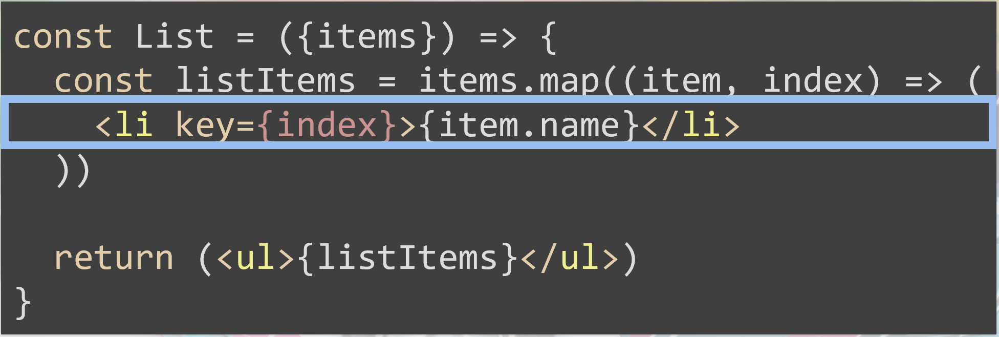

SPFx ha traído una multitud de novedades para el desarrollador tradicional de SharePoint acostumbrado a un entorno más clásico y estable. Pero como los tiempos cambian hay que adaptarse a todo este tooling de herramientas (gulp, reactJS, typescript, yoeman, code, webpack…) que se han convertido en nuestras herramientas del día a día. Como en toda transición que se precie, hay un proceso que todo desarrollador debe conocer y ese no es otro que el momento en el que deja de utilizar una herramienta en modo normal y empieza a exprimirla al máximo y sacarla su máximo partido.  En este articulo vamos a intentar explicar algunos detalles que hay que tener en cuenta cuando desarrollamos en ReactJS y que nos ayudan a mejorar el rendimiento de nuestra aplicación.

Partimos de la base de que para muchos de los desarrolladores de Office su primer contacto con ReactJS ha sido a través de SPFx. Para todos aquellos que se encuentren en esta situación les aconsejo que aprendan ReactJS independientemente de que después lo vayan a usar en SPFx o en otro tipo de desarrollo. Es vital conocer cómo funciona React, cuál es su ciclo de ejecución y todas las particularidades que tiene. De esta forma también viene muy bien para poder entender posteriormente como se ha montado SPFx. Muchas veces desde el desconocimiento pensamos que el éxito de esta librería es debido a la forma en la que trata el acceso al DOM y el algoritmo de Nodos que utiliza que no reemplaza todo el nodo sino el elemento que se ha modificado. Ahora bien, hay aspectos que no tenemos en cuenta y penalizan el rendimiento.

**Evitar Actualizaciones del DOM innecesarias**

**1.- El uso del "key"**

Dentro de las listas del html &lt;ul&gt;&lt;li&gt; el tener una Key en el mismo hace que los accesos al mismo sean mucho más rápidos, el no poner Key implica que para intentar añadir un nuevo elemento internamente se tenga que recorrer todos los elementos del mismo lo cual hace mucho más lento su acceso. Existen algunas herramientas como [React Developer Tools](https&#58;//chrome.google.com/webstore/detail/react-developer-tools/f)  que cuando estamos desarrollando nos marca en la consola que tenemos algunas etiquetas sin Key que intentemos solucionarlo. También existen reglas a la hora de compilación para evitar que pongamos la Key cuando toca (esta opción la aconsejo para evitar cometer errores tontos que después penalizan nuestra aplicación).

A la hora de poner una "key" también debemos tener en cuenta que esta sea única, es decir este código no sería correcto:

Como vemos si tenemos una variable "index" que la ponemos a todos los &lt;li&gt; que tenemos es lo mismo que no tener nada. Tenemos que poner un código único por ejemplo dentro de la clase ítems podemos tener un Id, que es un elemento único y lo podemos utilizar como "key"

**2.- Uso de High Order Component**

Un High Order Component a partir de este momento abreviado como "HoC" es un patrón que se utiliza mucho en React para poder reaprovechar y reutilizar mucho de nuestros componentes. Este patrón lo podemos comparar como las muñecas Matriuskas en las que dentro de una muñeca hay otra más pequeña y así sucesivamente.  Podemos hacer HoC por ejemplo para aplicar Seguridad a un componente o por ejemplo añadir un título a nuestro componente.  Un ejemplo de High Order Component puede ser el siguiente

¿Qué problema podemos tener con este HoC? Pues si este artefacto cuando vamos a hacer uso de él lo hacemos en el método Render del componente que se está implementando, implica que cada que ves que vuelve a pintar este componente estamos creando un nuevo componente. La solución correcta seria extraer este HoC a una variable más global e invocarla cuando vayamos a usarlo.

Ejemplo

Sino que deberíamos sacar la inicialización del componente fuera del render incluso fuera de la propia clase

**Evita renderizar los componentes de forma innecesaria**

Como he comentado anteriormente, es necesario que tengamos claro cuál es ciclo de vida que tiene cada componente de React y que métodos son donde están y en qué momento se ejecutan: ComponentDidUpdate, ComponentWillMount, ShouldComponentUpdate, etc. También debemos tener en cuenta que hay algunas reglas no escrita que no debemos de saltar, por ejemplo, no debemos de modificar el state cada vez que el componente se esté actualizando.

Junto con este tipo de reglas debemos tener en cuenta que hay un método ShouldComponentUpdate. Este método devuelve un valor booleano indicando si tenemos que volver a pintar el componente o no. Sabemos que cada componente de ReactJS se actualiza siempre que se modifica bien el State o las Props, ahora bien, en algunas ocasiones solo queremos volver a pintar el componente si hay algo que cambia su valor bien en el state o bien en las propos, por lo que es recomendable crearse esta función e indicar en qué momento vamos a querer que el componente se reenderize.  Por ejemplo:

En este caso vamos a utilizar una librería shallowEqual que se encarga de comparar si los dos objetos que se pasan son igual o diferente.

**Divide y vencerás: Separa el html en varios componentes**

Uno de los fallos princípiales es que estamos acostumbrados a no pensar en componentes sino en un único punto donde tenemos todo el html. Este error es muy común porque nuestro pensamiento es pensar que no todo son Componentes y vemos el html como un único componente.  Aparte de que esto no es correcto desde el punto de vista del mantenimiento del código fuente, desde el punto de vista solo de React hay un problema de rendimiento ya que al tener todo el desarrollo en un único componente hace que cualquier modificación en el mismo se tenga que "repintar" todo el componente y no solo una parte de él. Lo que hace que sobrecarguemos los accesos al DOM. Pensar en un componente como este:

Cada vez que se produce un cambio en la búsqueda está pintando la tabla y la paginación lo que hace que estemos actualizando constantemente el DOM. Una opción mucho mejor sería separar cada parte en componentes como el siguiente:

**Cuando trabajamos con Redux que aspectos debemos de tener en cuenta.**

En artículos anteriores hablé sobre la utilización del patrón Flux dentro de nuestros desarrollos en React, para ello utilizábamos algunas de las librerías que se encargan de abstraernos de este patrón, como pueda ser Redux, React-Redux, etc..  ¿Qué aspectos debemos tener en cuenta cuando usamos este patrón? Pues hay acciones que las estamos duplicando cuando realmente estamos haciendo lo mismo, lo ideal sería unificar estas dos acciones en una única acción y de esta forma evitamos modificar dos veces el state de nuestra aplicación y por lo tanto tendrá un rendimiento óptimo. Veamos un ejemplo:

Dado este contenedor​

Existe una librería "reselect" que se encarga de unir todas estas propiedades con tal de unificar las llamadas al state global de nuestra aplicación. Quedando la aplicación de la siguiente forma:

**Rendimiento custom de SPFx**

Cuando trabajamos con SPFx tenemos que darnos cuenta de cuál es la estructura que ha montado el equipo de SharePoint para poder hacer WebParts utilizando JavaScript. Antes de empezar con SPFx debemos tener en cuenta cómo funciona la solución y en qué momento empieza a cargar nuestro desarrollo.  Como sabemos nuestro WebPart hereda de la siguiente clase BaseClientSideWebPart, esta clase tiene muchos métodos y funcionalidad básica (alguna de la cual no está documenta). ¿Como podemos evitar algunos errores que cometemos de base? Pues de una forma sencilla, lo primero que tenemos que saber es si queremos volver a renderizar el componente o no. Existe un método "RenderOnce" que nos indica si el componente ya está renderizado o no. Por ello en nuestro desarrollo debemos de tener en cuenta de que si solamente queremos volver a renderizar nuestro componente una única vez hasta que recarguemos la página tendremos que invocar a este método. Por otro lado, hay que tener en cuenta de que, si nuestro WebPart tiene algún elemento configurable en la Toolpart y dependiendo de este valor puede cambiar su información, quizás no es conveniente que añadamos este control.

**Resumen**

A pesar de que React sea una librería con una historia muy pequeña si la comparamos con otras librerías hay que muchos aspectos que no utilizamos en nuestro día a día y que pueden mejorar el rendimiento de nuestra aplicación.  En ocasiones las características propias de React hacen que se camuflen errores en el desarrollo.

Los desarrolladores de SharePoint estamos acostumbrados a que las APIs de SharePoint no son lo más rápidas del mundo y muchos de nuestros desarrollos cuando los analizamos por primera vez decimos que son culpa de SharePoint y del acceso a estas API. Sin embargo, como en la vida todo es mejorable y todo código se puede mejorar y dado que nuestro conocimiento con React es algo "nuevo" debemos de leer como poder mejorar este rendimiento y por analizar nuestro desarrollo y no echar las culpas una y otra vez a SharePoint.

**Bibliografía**

[**https://evilmartians.com/chronicles/optimizing-react-virtual-dom-explained**](https&#58;//evilmartians.com/chronicles/optimizing-react-virtual-dom-explained)

[**https://building.calibreapp.com/debugging-react-performance-with-react-16-and-chrome-devtools-c90698a522ad**](https&#58;//building.calibreapp.com/debugging-react-performance-with-react-16-and-chrome-devtools-c90698a522ad)

[**https://reactjs.org/blog/2018/09/10/introducing-the-react-profiler.html**](https&#58;//reactjs.org/blog/2018/09/10/introducing-the-react-profiler.html)

[**http://www.benmvp.com/slides/2018/reactalicante/react-perf.html#/**](http&#58;//www.benmvp.com/slides/2018/reactalicante/react-perf.html#/)

**Adrián Diaz Cervera -- Architect Software Lead at Encamina**

MVP Office Development

[http://blogs.encamina.com/desarrollandosobresharepoint](http&#58;//blogs.encamina.com/desarrollandosobresharepoint)

[http://geeks.ms/blogs/adiazcervera](http&#58;//geeks.ms/blogs/adiazcervera)

adiaz@encamina.com @AdrianDiaz81

