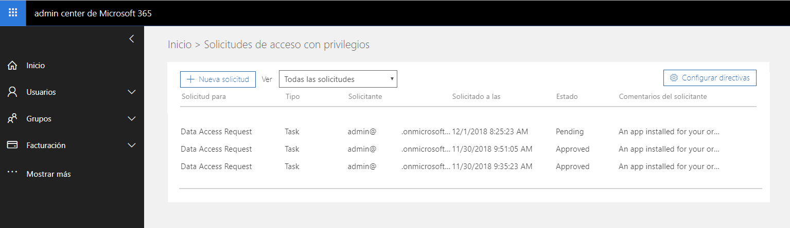

Estamos acostumbrados a crear aplicaciones centradas en personas que acceden a sus datos de Office 365 con Microsoft Graph API, pero ¿qué ocurre si queremos utilizar todos los datos de Office 365 para crear, por ejemplo, analíticas o incluso aplicaciones inteligentes? ¿Y si pudiésemos llevar toda esa información a Azure para poder trabajar con ella?

**Introducción a Microsoft Graph Data Connect**

En el último Ignite, Microsoft anunció la disponibilidad de Microsoft Graph Data Connect en preview pública. Graph Data Connect es un servicio que nos permite obtener información de Office 365 a través de un pipeline de Azure Data Factory y copiarla en un contenedor de Azure para luego poder interactuar con ella.

Por ahora se puede obtener este conjunto de datasets:

| **Data set** | **Descripción** |
| --- | --- |
| **BasicDataSet\_v0.Contact\_v0** | Contiene información sobre los contactos de cada usuario.  https://docs.microsoft.com/en-us/graph/api/resources/contact?view=graph-rest-1.0 |
| **BasicDataSet\_v0.Event\_v0** | Contiene información sobre los eventos del calendario de cada usuario.  https://docs.microsoft.com/en-us/graph/api/resources/event?view=graph-rest-1.0 |
| **BasicDataSet\_v0.Message\_v0** | Contiene información sobre los mensajes del buzón de cada usuario.  https://docs.microsoft.com/en-us/graph/api/resources/message?view=graph-rest-1.0 |
| **BasicDataSet\_v0.SentItem\_v0** | Contiene información sobre los mensajes enviados por cada usuario.  https://docs.microsoft.com/en-us/graph/api/resources/message?view=graph-rest-1.0 |
| **BasicDataSet\_v0.User\_v0** | Contiene información de usuarios.  https://docs.microsoft.com/en-us/graph/api/resources/user?view=graph-rest-1.0 |
| **BasicDataSet\_v0.MailboxSettings\_v0** | Contiene información de la configuración del buzón de cada usuario  https://docs.microsoft.com/es-es/graph/api/user-get-mailboxsettings?view=graph-rest-1.0 |
| **BasicDataSet\_v0.MailFolder\_v0** | Contiene información sobre las carpetas del buzón de cada usuario  https://docs.microsoft.com/en-us/graph/api/resources/mailfolder?view=graph-rest-1.0 |

**Preparando el entorno**

Antes de empezar a utilizar Graph Data Connect debemos realizar una serie de pasos para poder configurar el entorno:

1.       Crear un grupo de aprobadores de solicitudes de petición de datos: Todas las peticiones de datos de Office 365 a través de Graph Data Connect necesita que un usuario las apruebe, por lo que lo primero que tenemos que hacer es crear un grupo de aprobadores de estas solicitudes. Este grupo que creemos debe ser un grupo de seguridad habilitado para correo.

Una vez creado el grupo tenemos que añadir los usuarios aprobadores de estas peticiones, por lo que añadiremos algún usuario a este grupo. Estos usuarios deben tener el rol de Administrador Global en Office 365 y deben tener activada la autenticación multifactor. En caso de no ser así, cuando se apruebe la solicitud, dará un error

2.       Activar Graph Data Connect en el tenant de Office 365: Para poder utilizar Graph Data Connect primero debemos activar el servicio. Para ello accedemos al Centro de Administración de Microsoft 365 ([https://admin.microsoft.com](https://admin.microsoft.com/)) y dentro de Configuración -&gt; Servicios y complementos selecciona Versión preliminar de la conexión de datos de Microsoft Graph

Activa el servicio y selecciona el grupo de aprobadores que hemos creado en el paso anterior.

Con estos pasos ya tendríamos configurado nuestro entorno para poder utilizar Graph Data Connect.

**Extrayendo datos de Office 365 a un blob de Azure Storage**

1. Crear aplicación en Azure AD: Lo primero que tenemos que hacer es crear una aplicación en Azure AD que se utilizará como contexto de seguridad en la extracción de los datos. Para ello accederemos al portal de Azure ([https://portal.azure.com](https://portal.azure.com/)) y dentro de Azure Active Directory -&gt; Registro de aplicaciones seleccionamos Nuevo registro de aplicaciones

En la siguiente pantalla pondremos un nombre a la aplicación, como tipo de aplicación seleccionamos Aplicación web o API y pondremos como url de inicio de sesión https://[tenant].onmicrosoft.com/[aplicacion].

Copia el Id de aplicación, lo necesitaremos más adelante:

Ahora necesitamos crear una clave para la aplicación, para ello dentro de la aplicación que hemos creado vamos a Configuración -&gt; Claves y creamos una nueva clave. Copia la clave que se genera ya que sólo se muestra cuando se genera y después no podrás recuperarla.

Tienes que asegurarte que la aplicación tiene propietario, para ello vete a Propietarios y asegúrate que tiene un propietario y ese usuario es Administrador Global dentro de Office 365. Si no es así añádelo a la lista de propietarios.

2. Crear Azure Storage Blob: Ahora debemos crear un blob de Azure Storage para almacenar los datos que vamos a extraer de Office 365. Para ello accedemos al portal de Azure ([https://portal.azure.com](https://portal.azure.com/)) y creamos un nuevo recurso de tipo Cuenta de almacenamiento: blob, archivo, tabla, cola. En la siguiente pantalla seleccionamos la suscripción, grupo de recursos y añadimos los siguientes valores:

- Nombre de la cuenta de almacenamiento: nombre único que pondremos al storage.
- Ubicación: Oeste de Europa.
- Rendimiento: Estándar.
- Tipo de cuenta: BlobStorage.
- Replicación: Almacenamiento con redundancia local (LRS).

Una vez creado el storage debemos dar permisos de contribución a la aplicación que hemos creado antes. Para ello dentro del storage que hemos creado vamos a Control de acceso (IAM) y Agregar asignación de roles

Añadimos los siguientes valores:

- Rol: Colaborador de datos de blobs de almacenamiento.
- Asignar acceso a: Usuario, grupo o entidad de servicio de Azure AD.
- Seleccionar: seleccionamos la aplicación que hemos creado en el paso anterior.

Ahora necesitamos un nuevo contenedor en el storage, para ello dentro de la cuenta de almacenamiento seleccionamos Blobs y añadir contenedor

Añadimos un nombre al contenedor y dentro de Nivel de acceso público seleccionamos Privada (sin acceso anónimo). Guardamos el contenedor y ya tendríamos preparado el contenedor para almacenar la información que vamos a obtener de Office 365.

3. Crear Azure Data Factory Pipeline: Una vez que hemos creado la aplicación en Azure AD y el contenedor crearemos un pipeline en Azure Data Factory para extraer la información de Office 365.

Para ello dentro del portal de Azure creamos un nuevo Azure Data Factory, introducimos el nombre, suscripción, grupo de recursos, región y nos aseguramos de que sea de tipo Data Factory (V2). Una vez creado selecciona Crear y supervisar para acceder al editor de Azure Data Factory.

En el menú seleccionamos Author y creamos un nuevo pipeline.

Dentro del pipeline añadimos una nueva actividad Copy Data:

Ahora debemos configurar el origen y destino de la copia, para ello seleccionamos la actividad y en el panel inferior seleccionamos Source.

Pulsamos sobre el botón New para añadir un nuevo origen y seleccionamos Office 365 (Preview)

Al insertar se abrirá una nueva pestaña en la que podemos configurar el dataset. Dentro de esa pestaña, en el panel inferior, seleccionamos Connection y pulsamos sobre New para añadir una nueva conexión.

En esta pantalla es donde vamos a configurar la conexión para que utilice la aplicación de Azure AD que hemos creado anteriormente, por lo que añadiremos el Id de aplicación dentro de Service Principal ID y la clave que hemos generado en Service Principal Key.

Una vez creada la conexión debemos seleccionar que datos queremos copiar, los seleccionaremos en el desplegable Table.

Una vez creada la conexión vamos a la pestaña Schema y pulsamos sobre Import Schema. Se importará el schema de los datos que se van a obtener y es en esta pantalla donde podremos elegir qué información queremos sacar.

Con esto ya tenemos configurado el origen de la copia, ahora nos queda configurar el destino. Volvemos a la pestaña del pipeline y seleccionamos Sink.

Añadimos un nuevo destino y seleccionamos Azure Blob Storage. Al igual que cuando configuramos el origen, se abrirá una nueva pestaña para configurar la conexión al destino.

En el panel inferior añadimos un nuevo Linked Service.

En esta pestaña configuramos la conexión. Para la conexión utilizaremos la aplicación de Azure AD que hemos creado antes por lo que seleccionaremos como método de autenticación Service Principal y añadiremos el Id de aplicación y la clave que hemos generado antes. También seleccionaremos la cuenta de almacenamiento que hemos generado en pasos anteriores.

Ahora debemos seleccionar el contenedor de destino para ello pulsamos Browse dentro de File Path y seleccionamos el contenedor que hemos creado antes.

Los datos que devuelve se envían en formato JSON, por lo que tendremos que seleccionamos JSON Format en el desplegable File Format y Set of objects en el desplegable File pattern.

4. Ejecutar Azure Data Factory Pipeline: Ya tenemos creado el pipeline para copiar los datos, ahora vamos a ejecutarlo y probar que funciona correctamente. Para esto dentro de la pestaña del pipeline vamos a Trigger y seleccionamos Trigger Now​

Pulsamos sobre finalizar y comenzará la ejecución del pipeline. Dentro de la opción Monitor podremos ver la ejecución de las actividades del pipeline. La primera vez que ejecutamos el pipeline, pedirá consentimiento para obtener los datos. El proceso se quede en espera hasta que un usuario que pertenezca al grupo que hemos creado al principio autorice esa petición.

En este punto se envía un e-mail al aprobador informando que existe una petición de acceso a datos que tiene que aprobar.​

Para aprobar o rechazar esta solicitud el usuario debe acceder a la página de Privileged Access Management (PAM). Para acceder tiene que ir a [https://portal.office.com/adminportal/home#/Settings/PrivilegedAccess](https://portal.office.com/adminportal/home#/Settings/PrivilegedAccess)

En esta página se muestra todas las solicitudes realizadas. Seleccionamos la petición que nos interesa y aprobamos.

Una vez aprobada el flujo del pipeline continuará. Una vez que el pipeline termina la ejecución revisamos que los datos se han copiado correctamente. Para ello iremos al contenedor que hemos creado y vemos los datos que se han copiado.

**Conclusión**

Está claro que en Office 365 se almacena muchísima información sobre sus usuarios, como se comunican, interactúan entre ellos, etc. Microsoft Graph Data Connect nos da la posibilidad de extraer esos datos y crear aplicaciones para explotarlos.

Aún está en fase de preview pública y necesita mejorar, sobre todo echo en falta poder sacar otra información además de los datasets que hoy en día están disponibles, pero esperemos que sigan añadiendo más.

Podéis encontrar más información dentro de su GitHub, [https://github.com/OfficeDev/MS-Graph-Data-Connect](https://github.com/OfficeDev/MS-Graph-Data-Connect)

**Rubén Ramos Mateo**
 Technical Architect en Ricoh España
 [ruben\_rm@outlook.com](mailto:ruben_rm@outlook.com)

