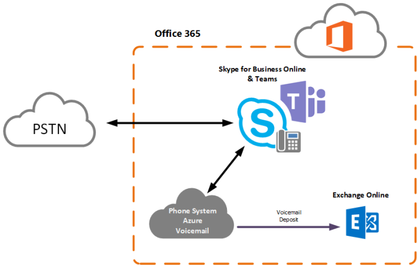

​

Así como estamos diciendo adiós a gran parte de las características de Skype for Business (podríamos decir que a todo el producto completo), es momento de irnos despidiendo también de los roles "hermanos" que residen en Exchange. Ahora es el turno de dar paso a la nueva generación de servicios basados en la nube, e irónicamente remplazando a una versión online, adiós Exchange Unified Messaging Online y bienvenido Cloud Voicemail.

Una despedida que se veía venir desde hace tiempo como varios de ustedes sabrán, y si no aquí estamos para informarlos. Exchange Server 2019, ya no cuenta con el rol de UM eso nos daba una pista que en su versión online dejaría de existir próximamente, igual nos pasa con el servicio de Skype for Business, tenemos nuestra versión on-premises pero en la nube las organizaciones nuevas con menos de 500 empleados ya no tendrán este servicio, sino que será ofrecido directamente con Microsoft Teams.

El sustituto Cloud Voicemail ya tiene un tiempo siendo utilizado con el servicio de Skype for Business Online y con Teams, así que podríamos decir que es un producto probado y con las necesidades de negocio cubiertas, y bien dije "podríamos decir" ya que tenemos que observar muy bien que es lo que nos quitaría esta nueva versión online, y que cosas nuevas nos trae.

Pero primero vamos a dar la fecha en la cual Microsoft dejara de ofrecer este servicio, ¿preparados? Febrero 2020 será la fecha en la cual Microsoft dirá adiós definitivo al servicio de ExUMO. Así que vamos a tener que prepararnos, y evaluar en qué fecha nos estarán migrando. Porque Microsoft conoce que hay ambientes con requerimientos particulares que no pueden migrarse de la noche a la mañana, sino que necesitan tiempo y analizar bien todas las opciones que se tienen y llevar una migración limpia (o al menos, lo mejor que se pueda).

Microsoft propone dividir la migración en 3 tipos diferentes de cliente:

**Cliente 1:**Compañías que se encuentran listas para la migración de acuerdo con lo siguiente:

- Clientes que usan el buzón de voz de una manera sencilla, es decir solo reciben las llamadas y las mandan a voicemail en caso de no contestar. No hay tratamiento de información más allá de esta simple tarea.

¿Qué migrarán para estos clientes? – Únicamente el correo de voz, ya que es lo único que utilizan.

¿Cuándo serán migrados? – Entre Marzo y Mayo de 2019.

**Cliente 2:** Compañías que tienen algún prerrequisito, es decir alguna interacción más allá de solo el uso de correo de voz.

- Compañías que tienen configurado AutoAttendant.
- Compañías con topología hibrida.
- Compañías que aun trabajan con extensiones en lugar de DIDs.

¿Qué migrarán para estos clientes? – Correo de voz, así como los autoattendants. Y es un decir, ya que Microsoft se encargará de migrar los correos de voz, pero la parte de AutoAttendants será delegada a nuestros queridos administradores de sistemas, es decir que prepárense para migrar tantos AA como tengan configurados hoy en día, respetando los flujos y redireccionamientos que tienen hoy, sino tienen DID's y los mandan a extensiones, ahí empezaremos con algunos problemillas.

¿Cuándo serán migrados? – Entre Mayo y Diciembre de 2019

**Cliente 3:** Clientes que necesitan mucha actividad por parte de sus administradores, o que requieren alguna inversión adicional.

- Si tienen ExUMO integrado con alguna aplicación de terceros.
- Si necesitan Suscriber Access.
- Clientes con Lync 2010.
- Integración con Fax.

¿Qué migraran para estos clientes? Voicemail, AA y todos los demás pendientes, no será una batalla sencilla sobre todo para los pobres que tienen actualmente la integración con terceros, si bien Microsoft nos da tiempo necesario, pero va a requerir una inversión extra. (Dentro de las cuales esta, moverse a Skype for Business hybrid al menos).

¿Cuándo serán migrados? – Para febrero 2020

Como verán las cosas no pintan tan sencillo como parecen, si solo tienes que usar el buzón de voz estás del otro lado, pero si empezamos a meter más variables se pone color de hormiga (como decimos aquí en México).

También si solo eres un usuario de Exchange y no de Skype la cosa esta peor, ya que no podrás continuar usando ExUMO para tu PBX. Tendrás que seleccionar entre dos opciones. O te migras a la solución de telefonía de Microsoft (Skype o Teams) o vas a tener que comprar un appliance con algún vendor para que te pueda ofrecer el servicio ($$$).

Espero que tengan una buena planificación para llevar su servicio a cloud voicemail, o en caso de no ser posible, que encuentren la solución que mejor se adapte a sus necesidades.

Por último, les dejo una tabla comparativa entre Cloud Voicemail vs ExUMO.

**ExchUMO and Azure cloud-based services feature matrix**

| Service | **Feature level** | **Feature** | **Notes** | **Cloud VM/AA** | **ExUMO** |
| --- | --- | --- | --- | --- | --- |
| VM | Service Features | Support 3rd-party PBX | ​ | N | Y |
| VM | Service Features | Support Skype for Business Server   | ​ | Q1CY19 | Y |
| VM | Service Features | Support Microsoft Teams | ​ | Y | N |
| VM | Service Features | eDiscovery and Hold | For security and compliance | Y | Y |
| VM | Service Features | Exchange Rules support | For security and compliance | Y | Y |
| VM | User Features | PSTN Dial-in Access | Subscriber access | N | Y |
| VM | User Features | PSTN Outlook Voice Access | Subscriber access | N | Y |
| VM | User Features | Dial-in using an authenticated endpoint | Calling the voicemail service to listen to voice messages and change voicemail settings | Y | Y |
| VM | User Features | User setting to disable voicemail | ​ | Y | Y |
| VM | User Features | User setting to change the personal greeting | ​ | Y | Y |
| VM | User Features | User setting to create an OOF greeting | ​ | Y | Y |
| VM | User Features | User setting to change the default language | ​ | Y | Y |
| VM | User Features | User setting to overwrite default greeting with TTS | ​ | Y | N |
| VM | User Features | Record personal greetings (authenticated device) | ​ | Y | Y |
| VM | User Features | Record personal greetings (PSTN) - play on phone | ​ | N | Y |
| VM | User Features | User setting to disable transcription | ​ | N | Y |
| VM | User Features | Transcription | ​ | Y | Y |
| VM | User Features | Visual voicemail on all endpoints | With user control to play, delete, message waiting indicator, and status-toggle, on all supported endpoints | Y | Y |
| VM | User Features | MP3 audio file format in Outlook | ​ | Y | Y |
| VM | User Features | Variable speed play control | ​ | Y | Y |
| VM | User Features | Forward a voicemail | Forward a received voicemail to other users | Y | Y |
| VM | User Features | Sending a voice message to a group of users | Voicemail broadcast | N | Y |
| VM | User Features | Voicemail notification using SMS | Users can receive an SMS when they have a new voicemail | N | Y |
| VM | User Features | Supported greeting languages | Details here: [https://docs.microsoft.com/en-us/microsoftteams/what-are-phone-system-auto-attendants](https://docs.microsoft.com/en-us/microsoftteams/what-are-phone-system-auto-attendants) | Y | Y |
| VM | User Features | Call answering rules | ​ | Q1CY19 | Y |
| VM | User Features | Play on phone (PSTN)- to play message | Call me on my cell to listen to the voice message | N | Y |
| VM | User Features | Play on phone (Auth)- to play message | Call me on my authenticated device | Y | Y |
| VM | User Features | Shared mailbox between multiple users | ​ | Y | Y |
| VM | Caller Features | Caller experience - protected voicemail | The caller can choose an option to mark a recorded message as protected | N | Y |
| VM | Caller Features | Caller experience - private voicemail | The caller can choose an option to mark a recorded message as private | N | Y |
| VM | Caller Features | Silence detection | ​ | N | Y |
| VM | Tenant-Admin Features | Server-level protected voicemail | Tenant-admin can configure a service-level rule to mark incoming voicemail as protected | Y | Y |
| VM | Tenant-Admin Features | Change recording duration time limit | CVM hard coded to 5 minutes | N | Y |
| VM | Tenant-Admin Features | Change silence detection timeout | ​ | N/A | Y |
| VM | Tenant-Admin Features | Change number of input failure | CVM: hard coded to 3 | N | Y |
| VM | Tenant-Admin Features | Change the default language | ​ | Y | Y |
| VM | Tenant-Admin Features | Disable/enable transcription | ​ | Y | Y |
| VM | Tenant-Admin Features | Disable/enable missed call notification | ​ | N | Y |
| VM | Tenant-Admin Features | Help Microsoft improve voice mail preview | ​ | Y | Y |
| VM | Tenant-Admin Features | Customize text message for enabled users | ​ | N/A | Y |
| VM | Tenant-Admin Features | Transcription profanity masking | ​ | Y | N |
| VM | Tenant-Admin Features | Voicemail policy | ​ | Y | Y |
| VM | Tenant-Admin Features | Web portal administration | ​ | CY19 | Y |
| VM | Tenant-Admin Features | PowerShell | ​ | Y | Y |
| AA | Service Features | AA support 3rd-party PBX | ​ | N | Y |
| AA | Service Features | Support Skype for Business Server | ​ | Y | Y |
| AA | Service Features | Support Microsoft Teams | ​ | Y | N |
| AA | Service Features | Dial by name, DTMF input | ​ | Y | Y |
| AA | Service Features | Dial by name, speech input | ​ | Y | Y |
| AA | Service Features | Multi-language support | Language details here: [https://docs.microsoft.com/en-us/microsoftteams/what-are-phone-system-auto-attendants](https://docs.microsoft.com/en-us/microsoftteams/what-are-phone-system-auto-attendants) | Y | Y |
| AA | Service Features | Transfer to operator, CQ, or a user | ​ | Y | Y |
| AA | Service Features | Transfer to PSTN number internally (DID RNL) | ​ | Y | Y |
| AA | Service Features | Transfer to PSTN number externally | ​ | Q2CY19 | Y |
| AA | Service Features | Business hours | ​ | Y | Y |
| AA | Service Features | Menu options | IVR menu options | Y | Y |
| AA | Service Features | Assigning an cloud PSTN number to AA | ​ | Y | N |
| AA | Service Features | Assigning an on-prem PSTN number to AA | ​ | Y | Y |
| AA | Service Features | Custom user selection | Enabling callers to reach customized list of organization users | Y | Y |
| AA | Service Features | After-hours and holidays treatment | ​ | Y | Y |
| AA | Service Features | Custom greeting using text to speech | ​ | Y | Y |
| AA | Service Features | Extension dialing | Reaching a user by dialing their extension | CY19 | Y |
| AA | Service Features | Mailbox for AA callers to leave a message | ​ | CY19 | Y |
| AA | Service Features | Multiple PSTN number assignment to an AA | ​ | Y | Y |
| AA | Tenant-Admin Features | Web portal administration | ​ | Y | N |
| AA | Tenant-Admin Features | PowerShell cmdlets | ​ | Y | Y |
| Fax | Service Features | Fax integration | ​ | N | Y |

**Rodolfo Castro Aguilar**
 MVP Office Apps and Services
 Twitter : @ucblogmx
 http://ucblogmx.com ​

