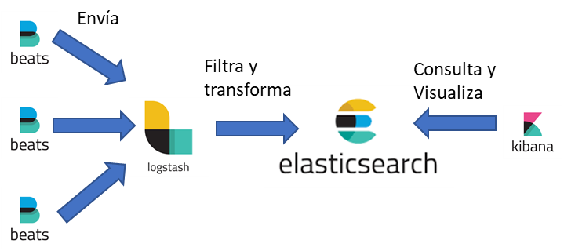

​El stack de Elastic sigue la siguiente estructura:

**Kibana** actúa como interfaz gráfica para todo el sistema, donde se visualizan los datos y se realizan las agrupaciones necesarias.

**Elasticsearch** es el repositorio de datos transformados (sin ser una base de datos), cuyos índices son la principal base para la representación de datos

**Logstash** es donde se realiza la agrupación, filtrado y transformación de los datos.  Esto es importante porque es quien consumirá más recursos.

**Beats**. Es un pequeño agente que instalamos en los servidores y que nos permite el envío de datos recolectados en nuestro servidor a un procesador (Logstash) o directamente al repositorio (Elasticsearch.  Cabe destacar que existen distintos tipos de Beats, según nuestra necesidad: FileBeat (para el envío de logs/ficheros), WinLogBeat (envío de eventos en un servidor Windows), MetricBeat (envío de métricas), etc.

Sobre la arquitectura:

- Los distintos Beats se instalan sobre los servidores/aplicación a analizar. En este caso particular, una granja de SharePoint 2013, pero puede hacerse sobre aplicaciones web (apache, IIS, etc).
- Logstash puede instalarse en un servidor como rol dedicado, dependiendo de la cantidad de beats que vaya a recibir.  A mayor número de beats/servidores, más poder va a requerir.
- ElasticSearch puede instalarse como servidor StandAlone, compartiendo recursos con Logstash aunque puede escalarse hacia una arquitectura más robusta: un clúster con un par de nodos.
- Kibana funciona como un servidor web, por lo que puede instalarse como servidor separado.

Como arquitectura, se ha instalado Beats en un servidor de Desarrollo, enviando logs a un servidor standAlone que contiene el resto de la arquitectura (Logstash, Elasticsearch & Kibana).  La configuración (fichero filebeats.yml) es la siguiente:

*filebeat.prospectors:*

*- type: log*

*enabled: true*

*paths:*

*- C:\Elastic\Data\\*.log*

*​output.logstash:*

*hosts: ["DAPERE759VM:5044"]*

En el servidor con el resto de las funciones, hay 2 elementos importantes a "retocar", ambos en la carpeta de Logstash:

En %Logstash\_home%/Config, creamos un fichero llamado Sharepoint\_ULS.conf, con el siguiente contenido:

*input {*

*beats {*

*port =&gt; "5044"*

*}*

*}*

*filter{*

*grok {*

*match =&gt; ["message", "(?&lt;sptimestamp&gt;%{MONTHNUM}/%{MONTHDAY}/%{YEAR} %{HOUR}:%{MINUTE}:%{SECOND}\\*?\*)%{SPACE}%{PROG:sp\_process}%{SPACE}\(%{WORD:sp\_pid}\)%{SPACE}%{WORD:sp\_tid}%{SPACE}+%{CATEGORY:sp\_area}%{SPACE}+%{CATEGORY:sp\_category}%{SPACE}%{WORD:sp\_eventid}%{SPACE}%{WORD:severity}%{SPACE}%{GREEDYDATA:sp\_eventmessage}"]*

*}*

*date {*

*match =&gt; ["sptimestamp", "MM/dd/YYYY HH:mm:ss.SSS"]*

*target =&gt; "sptimestamp"*

*}*

*}*

*output {*

*stdout {*

*codec =&gt; json*

*}*

*elasticsearch {*

*hosts =&gt; ["127.0.0.1:9200"]*

*index =&gt; "uls.%{+YYYY.MM.dd}"*

*}*

*}*

​​

Esto es tal vez el mayor quebradero de cabeza, puesto que es donde hacemos la transformación de los datos.  Así que lo despiezo:

- *Input { beats { port =&gt; "5044"} }*  Esto le dice a logstash de dónde va a obtener los datos, en este caso serán Beats que vendrán a través del puerto 5044.  Estos BEATS vienen como un JSON.
- *Filter {*  Esto es el inicio de las transformaciones que hará el Logstash.  Tiene dos partes:
    - el GROK que es una estructura basada en RegularExpressions.  Este filtro es lo que nos permite separar el contenido de cada línea e identificar los distintos campos que vienen informados en el log ULS: Fecha/hora, Proceso, PID, Area, Categoria, Severidad, Mensaje, etc.
    - La segunda parte es la transformación del campo fecha.  Es importante porque la configuración predeterminada de Logstash no entiende que en el JSON venga informado un campo numérico/fecha con un cero previo:  Prefiere 1/15/2018 en vez de 01/15/2018.
- *output.*    Esta sección indica los distintos tipos de salida y pueden ser por pantalla (en cuyo caso le digo que quiero que lo formatee como un JSON), a una consola o a un repositorio (ElasticSearch).  En este último caso hay que indicar el servidor al que debe ir y cómo se van a nombrar los índices.

El segundo fichero por modificar se llama *grok-patterns* y está ubicado en %logstash\_home%\vendor\bundle\jruby\2.3.0\gems\logstash-patterns-core-4.1.2\patterns.  Importante:  Este fichero es parte del sistema, así que algo de cuidado!  Contiene básicamente los distintos tipos de RegularExpressions que se utilizan para definir/acotar campos.  Agregamos una línea con la definición de CATEGORY al final:

Cabe destacar que los instaladores de Elastic (cualquiera de los productos del stack) suelen descargarse como un .zip pero alguno de ellos incluye un .msi para desplegar con mayor facilidad.  En todo caso, posteriormente los ejecutables pueden arrancarse como servicios (Filebeat y ElasticSearch por ejemplo).  También podemos arrancarlos de forma manual.  En todo caso es importante arrancarlos de forma ordenada:

1. Elasticsearch.
2. Logstash (fundamentalmente, porque tarda algo de tiempo en arrancar).
3. Kibana.
4. FileBeats.

El orden es importante ya que las aplicaciones deben estar levantadas en sus respectivos puertos para que la siguiente aplicación pueda conectar: Si Logstash no está levantado, FileBeats nos da error.  Para este demo, ElasticSearch se levanta como servicio y Kibana, Logstash y filebeats como comandos de consola (y así apreciar las salidas y confirmar que funciona correctamente)

Una vez se levanta filebeats comenzará a recoger información de los ficheros de log y enviarlas a Logstash para su procesamiento y de allí pasarán a ElasticSearch.  ¿Cómo confirmar que funciona correctamente? En un navegador, abrimos la url de kibana y en "Management &gt; Index Management" podemos ver si nuestro índice está creado y la cantidad de elementos que tiene:

Para saber si nuestro contenido tiene los campos que nos interesan, en la sección "Dev tools" podemos ejecutar una consulta de ejemplo:

La ventaja de utilizar la salida por consola es apreciar errores antes de verlos en el índice.  En la siguiente imagen (7: Error en Logstash al convertir datos) se puede apreciar un error en la salida de logstash porque el filtro GROK no es capaz de convertir los datos de frorma correcta (\_grokparsefailure).  Cabe destacar que aunque se presente este tipo de error, se genera un índice dentro de ElasticSearch que contiene el *timeStamp*(fecha/hora en que se envía el JSON) y como campo *Message*, la línea entera del log.

Una vez llegados a este punto, podemos comenzar con la exploración del contenido de los logs.  Para ello, en "Discover" comenzamos por definir un patrón de índice, desde "Management &gt; Kibana &gt; Create Index  Pattern".  Lo primero que nos solicita es el patrón del nombre. Si tenemos algún índice creado nos coincidirá y podremos partir desde allí:

Al presionar el botón "Next step", nos lleva a una nueva ventana donde debemos seleccionar el campo de fecha asociado, que nos permita diferenciar elementos en el tiempo.​

Una vez creado nuestro patrón y asociado al índice, podemos comenzar a realizar búsquedas.  Esto es clave para la creación de gráficos y Dashboards.  En este caso generamos una búsqueda llamada "Process" y agregamos como campos sp\_timestamp, sp\_category, sp\_area, sp\_process y severity.

Una vez hecho y guardado, podemos seguir con crear paneles de visualización.  Para ello tenemos varios tipos: área, mapa de calor, barras verticales/horizontales, datatable, línea, y dos que particularmente son muy útiles:  tarta (pie) y Nube de etiquetas (tag cloud).  Una vez seleccionado el tipo, debemos decir cuál es la base de nuestra gráfica.  Puede ser una consulta que hayamos hecho o una nueva.  Si seleccionamos la consulta que hemos guardado previamente, en el titulo aparece "linked to saved search Process".  Un aspecto importante es lo que Kibana llama "buckets" que pueden ser Split Series (nos permite superponer datos) o Split Charts (que nos permite gráficas separadas)

Aquí un truco importante:  antes de generar los gráficos es importante tener una idea de lo que queremos comparar. Por ejemplo, para cada proceso (w3wp, owstimer, noderunner, etc), saber los tipos (Categorías) de mensajes que aparecen y la cantidad de veces que aparecen. Esto nos puede dar una idea de las cosas que se hacen o dónde debemos poner nuestro foco.

Por último, una vez generadas varias visualizaciones podemos crear un dashboard, que nos proporcione la información según necesitemos ver los datos:

**Conclusión**

El análisis de logs, y en particular de IIS y SharePoint nos permite en primera instancia revisar los puntos que peor se comportan en nuestra plataforma y así dedicar esfuerzos en su mejora. Igualmente podemos identificar cuellos de botella y los elementos que presentan mayor uso, de forma que podamos reforzarnos o escalar la plataforma en dichos puntos.

Si bien es cierto que hoy en día con topologías híbridas o basadas en la nube disponemos de una variedad de opciones desde enviar logs a una BBDD y extraer los datos o usar eventos que puedan disparar flujos de escalado, no podemos descartar el uso de herramientas de análisis y representación vía Cuadros de mando como Power BI, Kibana, splunk, grafana e incluso, comenzar a pensar en análisis de series (para verificar cada cuanto se produce un error) e identificar patrones (errores en indexados FULL, por ejemplo)

**Daniel Pérez Aguiar**
 perezaguiar@programmer.net

