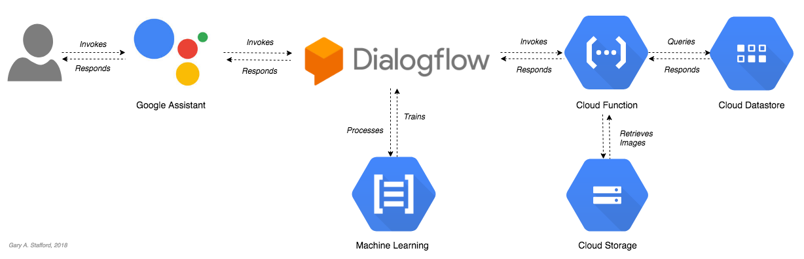
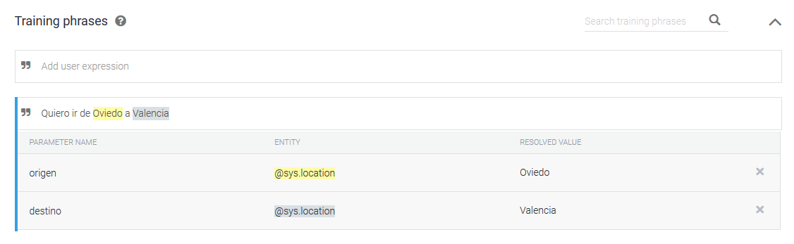

import ArticleHeader from '../../../components/article-header'

<ArticleHeader frontmatter={props.pageContext.frontmatter} />

Este es el comienzo de una serie de artículos en los que trataré el desarrollo con .net sobre algunos de los asistentes que hay actualmente en el mercado. Creo conveniente comenzar por: *"¿Alexa y Assistant son bots o asistentes?*" Desde mi punto de vista haría más una diferencia en cuanto a su dominio de trabajo y desarrollo de interfaces de comunicación. Tradicionalmente se ha hablado de los bots como sistemas que solo entendían una única entrada de información, texto y con un dominio muy concreto, como Irene, el "*asistente*" de Renfe ([http://consulta.renfe.com](http&#58;//consulta.renfe.com/)), que aunque lo llamen asistente no lo deberíamos de confundir con Alexa o Assistant, los que yo considero realmente asistentes, ya que su dominio es mucho mayor y variado.

¿Pero entonces un bot y un asistente son distintos? Si y no. Funcionalmente son iguales, en cuanto a ámbito uno tiene mayor envergadura o conocimiento del entorno.

En estos artículos vamos a hablar de asistentes, ya que son los que actualmente nos permiten desarrollar funcionalidades extra sobre ellos (Google Actions y Alexa Skills por ejemplo).

**¿Qué partes tiene un asistente?**

Todos actualmente tienen las mismas partes y el funcionamiento es igual o muy similar, visto el caso sobre Google Assistant no te lleva más de 2 minutos entenderlo sobre Alexa.

En el caso de Assistant hay ciertas piezas que no podremos cambiar, que son: Google Assistant y Dialogflow. Assistant es la interfaz de comunicación y transformación text-to-speech y viceversa, podemos decir que esta parte no tiene ninguna inteligencia y se limita a la transformación del mensaje y enviarlo a Dialogflow.

Dialogflow es el servicio NLP (Natural Language Processing) de Google, este servicio es entrenado en base a unas intenciones (Intents) y unas entidades (Entities) para comprender que es lo que quiere el usuario y reaccionar en consecuencia.

Lo veremos más fácil con un ejemplo:

Introduciremos oraciones que signifiquen lo mismo para entrenar el modelo, en este caso podríamos jugar con "*Quiero ir*", "*Me gustaría ir*", "*Llévame*" … indicando posteriormente que irán dos entidades distintas. A la primera entidad la llamaremos "*Origen*" y a la segunda "*Destino*" (las entidades de lugar son muy comunes y vienen entrenadas en todos los NLP). Estas son las unidades básicas de un NLP.

Dialogflow se encargará de recibir un mensaje desde Assistant, entender cuál es la intención del usuario en base al entrenamiento, extraer las entidades del mensaje y entonces llamará a la lógica de negocio que hayas indicado, desde responder con un mensaje predefinido a llamar a una función, llamar o no a una base de datos y preparar un mensaje dinámico.

Y ahora estarás diciendo "Vale, pero aún no he visto nada de .net" y tienes razón, pero es muy importante que primero tengas claras las partes de un asistente y luego te explico como sustituirlas por componentes en .net.

Dialogflow (y veremos que el resto igual) tienen un problema y es que Google quiere que uses su NLP, entonces ¿Dónde meto .net? Lo primero que puedes hacer es que Dialogflow consulte en tus APIs .net por una respuesta. ¿Nos vemos en el siguiente número?
 
Importante: En el siguiente número daré por hecho que sabes construir una API REST y alojarla en Azure.

**Diego Zapico Ferreiro**

@dzapic0

