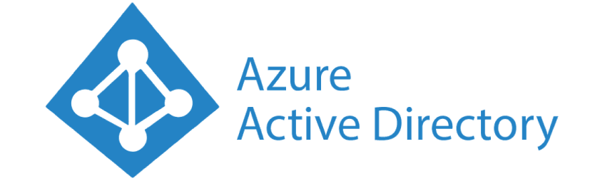
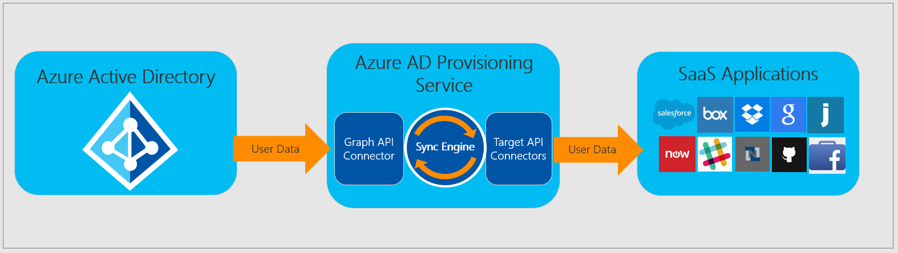
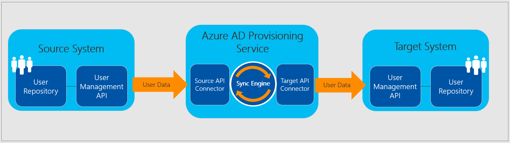
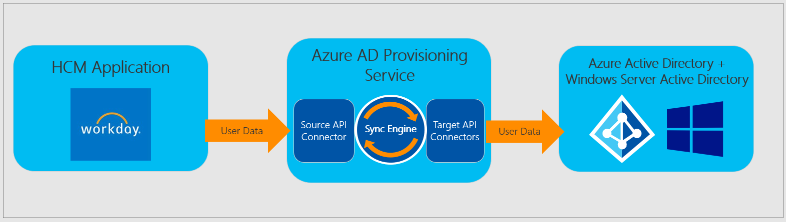
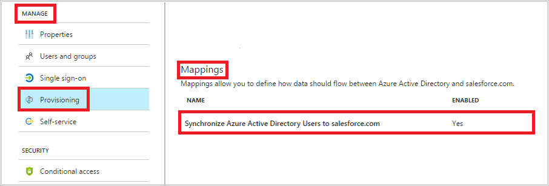

​Al principio era solo "eso que gestiona las identidades de Office 365", donde se asignan las licencias y poco más. Pero Azure AD es a día de hoy un robusto y completo servicio de Identity and Access Management (IdAM), con funcionalidades que le crecen como setas y características avanzadas de integración y seguridad.

**Azure AD Provisioning Service**

El Servicio de aprovisionamiento de usuarios de Azure AD no es que sea totalmente nuevo, pero es una de las funcionalidades que más está evolucionando. Azure Active Directory (Azure AD) permite automatizar la creación, el mantenimiento y la eliminación de identidades en otras aplicaciones cloud como Dropbox, Salesforce, ServiceNow, etc. Esta funcionalidad incluye:

- **Creación de cuentas** **automáticamente** en otras aplicaciones cloud cuando se crean nuevos usuarios en Azure AD.
- **Desactivación automática de cuentas** en otras aplicaciones cloud cuando se dan de baja en Azure AD.
- **Propagación automática de las actualizaciones** de datos de cuentas de usuarios.
- **Creación de otros tipos de objetos**, como grupos, para las aplicaciones que lo admitan.

El aprovisionamiento automático de usuarios también incluye:

- **Coincidencia** de las identidades entre Azure AD y las aplicaciones cloud de destino.
- **Personalización** del flujo de atributos entre Azure AD y la aplicación cloud de destino.
- **Alertas** de errores de aprovisionamiento.
- **Informes** y registros de actividades.

**¿Cómo funciona?**

**Azure AD Provisioning Service** utiliza la API de cada aplicación para crear, actualizar y deshabilitar usuarios por código. Así de fácil. Según cada aplicación, Azure AD Provisioning Service puede también crear, actualizar y deshabilitar otro tipo de objetos relacionados con la identidad, como grupos y roles.

Pero eso no es todo. Además de ser capaz de aprovisionar usuarios a otras aplicaciones cloud, ahora también podemos aprovisionar usuarios en Azure AD que provengan de otras aplicaciones. Whatttt? Como lo oyes. ¿Alguien dijo MIM?

De momento esta integración sólo está disponible con Workday, pero ya os podéis imaginar donde acabará todo esto.

[https://docs.microsoft.com/en-us/azure/active-directory/manage-apps/configure-automatic-user-provisioning-portal](https://docs.microsoft.com/en-us/azure/active-directory/manage-apps/configure-automatic-user-provisioning-portal)

Y si la aplicación cloud aún no tiene integración con Azure AD, utilizando SCIM (System for Cross-Domain Identity Management) podemos aprovisionar usuarios a cualquier aplicación que exponga un web Service.

[https://docs.microsoft.com/en-us/azure/active-directory/manage-apps/use-scim-to-provision-users-and-groups](https://docs.microsoft.com/en-us/azure/active-directory/manage-apps/use-scim-to-provision-users-and-groups)

En la sección provisioning de las aplicaciones que tengamos integradas, podemos personalizar el mapeo de atributos entre Azure AD y esa aplicación.

**Conclusión**

Poco a poco Azure AD se está convirtiendo en el gran motor de la gestión de identidades cloud. El salto a ser también un gestor de las identidades on-prem está al caer. En cualquier momento soportará ECMA2, y si nos fijamos bien, todos los desarrollos de Microsoft en el área de identidades se los lleva Azure AD. Ahí lo dejo.

**Pablo Ortiz Baiardo**
 Infrastructure & Cloud Consultant
 [ortiz.pablo@gmail.com](mailto:ortiz.pablo@gmail.com) 
@portiz2017

https://www.linkedin.com/in/portiz

