**Bajando a nuestro local la arquitectura de microservicios en AKS**

¿Microservicios o monolítico? ¿Desplegamos en contenedores nuestras aplicaciones?¿Como los orquestamos?, etc. Si este tipo de preguntas no te dicen mucho no te preocupes, la intención de este artículo es conocer las herramientas que nos van a poner un pelín más fácil ir a una arquitectura de microservicios desplegados en contenedores en Azure.

**Concepto contenedor, Docker**

El primer concepto que nos debería ir sonando es el concepto "Contendor". Vamos a entender por contendor el empaquetado de un software y sus dependencias, que nos va a permitir aislar unas aplicaciones de otras.

Docker es un proyecto Open Source, que nos va a permitir construir, almacenar y ejecutar aplicaciones distribuidas en contenedores. Se van a ejecutar en la mayoría de las distribuciones de Linux, Windows y Mac Os, usando "Docker Engine".

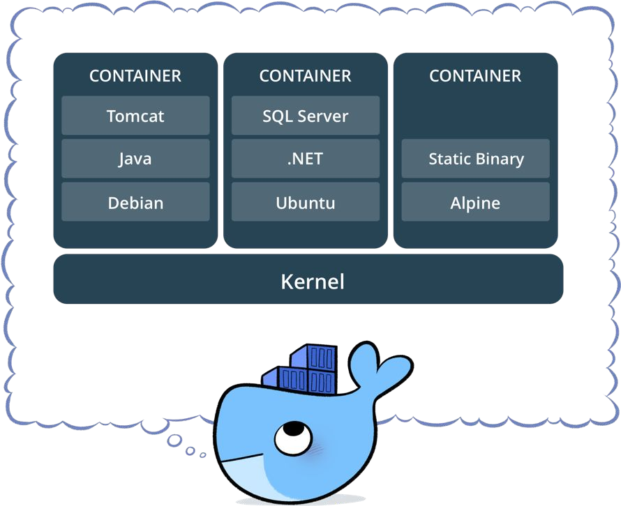

Para terminar, hay que aclarar que todos los contenedores comparten el mismo Kernel, y que no debemos confundir una maquina virtual con un contenedor de Docker, ya que mientras que en una maquina virtual necesitamos empaquetar el sistema operativo, en este caso el contenedor es independiente del mismo.

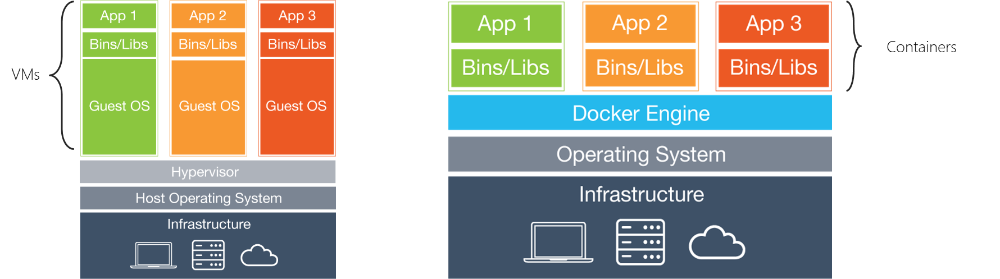

Para definir nuestro contenedor necesitaremos un fichero **.Dockerfile**, que nos permita empaquetar las aplicaciones necesarias en nuestra imagen, tal y como veremos un poco más adelante en el artículo.

**Orquestando contenedores con AKS, Kubernetes en Azure**

Kubernetes es el orquestador de contenedores, líder en la industria, y en Azure lo encontramos como el servicio Azure Kubernetes Service(AKS). Antes de empezar a trabajar con AKS, debemos tener algún que otro concepto de Kubernetes claro.

Kubernetes nos va a permitir escalar en un sistema de nodos de trabajo las ejecuciones de nuestros contenedores de Docker, aunque tenemos que tener en cuenta que no se mantiene la persistencia entre nodos de forma nativa.

Si profundizamos un poco más en Kubernetes vemos que los servicios que ejecutamos en Kubernetes, se agrupan en **PODS**, que se entiende como la unidad mínima de computo en Kubernetes, y no es más que la agrupación de contenedores que comparten una misma IP, almacenamiento y variables de entorno.

Si desplegamos dentro de un servicio o POD, varios contenedores, estos se podrán llamar entre ellos por IP interna, esto nos puede dar una pista de intentar juntar en un mismo Pods aquellas aplicaciones o sistemas que tengan relación.

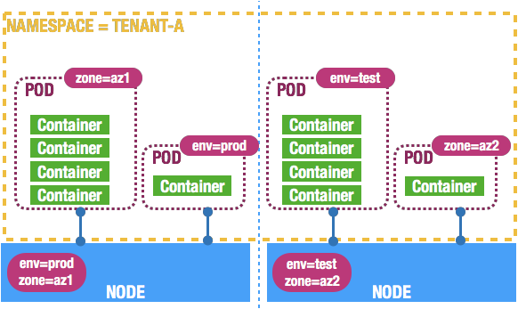

Volviendo a AKS, no deja de ser un clúster de Kubernetes administrado en Azure que nos asegura alta disponibilidad como el resto de los servicios PaaS, es configurable el escalado y nos aporta una serie de herramientas a nivel de monitorización. En resumen, es una forma fácil de crear un clúster de Kubernetes, y abstraernos del proceso de configuración de un clúster de este tipo.

**¿Qué nos aporta Azure Dev Space?**

Hasta aquí una brevísima introducción a conceptos necesarios, para que de verdad entendamos que es Azure Dev Space.

Uno de los mayores problemas del desarrollo Software es coordinar a todos los miembros de un equipo, y que podamos evolucionar de forma correcta una aplicación y su código fuente. A pesar de tener el código muy controlado gracias a herramientas como Azure Dev Ops y a GitHub, no es más cierto que seguimos con claros problemas por ejemplo con el versionado de una aplicación, o con equipos que tengan muy diferenciadas las competencias de Front-end y Backend, en ocasiones obligando a implementar entornos de integración bastante costosos para que todo el equipo pueda probar sus desarrollos.

Azure Dev Spaces, nace precisamente para cubrir esta necesidad, y no es otra que facilitar el desarrollo de aplicaciones en equipo, con la "particularidad" de que por debajo lo que hace este servicio es implementar un clúster de Kubernetes de AKS, y nos permite depurar en local este mismo. De esta forma podemos trabajar en equipo, y trabajar con una arquitectura  basada en contendores y Kubernetes, pero desde un entorno local.
 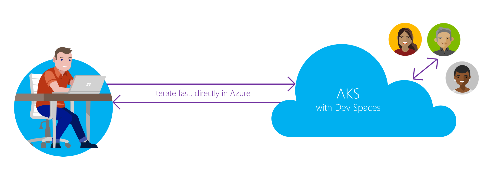

Cuando depuramos nuestra aplicación en Azure Dev Space, estamos realmente generando un contenedor de nuestra aplicación, y desplegándola en un AKS de nuestra suscripción. Además, se nos crea una conexión SSH que nos permite depurar en tiempo real nuestra aplicación desde nuestro Visual Studio local.

Cada miembro del equipo puede crear un espacio de trabajo que herede de una rama principal tal y cual haríamos en un repositorio de código fuente. Si creamos un espacio que herede de DEV podremos versionar nuestro Backend o nuestro Front, teniendo disponibles ambos servicios en un contenedor propio para el usuario, permitiendo hacer pruebas de forma aislada con una versión nueva, y si procede integrarlas en el entorno principal de DEV.

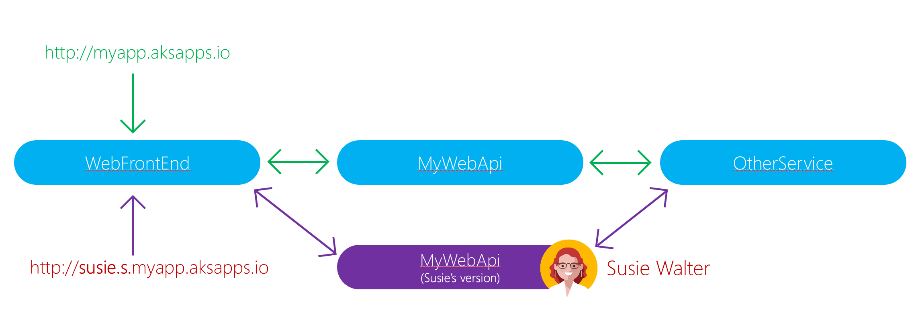

Como vemos en la imagen anterior, siempre que creemos un espacio de nombres que herede de un principal como DEV, tendremos en tiempo real dos URL'S. Una la de nuestro espacio de trabajo personal como el del ejemplo de Susie, y otro principal.

- **Url entorno principal**: myapp.aksapp.io
- **Url entorno de trabajo personal**: mydevspace.myapp.aksapp.io


La ventaja de este modelo es que por un lado una persona que solo trabaje con el proyecto de front, puede hacer uso de las APIS que ya estaban desplegadas en DEV, y versionar su versión de front, y viceversa. Además, podemos invocar ambas url's, y visualizar los cambios y poder hacer un QA mucho más preciso, sin necesidad de hacer un despliegue por cada cambio.

**Creando nuestra primera aplicación .Net Core en Azure Dev Space**

Vamos a hacer un ejemplo muy sencillo de como implementar una aplicación .Net Core con Visual Studio en Dev Space.Tenemos que tener claro que antes de empezar necesitamos crear un clúster de Kubernetes administrador en Azure con AKS.
 Existen algunas limitaciones para usar Azure Dev Space:

- El clúster de Kubernetes debe ejecutar la versión de Kubernetes 1.9.6 o superior.
- Esta disponible únicamente en las regiones EastUS, EastUS2, CentralUS, WebUS2, WestEurope, SoutheastAsia, CanadaCentral o Canada East.
- Necesitamos activar el Enrutamiento por HTTP.


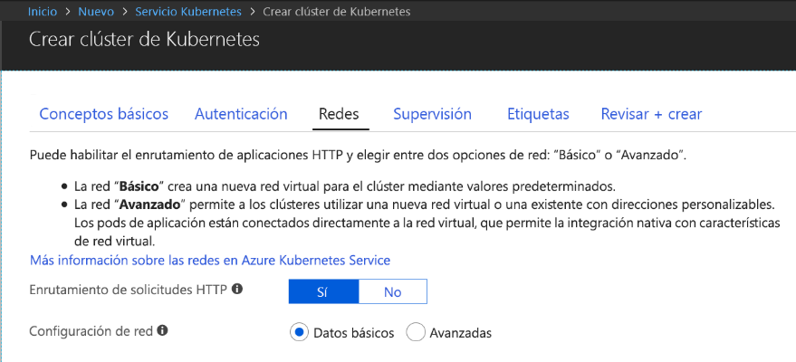

Además, necesitamos instalar las Tool de Kubernetes para Visual Studio, para ello desde el propio Visual Studio 2017, podemos seleccionar Tools-&gt;Extensions & Updates, y buscamos "**Visual Studio Tools for Kubernetes"**, y si no lo tenemos lo instalamos.

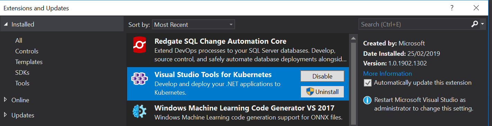

Una vez tenemos nuestro cluster y las Tools de Kubernetes, nos creamos una aplicación .Net Core 2.0, nos vale una aplicación MVC básica para dar forma al ejemplo.

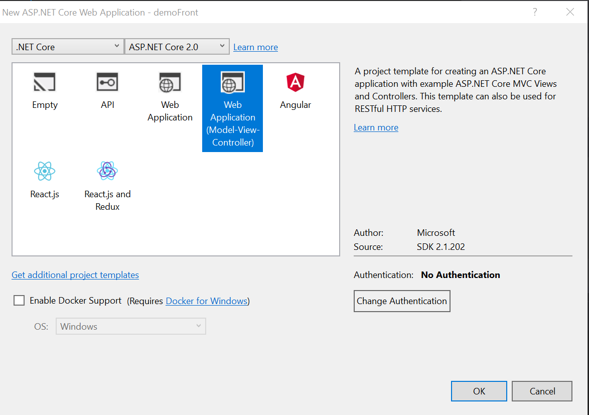

Una vez creado el proyecto y la solución, vamos a desplegarla en nuestro clúster de AKS con Azure Dev Space. En el desplegable de depuración, seleccionamos Azure Dev Space, y se lanzará una ventana de conexión a nuestra suscripción de Azure.

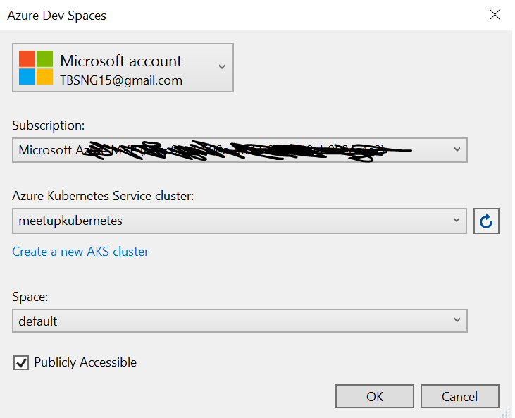

Deberemos seleccionar la suscripción donde desplegamos el servicio de AKS, seleccionar el propio clúster de AKS, y elegir un espacio de desarrollo. De momento solo tenemos el "default" que se crea de base, y es el que elegiremos.

Una vez aceptemos, se generará en nuestra solución varios ficheros, pero nos vamos a fijar en dos:

- **DockerFile**: contiene la información para generar nuestro contenedor Docker, y que desplegaremos en AKS.
- **Azds.yaml**: Contiene la configuración necesaria para implementar el espacio de desarrollo de Azure Dev Space.


Si lanzamos la depuración de la aplicación, veremos que se genera una url del tipo **demoFront.aksapp.io** que apunta a nuestro despliegue en AKS, y si ponemos un punto de depuración en por ejemplo en el HomeController, la ejecución se detiene en local.

Esta aplicación ya está desplegada en AKS, en un contenedor de Docker que Azure Dev Space ha definido por nosotros, y accesible por IP Pública por cualquier miembro de nuestro equipo de desarrollo.

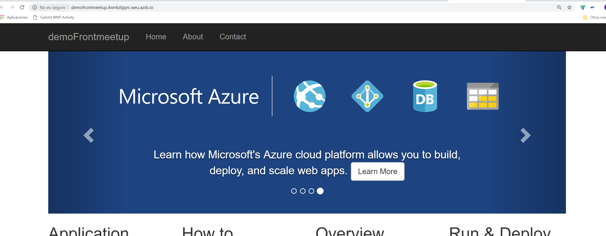

**Llamando de un contenedor a otro, Front y Backend**

Ya tenemos nuestro Front desplegado en AKS, pero nunca tenemos un escenario tan sencillo de ejecución, normalmente también necesitamos implementar un catalogo de servicios en Backend.

Para ello vamos a crear una aplicación también .Net Core del tipo Web API que llamaremos **demoBack**, y la vamos a configurar en el mismo espacio de trabajo default, tal y como hicimos en el ejemplo anterior.

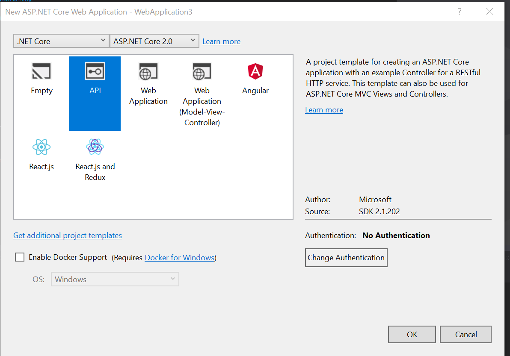

Si lanzamos esta aplicación tendremos una url del tipo **demoback.aksapp.io,**accesible del mismo modo que nuestra app de front.

¿Cómo comunicamos nuestro contenedor de front con el de back?. Para ello vamos a usar las "cabeceras de enrutamiento" que nos proporciona Azure Dev Space.

Si vamos a nuestro HomeController, en el método que invoca la vista "About" básica que nos crea el ejemplo, vamos a añadir una petición HTTP con el siguiente código C#:

```
using (var client = new System.Net.Http.HttpClient())            {                // Call *mywebapi*, and display its response in the page                var request = new System.Net.Http.HttpRequestMessage();                request.RequestUri = new Uri("http://demoback/api/values/1");                if (this.Request.Headers.ContainsKey("azds-route-as"))                {                    // Propagate the dev space routing header                    request.Headers.Add("azds-route-as", this.Request.Headers["azds-route-as"] as IEnumerable<string>);                }                var response = await client.SendAsync(request);                ViewData["Message"] += " and " + await response.Content.ReadAsStringAsync();            }
```

Es importante entender dos líneas, ya que el código no tiene misterio simplemente hace una petición Get al API Controller Values que hemos creado con el proyecto de API Backend.

Lo particular del ejemplo es:

- Añadimos una cabecera a la petición del tipo **"azds-rout-as"** que nos va a permitir conectar y enrutar las peticiones entre nuestros contenedores.
- La url que indicamos con "new Uri("http://demoback/api/values/1");" es del tipo [http://myappbackend/api/values/1](http&#58;//myappbackend/api/values/1)", es decir este código nos va a permitir como veremos en el siguiente ejemplo, que si creamos un nuevo espacio de trabajo que herede de este default, que siga funcionando esta petición. Es decir, el enrutamiento de Azure Dev Space nos permite que apuntando a la aplicación base de AKS, en este caso de nuestro backend, se vaya enrutando en función de si estamos en un espacio de trabajo u otro, sin necesidad de modificar este uri endpoint.


Si debugamos este código podremos poner un brakepoint en el api, y ver que desde la vista de About del front se invoca correctamente al backend de nuestro espacio de trabajo default.

**Creando espacios de trabajo**

Vamos a probar que nuestro código de enrutado por cabecera sigue funcionando cuando creamos un nuevo espacio de desarrollo. Para ello debemos seleccionar en las propiedades del proyecto tanto de front, como de backend la pestaña debug.

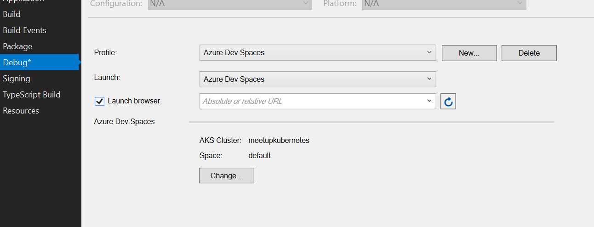

Si seleccionamos en Change, se nos abre la misma ventana de conexión a nuestro clúster que vimos anteriormente, y en el desplegable de Space, seleccionamos **"create new space"**. En la siguiente ventana, seleccionamos el espacio default (va a actuar como nuestro MASTER), y creamos un sitio de prueba para nosotros, en mi caso **shernandez**.

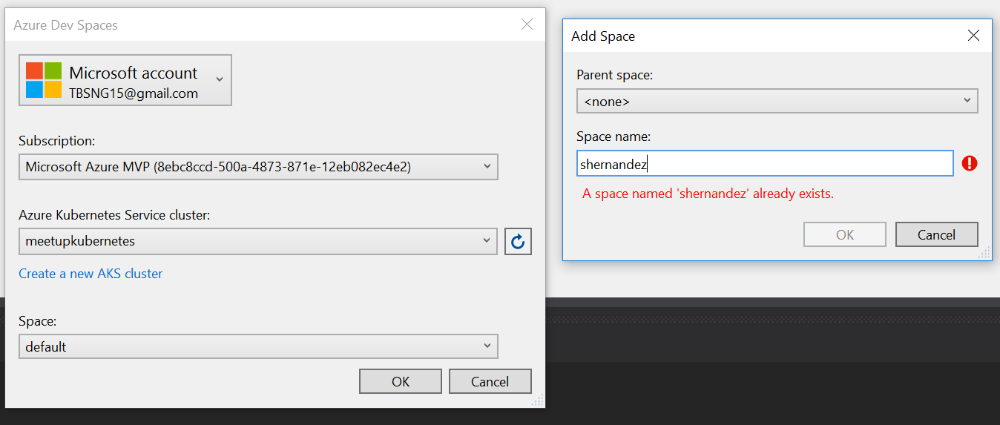

Si esto ha funcionado de forma correcta, se habrá creado un nuevo contenedor, que no es más que una versión del original de default, y desde este podemos evolucionarlo a nuestra demanda.

Si volvemos a depurar el api y el front, lanzándolo contra nuestro AKS con F5, podremos comprobar que el enrutado sigue funcionando, o lo que es mejor aun, si desplegamos con F5 y previamente hacemos un cambio en nuestro controller del tipo de la siguiente imagen, veremos que el api se ha modificado solo para el nuevo dev space creado "shernandez".

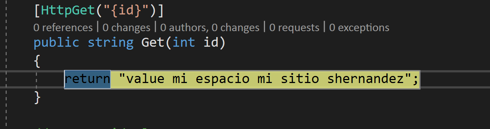

Podremos ver en la url generada para mi nuevo espacio de trabajo **shernandez.s.demofront.aksapp.io**, que me devuelve mi nueva versión del api, en cambio en **demofront.aksapp.io** que corresponde a la url de front en el espacio default (espacio base), se devuelve el valor anterior.

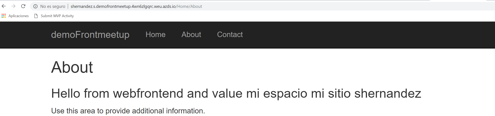


Por el contario en el espacio original default, tenemos el resultado original del API en la pantalla contacto.

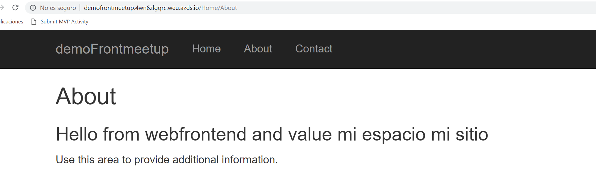

**Visual Studio es cómodo, pero es recomendable usar Azure CLI**

Siguiendo los ejemplos anteriores, perfectamente podemos usar Visual Studio para crear y desplegar nuestros espacios de trabajo. Pero también es cierto, que yo al menos en mi experiencia personal, cuando depuramos las aplicaciones desde el Visual Studio, al detenerlas también se detienen los espacios, y esto si lo hacemos contra un espacio de trabajo base como DEV puede dar problemas a los miembros del equipo.

Una forma de poder manejar Azure Dev Space es por línea de comandos con [Azure CLI.](https&#58;//docs.microsoft.com/es-es/cli/azure/install-azure-cli?view=azure-cli-latest)

Para ejecutarlo, simplemente abriendo una aplicación de consola una vez descargado el paquete de Azure CLI, podemos ejecutar los siguientes comandos:

**Logarse contra suscripción de Azure**
 az login
**Conectarse al clustes AKS vía Azure Dev Space**
 az aks use-dev-spaces -g AzureDevops -n Meetupkubernetes

**Subir una ap a Azds**(debemos situarnos el directorio con el yaml y el dockerfile a desplegar)
 azds up

**Seleccionar un espacio de trabajo**
 azds space select --name scott

**Listas urls de los espacios de trabajo**
 azds list-uris

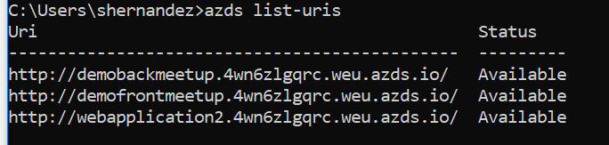

**Conclusiones del uso de Azure Dev Spaces**

Sin duda estamos ante un mundo apasionante este el de los microservicios, pero desde mi franqueza también debo avisar que el primer contacto es más que duro. Como hemos podido ver en este pequeño artículo, y desde un punto de vista muy superficial, necesitamos entender el concepto contenedor, el concepto clúster y orquestador como es Kubernetes, para poder ver todo el potencial de Azure Dev Space.

Para equipos maduros, que bien trabajen con soluciones en microservicios, o que tengan un escenario de despliegue por contenedores, este es un servicio más que recomendable. La principal virtud, es que, con los espacios de desarrollo, vamos a poder versionar y probar tanto nuestro backend como nuestro front sin necesidad de hacer infinidad de pull request y despliegues en integración.

Además, permite por ejemplo a un compañero de front, tener plataformado su entorno de trabajo, debugando su lado front, y teniendo una versión de las apis estables que sabemos no van a cambiar al menos hasta conectarse al espacio principal.

En resumen, muy interesante esta primera aproximación a un servicio que espero siga evolucionando.


**Sergio Hernández Mancebo**

Principal Team Leader en Encamina | Azure MVP

