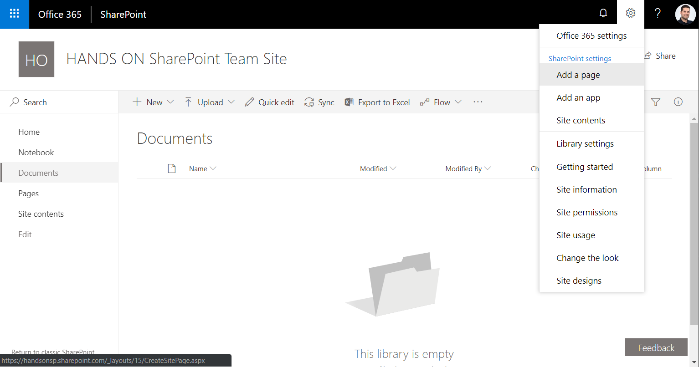
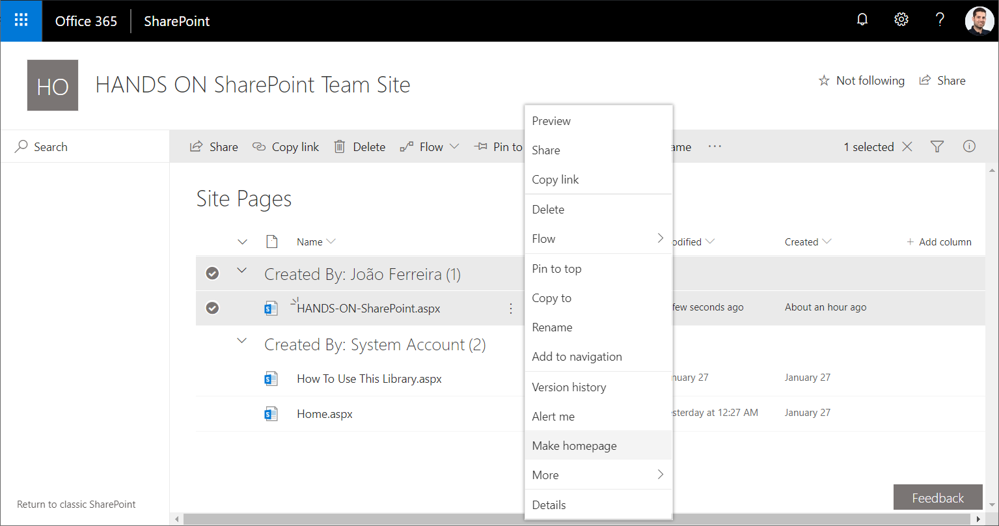
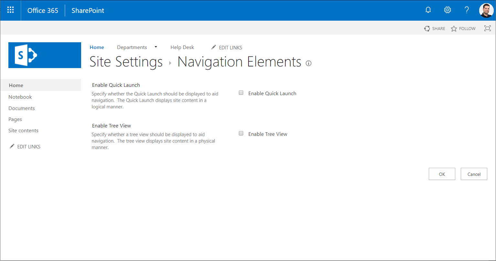
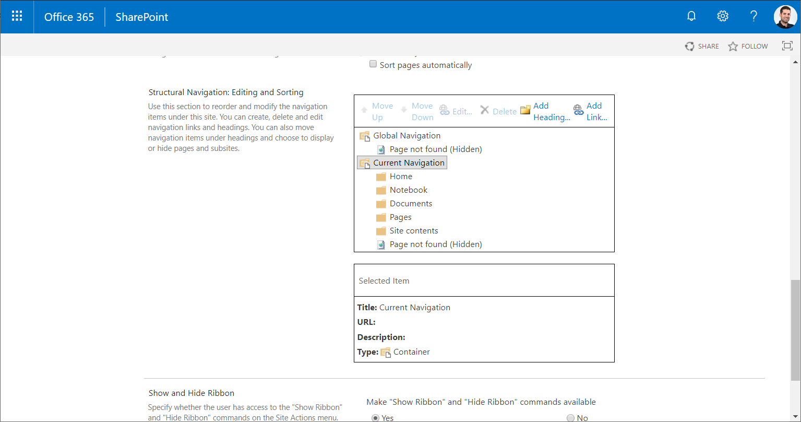
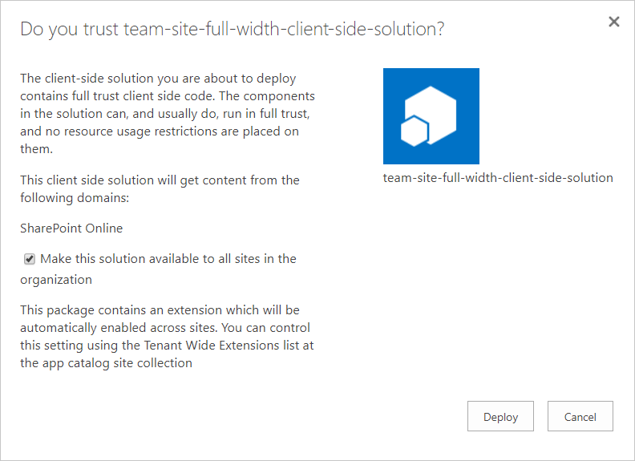
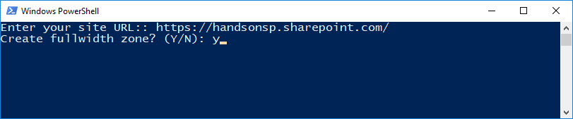
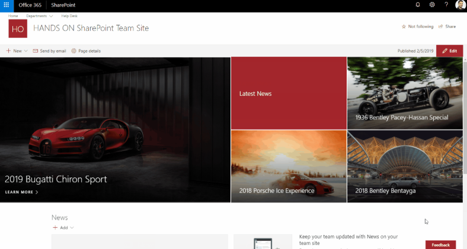

Recently I've got a few requests to transform classic root team sites with publishing enabled into modern SharePoint sites. The technic described in this article allows you to keep all your existent content, and at the same time allows you to take advantage of the out of the box responsive layouts and modern web parts.

**Create a modern landing page**

1. On your root site collection navigate to a modern Library. If the library is not being displayed with the modern layout do the following:

- Open the browser developer tools by pressing F12.
- In the console type "GoToModern();" and press Enter.
- Wait for the page to refresh.

​2. Click on settings and then "Add a page":

3. Once created give it a name and build your new landing page.

4. Once you've built it according to your needs go to "Site Contents".

5. Open the Site Pages library.

6. Click on the "Show Actions (…)".

7. Click on "Make Home Page".​

**Manage the navigation**

The new landing page is being displayed as a modern Team Site showing just the vertical navigation, to use the horizontal navigation follow the steps below.

1. Go to Site Settings.

2. Click on "Navigation Elements".

3. Uncheck the "Enable Quick Launch".

4. Click OK.
5. Edit the navigation on the new landing page.
6. Delete all the Items under "Current Navigation".

7. For the global navigation I suggest you use "Metadata Navigation", it will [increase the overall performance](https://docs.microsoft.com/en-us/office365/enterprise/navigation-options-for-sharepoint-online) of your SharePoint site. After selecting the term for the global navigation, it will take a few minutes to be visible in the new modern page.

**Create a full width landing page**

Even though you now have a modern landing page the content is still being formatted like a team site. To get it like a modern communication site with a full width top area and centered web part zones I've used a modified version of the [**Team Site Full Width Extension**](https://devscopeninjas.azurewebsites.net/2018/12/28/make-your-team-site-look-like-a-communication-site/) built by [Luis Ribeiro](https://twitter.com/Luis_Ribeiro_PT).

This extension will make your site full width giving it a modern look and feel you are looking for.

To install the extension, follow the steps blow:

1. Download and extract the solution.

2. Open your App Catalog and upload it.

3. Run the install.ps1 file.

4. Provide the URL to the site collection where you want to apply the solution.

5. Type Y to make the first web part zone full width.

6. Type N to just center all the web part zones.

The result will look like the image below.

**Conclusion**

This is not the only way to make your root site as a modern SharePoint site, this approach is suitable for scenarios where you need to keep your classic pages as they are but still want to take advantage of the modern SharePoint features.

If this approach is not exactly what you need have a look at [this thread](https://techcommunity.microsoft.com/t5/SharePoint/Approaches-to-convert-the-built-in-root-site-collection-into-a/td-p/290489) in the Microsoft Tech Community.

As always, the code for this solution on [GitHub](https://github.com/joaoferreira/dvs-spfx-extensions), feel free to use it and contribute to make it better.

**Joao Ferrerira**

Office Development MVP | SharePoint Team Lead at Bindtuning

