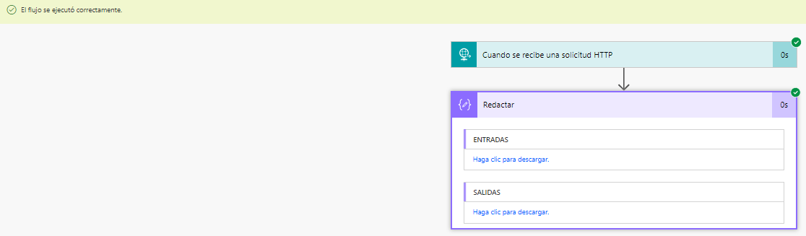
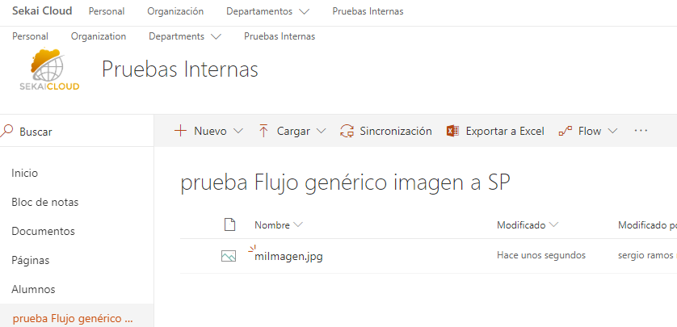

import ArticleHeader from '../../../components/article-header'

<ArticleHeader frontmatter={props.pageContext.frontmatter} />

**Creando un conector genérico con Flow para guardar un archivo**

Vamos a crear un conector genérico que luego podremos usar en PowerApps para subir la imagen. Para ello iremos a nuestro sitio de Flow y crearemos un flujo desde cero, a la hora de buscar conectores y desencadenadores seleccionaremos "request/response" (traducido a Flow en español como "solicitud").

La url que pide para el post la dejaremos, ya veremos que se rellena automáticamente, vamos primero a agregar otro paso más a nuestro Flow, de las acciones de operaciones de datos vamos a quedarnos con "compose" (traducido como "Redactar").

A continuación, vamos a configurar la entrada de esta acción con la expresión Trigger() la cual si nos fijamos en su descripción permite derivar la salida de un desencadenador en tiempo de ejecución, es decir, el desencadenador anterior "cuando se recibe una solicitud HHTP".

Dejamos la configuración de esta manera, indicamos un nombre al flujo y al pulsar sobre guardarle veremos que la dirección url que antes hemos dejado vacía se ha rellenado

Vamos a probar esta url para ver más claro que y como necesitamos enviarle al flujo todo lo necesario para que se guarde una imagen, que será el nombre de la imagen y la imagen en sí. Para verlo vamos a usar la aplicación postman ("https://www.getpostman.com"):
- Indicamos la Url anterior como Url de la solicitud http.
- En la pestaña body de postman indicamos que la petición será form-data.
- Como key file seleccionamos una imagen cualquiera de nuestro pc.
- En la url agregamos el parámetro para el nombre de imagen.

Después de enviar la petición de postman veremos en el historial de ejecuciones de nuestro flujo el resultado, donde en el JSON resultante, dentro de "outputs" tenemos "queries" con el nombre de la imagen que pasamos como parámetro y el "$content" dentro de "body" con la imagen en base64

Vamos a editar nuestro flujo y coger primero el nombre que tendrá la imagen configurando el paso de redactar:
**trigger()**['outputs']['queries']['NombreImagen']

Para obtener la imagen en sí, tendremos que añadir otro paso de "redactar". En este caso lo que queremos es el contenido en base64 de la imagen que contiene el body del resultado de la petición y que, como podemos ver en el JSON anterior, es de tipo "multipart/form-data" así que usaremos la expresión TriggermultipartBody().

Como posteriormente queremos que esta imagen se quede guardada en SharePoint aquí será necesario transformar esa imagen en base64 a binario y subir la imagen, vamos a verlo en la imagen como queda.

**base64**To**Binary(triggerMultipartBody(**0**)**['$content']**)**

Ya solo nos quedaría la parte de guardar en una biblioteca de SharePoint vamos entonces a agregar un paso más a nuestro flujo para ello, los pasos anteriores les cambié el nombre para que resulte más fácil de identificar

Una vez guardado, si todo ha ido bien podremos probarlo llamándolo otra vez desde postman y visualizar el resultado en el sitio de SharePoint.

****

**Guardar imagen desde la entrada de escritura manual de PowerApps**
Vamos a ver como adjuntar una firma manual insertada desde una aplicación de PowerApps, para el ejemplo vamos a partir de una aplicación para los repartidores de paquetes de una empresa en la que firme el destinatario y los datos de la entrega con su firma se queden reflejados en una lista, vamos a ello, lo primero la lista de ejemplo con el destinatario dirección, etc. y un número de seguimiento del paquete.

A partir de una aplicación PowerApps de lienzo en blanco, nos conectaremos a los datos de la lista, agregaremos una pantalla de formulario y haremos una conexión a la lista. Al formulario también habrá que cambiarle la propiedad de modo predeterminado a "nuevo", también elimine el campo título que no tiene mucho sentido y agregamos el control de entrada para la firma.

Hasta aquí bien, el problema es que si intentamos guardar la imagen que contiene el control veremos algo del estilo "blob:https://create.PowerApps.com/……" y nos informará que eso no existe, es aquí donde haremos uso del workflow creado anteriormente. Para lo que queremos hacer, generaremos una plantilla para la llamada haciendo uso de la página [http://specgen.apistudio.io/](http&#58;//specgen.apistudio.io/) con la url de la petición del post del http (la url que obtuvimos en el Flow).

El paso siguiente de "program info" permite indicar datos de contacto, el título de la API, etc. Cambiamos el título a SubirArchivo, el e-mail de contacto y el puerto para la API. Dejamos el resto de los datos con los valores por defecto.
En el paso de "API Info" configuramos el parámetor API Base Path para que aparezca el valor "/workflows" e indicamos un nombre en "Operation id".

Los siguientes pasos los dejaremos como están hasta llegar al paso "Open API Spec" que nos permitirá descargar el JSON Que se ha formado. Este JSON puede contener valores "null" por lo que será necesario editarlo para realizar las correcciones necesarias que nos eviten errores posteriormente.

En el json en la sección "parameters" podemos ver la definición de los parámetros de la petición http del workflow, a estos les tenemos que agregar los valores default que ya tenemos, y eliminar todo el parámetro content-type, se quedarían así

También agregamos nuestro contenido de la imagen con lo que se quedaría esta parte así

Volvemos al entorno de creación de PowerApps PowerApps y hacemos clic en la parte de conexiones. Crearemos una nueva conexión en conectores personalizados, donde importaremos el archivo JSON que acabamos de modificar.

Tras esto en el paso 2 de autenticación lo dejaremos sin autenticación y en el 3 veremos el id de operación que será el que usemos más adelante.

Y también podemos ver los parámetros que se enviarán, tendremos que editar api-version, sp,sv,sig y ponerlos como de visibilidad interna para que se oculten al usuario.

Tras esto ya podremos guardarlo, y agregarlo como conexión

En la PowerApp creada, el control de entrada de escritura que se ha agregado se llama PenInput3 y tiene la propiedad Image. En la imagen de "tick" de la app en su OnSelect vamos a llamar a subirArchivo, tendrá de nombre el número de seguimiento y subiremos la imagen del recibí que dibujemos, esta llamada la voy a hacer directamente y antes del submit para no andar poniendo validaciones etc, pero no es la forma más correcta

Y la prueba:

****

**Agregar imagen como adjunto con Flow**

En este último paso vamos a ver como agregar como adjunto la imagen de firma que guardamos desde la aplicación creada anteriormente, en el teníamos una lista "paquetes entregado" y una biblioteca que almacena las firmas, vamos entonces a la biblioteca de firmas y crearemos un Flow desde cero para ella con el desencadenador "cuando se crea un archivo".

Obtendremos el contenido del archivo y crearé una variable para el nombre, o podría coger del mismo nombre del archivo, pero ni se por qué de esa manera no me funcionaba bien

Obtendremos los elementos de la lista:

Y en el último paso le damos el nombre de la imagen y le decimos que el contenido es el que hemos recuperado anteriormente
**

Conclusión**
En este artículo hemos podido ver como interconectando los diferentes productos, Flow PowerApps y SharePoint podemos construir soluciones de negocio versátiles sin necesidad de código

**Sergio Ramos**

Sekai Cloud Co-Founder
 [sramos@sekaicloud.es](mailto&#58;sramos@sekaicloud.es)
 linkedin: https://www.linkedin.com/in/sergioramosmarquez/
 http://sekaicloud.es/

