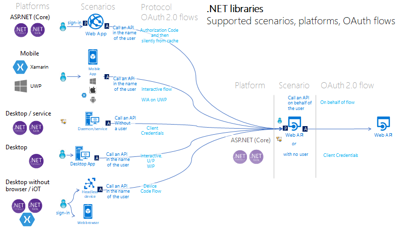
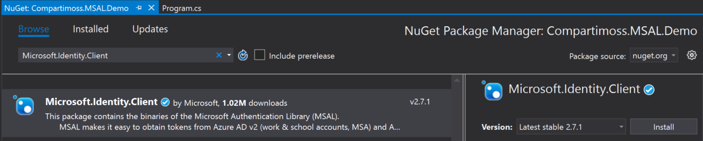
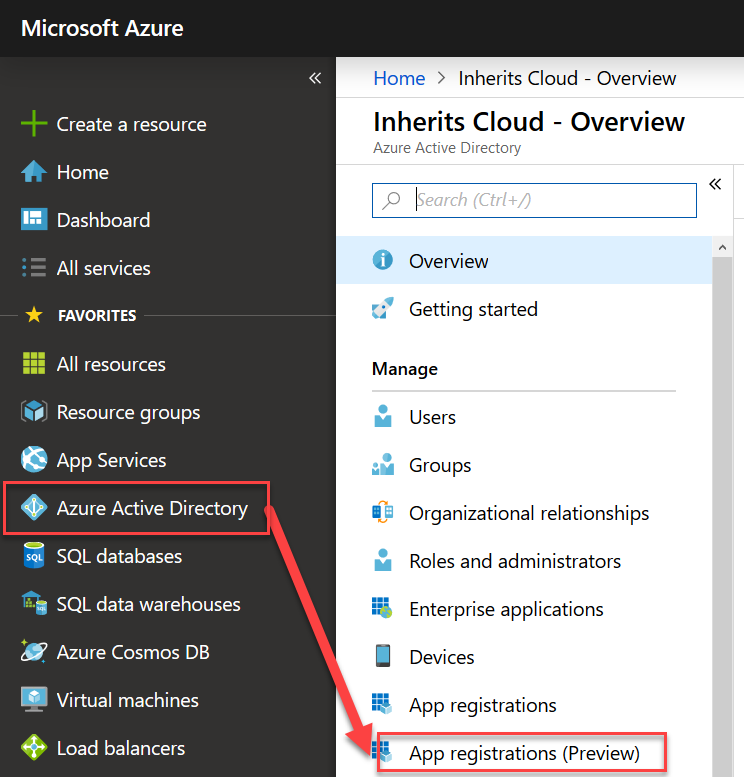
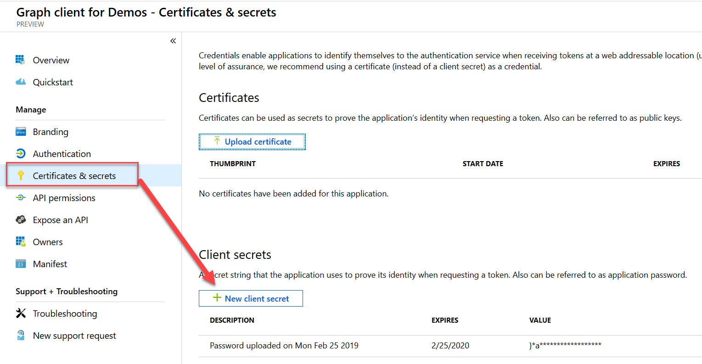
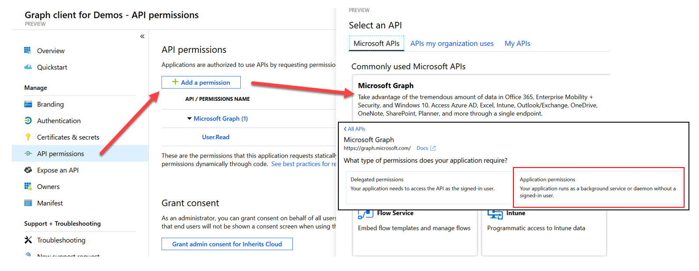
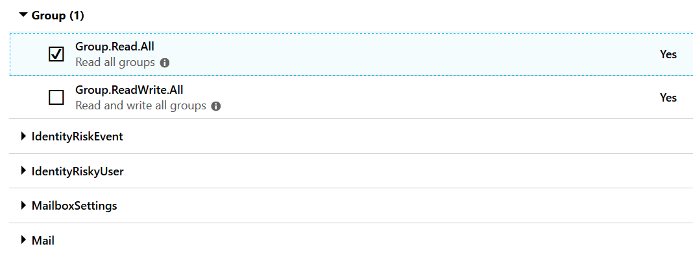
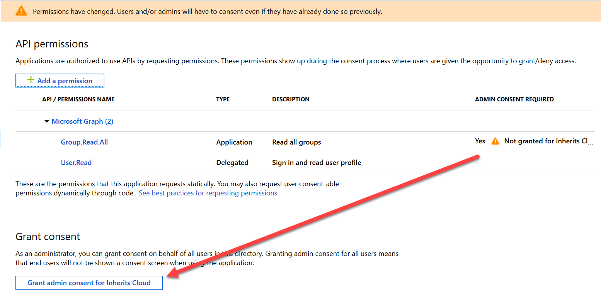
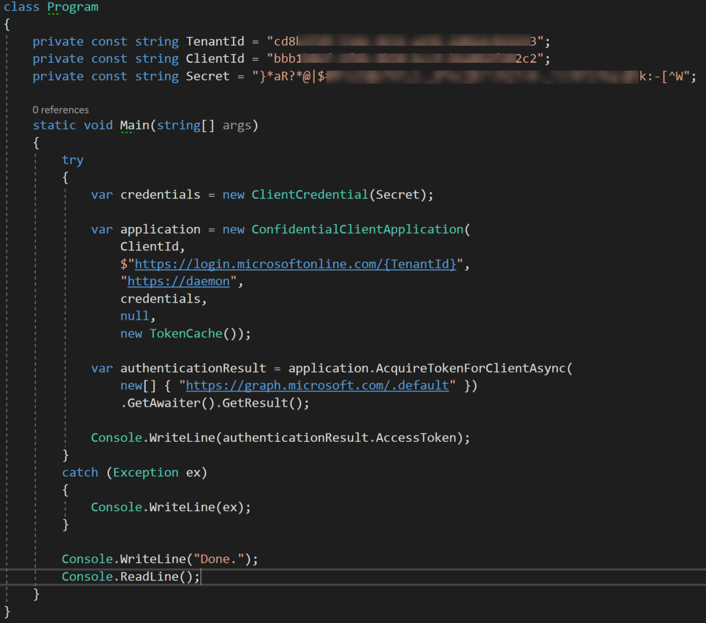
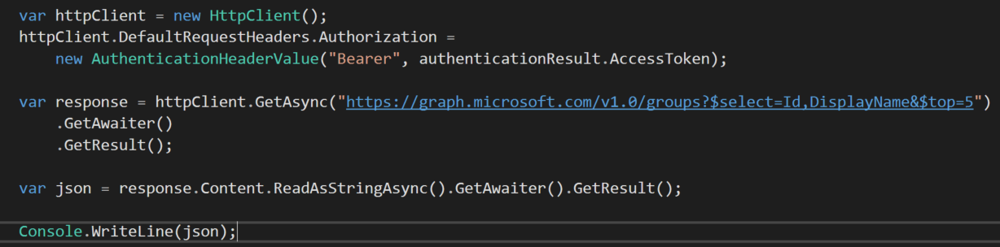

import ArticleHeader from '../../../components/article-header'

<ArticleHeader frontmatter={props.pageContext.frontmatter} />

​Si eres desarrollador en el ecosistema Cloud de Microsoft (AKA Azure), más pronto que tarde vas a necesitar consumir un servicio securizado con Azure Active Directory (AAD), por ejemplo. La ultra conocida Graph API, pero también otros servicios como la API REST de SharePoint, o incluso una API desarrollada por nosotros y protegida con Azure AD.

Sirva la siguiente imagen como referencia de arquitectura con varios clientes consumiendo APIs seguras en Azure AD, donde una de ellas podría ser perfectamente la Graph API:

Cualquier servicio securizado en Azure AD, estará basado en los protocolos estándar *OpenIdConnect* y *oAuth2*, por lo que antes de ser consumido, deberemos obtener un Token válido para ese servicio.

El negociado de ese Token dependerá del escenario de consumo, pero siempre se hará siguiendo uno de los *Flows* definidos por *OpenIdConnect* y oAuth2. Dicho "Flow", no es más que un baile entre el cliente y Azure AD, que dará como resultado un Token válido para el servicio / API. Ese "baile", será diferente en función del tipo de cliente (ver imagen arriba): Si el cliente es una aplicación web, y se pretende consumir Graph API con permisos del usuario logado en la web app, seguiremos un Flow llamado "*Authorization Code Flow*". Si por el contrario tenemos una aplicación de consola y queremos consumir Graph con permisos de aplicación (sin intervención de ningún usuario), utilizaremos un Flow distinto: "*Client credentials Flow*".

A día de hoy, Azure AD expone 2 versiones para negociado de Tokens: endpoint v1 / v2. Podéis encontrar las principales diferencias en el siguiente enlace: [https://docs.microsoft.com/en-us/azure/active-directory/develop/azure-ad-endpoint-comparison](https&#58;//docs.microsoft.com/en-us/azure/active-directory/develop/azure-ad-endpoint-comparison). Actualmente se recomienda utilizar el V2 siempre que sea posible, ya que cumple mejor con los estándares de OpenIdConnect y oAuth2 (entre otras ventajas). El endpoint v2, soporta los siguiente flows:

- Open ID Connect (Sign in) Flow
- OAuth 2.0 Auth code grant.
- OAuth 2.0 Implicit grant.
- Oauth 2.0 On-behalf-of.
- Oauth 2.0 Client Credentials.
- Oauth 2.0 Resource Owner password credentials grant.
- Refresh Token.
- Device Code Flow (personal accounts NOT supported).

Tenéis muy bien documentados todos estos flows en la documentación de Azure AD, que podéis encontrar en el siguiente enlace: [https://docs.microsoft.com/en-us/azure/active-directory/develop/active-directory-v2-protocols](https&#58;//docs.microsoft.com/en-us/azure/active-directory/develop/active-directory-v2-protocols)

Por suerte, no es necesario conocer todos estos flows (además de otras cosas complejas como Signatures, Cryptography, etc), para poder negociar un Token con Azure AD. Es aquí donde aparece la librería MSAL (Microsoft Authentication Library). MSAL nos va a facilitar mucho la vida a la hora obtener un token, y nos va a abstraer bastante de la implementación específica de cada Flow.

En este artículo nos vamos a centrar en MSAL.net, que es la versión .net, pero existen otras versiones de MSAL para otras tecnologías: msal.js, para aplicaciones JavaScript o NodeJS, además de versiones para IOS, Android e incluso Python.

Actualmente podemos instalar MSAL como un paquete más de NuGet.

**Registrar App para consumir MS Graph API**

Previamente al negociado de Token, debemos registrar una App en Azure AD, y configurarla para poder consumir la Graph API. En este ejemplo vamos a utilizar el Azure AD v2 endpoint, así que haremos uso de la opción del portal "App registrations (preview)".

Como podemos observar, esta opción todavía está en "preview", sin embargo, se refiere a la experiencia de registro (UI y UX), es decir, que el endpoint V2 es perfectamente valido para producción. Una vez allí, crearemos una nueva app, simplemente dando un nombre para la App. Una vez registrada, necesitamos unos pasos extras para poder utilizar Graph desde nuestra App. Primero vamos a necesitar crear un Secret:

Finalmente, configuramos los permisos que queremos que nuestra App tenga en Graph API. En nuestro ejemplo, nuestro cliente va a ser una aplicación de consola, y vamos a querer llamar a Graph con permisos de aplicación, para que no sea necesaria la intervención de un usuario (login). Un caso de uso bastante común sería esto mismo en una Azure Function que se ejecuta con un Timer (típico proceso de background). Siendo así, seleccionamos permisos de Aplicación:

Para nuestro ejemplo vamos a leer los grupos, así que solicitamos permisos para ello:​

Los permisos de aplicación siempre van a requerir que un administrador los "consienta" (AKA Admin consent). Para ello podríamos acceder a otro endpoint de Azure AD pasando ciertos parámetros, un usuario administrador haría el Login, y aceptaría los permisos requeridos. Sin embargo, el portal nos lo pone mucho más fácil con el siguiente botón:

**Obtención del token**

Llegado a este punto, ya tenemos nuestra App registrada en Azure AD, y lista para usarla desde nuestro código y obtener un Token para Graph. Vamos ahora al código. En una aplicación de consola, podemos usar el siguiente snippet para obtener un token válido para Graph API con permisos de Aplicación:

Básicamente son solo 2 pasos: Primero creamos un objeto "ConfidentialClientApplication", que va a representar nuestra App registrada en Azure AD. Existen dos tipos de clientes OpenIdConnect / oAuth2:

- Confidential: Un cliente "confidencial" es aquel que, por su naturaleza, puede guardar una key/secret de manera segura, como por ejemplo una Azure Function, una app de consola (daemons en general), o una aplicación de web con código de servidor.
- Public: un cliente público no es capaz de almacenar una key de forma segura, como por ejemplo una aplicación browser-base (una SPA de JavaScript), o aplicaciones nativas, mobile, etc.

Y así ha sido reflejado en la libraría MSAL:

- ConfidentialClientApplication
- PublicClientApplication

En el constructor de ConfidentialClientApplication tenemos:

1. Client ID de nuestra App registrada en Azure AD.
2. Authority: esto es la URL de login a nuestro tenant, y se compone tal y como tenemos en el código, usando nuestro Tenant ID.
3. Redirect URI: no aplica a nuestro caso, ya que es una aplicación de consola (no una web app). Sin embargo, es necesario especificar cualquier valor que sea una URL HTTPS válida.
4. ClientCrendetials usando el Secret obtenido al registrar la app en Azure AD.
5. User Token Cache: null, puesto que obtenemos el token con permisos de Aplicación, sin usuario logado.
6. Application Token Cache: MSAL tiene una cache de Tokens interna, para evitar llamadas innecesarias a Azure AD una vez obtenido el Token. En muchos escenarios, la TokenCache interna de MSAL no será suficiente, y habrá que extenderla (por ejemplo, para usar alguna DB o RedisCache). Hoy en día, MS proporciona un ejemplo basado en Http Session, que mejora la interna para escenarios web, pero que sigue sin ser óptimo.

Una vez tenemos el objeto *ConfidentialClientApplication*, sólo tenemos que llamar al método "AcquireTokenForClientAsync" pasando los *scopes* para los que solicitamos el Token. Para el caso de Graph, existen numerosos scopes: Groups.Read.All, Email.Send, etc. Sin embargo, cuando usamos permisos de Aplicación, debemos pasar el scope por defecto de Graph: [https://graph.microsoft.com/.default](https&#58;//graph.microsoft.com/.default), y de esta manera, la App tendrá los permisos registrados en Azure AD (que en nuestro caso era Groups.Read.All).

**Llamando a Graph API para obtener grupos en la tenant**

Una vez obtenido el token, basta con incluirlo en cualquier petición a Graph. En nuestro caso vamos a llamar al endpoint de groups, para obtener los primeros 5 grupos de la tenant:​

Como vemos, con unas pocas líneas de código y sin tener que conocer las tripas de los diferentes flows de Azure AD, hemos sido capaces de obtener un Token y hacer una llamada a Graph API.

Luis Mañez – SharePoint / Cloud Solutions Architect en ClearPeople LTD
 @luismanez
 [https://medium.com/inherits-cloud](https&#58;//medium.com/inherits-cloud)

