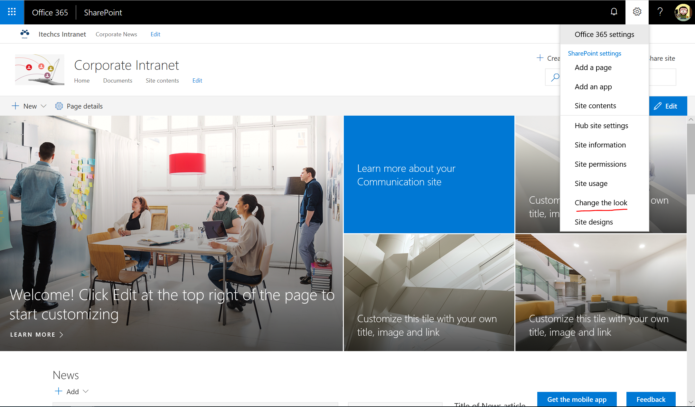
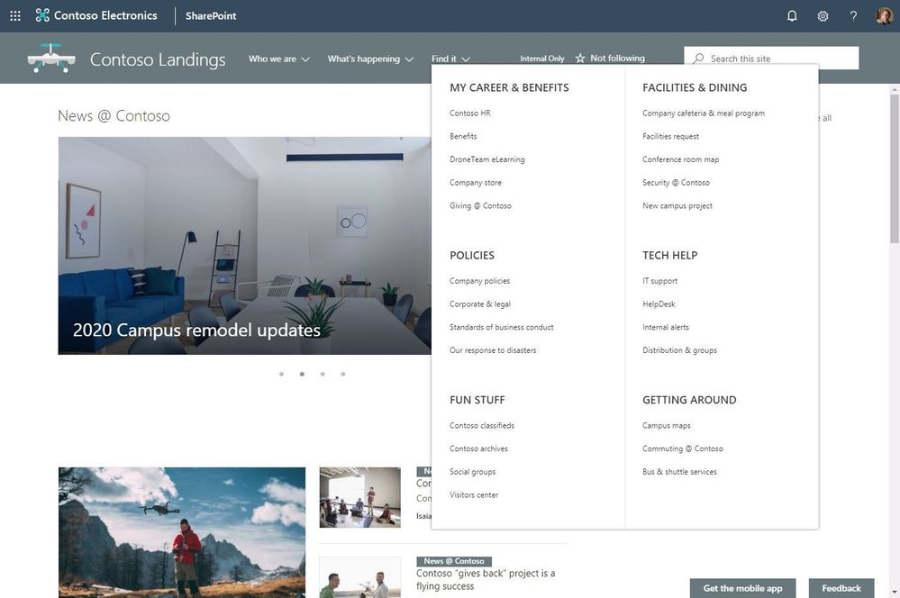

Desde hace un par de años estamos asistiendo a la "modernización" de la plataforma SharePoint de la mano de una serie de innovaciones que Microsoft ha ido liberando en la versión cloud de la plataforma: páginas modernas, listas y bibliotecas modernas, WebParts de SharePoint Framework, etc. Sin embargo, esta "modernización" tenía (y sigue teniendo) un punto débil: las posibilidades de personalización de caja y sin recurrir a desarrollo son muy limitadas. Afortunadamente, uno de los puntos fuertes de SharePoint Online (SPO) es que continuamente tenemos mejoras y novedades en la plataforma como la reciente incorporación de opciones de personalización por defecto en sitios modernos. Como veremos en este artículo, las posibilidades de personalización siguen siendo reducidas, pero apuntan en la buena dirección.

**Nuevas opciones de personalización liberadas**

Las nuevas opciones de personalización de sitios modernos se encuentran disponibles en la opción "Change the look" ("Cambiar el aspecto") dentro del menú de configuración del sitio:

Desde esta opción tendremos acceso a 4 configuraciones de cambio de aspecto del sitio:
- **Theme (Tema),** nos permite cambiar el tema del sitio por alguno de los temas disponible por defecto o bien por un tema personalizado que se haya desplegado en el tenant. Para crear nuevos temas personalizados, os recomiendo las siguientes referencias:
    - Referencia oficial en la documentación de Microsoft sobre temas en sitios de SPO: [https://docs.microsoft.com/en-us/sharepoint/dev/declarative-customization/site-theming/sharepoint-site-theming-overview](https://docs.microsoft.com/en-us/sharepoint/dev/declarative-customization/site-theming/sharepoint-site-theming-overview)
    - Herramienta online para generar nuevos temas: [https://developer.microsoft.com/en-us/fabric#/styles/themegenerator](https://developer.microsoft.com/en-us/fabric#/styles/themegenerator).
    - Como provisionar un tema personalizado en un tenant de SPO (Ejemplo de Joao Ferreira, colaborador habitual de CompartiMOSS): [http://sharepoint.handsontek.net/2018/03/11/brand-modern-sharepoint-online-sites/](http://sharepoint.handsontek.net/2018/03/11/brand-modern-sharepoint-online-sites/)
- **Header (Cabecera)**, permite configurar la cabecera del Sitio en aspectos como el layout a utilizar, el logo del sitio o el color de fondo.
- **Navigation** (Navegación), permite elegir la experiencia de navegación del sitio.
- **Footer**(Pie de página), permite configurar el pie de página del sitio.

**Configuración de la cabecera**
La opción de configuración de cabecera de un sitio moderno permite realizar los siguientes cambios:

- El diseño (layout), permitiendo elegir entre un diseño estándar (opción por defecto) o bien uno compacto.
- El logo del sitio.
- El color de fondo de la cabecera, permitiendo elegir entre cuatro combinaciones posibles.

Una vez hemos realizado los cambios a nivel de cabecera, es importante no solo aplicarlos, si no también guardarlos para que sean efectivos.
**Configuración de la navegación**

Esta opción permite elegir la experiencia de usuario en la navegación entre secciones del sitio de acuerdo con dos posibilidades:

- Cascada (Cascading), que es la opción por defecto.
- Megamenu.

Un ejemplo de Megamenu (Imagen extraída de contenidos de Microsoft) es el siguiente:

**Configuración del pie de página**

Finalmente, el último elemento que podemos configurar con opciones de serie en sitios modernos de SPO es el pie de página. Para ello haremos uso de la opción del mismo nombre, de manera que podremos:

- Indicar si el pie de página va a estar visible a lo largo del sitio.
- El icono para mostrar en el pie de página en el caso en el que esté habilitado.
- El texto para mostrar en el pie de página en el caso en el que esté habilitado.
- Configurar los enlaces a mostrar en el pie de página en el caso en el que esté habilitado.

El resultado de realizar todas las configuraciones indicadas en el pie de página es el siguiente (**Nota:** para visualizar el pie de página se necesitará hacer scroll en la página).
****
**Configuraciones a nivel de Hub Sites**
Además de las opciones descritas de personalización para un sitio, si este es un Hub Site también podremos realizar dos personalizaciones básicas:

- Cambiar el logo del Hub Site.
- Cambiar el nombre del Hub Site.

Ambas opciones se muestran hacer clic en "Hub site settings" en el menú de configuración del sitio.
**
Conclusiones**
Las posibilidades de personalización de sitios modernos de SPO han sido y siguen siendo bastante reducidas. Sin embargo, las novedades recientes para personalizar mínimamente un sitio de SPO hacen pensar que poco a poco Microsoft nos irá proporcionando distintas posibilidades para personalizar sitios sin necesidad de recurrir al desarrollo.

**Juan Carlos González**

**Office Apps & Services MVP | Office 365 SME**

@jcgm1978​​

