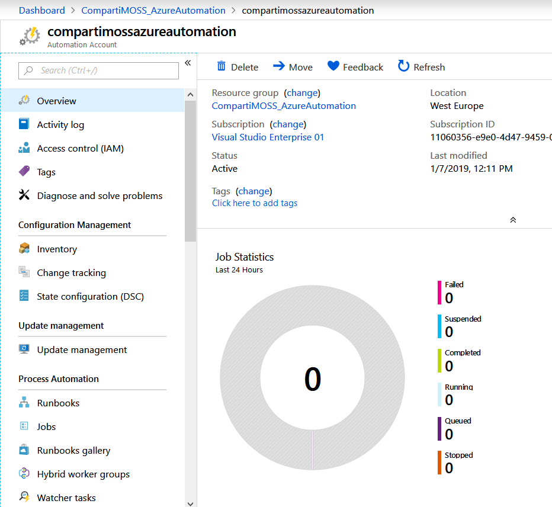
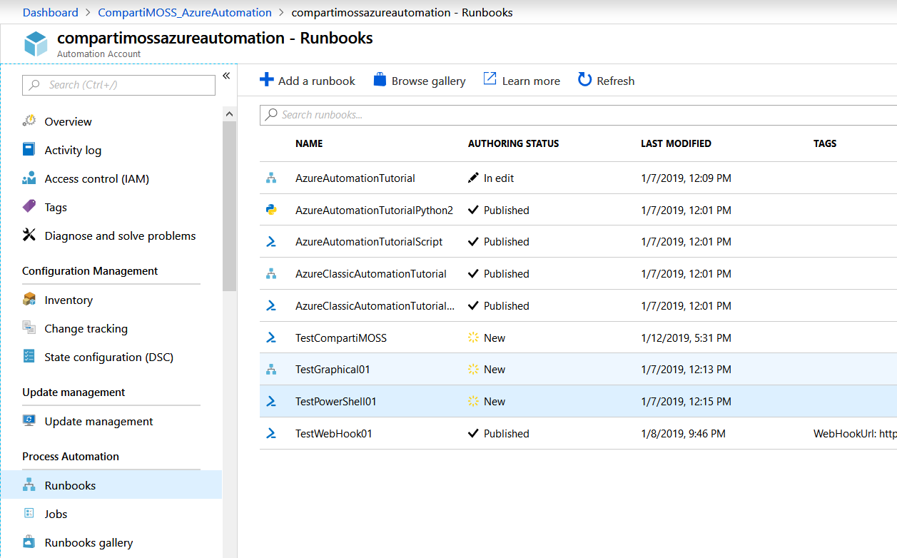
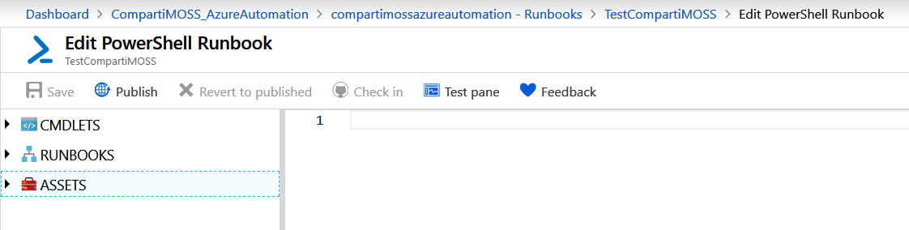
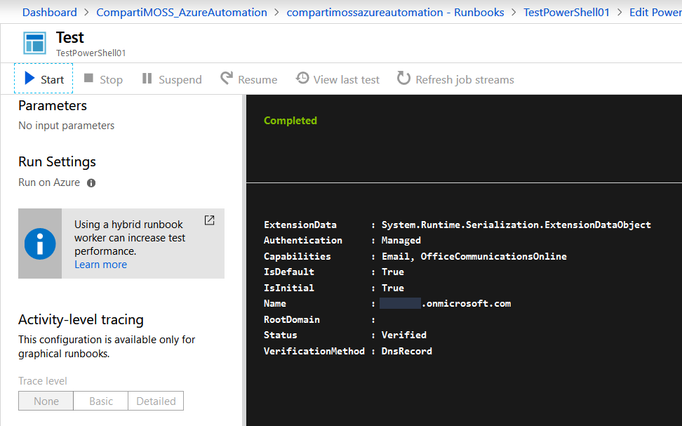

import ArticleHeader from '../../../components/article-header'

<ArticleHeader frontmatter={props.pageContext.frontmatter} />


Una de las características más poderosas de Azure como sistema de integración, es su capacidad para ser controlado programáticamente. Azure Automation ofrece un sofisticado servicio de configuración y automatización basado en la nube, que permite administración tanto de Azure mismo como de sistemas no localizados en Azure, tales como Office 365 y SharePoint Online.

Azure Automation ofrece la posibilidad de automatizar tareas frecuentes de administración en la nube, que potencialmente consumen mucho tiempo y son propensas a errores, reduciendo a su vez los costos operativos. El servicio permite crear scripts gráficamente, en PowerShell o con Python. Mediante el uso de scripts híbridos, se pueden combinar recursos en entornos locales con recursos de Azure. Los scripts de Automation se pueden hacer ejecutar automáticamente con un scheduler, manualmente desde el panel de control de Azure, por medio de PowerShell o utilizando un WebHook.

En el contexto de Office 365 y SharePoint Online, se puede pensar en el uso de Azure Automation para la creación de "Timer Jobs" como los que utiliza SharePoint OnPremises, tareas de mantenimiento como el aprovisionamiento de nuevos sitios o cuentas de usuarios o la ejecución automatizada de procesos dentro de SharePoint inicializados por otros sistemas (integración con sistemas externos).

**Creación del Servicio de Azure Automation**

Para poder utilizar el servicio es necesario primero crear una instancia en su suscripción de Azure. Utilice credenciales de administrador en el portal de Azure ([https://portal.azure.com](https&#58;//portal.azure.com/)) y cree o reutilice un Grupo de Recursos. Dentro del Grupo, agregue un servicio del tipo "Automation" asignándole un nombre, suscripción, Grupo de Recursos y Localización del centro de datos. En el momento de escribir este articulo solamente existe un esquema de precios que incluye 500 minutos de ejecución de scripts gratis, y pago por cada minuto de ejecución extra cuando el limite gratuito se sobrepasa.

Cuando el servicio ha terminado de ser creado, desde su ventana de manejo se pueden monitorear scripts que están ejecutando o ya han ejecutado, y crear nuevos o manejar los que ya existen:



**Programación de un script de Automation**

Para crear un script de PowerShell para Automation, desde la ventana de administración de servicio haga clic sobre "Runbooks", lo que abre una nueva ventana con la lista de todos los scripts que el servicio maneja (una instancia del servicio de Automation puede contener cientos de scripts):



El servicio crea unos cuantos scripts de ejemplo que se pueden eliminar si no se utilizan. Haga clic sobre el botón "Add a runbook" lo que permite crear un nuevo script ("Runbook") o importar uno desde un archivo. El botón "Create a new runbook" permite asignarle un nombre y seleccionar su tipo (PowerShell, Python, Graphical o PowerShell Workflow). El tipo "Graphical" permite crear wysiwyg scripts basados en "bloques" preexistentes de código de PowerShell. Para trabajar con SharePoint se utiliza siempre el tipo "PowerShell".

Después de crear un Runbook de PowerShell aparece la pantalla donde se puede crear y editar el código de PowerShell:



El menú del lado izquierdo permite examinar y agregar al código rápidamente todos los Cmdlets existentes por defecto en el servicio. De igual forma, se pueden conectar con otros Runbooks en el servicio para utilizar su funcionalidad. En la parte de "Assets" se pueden ver y agregar Variables, Conexiones, Credenciales y Certificados.

Una vez el script ha sido creado y testeado, se debe utilizar el botón de "Publish" para indicarle al sistema que el Runbook está listo para ser utilizado en producción.

**Agregar Módulos de PowerShell en Azure Automation**

Como se ha indicado, el servicio dispone de todos los Cmdlets por defecto que se pueden ver y utilizar en un sistema de Windows "normal", es decir, todos los Cmdlets que existen en una consola de PowerShell de Windows estándar. Estos Cmdlets no permiten trabajar con Office 365 ni SharePoint Online, por lo que es necesario agregarle los correspondientes módulos o dlls antes de poder utilizar Azure Automation con SharePoint.

Hay tres tipos de módulos que se pueden utilizar para SharePoint (aunque usted puede crear sus propios Cmdlets o dlls, compilarlos y agregarlos a Automation de forma similar a como se indicara en un momento): los Cmdlets del módulo de MSOnline que permiten operaciones básicas con usuarios, grupos y en el Tenant de Office 365, los dlls de SharePoint CSOM (Client Side Object Model) que dan acceso a toda la funcionalidad de SharePoint y los Cmdlets de PnP que amplían la funcionalidad de los dlls de CSOM.

**Agregar los Cmdlets de MSOnline**

Desde la ventana de manejo de los Runbooks (Imagen 2), utilice el botón de "Modules" (menú izquierdo, bajo la sección de "Shared Resources"). La ventana muestra la lista con todos los módulos de PowerShell disponibles en el momento. Haga clic sobre "Browse gallery" y en la casilla de búsqueda escriba "msonline". Haciendo clic sobre el módulo "MSOnline" (creado por "AzureADPowerShell") se instala el módulo automáticamente.

**Agregar los dlls de SharePoint CSOM**

Este módulo utiliza dos dlls de SharePoint: Microsoft.SharePoint.Client.dll y Microsoft.SharePoint.Client.Runtime.dll y permite utilizar las clases, métodos y propiedades presentes en ellos. Los dlls se pueden descargar desde [https://www.microsoft.com/en-us/download/details.aspx?id=42038](https&#58;//www.microsoft.com/en-us/download/details.aspx?id=42038). Descargue desde ese sitio la última versión x64 del sharepointclientcomponents e instálelos o desempáquelos localmente. Copie los dos dlls indicados a un directorio llamado "Microsoft.SharePoint.Client" (utilice este nombre, no lo cambie). Haga un archivo zip del directorio "Microsoft.SharePoint.Client" (no incluya el directorio, los archivos tienen que estar directamente bajo la raíz del archivo zip).

Desde la ventana de manejo de los Runbooks (Imagen 2), utilice el botón de "Modules" (menú izquierdo, bajo la sección de "Shared Resources"). La ventana muestra la lista con todos los módulos de PowerShell disponibles en el momento. Haga clic sobre "Add a module" y seleccione el archivo zip creado anteriormente. El servicio sube los dlls a Azure y los configura en el sistema para que puedan ser utilizados por PowerShell.

Agregar los Cmdlets de PnP

Utilice el mismo procedimiento descrito para el módulo de MSOnline, pero en este caso busque por " SharePointPnPPowerShellOnline".

**Creación de credenciales para Office 365**

La idea de utilizar Azure Automation con SharePoint Online es que se puedan crear scripts que ejecuten automáticamente y por sí mismos, por lo que hay que configurar las credenciales de la cuenta de ejecución para que los scripts también se logueen automáticamente.

Desde la ventana de manejo de los Runbooks (Imagen 2), utilice el botón de "Credentials" (menú izquierdo, bajo la sección de "Shared Resources") para crear credenciales que se puedan utilizar en los scripts. Es posible crear credenciales separadas para cada script, o una sola para todos. El botón de "Add a credential" permite configurar un nombre para la credencial, una corta descripción, la clave y el usuario (Email). Las claves se conservan encriptadas y no es posible verlas en la interfaz de manejo del servicio.

**Programación de scripts de Automation para SharePoint Online**

Una vez se dispone de por lo menos uno de los módulos para SharePoint y una entrada de credenciales como se describe anteriormente, es posible comenzar a crear scripts para acceder al sistema.

**Script utilizando MSOnline**

Cree un nuevo Runbook como se describió anteriormente. En la ventana de edición agregue el siguiente código:

```
# Credenciales$myCred = Get-AutomationPSCredential -Name "NombreCredenciales"# Conectar a Office 365Connect-MsolService -Credential $myCred# Trabajar con SharePoint/Office$myDomain = Get-MsolDomainWrite-Output $myDomain
```


La primera línea del script recolecta las credenciales del usuario del Tenant (utilizando el nombre de la entrada que define las credenciales) y la segunda línea las utiliza para logarse en Office 365. El Cmdlet "Get-MsolDomain" del módulo MSOnline recupera los datos del dominio y la cuarta línea los muestra por pantalla. Utilice cualquiera de los Cmdlets presentes en MSOnline para trabajar con SharePoint.

Use el botón de "Save" y luego el de "Test pane". En la ventana de testeo utilice el botón de "Start" para ejecutar el script y luego de unos cuantos segundos aparece el resultado:



**Script utilizando CSOM**

Cree otro Runbook y utilice el siguiente código:


Add-Type -Path "C:\Modules\User\Microsoft.SharePoint.Client\Microsoft.SharePoint.Client.dll"
 
```
# Credenciales$myCred = Get-AutomationPSCredential -Name "NombreCredenciales"$myUser = $myCred.UserName$myPW = $myCred.Password # Conectar a Office 365$cred = New-Object Microsoft.SharePoint.Client.SharePointOnlineCredentials($myUser, $myPW)$mySite = "https://dominio.sharepoint.com/"$myContext = New-Object Microsoft.SharePoint.Client.ClientContext($mySite)$myContext.Credentials = $cred # Trabajar con SharePoint$myWeb = $myContext.Web$myContext.Load($myWeb)$myContext.ExecuteQuery() Write-Output "Web Titulo: " $myWeb.Title
```

Note que en la primera línea se utiliza el nombre del archivo zip como parte de la ruta al dll de SharePoint que se configuró con el módulo indicado en la sección "Agregar los dlls de SharePoint CSOM".

**Script utilizando PnP**

Cree un nuevo Runbook y utilice el siguiente código:

```
# Credenciales$myCred = Get-AutomationPSCredential -Name " NombreCredenciales" # Conectar a Office 365$mySite = "https://dominio.sharepoint.com/"Connect-PnPOnline -Url $mySite -Credentials $myCred # Trabajar con SharePoint$myContext = Get-PnPContextWrite-Output $myContext
```

**Como hacer ejecutar un script de Azure Automation**

Existen varias posibilidades para iniciar un script de Azure Automation:

- Manualmente desde la ventana de control de Azure Automation: Como se indicó anteriormente, un Runbook se puede hacer ejecutar manualmente desde la ventana de testeo directamente en el portal de Azure. También, después de publicado, se puede utilizar el botón de "Start" para hacerlo ejecutar manualmente. La ventana de "Overview" del Runbook muestra una lista de los "Recent Jobs" que se han ejecutado. Haciendo clic sobre uno de ellos, se puede obtener información completa sobre cómo fue esa ejecución en particular, sus errores, output, etc.


Desde otro Runbook: Un Runbook se puede hacer ejecutar desde otro Runbook, de la misma forma que un script de PowerShell se puede llamar desde otro script de PowerShell. Utilice el Cmdlet "Start-AzureRmAutomationRunbook" de la siguiente manera para ejecutar un script desde otro script:

```
Start-AzureRmAutomationRunbook `    –AutomationAccountName 'NombreCredenciales' `    –Name 'NombreRunbook' `    -ResourceGroupName 'NombreGrupoDeRecursos' `    -DefaultProfile $AzureContext `    –Parameters $params –wait
```

Un archivo .ps1 de PowerShell se puede integrar (concatenar) también en otro archivo, de tal forma que el motor de PowerShell los ejecute como si fueran uno solo, de la misma manera que se hace en el funcionamiento normal de PowerShell. La siguiente línea de código integra el archivo "TestPowerShell01.ps1" en el archivo .ps1 actual:

.\TestPowerShell01.ps1

**Ejecución automática por medio de un scheduler**

Azure Automation permite acoplar un scheduler a un Runbook. Para hacerlo:

- Cree, testee y publique el Runbook.
- Desde la ventana de "Runbooks" (imagen 2) haga clic sobre "Schedules" (menú al lado izquierdo) y luego "Add a Schedule".
- Defina un nombre, descripción, fecha y hora para iniciar el Schedule y si el timer debe ejecutar una sola vez o recurrentemente.
- Si se utiliza un timer recurrente, defina cada cuanto debe ejecutar y si tiene un tiempo de finalización o debe ejecutar indefinidamente
- Guarde los cambios.


Para acoplar un Runbook a un scheduler, desde la lista de Runbooks seleccione el indicado y desde su ventana de manejo haga clic sobre "Link to Schedule". El botón de "Link a Schedule to your runbook" permite seleccionar uno de los scheduler creados anteriormente, o crear uno nuevo.

**Por medio de PowerShell**

Los scripts de Automation se pueden iniciar desde una consola local de PowerShell. Primero es necesario agregar el módulo de PowerShell para Azure por medio del Cmdlet "Install-Module AzureRM". Luego utilice un script similar al siguiente ejemplo que inicia logeando interactivamente al usuario, luego ejecuta uno de los Runbooks con un parámetro de entrada y finalmente, por medio de un loop, espera a que finalice la ejecución y muestra el resultado del script por pantalla:

```
# Login en AzureLogin-AzureRmAccount#Get-AzureRmSubscription / Select-AzureRmSubscription # Por si es necesario cambiar de Subscripcion $params = @{"ScriptData"="Gustavo estuvo aqui"}   # Use ; para separar dos o mas parametros$job = Start-AzureRmAutomationRunbook -ResourceGroupName "CompartiMOSS_AzureAutomation" `                -AutomationAccountName "compartimossazureautomation" -Name "TestRunbook01" `                -Parameters $params $doLoop = $trueWhile ($doLoop) {  $job = Get-AzureRmAutomationJob -ResourceGroupName "CompartiMOSS_AzureAutomation" `                -AutomationAccountName "compartimossazureautomation" -Id $job.JobId  $status = $job.Status  $doLoop = (($status -ne "Completed") -and ($status -ne "Failed") -and ($status -ne "Suspended") `                    -and ($status -ne "Stopped"))} Get-AzureRmAutomationJobOutput -ResourceGroupName "CompartiMOSS_AzureAutomation" `                -AutomationAccountName "compartimossazureautomation" -Id $job.JobId -Stream Output
```

**WebHooks para Azure Automation**

Una forma más para hacer ejecutar un script de Azure Automation es por medio de un WebHook. Automation ofrece la posibilidad de crear un WebHook para cada Runbook, es decir, un URL en Internet, que se puede llamar con un método HTTP POST, pasándole parámetros si es necesario, de tal forma que cuando la llamada llega al sitio, el script de Automation comienza a funcionar automáticamente. La llamada al URL no depende de un lenguaje de programación determinado y se puede realizar por medio de múltiples maneras, de tal forma que es totalmente agnóstico en cuando a una u otra tecnología.

Para crear un Automation WebHook para un Runbook:

- Cree, guarde y testee el script de la forma indicada anteriormente.
- Publique el script.
- Desde la ventana del Runbook (después de publicado), haga clic sobre "Add webhook".
- En la nueva ventana, haga clic sobre "Create new webhook" y asígnele un nombre. En la casilla de "Expires" determine por cuanto tiempo el WebHook estará disponible. Copie en un sitio seguro el "URL" pues después de cerrar esta ventana será imposible recuperar el token desde Azure.


Un punto importante en la programación de PowerShell en el código del script es que solamente se puede leer un parámetro de entrada llamado (obligatoriamente) "$WebhookData" del tipo "object". Los nombres y valores de los parámetros se deben enviar en el header de la llamada HTTP y/o en su body. Para leer el parámetro, que contiene tanto el header como el body, primero testee si la variable contiene algún dato, y luego utilice sus valores si es "true", como muestra el siguiente fragmento de PowerShell:

```
​Param( [string]$ScriptData,  # Para usar como parametro en un script directamente [object]$WebhookData  # Para usar como parametro en un WebHook) if ($WebhookData -ne $null) {    Write-Output ("*** Informacion recibida usando un WebHook")    Write-Output ("Name In Header - " + $WebhookData.RequestHeader.NameInHeader)    Write-Output ("Text In Header - " + $WebhookData.RequestHeader.TextInHeader)    Write-Output ("WebHook Name - " + $WebhookData.WebHookName)    Write-Output ("Body - " + $WebhookData.RequestBody)}else {    Write-Output ("*** Informacion recibida con una llamada directa al script")    Write-Output ("Script Data - " + $ScriptData)}
```

Para llamar el WebHook se puede utilizar cualquier tipo de lenguaje de programación. Por ejemplo, usando PowerShell:

```
$uri = "https://s2events.azure-automation.net/webhooks?token=dtb...MueTw%3d" $headers = @{"NameInHeader"="nombre en header";"TextInHeader"="texto en header"} $body = "texto en body" #$response = Invoke-RestMethod -Method Post -Uri $uri -Headers $headers -Body $body$response = Invoke-WebRequest -Method Post -Uri $uri -Headers $headers -Body $body Write-Output ("Respuesta - " + $response)
```

Note que se puede utilizar tanto el Cmdlet "Invoke-RestMethod" como el Cmdlet "Invoke-WebRequest". También es importante observar que el WebHook no tiene ningún tipo de autorización, su única medida de seguridad es el Token en el URL. Si el token es conocido, cualquier sistema puede hacer ejecutar el script sin problemas (siempre es posible agregar código de autenticación personalizado, si es necesario). Finalmente, porque el Runbook ejecuta en forma asincrónica totalmente, es imposible recibir información desde la ejecución del script.

**Puntos para tener en cuenta cuando se usa Automation**

Cuando se usa Azure Automation se debe tener en cuenta los siguientes puntos:

- Interacción con usuarios: los scripts en Azure Automation ejecutan sin interacción con el usuario, por lo que cualquier error que ocurra en el script no es reportado. Asegúrese de utilizar código para atrapar errores y alguna forma para avisar a los administradores si ocurre uno (enviar un Email, por ejemplo).
- Seguridad: probablemente es una buena idea tener una cuenta de Azure dedicada solamente a la ejecución de scripts de Automation.
- Use "Write-Output" en lugar de "Write-Host" para mostrar información por pantalla.
- Otras posibilidades: existen otras posibilidades técnicas con Automation no mencionadas en este artículo. Por ejemplo, la creación de scripts gráficamente, el uso de "workflows" de PowerShell y el uso de scripts híbridos. Microsoft proporciona toda la información necesaria para usar esas otras opciones.


**Conclusiones**

Azure Automation es un servicio de Azure que se puede utilizar extensivamente con Office 365 y SharePoint Online, permitiendo la automatización del sistema por medio de scripts de PowerShell. El servicio es muy poco costoso para utilizar, muy poderoso técnicamente, y puede reemplazar otro tipo de soluciones fácil y rápidamente; por ejemplo, puede ser utilizado para crear "Timer Jobs" en SharePoint sin necesidad de crear y mantener toda la infraestructura de sitios web y/o funciones de Azure como se hace tradicionalmente.

**Gustavo Velez**
 MVP Office Apps & Services
 [gustavo@gavd.net](mailto&#58;gustavo@gavd.net)
 http://www.gavd.net

