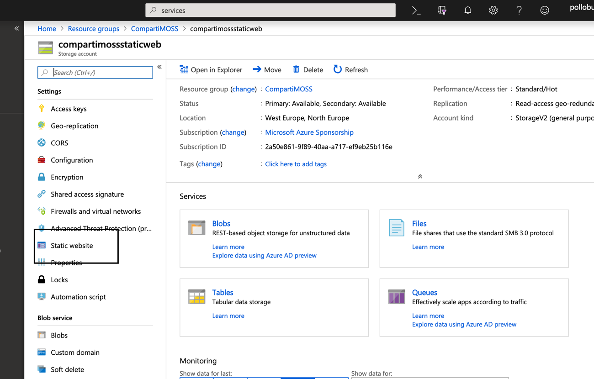
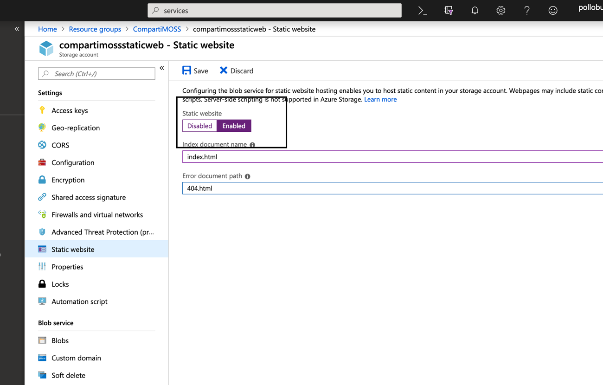

Desde hace muy pocos meses, ya podemos hospedar nuestras webs estáticas en el servicio de Azure Storage GPv2.

**¿Qué es una web estática?**

Una web estática es aquella aplicación que solo contiene ficheros HTML, CSS, JavaScript o imágenes, a diferencia de las webs dinámicas que dependes de código de servidor. Un ejemplo de una web estática es una aplicación Single Page Application, que solo contiene este tipo de ficheros y que llama a APIs para obtener los datos a mostrar, autenticarse, autorizarse, etc.

Hasta ahora si queríamos alojar una de estas webs en Azure lo teníamos que hacer en Azure Web Apps; también tenemos otros servicios, pero este sería el más sencillo y rápido. El problema que nos encontrábamos es el precio para pagar por alojar este tipo de webs y la rapidez en servir el contenido. Para dar salida a este problema, apareció la opción de alojar este tipo de webs en Azure Storage, lo que nos permite tener unos costes mucho más bajos con una escalabilidad mayor.

En este articulo vamos a ver como funciona y como podemos alojar nuestra web.

**Habilitando Static Websites en Azure Storage.**

Lo primero que tenemos que hacer es crear un Azure Storage GPv2.

Una vez lo tenemos creado, habilitaremos la opción de Static website:

**Como funciona**

Cuando se habilita la opción se debe indicar la página de inicio y la página de error 404 not found. Una vez añadimos esta información y guardamos, se crea un container con nombre $web, si ya existe no se crea, el comportamiento habitual de cualquier container en Azure Storage.

​

Una vez creado también nos da dos endpoints, uno principal y uno secundario que es donde estará alojada nuestra web.

**Subiendo los archivos**

Lo único que debemos hacer es añadir nuestro archivo en el container creado $web, para ello podemos hacerlo de diferentes formas.

- AZzCopy.
- Storage Explorer.
- Azure Pipelines.
- Visual Studio Code Extension.
- Portal.

**Ejemplo​**

Vale, hasta ahora son todo palabras; vamos a subir una web creada en React, la creada por defecto, a Azure Storage como static web. Todos los pasos para crear una aplicación React están aquí: [https://github.com/facebook/create-react-app/](https&#58;//github.com/facebook/create-react-app/). Primero creamos nuestra aplicación React: *npm init react-app my-app*

Después modificamos el fichero *app.js* para modificarlo y ver que todo funciona correctamente:

Ahora hacemos un *npm start* y vemos que nuestros cambios han tenido efecto:

Ahora vamos a preparar nuestra aplicación para subirla al Azure Storage, para ello ejecutaremos el comando *npm run build*. Este comando nos generará la carpeta *build* y dentro de ella todos los archivos necesarios para que nuestra web funcione.

Ahora lo que tenemos que hacer es subir todos los ficheros de esta carpeta a nuestro container $web, para ello utilizaremos Microsoft Azure Storage Explorer.

Ahora ya lo tenemos, si accedemos al primary point de nuestra static web en Azure Storage veremos nuestra web.

Como has podido ver subir una static web a Azure Storage es muy sencillo y rápido, y que las ventajas que nos ofrece son mucha y a tener en cuenta a la hora de alojar nuestras aplicaciones.

**Robert Bermejo**
 Cloud Architect & Technical Lead Consultant in TOKIOTA | Microsoft Azure MVP

bermejoblasco@live.com
 @robertbemejo
 [www.robertbermejo.com](http&#58;//www.robertbermejo.com/)

