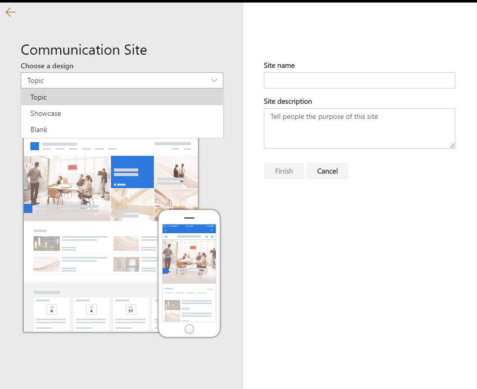
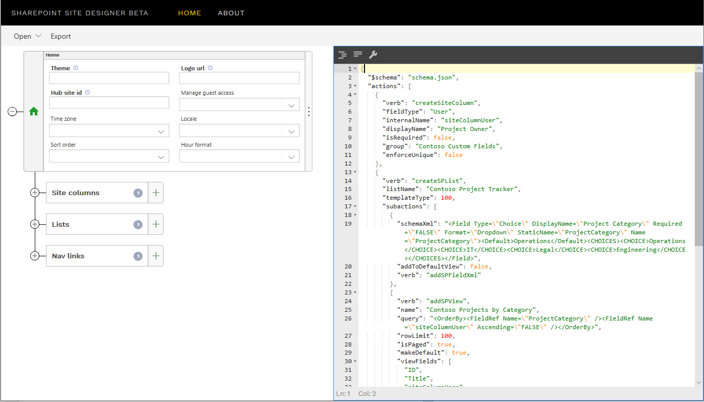
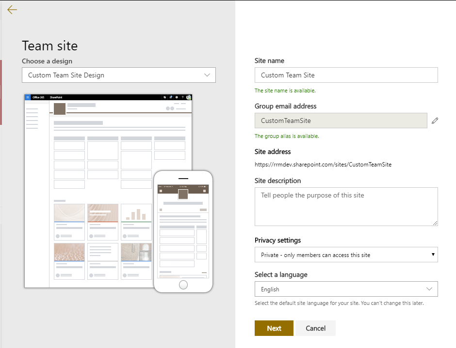
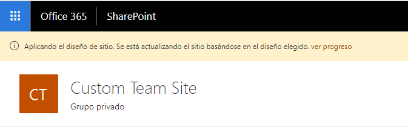
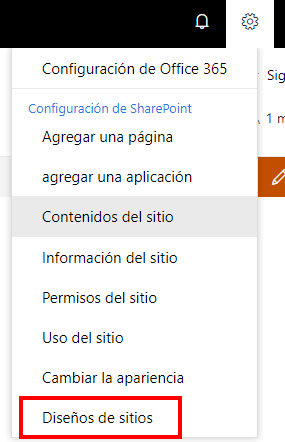
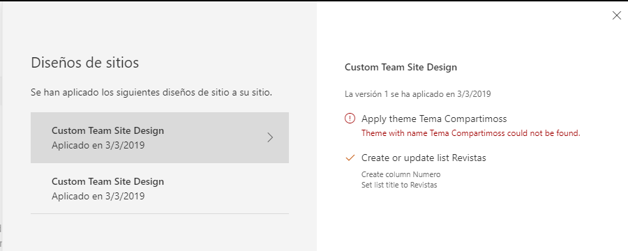
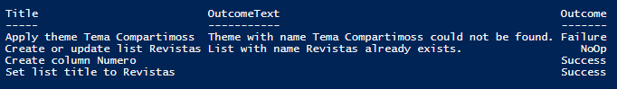
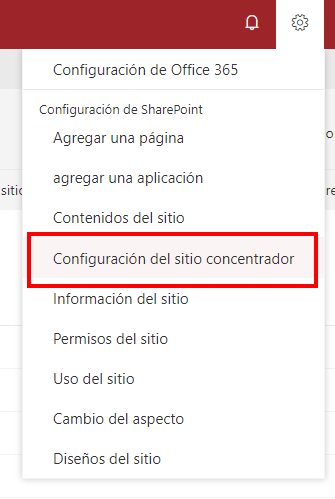
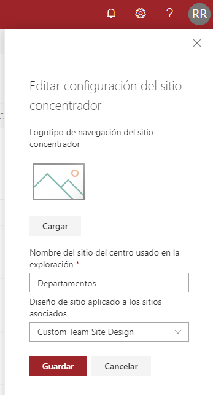
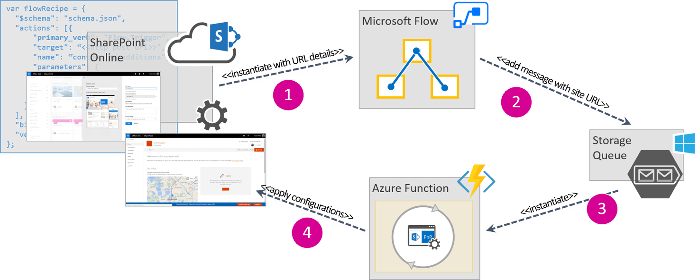

**¿Qué son los diseños y scripts del sitio de SharePoint?**

Un diseño de sitio SharePoint es un conjunto de acciones que se ejecutan en un sitio después de que éste ha sido creado. Con los diseños de sitio, por ejemplo, podemos crear listas, tipos de contenido, aplicar temas, etc.

Un script de sitio es un texto en formato JSON que contiene las acciones que vamos a ejecutar. Podemos pensar que un diseño de sitio es un contenedor de uno o varios scripts de sitio.

Como hemos visto, los diseños de sitio contienen acciones que se ejecutan una vez se ha creado el sitio, es decir, si tenemos un sitio en el que se aplicó un diseño y actualizamos ese diseño, el sitio no se actualizará automáticamente, sino que tendremos que volver a aplicar el diseño para que se apliquen los cambios.

Tampoco podemos añadir acciones antes de la creación del sitio, por ejemplo, incorporar un flujo de aprobación antes de la creación del sitio.

Existen diseños de sitio predeterminados dentro de SharePoint que podemos ver al crear un nuevo sitio moderno o también podremos crear nuestros diseños de sitio personalizados.



**Creando un script de sitio**

Los scripts de sitio son archivos JSON que especifican una lista ordenada de acciones que se ejecutarán al crear el sitio, es decir, las acciones se ejecutarán en el orden que indiquemos en el fichero JSON.

Un script de sitio puede contener varias acciones, que a su vez pueden contener subacciones, y cada acción viene definida por un valor de verb. Únicamente se pueden utilizar valores de verb que estén contenidas dentro del schema y si pones un valor que no esté disponible, se mostrará un bonito mensaje de error advirtiendo que esa acción no está disponible. Se irán añadiendo nuevos valores por lo que te aconsejo que revises que acciones están disponibles antes de crear el script de sitio. Puedes ver las acciones disponibles en [https://docs.microsoft.com/en-us/sharepoint/dev/declarative-customization/site-design-json-schema](https&#58;//docs.microsoft.com/en-us/sharepoint/dev/declarative-customization/site-design-json-schema)

La estructura general de este fichero JSON es la siguiente:

```
{    "$schema": "schema.json",        "actions": [            ...            <one or more verb actions>            ...        ],        "bindata": { },        "version": 1};​
```

Dentro de cada acción indicaremos el valor de verb que queremos ejecutar y los parámetros necesarios para esa acción. Por ejemplo, podemos tener este script sencillo que aplica un tema y crea una lista:

```
{  "$schema": "schema.json",  "actions": [    {      "verb": "applyTheme",      "themeName": "Tema Compartimoss"    },    {      "verb": "createSPList",      "listName": "Revistas",      "templateType": 100,      "subactions": [        {          "fieldType": "Number",          "displayName": "Numero",          "internalName": "NumeroRevista",          "addToDefaultView": true,          "isRequired": true,          "verb": "addSPField"        },        {          "verb": "setTitle",          "title": "Revistas"        }      ]    }  ],  "bindata": {},  "version": 1}
```

Puedes crear el fichero JSON directamente a mano, pero existen varias herramientas que con una interfaz gráfica que pueden ayudarte a crear estos ficheros. Una de estas herramientas es [sitedesigner.io](https&#58;//www.sitedesigner.io/). Desde esta herramienta podrás ir añadiendo las acciones que necesites a tu script de sitio de una forma visual y luego podrás exportar ese script a un fichero JSON o incluso da la posibilidad de generar el código PowerShell necesario para desplegar el script a tu tenant.



**Exportar una lista existente a un script de sitio**

Recientemente, Microsoft liberó una nueva funcionalidad para poder generar un script para una lista que tengamos en un sitio. Para ello utilizaremos el comando de PowerShell Get-SPOSiteScriptFromList. El siguiente script de PowerShell mostrará en pantalla el script de la lista que indiquemos:

```
$adminSiteUrl = "https://tenant-admin.sharepoint.com"$listUrl = "https:// tenant.sharepoint.com/sites/site/Lists/listname" $cred = Get-CredentialConnect-SPOService $adminSiteUrl -Credential $cred Get-SPOSiteScriptFromList -ListUrl $listUrl
```

**Desplegando diseños y scripts de sitios**

Una vez que hayamos creado nuestro script tendremos que desplegarlo a nuestro tenant. Tenemos varias opciones para hacer el despliegue: se pueden desplegar con PowerShell o a través de REST API o CSOM.  Con el siguiente script desplegamos el script que hemos creado de ejemplo a nuestro tenant y creamos un diseño de sitio que contiene el script:

```
$adminSiteUrl = "https://tenant-admin.sharepoint.com" $script = @'{  "$schema": "schema.json",  "actions": [    {      "verb": "applyTheme",      "themeName": "Tema Compartimoss"    },    {      "verb": "createSPList",      "listName": "Revistas",      "templateType": 100,      "subactions": [        {          "fieldType": "Number",          "displayName": "Numero",          "internalName": "NumeroRevista",          "addToDefaultView": true,          "isRequired": true,          "verb": "addSPField"        },        {          "verb": "setTitle",          "title": "Revistas"        }      ]    }  ],  "bindata": {},  "version": 1}'@ $webTemplate = "64"$siteScriptTitle = "Custom Team Site Script"$siteDesignTitle = "Custom Team Site Design" $cred = Get-Credential Connect-SPOService $adminSiteUrl -Credential $cred $siteScript = Add-SPOSiteScript -Title $siteScriptTitle -Content $script Add-SPOSiteDesign -Title $siteDesignTitle -WebTemplate $webTemplate -SiteScripts $siteScript
```

Dentro del script vemos que tenemos un parámetro webTemplate. Este parámetro sirve para indicar en qué tipo de plantilla vamos a mostrar nuestro diseño cuando creamos una colección de sitios desde la interfaz de usuario. Este parámetro puede tener los siguientes valores:

- 64: Sitios de equipo.
- 68: Sitios de comunicación.


Lo que realmente hace el parámetro webTemplate es asociar el diseño de sitio en el desplegable de la interfaz de usuario, pero se puede asignar cualquier diseño de sitio a cualquier tipo de colección de sitios programáticamente. Es más, si en ese parámetro ponemos un valor distinto a los dos valores que he mencionado, el diseño de sitio estará oculto en la interfaz de usuario, pero aun así se podrá asignar a una colección de sitios vía script de PowerShell o REST.

**Administrando los diseños de sitio con PowerShell**

Existen varios comandos de PowerShell que nos pueden resultar útiles a la hora de administrar los diseños y scripts de sitio que tengamos desplegados en nuestro tenant. Los diseños y scripts de sitio se despliegan a nivel de tenant por lo que para poder ejecutar los comandos tendremos que estar conectados al sitio de administración de SharePoint:

- Obtener información de diseños y script de sitio: Podemos obtener información de los diseños y script de sitio desplegados en nuestro tenant con los comandos:


Get-SPOSiteDesign
Get-SPOSiteScript
 

- Modificar un diseño de sitio:


```
Set-SPOSiteDesig​n -Identity $siteDesignId -SiteScripts $siteScriptId
```
 

- Modificar un script de sitio:


```
Set-SPOSiteScript -Identity $siteSc​​riptId -Content $scriptContent
```
 

- Eliminar un diseño de sitio:


```
Remove-SPOSiteDesign​ -Identity $siteDesignId
```
 

- ​Eliminar un script de sitio:


```
Remove-SPOSiteScript -Id​entity $siteScriptId
```
 
**Aplicando diseños de sitios**
Tenemos varias formas para aplicar un diseño de sitio, una de ellas es mediante la interfaz de usuario. Al crear una nueva colección de sitios y seleccionar el tipo de sitio que hemos incluido en el parámetro webTemplate de nuestro script, veremos que nuestro diseño de sitio está disponible en un desplegable:



Una vez que hayamos creado el sitio se nos muestra un mensaje diciendo que se está aplicando el diseño, incluso podremos ver el progreso de la ejecución.



En el caso que cualquiera de las acciones que hayamos incluido en nuestro diseño diese un error, el script sigue ejecutándose hasta completar su ejecución.

Desde la interfaz de usuario también podemos aplicar un diseño de sitio a un sitio que hayamos creado anteriormente. Para ello vamos a la rueda de configuración del sitio y pulsamos sobre Diseños de sitios​



Se nos mostrará un panel lateral con todas las ejecuciones de diseños de sitios que hayamos hecho, junto al resultado de cada una de las ejecuciones:​



También veremos un enlace para ver todos los diseños de sitio disponibles donde podremos seleccionar otro diseño de sitio para aplicar.

Igual que aplicamos el diseño de sitio vía interfaz de usuario, podemos hacerlo mediante PowerShell, para ello utilizamos el comando Invoke-SPOSiteDesign de la siguiente manera:

```
Invoke-SPOSiteDesign -Identity <siteDesignId> -WebUrl https://tenant.sharepoint.com/sites/CustomTeamSite​
```

Una vez ejecutado mostrará un resumen de las acciones ejecutadas y su resultado:



**Permisos en diseños de sitios**

Todos los diseños de sitios son públicos y visibles para todos por defecto, pero puede ocurrir que queramos limitar el uso de nuestro diseño a ciertos usuarios o grupos de seguridad.

Para poder hacer esto tendremos que hacer uso del comando de PowerShell Grant-SPOSiteDesignRights de la siguiente manera:

```
$adminSiteUrl = "https://tenant-admin.sharepoint.com"$siteDesignId = "<siteDesignId>"$principals = "<securityGroup>", "<user>" $cred = Get-CredentialConnect-SPOService $adminSiteUrl -Credential $cred Grant-SPOSiteDesignRights -Identity $siteDesignId -Principals $principals -Rights View​
```


Podemos dar permiso tanto a grupos de seguridad como a usuarios concretos y podremos asignar a varios separándolos por una coma.

El valor del parámetro Rights siempre debe ser View.

En el caso que queramos quitar los permisos a ciertos usuarios para usar nuestro diseño de sitio utilizaremos el comando Revoke-SPOSiteDesignRights:

```
Revoke-SPOSiteDesignRights -Identity $siteDesignId -Principals $principals 
```

Siempre podremos ver los permisos que tiene asignado un diseño de sitio ejecutando el comando:

```
Get-SPOSiteDesignRights -Identity <siteDesignId>
```

**Diseños de sitio y Hub sites**

Los diseños de sitio son un gran complemento a los Hub Sites ya que podemos hacer que en todos los sitios que creemos dentro de un Hub se ejecute nuestro diseño de sitio. Para poder asociar un diseño de sitio a un Hub Site, podemos hacerlo desde la interfaz de usuario o vía PowerShell.

Para asociar nuestro diseño de sitio a un Hub desde la interfaz de usuario, únicamente tendremos que ir a nuestro Hub y acceder a la Configuración del sitio concentrador:



Se nos abrirá un panel lateral donde podremos seleccionar el diseño de sitio asociado a ese Hub:



También podemos asociar el diseño de sitio a través de PowerShell, para ello lo haríamos con el siguiente script:

```
$hubSiteUrl = "https://<tenant>.sharepoint.com/sites/<hubSite>"$siteDesignId = "<siteDesignId>" $adminSiteUrl = "https://<tenant>-admin.sharepoint.com"Connect-SPOService $adminSiteUrl Set-SPOHubSite $hubSiteUrl -SiteDesignId $siteDesignId
```

Una vez hayamos asignado un diseño de sitio a un Hub, todos los sitios que creemos dentro de ese hub se le aplicará nuestro diseño de sitio.

Otra de las opciones que tenemos para integrar diseños de sitios y Hub Sites, es la posibilidad de unir un sitio que estemos creando a un Hub desde el propio diseño de sitio. Dentro del script de sitio incluido en nuestro diseño podemos añadir una acción joinHubSite donde le indicamos el Hub donde vamos a asociar nuestro sitio. De esta forma todos los sitios que generemos con este diseño se asociarán directamente al Hub que hayamos indicado.

```
{  "$schema": "schema.json",  "actions": [    {      "verb": "joinHubSite",      "hubSiteId": "<hubSiteId>"    }  ],  "bindata": {},  "version": 1}
```

**​Diseños de sitio y motor de aprovisionamiento remoto de PnP**

Con lo que hemos visto podemos pensar que los diseños y scripts de sitio pueden ser un sustituto del motor de aprovisionamiento de PnP, pero más bien yo lo veo como un complemento. Por ejemplo, aún hay cosas que no podemos hacer con diseños de sitio y sí se puede con plantillas de PnP o incluso si queremos ejecutar una plantilla PnP que ya tengamos creada dentro de la experiencia estándar de creación de sitios en SharePoint Online.

Una de las acciones que podemos incluir dentro de nuestro script de sitio es la posibilidad de llamar a Flow, de esta forma podemos ejecutar una plantilla de PnP dentro de la ejecución de nuestro script de sitio



Para llamar a Flow desde nuestro script de sitio debemos incluir una acción de esta forma:

```
{    "$schema": "schema.json",    "actions": [    {            "verb": "triggerFlow",            "url": "[paste the workflow trigger URL here]",            "name": "Call Flow",            "parameters": {                "event":"",                "product":""            }    }    ],    "bindata": {},    "version": 1}
```


Si quieres ver un tutorial de todos los pasos para realizarlo puedes verlo en [https://github.com/SharePoint/sp-dev-docs/blob/master/docs/declarative-customization/site-design-pnp-provisioning.md](https&#58;//github.com/SharePoint/sp-dev-docs/blob/master/docs/declarative-customization/site-design-pnp-provisioning.md)

Otra posibilidad de integración entre los diseños de sitio y el aprovisionamiento con plantillas de PnP, es la posibilidad de desplegar diseños y scripts de sitio dentro de nuestra plantilla, incluso la de crear colecciones de sitios con esas plantillas.

Dentro del nodo Tenant de nuestra plantilla podemos declarar nuestro script de sitio siguiendo este esquema:

```
<pnp:SiteScript      Title="xsd:string"      Description="xsd:string"      JsonFilePath="xsd:string"      Overwrite="xsd:boolean"></pnp:SiteScript>
```


También podemos definir nuestros diseños de sitio asociándoles los scripts de sitio que necesitemos, o incluso limitar los usuarios que queremos que puedan utilizar nuestro diseño de la misma forma que hemos visto anteriormente.

```
<pnp:SiteDesign      Title="xsd:string"      Description="xsd:string"      IsDefault="xsd:boolean"      WebTemplate=""      PreviewImageUrl="xsd:string"      PreviewImageAltText="xsd:string"      Overwrite="xsd:boolean">   <pnp:SiteScripts />   <pnp:Grants /></pnp:SiteDesign>
```


**Conclusión**

Los diseños de sitio nos proporcionan otra posibilidad a la hora de personalizar la creación de nuestras colecciones de sitio. A los usuarios les permite crear colecciones de sitio con una plantilla que hayamos definido dentro del proceso de creación de sitios Out Of the Box de SharePoint y a los administradores les permite administrar que diseños están disponible en el tenant y que grupo de usuarios pueden utilizar esos diseños. Todo ello con menos desarrollo que con las opciones que teníamos anteriormente.

Microsoft sigue trabajando para incorporar nuevas acciones que podamos ejecutar dentro de un script de sitio. También tenemos limitado el número de acciones que podemos incluir en un diseño de sitio, actualmente 300. Por todo esto la combinación de diseños y scripts de sitio junto con el motor de aprovisionamiento remoto de PnP me parece una muy buena opción a la hora de aprovisionar nuestro sitio dentro de SharePoint Online.

**Rubén Ramos Mateo**
 Technical Architect en Ricoh
 [ruben\_rm@outlook.com](mailto&#58;ruben_rm@outlook.com)
 @rubenr79

[https://rubenrm.com/](https&#58;//rubenrm.com/)

