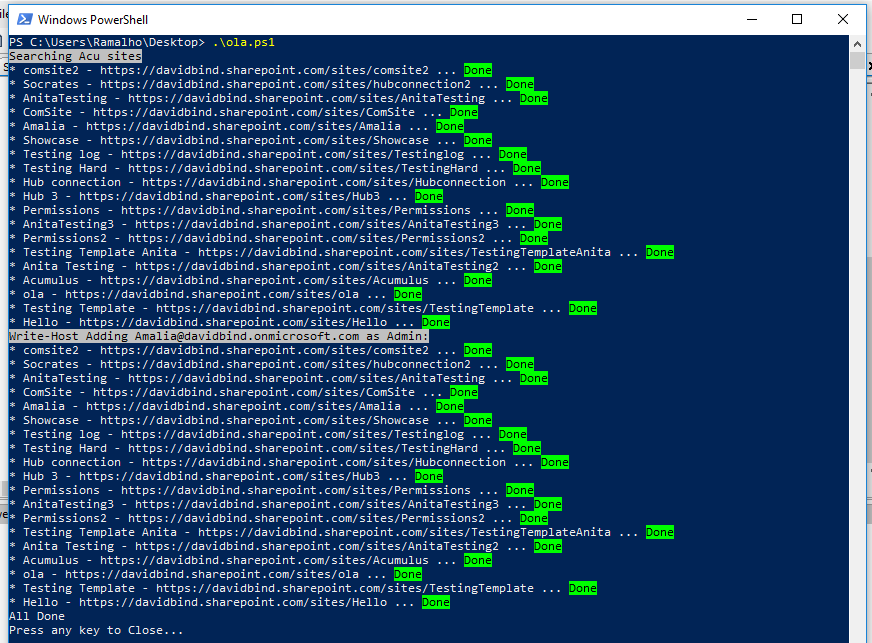

When we are starting or doing development on SharePoint online most of the time, and since the introduction of the Hub Site (hubify), projects are done with this new structure. Adding a new user as admin on each site of the Hub will be very time consuming.  With the PowerShell Script shared here, this task can be done in a few seconds.

In order to run this script successfully, you require Global SharePoint administrator rights. Furthermore, a site belonging to the Hub needs to be added, as well as the email of the person to be added as an admin on your Hub.

Make sure that you also have all the SharePoint Online Management Shell installed on your desktop. You can open your PowerShell as an Administrator and paste the next line to install all the required cmdlets.

```
 Install-Module -Name Microsoft.Online.SharePoint.PowerShell
```

The following Power Shell script will make a user an admin of your Hub (replace the required values).

```
$adminCenter = "https://contoso-admin.sharepoint.com" #SharePoint admin center
$hubSite     = "https://contoso.sharepoint.com/sites/hubcontonso" #Hub Site root
$username    = "contoso@contoso.com" #Your email
$password    = "password" #Your password
$adminEmail  = "contosoAdmin@contoso.com" #New Admin
$encpassword = convertto-securestring -String $password -AsPlainText -Force
$cred = new-object -typename System.Management.Automation.PSCredential -argumentlist $username, $encpassword
Connect-SPOService -Url $adminCenter -Credential $cred
$hub = Get-SPOHubSite $hubSite
$sites = Get-SPOSite -Limit All
$sitesFromHub = New-Object System.Collections.ArrayList
​Write-Host ("Searching {0} sites" -f $hub.Title) -BackgroundColor Gray -ForegroundColor Black
foreach ($site in $sites){
       try{
              $hubSiteID = Get-SPOHubSite $site.Url
              if($hubSiteID.ID -eq $hub.ID){
                    Write-Host ("* {0} - {1} ... " -f $site.Title, $site.Url) -NoNewline
                    $sitesFromHub.add($site) | Out-Null
                    Write-Host "Done" -BackgroundColor Green -ForegroundColor Black
              }
       }
       catch{
              continue
       }
}
Write-Host Write-Host ("Adding {0} as Admin:" -f $adminEmail) -BackgroundColor Gray -ForegroundColor Black
foreach ($hubSiteAssociated in $sitesFromHub){
Write-Host ("* {0} - {1} ... " -f $hubSiteAssociated.Title, $hubSiteAssociated.Url) -NoNewline
try{   
       Set-SPOUser -Site $hubSiteAssociated -LoginName $adminEmail -IsSiteCollectionAdmin $true | Out-Null
       Write-Host "Done" -BackgroundColor Green -ForegroundColor Black
}
catch{
       Write-Host "No Permissions" -ForegroundColor Black -BackgroundColor Red
 }
}
Write-Host "All Done"
Write-Host "Press any key to Close..."
$Host.UI.RawUI.ReadKey("NoEcho,IncludeKeyDown") 
```



**Conclusion**

This script will add the user as an admin on the SharePoint sites that are associated with the Hub. This script can be useful when you're developing the Hub sites and keeping the content updated on SharePoint sites.


**David Ramalho** <br />
SharePoint Developer at BindTuning 
 
import LayoutNumber from '../../../components/layout-article'
export default LayoutNumber
