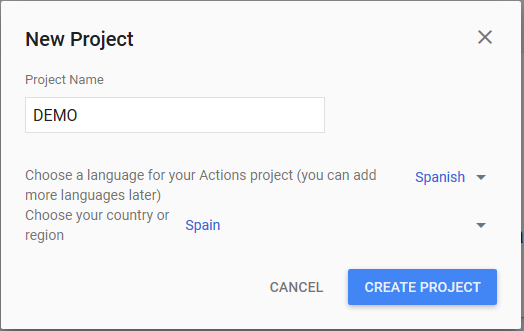
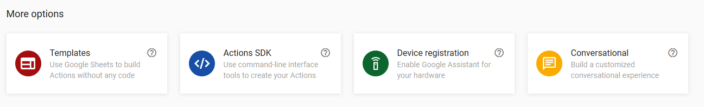
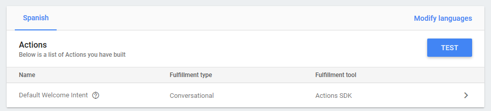

En el anterior artículo vimos cómo era la estructura de un asistente virtual, de que partes estaba formado, recuerda que todos tienen una estructura similar. Te voy a ser sincero, la idea era que en este artículo te iba a enseñar cómo hacer que Dialogflow consultase a tu API y empezar a crear el bot, pero como yo no soy ningún genio y también estoy en proceso de aprendizaje me he estado pegando con Dialogflow hasta que llegué a un punto en el que rompí nuestra relación. Te explico, Google nos dice que la forma de trabajar es la que os conté en el otro artículo, Google Assistant se conecta a Dialogflow y nosotros le indicamos a Dialogflow que en ciertos puntos llame a nuestro endpoint (webhook) para desarrollar más una intención. Google también nos dice que nos brinda todas las herramientas necesarias, nos da ejemplos y nos da el Dialogflow SDK en un montón de lenguajes:

- Node.js
- Python
- Java
- Go
- Ruby
- C#
- PHP


Hasta aquí todo pintaba bien, los ejemplos solo los dan en Node.js y Java, pero bueno, no tiene que ser muy distinto para C#... ¡ERROR! Una vez me puse a desarrollar me di cuenta de que solo proporcionan un SDK real para Node.js y Java, el resto son estructuras de clases para deserializar el *request* que llega de Dialogflow y el *response* que tendremos que enviar, puede parecer interesante, pero no lo es debido a que no contempla ninguna de las reglas que tiene la API, por ejemplo este SDK no controla que nuestro primer mensaje en el response sea del tipo "SimpleResponse" como indica su documentación, tampoco ofrece soporte para poder usar las *built-in intents* del sistema, tenemos un problema.

Como es open source podemos pensar en hacerlo nosotros y hacer un pull request, pero ya lo dicen los archivos que podemos ver en el GitHub[\[1\]](file:///C:/CompartiMOSS/Asistentes%20con%20.net%20-%20Parte%20II%20%28gactions%29%20-%20Diego%20Zapico.docx#_ftn1) estos ficheros son autogenerados desde las especificaciones de la API y en futuros cambios se dañara todo. Esto solo me dejaba una salida (Do It Yourself), así que manos a la obra.

Como comenté más arriba lo interesante es poder acceder a las *built-in* ya que son necesarias para cosas como pedir los datos del usuario, no hay otra forma a no ser que se los pidas directamente al usuario, pero te podría mentir y no creo que sea la forma adecuada. Llegados a este punto empecé a tener problemas, la documentación no parece actualizada en todos los puntos, algunas respuestas desde Dialogflow no tienen ningún mensaje del error, se limitan a un "Malformed Response" y no estaba avanzando correctamente. Tocaba tomar un nuevo rumbo y volví a investigar.

Aquí descubrí "gactions CLI", la interfaz en línea de comandos para proyectos en Actions. Se encuentra disponible para Windows, Mac y Linux y sin duda es el mejor camino si quieres hacer un bot sin emplear Dialogflow como NLP (Natural Language Processing). Y te podrías preguntar "Diego ¿Y por qué no lo hiciste con Java o NodeJS?", yo porque soy raro y quería usar LUIS[\[2\]](file:///C:/CompartiMOSS/Asistentes%20con%20.net%20-%20Parte%20II%20%28gactions%29%20-%20Diego%20Zapico.docx#_ftn2).
 Volviendo a *gactions* el uso en Windows es muy sencillo, descargamos el .exe desde la web de la documentación[\[3\]](file:///C:/CompartiMOSS/Asistentes%20con%20.net%20-%20Parte%20II%20%28gactions%29%20-%20Diego%20Zapico.docx#_ftn3) y lanzamos el comando "gactions init" para crear el fichero action.json que necesitaremos luego para enviar a Google Actions la configuración del proyecto.

Este action.json tendrá la siguiente estructura mínima:

```
{  "actions": [    {      "description": "Default Welcome Intent",      "name": "MAIN",      "fulfillment": {        "conversationName": "{PROJECT-NAME}"      },      "intent": {        "name": "actions.intent.MAIN",        "trigger":{          "queryPatterns":[            "talk to DEMO"          ]        }      }    }     ],  "conversations": {    "{PROJECT-NAME}": {      "name": "{PROJECT-NAME}",      "url": "{URL-ENDPOINT}",      "fulfillmentApiVersion":2    }  }}​
```

En este json indicaremos los actions con los que contara nuestra Action (menuda redundancia en los nombres), un Google Action puede tener distintos actions, por ejemplo, para cada idioma. En este caso se indica un action built-in llamado "actions.intent.MAIN" que corresponde a la intención de llamar o iniciar un Action, con el mensaje "talk to DEMO". Posteriormente indicamos cual será el endpoint del Action y aquí está el punto interesante, si registramos el action en la web solo nos permitirá registrar un endpoint de Dialogflow, pero al hacerlo con gactions podremos registrar otro endpoint (nuestra API en Azure, por ejemplo) y olvidarnos de Dialogflow.

Como dije en esta serie Dialogflow no nos aporta nada porque mi intención es usar LUIS como servicio NLP, pero podrías usar Dialogflow como NLP y usar .net para extender, por ejemplos para consultar servicios como el tiempo, una API personal de stock… pero repito que la idea es abstraernos completamente de servicios externos y tener la mínima dependencia posible de la plataforma.

El fichero no tiene por qué llamarse "action", una buena práctica es indicar el idioma del action, en este caso podría ser "action.es.json".

Ya tenemos nuestro fichero actions.json, pero primero debemos de crear un Actions en la "Actions on Google console" en la dirección [https://console.actions.google.com](https://console.actions.google.com/) (Nota**:** las cuentas empresariales de GSuite pueden tener limitaciones a la hora de probar o desplegar Actions), crear un Actions es tan sencillo como ponerle un nombre e indicar un idioma inicial y tu región.



Después te dan varios ejemplos de plantillas que puedes usar, pero nosotros vamos a indicar que usaremos el "Actions SDK" (que te recuerdo que no dan para C#, pero ya te diré lo que vamos a hacer).



Aquí ya te habla sobre *gactions* y te enlaza con la documentación.

En la siguiente página nos indica los pasos mínimos que debemos de completar como:

- Indicar como se invocará nuestra Action.
- Construir Actions.
- Probarlo en el simulador.
- Pasos para desplegar en producción.


Los dos primeros puntos lo haremos con el fichero action.json. Nos dirigimos a "Project settings" (la interfaz está en inglés) y necesitamos nuestro "Project ID" para gactions.

Volvemos a gactions.exe y usaremos el comando:

gactions update --action\_package PACKAGE\_NAME --project PROJECT\_ID

Donde "PACKAGE\_NAME" es el nombre de nuestro action.json (o la ruta si no está en la misma carpeta). Gactions nos pedirá acceso para terceros en nuestra cuenta de Actions on Google a través de una URL para autentificarnos y realizará la subida del fichero, si hubiese cualquier error con el json nos lo indicará y en el momento podremos ver en la web como se han creado los actions que pusiésemos en el json.



Ahora ya tenemos nuestro Assistant haciendo llamadas directamente a nuestra API, esto es válido para usar con cualquier lenguaje, incluso podrías usar VB.NET si quisieras.

En el próximo artículo vamos a recibir las llamadas desde Assistant y ver la estructura de la información que recibimos.


**Diego Zapico** <br />
@dzapic0 <br />
Desarrollador en Encamina <br />

[\[1\]](file:///C:/CompartiMOSS/Asistentes%20con%20.net%20-%20Parte%20II%20%28gactions%29%20-%20Diego%20Zapico.docx#_ftnref1) https://github.com/googleapis/google-cloud-dotnet/tree/master/apis/Google.Cloud.Dialogflow.V2

[\[2\]](file:///C:/CompartiMOSS/Asistentes%20con%20.net%20-%20Parte%20II%20%28gactions%29%20-%20Diego%20Zapico.docx#_ftnref2) https://www.luis.ai/home

[\[3\]](file:///C:/CompartiMOSS/Asistentes%20con%20.net%20-%20Parte%20II%20%28gactions%29%20-%20Diego%20Zapico.docx#_ftnref3) https://developers.google.com/actions/tools/gactions-cli 
 
import LayoutNumber from '../../../components/layout-article'
export default LayoutNumber
