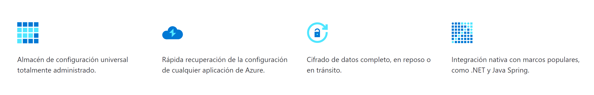
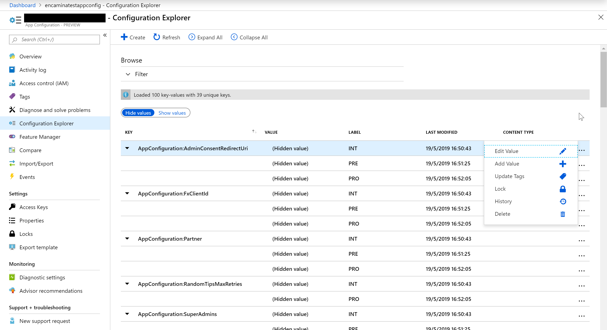
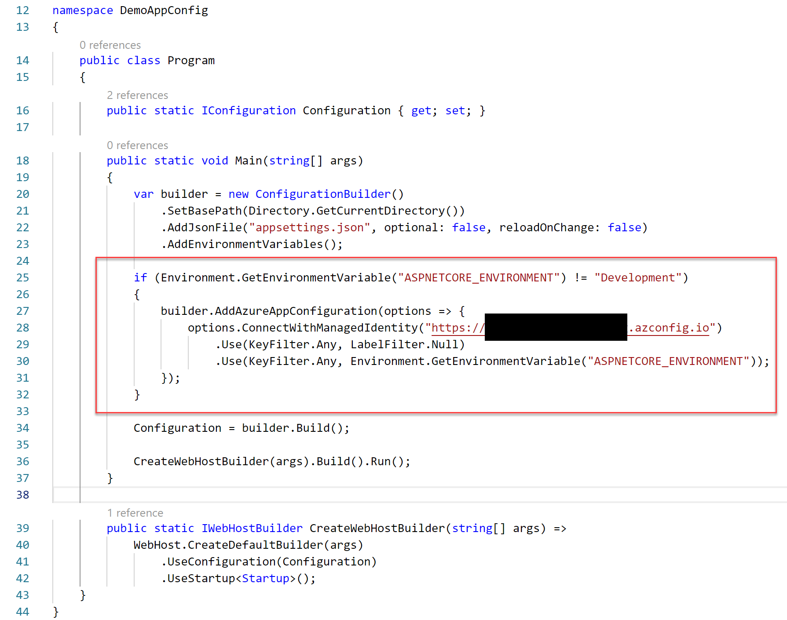
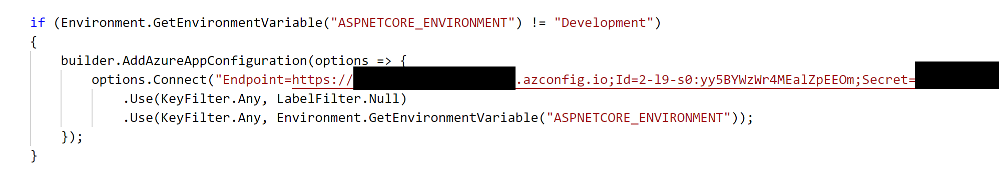

import ArticleHeader from '../../../components/article-header'

<ArticleHeader frontmatter={props.pageContext.frontmatter} />

​Microsoft sigue invirtiendo en Azure con nuevos servicios que ayudan, en este caso, a gobernar las configuraciones de nuestras aplicaciones. App Configuration es un nuevo servicio que nos permite almacenar los parámetros de nuestras aplicaciones de una forma rápida y escalable. Un servicio optimizado para separar totalmente la configuración del código que gestiona los diferentes pares de clave-valor que usamos en las aplicaciones junto con funcionalidades extras de etiquetado, versionado en el tiempo, seguridad basada en identidades administradas de servicios y/o encriptación en transporte y en almacenamiento.

**Configuration Explorer**

Cuando accedemos al servicio, el explorador de configuración ofrece una interfaz jerárquica para administrar todas las configuraciones que hemos creado.

La jerarquía se construye usando las etiquetas (*LABEL*) que podemos asociar a cada una de las claves que creamos, con esto, podemos tener diferentes configuraciones para cada par de clave-valor, por ejemplo, para representar los diferentes valores que podamos tener por entorno de ejecución, Integración, Preproducción y Producción, pero tenemos la libertad de gestionar esas etiquetas como necesitemos, otro ejemplo podría ser usarla para diferenciar los valores en las diferentes regiones geográficas de Azure donde ejecutamos la aplicaciones, North Europe, West Europe, West US, …

**Librerías de cliente**

Para usar el servicio tenemos diferentes librerías, en función del tipo de aplicación que estamos desarrollando:

| **Framework** | **Como conectar** | **Librearía** |
| --- | --- | --- |
| **.NET Core and ASP.NET Core** | Proveedor de App Configuration para .NET Core | Microsoft.Extensions.Configuration.AzureAppConfiguration [https://www.nuget.org/packages/Microsoft.Extensions.Configuration.AzureAppConfiguration](https&#58;//www.nuget.org/packages/Microsoft.Extensions.Configuration.AzureAppConfiguration) |
| **.NET and ASP.NET** | Constructor de App Configuration para .NET | Microsoft.Configuration.ConfigurationBuilders.AzureAppConfiguration [https://www.nuget.org/packages/Microsoft.Configuration.ConfigurationBuilders.AzureAppConfiguration](https&#58;//www.nuget.org/packages/Microsoft.Configuration.ConfigurationBuilders.AzureAppConfiguration) |
| **Java Spring** | Cliente de App Configuration para Spring Cloud | spring-cloud-starter-azure-appconfiguration-config [https://mvnrepository.com/artifact/com.microsoft.azure/spring-cloud-starter-azure-appconfiguration-config](https&#58;//mvnrepository.com/artifact/com.microsoft.azure/spring-cloud-starter-azure-appconfiguration-config) |
| **Otros** | API REST | [https://github.com/Azure/AppConfiguration#rest-api-reference](https&#58;//github.com/Azure/AppConfiguration#rest-api-reference) |

**Cómo usarlo en ASP.NET Core**

Una vez que hemos creado el servicio y creamos las claves, bien manualmente o bien con el proceso de importación, lo primero que tenemos que hacer para usarlo en nuestra aplicación ASP.NET Core es instalar el paquete Nuget de configuración.

dotnet add package Microsoft.Extensions.Configuration.AzureAppConfiguration --version 1.0.0-preview-008520001

Ahora modificamos el proceso de carga de nuestra aplicación para que use el servicio de App Configuration cuando no estamos en el entorno de desarrollo (*Development*).

Hay que tener en cuenta que, en el ejemplo anterior, el método de autenticación del servicio de App Configuración usa una identidad administrada del servicio de Azure donde se va a ejecutar la aplicación. En la siguiente imagen, vemos cómo podemos realizar esta conexión usando una clave de acceso del servicio App Configuration.

El método Use nos permite realizar filtros sobre las claves que son accesibles por la aplicación, en nuestro caso, obtenemos todas las claves que no tienen etiquetas junto a las que pertenecen al valor de la variable de nuestro entorno, por ejemplo, INT, PRE o PRO.

El resto de nuestro código básicamente es el mismo, si ya estamos usando la implementación de .NET Core IConfiguration. Por ejemplo, en la siguiente línea de código, leemos una sección de configuración llamada DevOpsTeams que se almacenará en el contenedor de dependencias.

services.Configure&lt;Models.DevOpsTeamConfig&gt;(Configuration.GetSection("DevOpsTeam"));

**Conclusiones**

Con Azure App Configuration centralizamos las configuraciones de las aplicaciones, además de añadir seguridad al acceso a la mismas, conseguimos tener una herramienta para administrar las claves de nuestras aplicaciones.

**Alberto Diaz Martin**  
 MVP Azure  
 adiazcan@hotmail.com  
 @adiazcan  
[http://blogs.encamina.com/por-una-nube-sostenible/](http&#58;//blogs.encamina.com/por-una-nube-sostenible/)