Azure Digital Twins es un nuevo servicio de Azure con el que podremos que crea modelos completos del entorno físico, pudiendo crear grafos de inteligencia espacial para modelar las relaciones y las interacciones entre personas, espacios y dispositivos.

En este articulo nos centraremos en como poder crear un nuevo servicio de Azure Digital Twins a través de una suscripción de Azure, consultar los datos de los sensores simulados y comprobar si la habitación esta disponible para su uso usando los datos extraídos de los sensores.

Para la creación de la instancia de Digital Twins en nuestra suscripción de Azure deberemos de entrar en el portal de Azure -&gt; Crear un Recurso -&gt; Digital Twins

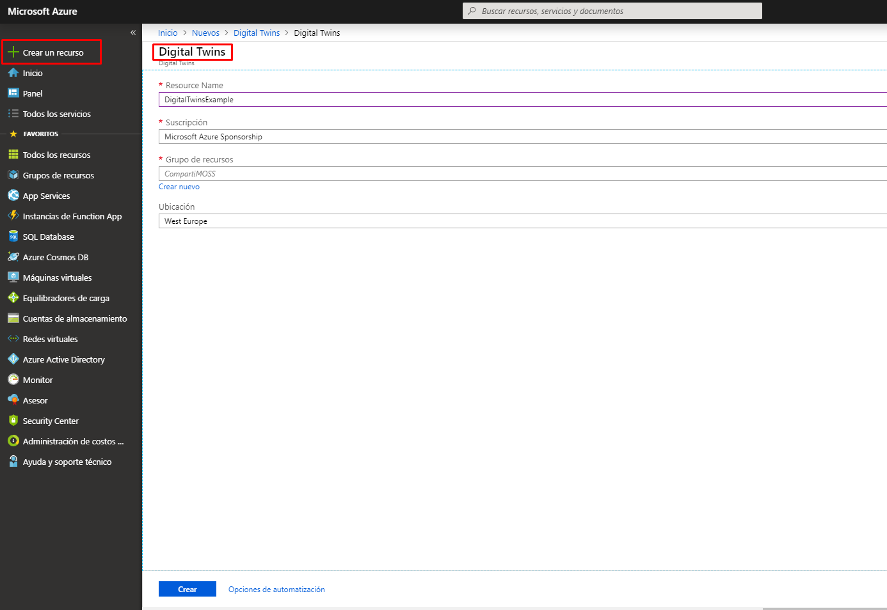

Tened en cuenta que solo se puede crear una única instancia de Digital Twins por suscripción.

Una vez que ya tenemos aprovisionada la instancia del servicio Digital Twins podremos ver la siguiente información general, donde encontraremos la url del Management API. Desde esta url nos mostrará todas las capacidades que ha aprovisionado el servicio de Digital Twins y que podremos usar.

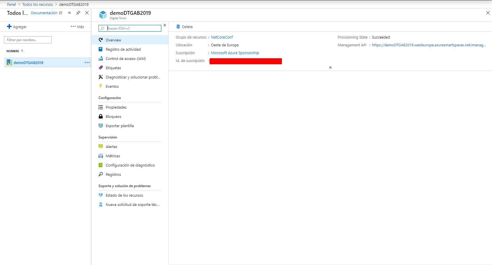

La url que nos muestra por defecto el servicio es la que contiene toda la información de la API REST de Azure Digital Twins que se aplica a la instancia, normalmente suele tener el siguiente formato: [**https://yourDigitalTwinsName.yourLocation.azuresmartspaces.net/management/swagger**](https://yourdigitaltwinsname.yourlocation.azuresmartspaces.net/management/swagger)

Sin embargo, para poder tener acceso a la instancia del servicio deberemos de modificar la url: [**https://yourDigitalTwinsName.yourLocation.azuresmartspaces.net/management/api/v1.0/**](https://yourdigitaltwinsname.yourlocation.azuresmartspaces.net/management/api/v1.0/)

(esta url podemos guardarla en un fichero de texto para poder usarlo en los pasos posteriores)

Ahora deberemos de definir los permisos para nuestra instancia de Digital Twins, por lo que deberemos de entrar en el portal de Azure -&gt; Registros de Aplicaciones -&gt; Nuevo registro de aplicaciones.

Le asignaremos un nombre, seleccionaremos para este ejemplo la opción solo las cuentas de este directorio organizativo del aparatado Tipos de Cuentas compatibles he informaremos la url de nuestra web. Por último, registraremos la aplicación.

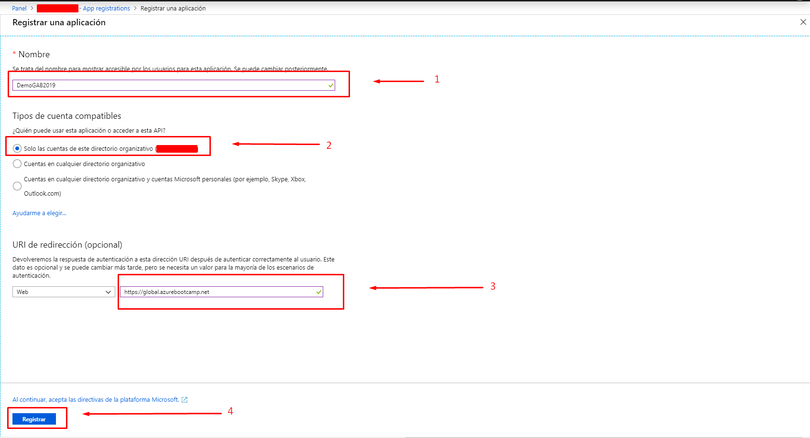

Una vez que hemos registrado la aplicación podemos revisar en la información general el id de aplicación, Id de directorio (esta información podemos guardarla en un fichero de texto para poder usarlo en los pasos posteriores para provisionar y consultar los datos de la instancia). Debemos irnos al apartado Permisos de API y añadir permisos.

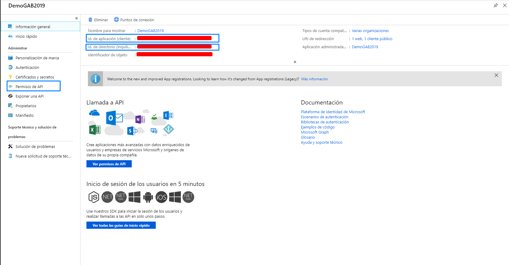

Muy importante que cuando añadamos el permiso busquemos en API usadas en mi organización con el nombre Azure Digital Twins. Una vez seleccionado le daremos los permisos de Lectura/Escritura y para finalizar deberemos de Conceder Permisos.

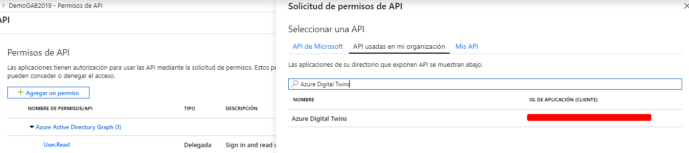

Por último, deberemos de ir a portal de Azure -&gt; Azure Active Directory -&gt; Propiedades donde podremos consultar el Id de Directorio (esta información podemos guardarla en un fichero de texto para poder usarlo en los pasos posteriores).

Con estos pasos ya tenemos provisionado nuestro servicio de Azure Digital Twins para poder trabajar con él. Ahora vamos a usar un ejemplo ya preparado por el equipo de Microsoft que podréis descargar desde GitHub en el siguiente enlace ([https://github.com/Azure-Samples/digital-twins-samples-csharp/](https://github.com/Azure-Samples/digital-twins-samples-csharp/)) para poder "provisionar una estructura completa".

Una vez que nos descarguemos el ejemplo y lo hayamos descomprimido en una carpeta en nuestro sistema, por ejemplo C:\samples\digital-twins-sample, os recomendaría abrirlo con Visual Studio Code y de esta forma tener una visión del proyecto además de la terminal en una sola ventana.

Cuando entramos en la carpeta descomprimida observamos dos proyectos netcore que son occupancy-quickstart (nos permitirá consultar los datos en tiempo real) y device-connectivity (nos permitirá aprovisionar nuestro servicio con sensores simulados).

Nos centraremos primero en el aprovisionamiento, para ello recordad que en los pasos anteriores os pedía que guardarais cierta información, ahora es el momento de usarla. Iremos a la ruta occupancy-quickstart\src\ appSettings.json

```
{    "AADInstance": "https://login.microsoftonline.com/",    "ClientId": "Id registro aplicación de AD",    "Tenant": "Id del directorio",    "BaseUrl": "Nuestra URL modificada de Azure Digital Twins"}​
```


Una vez guardemos el fichero con los datos solicitados, desde consola realizaremos los siguientes comandos:

- cd occupancy-quickstart\src
- dotnet restore
- dotnet run ProvisionSample


La primera vez que lo hacemos nos pedirá que nos loguemos en una url con un código determinado que se genera aleatoriamente para identificar el servicio. Al ser un servicio que está actualmente en preview se solicitara cada 24h.

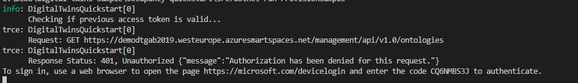

Una vez que hemos autorizado el servicio a través de los pasos anteriores, empezara a generar el aprovisionamiento que se ha definido concretamente para tener más información es en el archivo digital-twins-sample\occupancy-quickstart\src\actions\ provisionSample.yaml

Sabremos que ha finalizado cuando encontremos al final la instrucción "Completed Provisioning" además ahora deberemos de buscar la clave ConnectionString y copiaremos su valor en un archivo de texto para usarlo en el proyecto device-connectivity para poder observar los datos.​

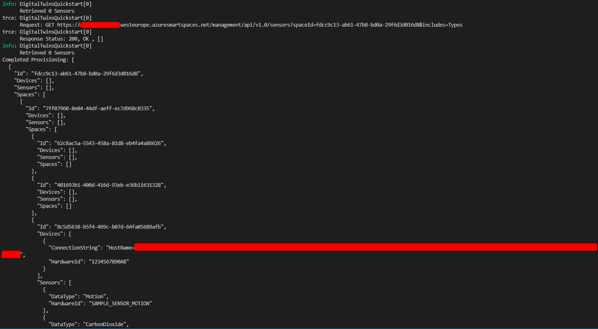

Deberemos de ir al fichero digital-twins-sample\device-connectivity\appsettings.json y copiar el valor que hemos obtenido en el aprovisionamiento del paso anterior, como se puede observar aquí es donde también definimos los dispositivos que queremos observar:

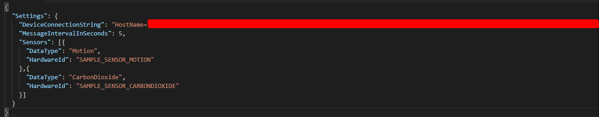

Ahora desde una terminar realizaremos los siguientes comandos:

- cd device-connectivity
- dotnet restore
- dotnet run​


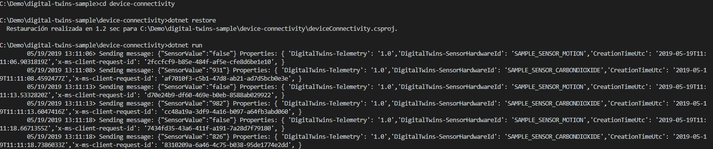

Podemos observar como nos devuelve los resultados del sensor en tiempo real. Para poder tener una visión completa de Azure Digital Twins abrimos una nueva terminal en paralelo y lanzamos los siguientes comandos:

- cd occupancy-quickstart\src
- dotnet run GetAvailableAndFreshSpaces


Si colocamos las dos ventanas en el escritorio podremos ver que en la primera estamos obteniendo los datos en tiempo real de los sensores y en la otra terminal estamos tratando esos datos y mostrándonos los espacios disponibles con aire fresco que tenemos en ese momento. Esta lógica se ha definido en el fichero digital-twins-sample\occupancy-quickstart\src\actions\userDefinedFunctions\availability.js

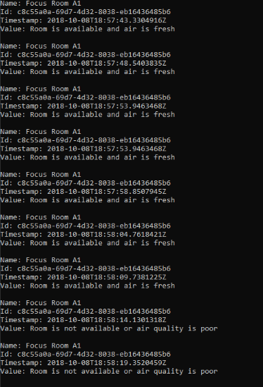

Para poder tener una visión completa de todo los dispositivos, estancias que tenemos aprovisionadas podemos usar un visor de grafos espacial ([https://github.com/Azure/azure-digital-twins-graph-viewer](https://github.com/Azure/azure-digital-twins-graph-viewer)) con el que podremos ver de una forma más visual nuestro aprovisionamiento que hemos realizado en este ejemplo:-

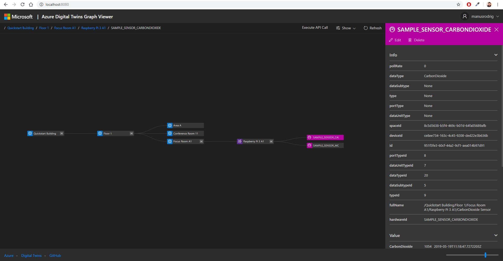

**Conclusiones**

Sinceramente pienso que el nuevo servicio de Azure Digital Twins es muy útil para poder representar el mundo físico y sus muchas relaciones, con ello puede ayudar a simplificar el modelado, procesamiento de datos, control de eventos y el seguimiento de dispositivos IoT. Con ello el poder llevar la transformación digital a las diferentes industrias se puede conseguir de una forma segura, fácil y sobre todo unificada.

Por otro lado, debemos de tener en cuenta que actualmente es un servicio en preview y por tanto tiene algunas limitaciones. Aunque se espera que para final de año se libere completamente.


**Manuel Sánchez Rodríguez** <br />
[Manuss20@gmail.com](mailto:Manuss20@gmail.com) <br />
@manuss20 <br />
 https://manuss20.com 
 
import LayoutNumber from '../../../components/layout-article'
export default LayoutNumber
