import ArticleHeader from '../../../components/article-header'

<ArticleHeader frontmatter={props.pageContext.frontmatter} />


**Orquestando y centralizando eventos con Servicios Serverless de Azure**

Cada vez va a ser más "normal" e incluso "recurrente", que para implementar gran parte de nuestros sistemas tendamos a diseñar piezas que se basen en servicios Serverless. Esto tiene un primer impacto enorme en nuestras decisiones, ya que contra más procesos corramos en Serverless, y en su mayoría de estos casos en segundo plano, deberemos tener un control casi al milímetro tanto de los "eventos" que disparan estos procesos en background, como de retornar el resultado de estos.

¿Qué pasa si un proceso muy potente, casi inexpugnable en cuanto al rendimiento, se detiene, se para o ni siquiera conseguimos arrancarlo?, ¿Cómo se entera la aplicación que hace de interfaz hacia el usuario?

Si decidimos hacer un portal web, que tenga parte de trabajo en procesos Serverless, necesitaremos hacernos preguntas y poner soluciones como las que vamos a ir desarrollando en los siguientes apartados.

**Arquitecturas orientadas a eventos, ¿Qué son?**

Una arquitectura basada en eventos debe tener una visión muy orientada a "conectar" sistemas, servicios o productos, en base a unos eventos que se van produciendo en cada uno de estos "Productores de eventos".

Debemos pensar que un Productor de eventos, va a emitir un evento en base a una acción o suceso, al cual los "Consumidores" van a tener acceso mediante una Suscripción a un evento.

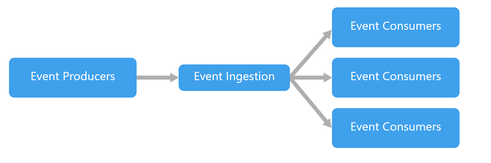

Los eventos tienen que ser enviados / recibidos en tiempo real por los Consumidores, y una característica muy especial de estas arquitecturas es que el sistema que produce el Evento, no tiene que controlar que el Consumidor, reciba el evento, o lo que es lo mismo, el proceso que genera un evento, como puede ser el guardado de un dato en una base de datos, o la subida de un documento a un blob, es 100% independiente al hecho de que el evento se propague y que el consumidor reaccione a estas acciones.

Por esto podemos decir que estas arquitecturas implican "procesos" en segundo plano, y que si no se diseñan de forma correcta, con un control de errores muy exhaustivo, puede llegar a provocar perdida de Eventos, y por lo tanto, procesos no ejecutados, que en muchos casos pueden ser capitales para el usuario.

Modelos de la arquitectura, como generar los eventos

Una arquitectura basada en eventos puede seguir dos posibles modelos:

- ***Modelo Pub/sub:***La infraestructura de la mensajería hace un control de las suscripciones. Cuando se publica un evento, se envía el evento a cada suscriptor. Una vez un evento es enviado, no se puedo volver a reproducir, y los nuevos suscriptores a dicho evento no lo reciben.
- **Modelo Streaming de Eventos:**Los eventos se van "almacenando" en un registro y no se borran. Los eventos sí que llevan un orden, pero los consumidores no se suscriben al flujo de generación de un evento, sino que un cliente accede al registro de eventos, lo lee bajo demanda y es responsable de avanzar su posición en el flujo. La ventaja de este modelo es que cualquier cliente puede unirse en cualquier momento y reproducir eventos pasados.


**Modelos de consumo de un evento, ¿Cómo se comporta el consumidor?**

Por su lado, el consumidor de un evento tiene varias formas de "procesar" un evento generado:

- **Procesamiento sencillo por eventos:**Un evento desencadena una acción inmediatamente en el consumidor. Por ejemplo, un Trigger de un Azure Function cuando se sube un fichero en un Blob Storage.
- **Procesamiento de eventos complejos:**El consumidor procesa una serie de eventos, y este los filtra en busca de patrones o comportamientos requeridos, por ejemplo, la ingesta de datos y el posterior filtro desde Azure Stream Analytics.


**¿Qué características debe tener nuestro sistema para usar esta arquitectura?**

- Hay concurrencia en el consumo de los eventos, es decir varios sistemas o subsitemas necesitan consumir un mismo evento.
- Es un escenario de eventos en "Tiempo real o Retardo Mínimo".
- Procesamiento de eventos complejos
- Gran volumen y alta velocidad de procesamiento


**Ventajas de estas arquitecturas**

- Nos permiten "desvincular" a los sistemas Productores de eventos de los Consumidores.
- Evitamos las integraciones "Punto a punto", y con ello adaptar nuestros desarrollados para acoger a los nuevos consumidores, lo que facilita añadir nuevos sistemas consumidores en nuestra arquitectura.
- Respuesta en tiempo real para cada consumidor a un evento, y de forma concurrente.
- Arquitectura escalable y muy distribuida
- Cada subsistema puede reaccionar de forma diferente a un evento dentro del flujo de ejecución, lo que nos permite "re-interpretar" el flujo bajo demanda.


**¿Qué nos aporta el Serverless en nuestra arquitectura?**

Una vez tenemos claro todo lo que nos aporta una arquitectura basada en eventos, y que tenemos alternativas para plantear nuestros eventos, deberemos ajustar el uso y consumo de nuestros servicios Serverless.

Evidentemente, los servicios Serverless, y en concreto los servicios que nos aporta Azure, nos permiten subir al siguiente nivel de complejidad nuestras arquitecturas, pero ¿Siempre son necesarios incluir un Azure Functions o una Logic App?

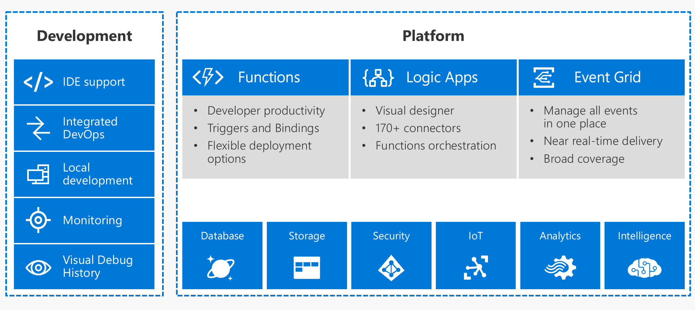

La respuesta es NO, muchas veces podemos mantener nuestros modelos clásicos basadas en aplicaciones Monolíticas, que van a tener el mismo o mejor rendimiento que un servicio desplegado en modo Serverless. Es decir, por ejemplo, un App Service bien escalado en algunos casos, puede sernos más útil e incluso más económico.

Una vez puesto el WARNING encima de la mesa, debo decir que, para una arquitectura basada en eventos, nos van a venir ni que al pelo tanto Azure Functions como Logic App.
Podemos pensar que nuestra arquitectura se puede basar en servicios Serverless, siempre y cuando los procesos a implementar cumplan que:

- Son iniciados por un Evento.
- No tienen definido un límite de ESCALADO.
- No conocemos VOLUMENES de ejecución.
- No conocemos el Nº de Usuarios ni la CONCURRENCIA MÁXIMA.
- Debe funcionar el 99% de los casos.
- No está en ALTA DISPONIBILIDAD.
- Preferiblemente para procesos en background.


Podemos decir entonces que con todo lo anterior, ya tenemos una idea más o menos clara de cuando utilizar arquitecturas basadas en Eventos, y, por otro lado, en que escenarios deberíamos plantear el uso de servicios Serverless, pero ¿Cómo arrancamos el diseño sin volvernos locos?

**Azure Event Grid, el concentrador de eventos**

Siempre que juntemos en nuestros requisitos "Tiempo Real", "Concurrencia", y "Gran Volumen de eventos", no estaría de más pensar en Azure Event Grid.

Para ir situando a este potente servicio de Azure, debemos decir que Event Grid viene a ser un servicio que administra la relación entre los Productores de Eventos y los Consumidores. Pongamos un ejemplo de uso para ver claro donde encajar Event Grid. Imaginemos un escenario en el que dos sistemas esperan a que se suba un fichero a un Blob Storage.

Cada sistema tiene un proceso propio para el re-escalado de imágenes, ya que el primer sistema muestra las imágenes en un Portal Web a una resolución muy grande de pantallas, y el segundo está orientado a re-escalar estas mismas imágenes, pero para una vista móvil.

Estos dos procesos se van a disparar, una vez se suba la imagen al Blob Storage, y en tiempo real cada uno de ellos generará copias de las imágenes y las dejara en un segundo blob que consume tanto la web, como la app móvil.

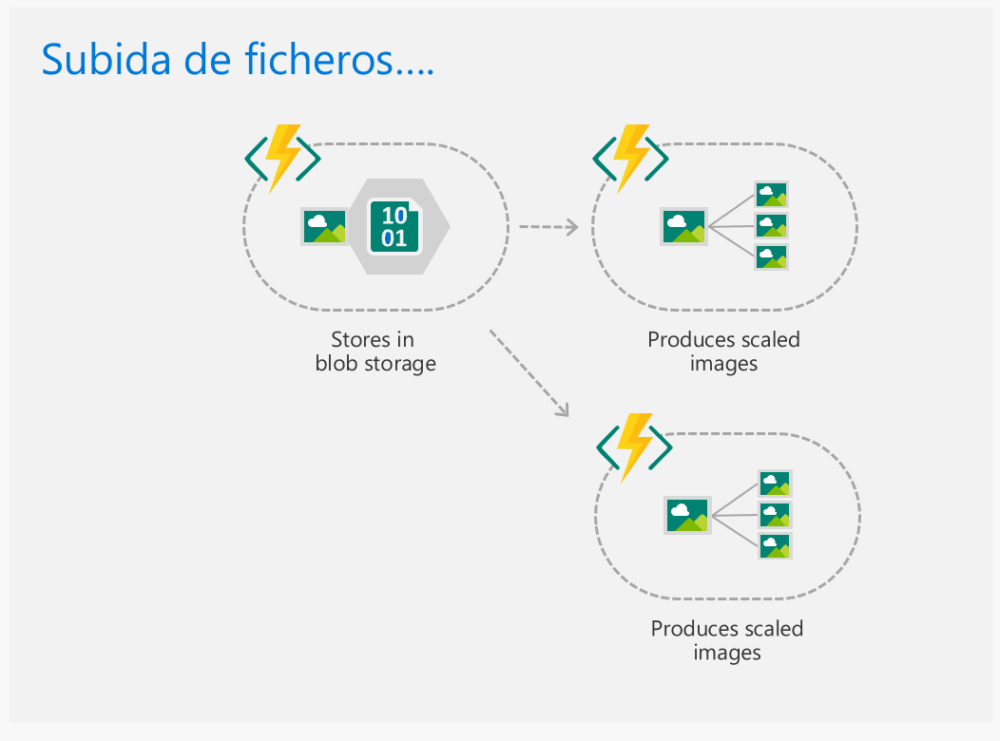

Para cubrir este escenario, sin utilizar Event Grid, necesitaríamos 2 funciones y dos Trigger configurados contra el blob storage de origen. O lo que es lo mismo, 2 eventos independientes, y que funcionen de forma totalmente aislada.

Esto conlleva, llevar una monitorización y una gestión de reintentos individuales para cada proceso, lo que lleva a complicar el mantenimiento y el aseguramiento de los procesos.

Llevar un control de eventos es necesario, para no caer en una micro gestión de estos trigger, y para ello deberíamos tender a una arquitectura basada en Eventos y por Suscripciones a eventos.

Azure Event Grid entre otras cosas, viene a "centralizar todos los eventos", y a gestionar esas suscripciones, por eso decimos que va a hace de PEGAMENTO, entre nuestros Productores o Publicadores de eventos, y los Suscriptores o Consumidores.

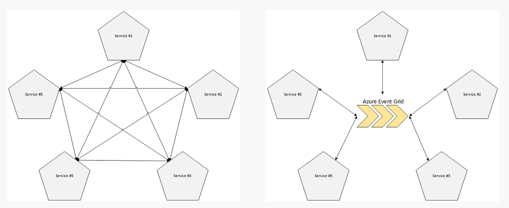

Como vemos muy gráficamente en la imagen anterior, Azure Event Grid, viene a controlar todos esos eventos que hemos ido creando entre nuestros Servicios Consumidores, y el origen de estos Eventos, que en muchos casos pueden ser sistemas de Almacenamiento, Aplicaciones SaaS o Bases de datos.

Conceptos básicos de Azure Event Grid

Para empezar a manejar Azure Event Grid, tenemos que entender varios conceptos básicos del servicio para que nos sea sencillo utilizarlo. Como ya hemos ido viendo con las Arquitecturas basadas en Eventos, este servicio se basa en conectar al Publicador con el Suscriptor vía un evento, y para ello define los siguientes conceptos:

- **Events**: Lo que ha sucedido.
- **Publisher**: Donde ha sucedido el evento, sistema que genera el evento.
- **Topics**: Canal de envío del evento y categorización del evento, por ejemplo, para un Blob 
Storage, **Upload Blob**, es el topic para capturar las subidas de ficheros.
- **Suscriptions**: Como recibimos el evento, por ejemplo, vía Webhook.
- **Handlers**: App o servicio que recibe el evento.


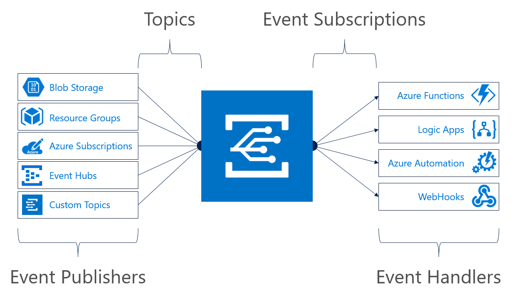

**Características del Servicio**

Además, a estas características debemos sumar que a nivel de rendimiento:

- Siempre disponible.
- Near real-time event delivery.
- Asegura al menos una vez el envío del evento.
- Escalado dinámico.
- Platform agnostic (WebHook).
- Language agnostic (HTTP protocol).
- Enrutado de eventos.

​​Un primer ejemplo, Azure Functions y Blob storage conectados por Event Grid por el portal de Azure

Como la mejor forma de terminar de entender algo, es empezar a probarlo vamos a hacer un ejemplo muy sencillo desde el portal de Azure, para que veamos cómo funciona.
Para ello debemos logarnos en el portal y crear dos servicios:

- **Azure Storage Account:​**

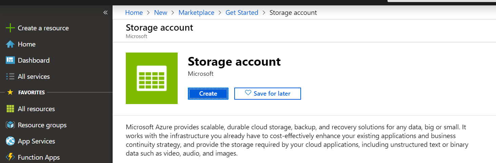

Crearemos el servicio en un grupo de recursos nuevo llamado CompartimossEventGrid, y configuramos el servicio de la siguiente forma:

    1. Storage Account Name: storageegdemo
    2. Location: West Europe
    3. Performance: Standard
    4. Account Kind: Storage V2
    5. Replication: RA-GRS
    6. Acces tier: Host


Dejamos las configuraciones de red a por defecto, y confirmamos la creación del servicio.

**Azure Funcions App:**

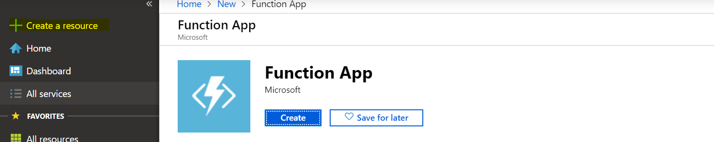

Crearemos un servicio Azure Functions App, en el grupo de recursos CompartimossEventGrid, con el nombre fappeventgriddemo, tal y como se ve en la siguiente imagen.

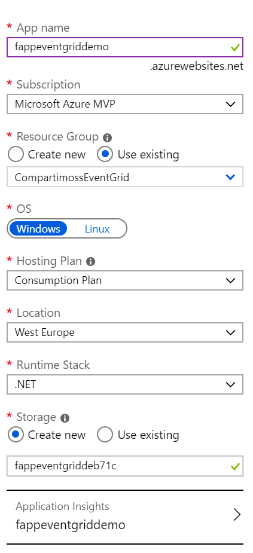

Si todo ha ido de forma correcta, al acceder al grupo de recursos deberíamos tener los siguientes servicios:

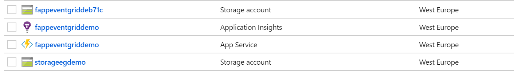

**Crear una función y conectarla vía Event Grid al Blob**

Una vez creado los servicios, accedemos al servicio fappeventgriddemo, y creamos una función de la siguiente forma:

1. Seleccionamos Nueva Función, en el apartado de Funciones.

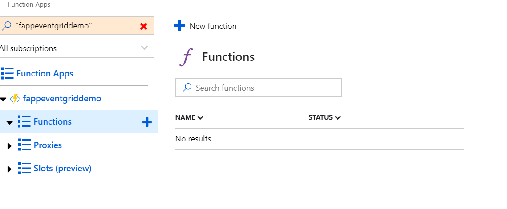

2. Este segundo punto es importante, ya que necesitamos escoger el desencadenador de la nueva Función, y escogeremos Azure Event Grid Trigger.

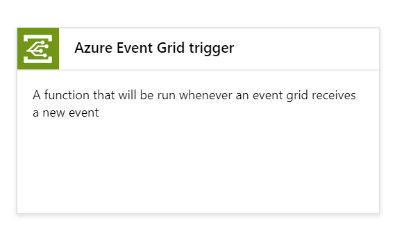

3. Necesitaremos instalar la extensión Microsoft.Azure.WebJobs.Extensions.EventGrid para que funcione el binding de Event Grid, este proceso solo lo deberemos hacer con la primera Función de cada servicio Azure Functions.​

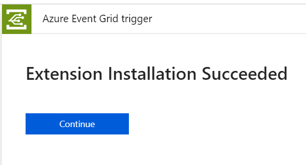

4. Una vez terminada la instalación, introducimos como nombre de la función EventGridTriggerDemo, y pulsamos en crear. Cuando el proceso de creación termina en pocos segundos, podremos ver el contenido del fichero run.csx, donde podremos ver el código que se ha autogenerado:

```
#r "Microsoft.Azure.EventGrid"
using Microsoft.Azure.EventGrid.Models;
public static void Run(EventGridEvent eventGridEvent, ILogger log)
{    
    log.LogInformation(eventGridEvent.Data.ToString());
}
```

Sin analizamos el código, tenemos que ver que la función espera un objeto del tipo EventGridEvent, que contiene toda la información del evento. Podemos revisar la definición de la clase en el siguiente [enlace](https&#58;//docs.microsoft.com/en-us/dotnet/api/microsoft.azure.eventgrid.models.eventgridevent?view=azure-dotnet).

La función lo que hace es un print por pantalla del evento recibido, por lo que cuando enlacemos con el blob storage esta función podremos ver con más detalle el contenido de un evento, y así analizar la clase EventGridEvent

Una vez el código nos permite recibir eventos de event grid, necesitamos crear la suscripción de Event Grid, como veremos a continuación.

**Creando la suscripción**

Lo primero que debemos hacer es seleccionar la función recién creada, y seleccionar "Add Event Subscription", que encontramos en el fichero run.csx. Este enlace nos lleva al menú de Event Grid, que nos permite crear una suscripción y que deberemos configurar de la siguiente forma:

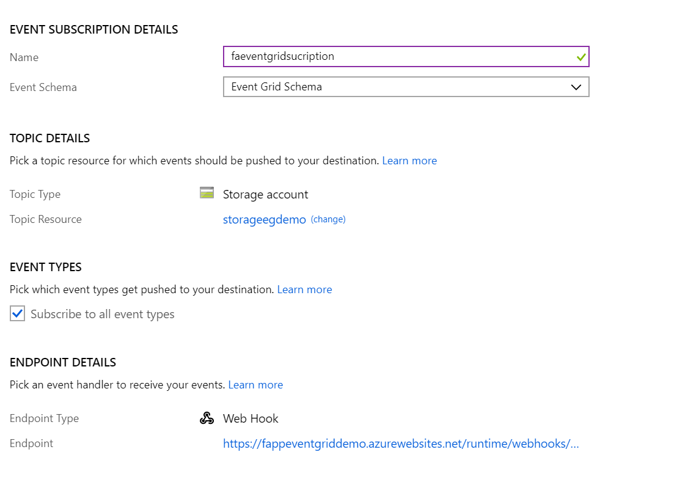

Si analizamos la imagen, veremos que necesitamos dar un nombre a la suscripción, y elegir un esquema que en este caso usaremos el básico de Event Grid para que nos cuadre con la clase EventGridEvent que hemos nombrado en la creación de la función.

Seleccionamos por otro lado el Topic, que no deja de ser el origen del evento, para ello seleccionamos un tipo Storage Account, y seleccionamos la cuenta creada al principio del ejemplo.

Seleccionamos el tipo de Evento, que en caso de un blob pueden ser Blob Created y Blob Deleted, podemos elegir el que más nos guste, en mi caso he seleccionado todos.

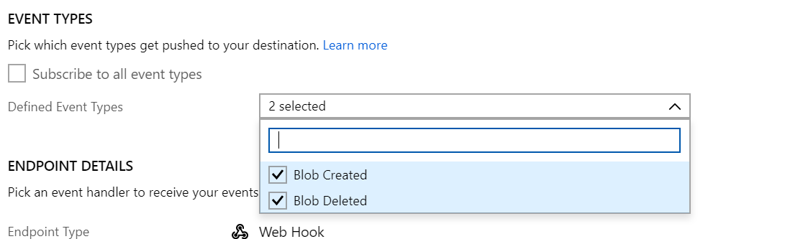

Por último, debemos ver que se nos autogenera una dirección Webhook, que apunta a nuestra función, y que hará de cliente para recibir en tiempo real todos nuestros eventos.

Vamos a omitir en este ejemplo el apartado de Filtros y Características extras que nos aporta una suscripción event grid, que poco nos aporta para un primer ejemplo sencillo.

**Probando la suscripción subiendo una imagen al blob**

Para poder probar la suscripción, lo primero vamos a crear un blob dentro de la cuenta storagedegdemo, para hacer saltar a Event Grid. Seleccionamos el servicio de almacenamiento, y en el listado de servicios seleccionamos blob, donde seleccionaremos Crear Container.

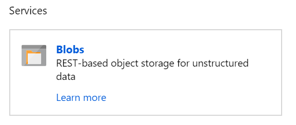

Una vez creado el contenedor, vamos a abrir en una segunda pestaña la Azure Function que hemos conectado con este servicio de blob. Si seleccionamos la función y justo debajo del código, seleccionamos el tab LOG, en el que podremos ver en tiempo real el imprimir del evento que tiene el código de la función.

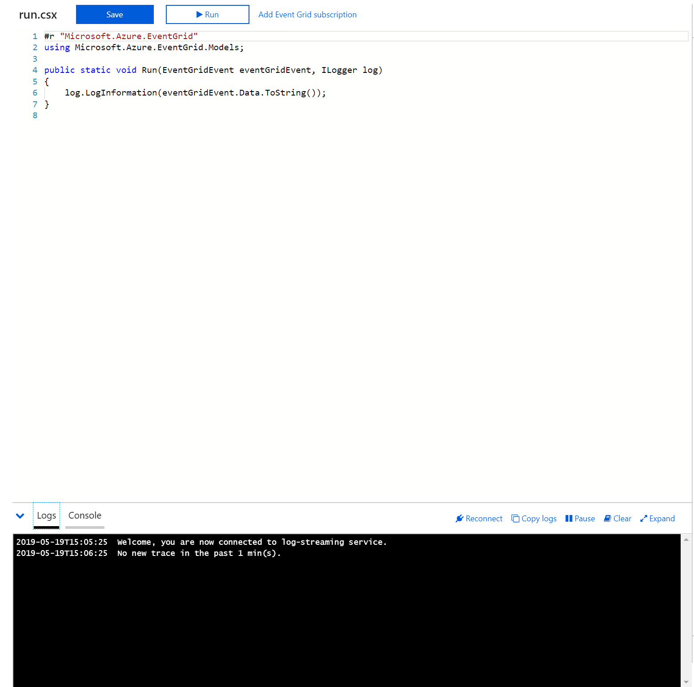

Volviendo al blob, seleccionamos el blob creado y hacemos un Upload de cualquier fichero que tengamos en nuestra maquina local, para probar nuestra suscripción de Event Grid.

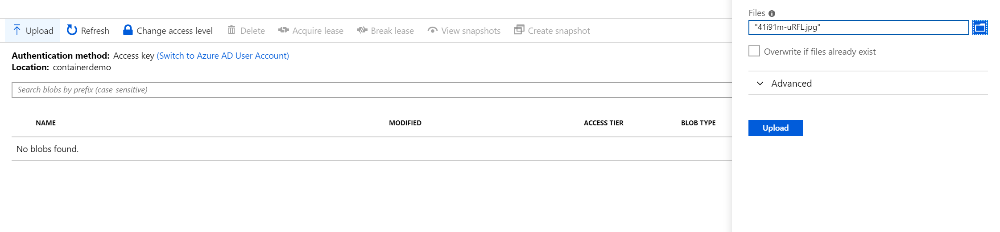

Una vez que subamos el fichero, en tiempo real, en la consola de Log de nuestra function veremos que se ha lanzado una ejecución, y en consola de log podremos ver todos los datos del Evento subir fichero a un blob.

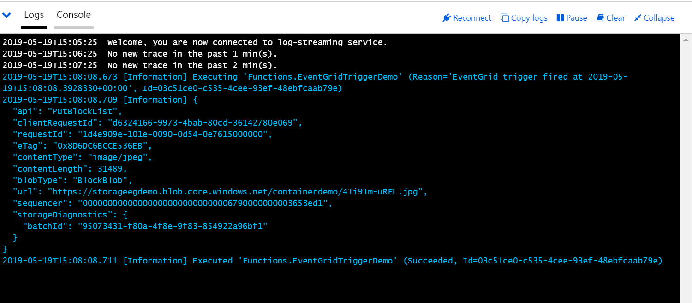

A partir de aquí ya tenemos conectado el blob a nuestra Azure Function, y podemos añadir la lógica de negocio necesaria para tratar este evento.

Si analizamos los datos, vemos que recibimos en un JSON los datos relativos al evento, y por destacar:

- Recibimos en un campo URL el fichero que se ha subido.
- Content-type: El tipo de fichero que se ha subido, en este caso yo he subido una imagen.
- Api: nos indica que se ha realizado un put de un fichero


Con estos datos, podemos hacernos a una idea de que fichero se ha subido, y si fuera necesario podríamos transformar la imagen subida o enviársela a un tercer sistema.

**Azure Event Grid, un servicio para tener muy en cuenta**

Aunque lo hemos visto muy por encima, porque a día de hoy Event Grid está muy evolucionado y nos permite hacer sistemas de suscripción muy complejas para arquitecturas basadas en Eventos, con este artículo nos podemos hacer a la idea de cómo empezar a trabajar con Event Grid, y sobre todo la necesidad o no de usar tanto Event Grid como por ejemplo Azure Function.

Lo más importante cuando diseñamos arquitecturas, es tener 100% claro lo que necesitamos y si los servicios que estamos utilizando son los más idóneos. Nunca debemos utilizar servicios porque nos parezcan potentes o novedosos, a veces arquitecturas más humildes nos pueden llevar al éxito de igual o de mejor forma.

En cualquier caso, este tipo de arquitecturas son muy potentes, muy interesantes para Organizaciones que tengan muchos sistemas distribuidos, y necesidad de conectarlos en tiempo real. En siguientes artículos veremos cómo estos servicios Serverless se convierten en imprescindibles por ejemplo para extender Office 365 tanto para Dynamics como para Sharepoint, ya que Event Grid se convierte en nuestra puerta de entrada a todo lo que pasa en nuestras aplicaciones.

Sin duda tenemos las herramientas, aun necesitamos la pausa para poner todo en orden, y combinar nuestro Serverless con otros servicios como Azure Search o Azure Service Bus, y construir sistemas escalables, seguros concurrentes, y sobre todo muy rápidos; *"el tiempo real es una realidad hoy día".*


**Sergio Hernandez Mancebo** <br />
Principal Team Leader en Encamina | Azure MVP <br />
@shmancebo