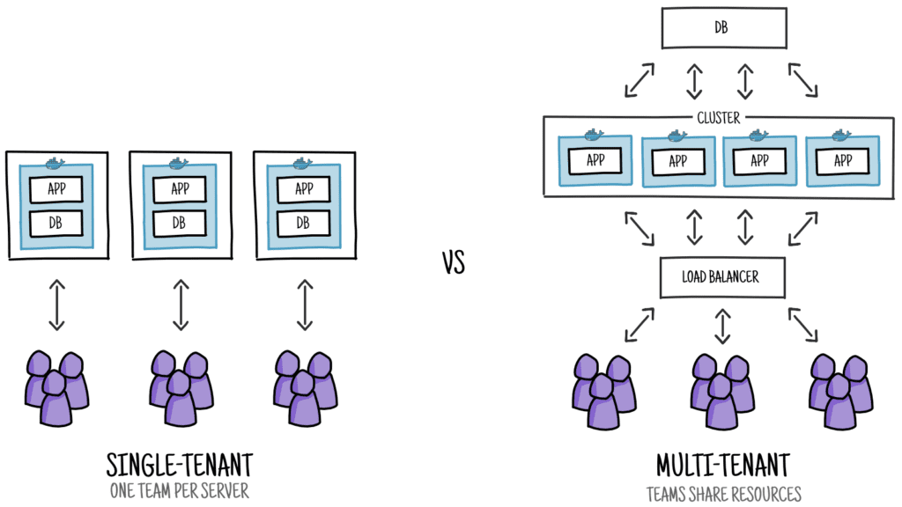
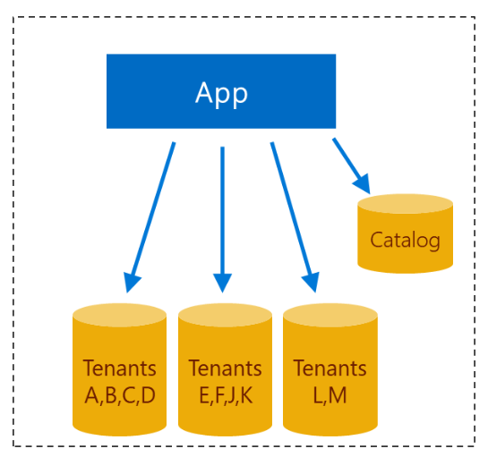
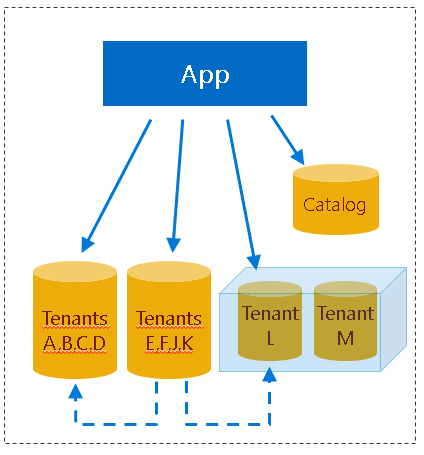

**Glosario de términos**

Antes de empezar a desglosar todos los aspectos que se necesitan para implementar una aplicación multitenant,  nos centraremos en explicar un glosario de términos muy importante para poder entender este tipo de arquitectura.

- **Tenant =&gt;**Se puede definir como un grupo de usuarios que comparten acceso común con privilegios específicos a la instancia de software. Es decir, esta única instancia de software e infraestructura únicamente atiende a un único cliente.  Este tipo de desarrollo está vinculado al desarrollo tradicional (arquitecturas monolíticas, on-premise, poco aprovechamiento de los recursos y muy personalizado).
- **Multitenant =&gt;**Principio de arquitectura de software en la cual una sola instancia de la aplicación se ejecuta en el servidor, pero sirviendo a múltiples clientes u organizaciones. Una sola base de código se ejecuta en todos sus clientes.  Las aplicaciones multitenant no son más que una evolución en el tiempo en la lucha de las empresas por el ahorro de costes:
    - (1960) Timesharing =&gt; Las empresas alquilaban CPU entre varias para procesar los datos de sus clientes para reducir costes.
    - (1975) Hosted Application =&gt; Los proveedores de servicios de aplicaciones tradicionales (ASP) alojaron aplicaciones (en ese momento) en nombre de sus clientes.
    - (1993) Web Application =&gt; Aplicaciones web populares orientadas al consumidor (como Hotmail) desarrolladas con una única instancia de aplicación que sirve a todos los clientes




**¿Qué consideraciones debemos de tener para hacer una aplicación multitenant?**

El principal motivo que nos planteamos para crear una aplicación multitenant es porque nuestra aplicación va a ser consumida por varios clientes. Si por el contrario nuestra aplicación es únicamente para un cliente con su propia lógica no tiene ningún sentido plantearse este tipo de arquitectura. El motivo: No se aprovechan ninguna de las ventajas que nos ofrecen el multitenant.

Ventajas:

- Ahorro de costes, al tener los costes distribuidos entre varios clientes naturalmente el precio se disminuye por cliente. Al hacer uso del cloud y su modelo de pago (siempre que se pueda en los servicios necesarios) todavía es una ventaja todavía más importante. Pensar en el caso de tuviéramos que comprar un servidor y ¿qué tamaño tenemos que poner? Con el cloud todo esto es configurable y escalable a nuestras necesidades con lo que es posible crear pequeños MVP (Minimum Viable Product) lanzarlos al mercado ver si resultan y en el caso de fracaso la inversión realizada será mucha menor.
- Actualización. Al tener una única aplicación ejecutando, actualizando una actualizamos a todos nuestros clientes. Pensar en SharePoint Online cada vez que lanzan una actualización si tuvieran que actualizar todas las granjas de forma manual no habría tiempo casi material para hacerla. El caso de Office 365/SharePoint Online dado la gran cantidad de clientes que tienen e incluso infraestructura que se utiliza tienen un modelo de despliegue un tanto diferente, pero en este caso es que nuestra aplicación ha tenido muchísimo éxito.
- Seguridad de la información de cada cliente.
- Optimización en el uso de los recursos de la infraestructura.


Desventajas

- Menos personalización, a la hora de hacer un producto si cada cliente tiene una versión de este, sería una verdadera locura. Aun así, es posible, sin embargo, por norma general las aplicaciones multitenant cada cliente tiene poca personalización respecto a lo que es el producto original.
- Single point of  failure =&gt; Fallos más dramáticos, cuando se produce un fallo en el sistema este es más sonoro debido a que no solamente se entera un único cliente, sino que todos tus clientes es posible que no dispongan del servicio. Pensar los fallos en Azure, SharePoint Online, Amazon o Netflix.


Una vez ya tenemos claro en que circunstancias se desarrollan las aplicaciones multitenant vamos a ver que debemos tener en cuenta para poder hacer una aplicación multitenant y optimizar al máximo las ventajas que nos ofrece Azure. Desde el punto de vista de arquitectura deberemos tener en cuenta aspectos como la autenticación, el almacenamiento de datos o el lugar donde se va a ejecutar nuestra aplicación.  Centrémonos en cada una de esas partes.

**Autenticación**

Dentro de Azure, esta más que extendido el uso del servicio de Azure Active Directory en casi cualquier aplicación que esta alojada en Office 365. En el caso de que nuestra aplicación pueda ser una aplicación dentro del ecosistema Microsoft y/o Office 365 el hacer uso de este servicio puede ser un punto a favor de la adopción de nuestro desarrollo dentro de nuestros clientes. En el caso de que nuestra App necesite una personalización y no este dentro de Office 365 lo más normal es optar por un modelo de autenticación Ad-hoc siguiendo los estándares que marca OpenId.

¿Como podemos hacer usar nuestra Aplicación el servicio de Azure Active Directory Multitenant?

1. En el registro de nuestra aplicación indicar que la aplicación es multientant, en ese momento dicha aplicación se va a poder utilizar en cualquier tenant de Azure que exista (siempre que el administrador de dicho tenant consienta instalarla naturalmente).

2. Desde el punto de vista del FrontEnt o de la capa Vista tendremos que modificar los endpoint en los que solicitamos el acceso. Por regla general estamos acostumbramos a autenticarnos contra una url de la siguiente forma:

https://login.microsoftonline.com/contoso.onmicrosoft.com

Para que nuestra aplicación sea multitenant tendremos que modificar "contoso.onmicrosoft.com" por common. Un ejemplo de esto haciendo uso de Adal.JS sería el siguiente código:

```
export const adalConfig: AdalConfig = {  
    tenant: 'common',  
    clientId: process.env.REACT_APP_CLIENTID,  
    endpoints: {    
        api: process.env.REACT_APP_CLIENTID,    
        graphApi: 'https://graph.microsoft.com/'  
    },  
    cacheLocation: 'localStorage',
};    
runWithAdal(authContext, () => {        
    renderApp();    
}, false);​
```

3. Si nuestra aplicación autentica la parte servidora también haciendo uso del Azure Active Directory tendríamos que modificar los valores de este para que de esta forma se autentique independientemente del inquilino que se este conectando a nuestra aplicación. Un ejemplo de como hacerlo en .NET Core es implementar un middleware como el siguiente:

```
public static AuthenticationBuilder AddAzureAdBearerMultiTenant(this AuthenticationBuilder builder, Action<AzureAdOptions> configureOptions) {
    builder.Services.Configure(configureOptions);
    builder.Services.AddSingleton<IConfigureOptions<JwtBearerOptions>, ConfigureAzureOptions>();
    builder.AddJwtBearer(j => {
        j.TokenValidationParameters = new TokenValidationParameters() { 
            ValidateIssuer = false 
        };
    });            
    return builder;       
}​
```

​4. Por último, el Administrador del tenant que va a utilizar la App debe de instalarlo en su "tenant". Para ello hay una url de consentimiento que un usuario administrador debe de aceptar para poder hacer uso de nuestra aplicación. El flujo para dicha aprobación es como el que se muestra en el siguiente dibujo. En el caso de que un administrador, ya no quiera que la aplicación se use más en su tenant puede revocarlo desde su Portal de Azure quitando los permisos.

**La Base de datos:**  **SQL Azure/Cosmos DB**

Una vez ya tenemos clara que autenticación va a tener nuestra aplicación, el siguiente eslabón que se ha de tratar es el almacenamiento de los datos. Dentro de los servicios que nos proporciona Azure podemos elegir tanto base de datos relacional como SQL Azure o bien base de datos no relacional como Cosmos DB. La elección de una u otra no depende de que nuestra aplicación sea multitenant, pero sí que debemos tener claro qué tipo de arquitectura vamos a tener para que la optimizar los accesos a datos.

¿De que depende el patrón que va a utilizar nuestra aplicación?

- Dependiendo de la escalabilidad: Número de tenants que consumen nuestra aplicación, almacenamiento de cada uno de ellos, carga de trabajo.
- Aislamiento de tenants:  aislamiento de los datos y rendimiento (si la carga de trabajo de un tenant afecta a otros). No todos los clientes tienen el mismo volumen de datos. También es posible que nuestros clientes tengan flanjas horarias diferentes, por lo que se podemos aprovechar los servicios que nos proporciona el cloud,
- Costo por tenant: dependiendo de que patrón escojamos los costos de la base de datos se pueden incrementar, de cara a la viabilidad de nuestra aplicación es algo que debemos de tener muy presente.
- Complejidad de desarrollo: Cambios en el esquema. Cambios en las consultas (requeridos por el patrón).
- Complejidad operativa: Supervisión y administración del rendimiento., administración del esquema. restauración de un tenant, recuperación ante desastres.
- Capacidad de personalización:  facilidad para admitir las personalizaciones del esquema que son específicas de un tenant en particular.


**Posibles patrones:**

**Multi-tenant app with database-per-tenant.​**


En este patrón cada tenant tiene su propia base de datos en exclusiva para él. Su principal beneficio es el aislamiento de los datos entre cada uno de los tenant, así como los procesos que se ejecutan en cada uno de ellos. Por otro lado, su principal desventaja es que cada base de datos tiene un coste muy elevado.

- **Multi-tenant app with database-per-tenant. (ELASTIC POOL)**


Este patrón es una variante, del primer patrón, pero con la ventaja de que el utilizar una base de datos "Elastic" es un único servidor de base de datos lo cual puede proporcionar un ahorro de costos, debido a que se pueden compartir alguno de los recursos.

- **Multi-tenant app with multi-tenant databases.**




Utilizando este patrón deberemos de tener una o varias columnas de identificadores del tenant dentro del esquema de nuestra base de datos. Con esta opción se sacrifica el aislamiento de los datos ya que residen físicamente en la misma base de datos. También se comparte recursos de proceso y almacenamiento entre todos los tenants. Todo ello implica que es la de menos coste.

- **Multi-tenant app with sharded multi-tenant databases.**


****

Es una variante del modelo anterior, pero los datos de un tenant pueden estar distribuidos a través de varias bases de datos o particiones. El escalado es casi ilimitado, bases de datos más pequeñas que se administran con más facilidad. Pueden usarse Elastic pools. Aquí es clave el identificador del inquilino.

**¿Como podemos implementar estos patrones en Entity Framework Core?**

En primer lugar, nos crearemos un TenantProvider cuya finalidad será obtener el tenant id en este caso vamos a a obtener el tenantID de la petición http que realice las peticiones. De esta forma podemos filtrar dependiendo de que tenant nos llama. Su implementación seria como la siguiente:

```
public class DatabaseTenantProvider : ITenantProvider 
{
    private string tenantId;
    public DatabaseTenantProvider(TenantsDbContext context, IHttpContextAccessor accessor) 
    {
        var tenantIdRequest = accessor.HttpContext.User.FindFirst(c => c.Type == "http://schemas.microsoft.com/identity/claims/tenantid")?.Value; 
        context.Database.EnsureCreated();
        if (!string.IsNullOrWhiteSpace(tenantIdRequest))
        {
            tenantId = tenantIdRequest;
        }
    }
    public string GetTenantId() {
        return tenantId;
    }
}​
```

Una vez ya tenemos el patrón que vamos a implementar vamos a indicarle a nuestro contexto de base de datos que cada vez que se realice alguna consulta a la base de datos esta se filtre por el tenant que realiza la consulta. Para ello bastaría con el siguiente ejemplo:

```
public class PastryDbContext : DbContext    
{        
    public DbSet<Pastry> Pastry { get; set; }         
    private readonly ITenantProvider tenantProvider;         
    public PastryDbContext(DbContextOptions<PastryDbContext> options,                                    
        ITenantProvider tenantProvider) : base(options)        
    {            
        this.tenantProvider = tenantProvider;        
    }           
    protected override void OnModelCreating(ModelBuilder modelBuilder)        
    {            
        base.OnModelCreating(modelBuilder);            
        modelBuilder.Entity<Pastry>().HasQueryFilter(p => p.TenantId == tenantProvider.GetTenantId());        
    }
}​
```

Este seria una implementación de uno de los patrones dependiendo de cada caso sería posible implementar el patrón bien utilizando EF Core.

**Alojamiento de la Aplicación**

Por regla general nuestra aplicación la tendremos alojada en una WebAPP, que se pueda escalar dependiendo de las necesidades. Esta opción sería para aplicaciones sencillas que no requieran de una alta escalabilidad. En Apps en la que la escalabilidad sea un elemento clave habría que optar por el uso de Kubernetes o cualquier orquestador de Microservicios, de forma que nuestra aplicación pueda escalar en los servicios que más lo requieran y de esta forma dar un servicio óptimo y adaptado a los requerimientos que demanda el negocio. En este articulo solamente es un overview para poder pensar sobre todo los artefactos o elementos que necesitamos para crear una App multitenant.

**Conclusiones**

El crear Aplicaciones Multitenant no es algo tan trivial como activar una opción y nuestra aplicación ya la pueden utilizar todos nuestros clientes de una forma óptima y adaptada el cloud. Hay que pensar en los aspectos que he indicado en el artículo y en muchos que no hemos abordado como por ejemplo: Ley de protección de datos, Geolocalización, Performance, Actualización, etc…

Azure no es únicamente el Cloud donde los clientes pueden empezar migrar su infraestructura, o consumir servicios, Azure también es la base de muchas de las aplicaciones empresariales/ apps/ startups que están en el mercado. Todo esto es debido a la gran cantidad de servicios por lo que desde el punto de vista tecnológico y de negocio es bastante importante el conocer al máximo la potencia que nos puede ofrecer Azure y de esta forma poder implementar aplicaciones más complejas, mantenibles y escalables.


**Adrián Diaz Cervera -- Architect Software Lead at Encamina** <br />
MVP Office Development <br />
[http://blogs.encamina.com/desarrollandosobresharepoint](http&#58;//blogs.encamina.com/desarrollandosobresharepoint) <br />
adiaz@encamina.com @AdrianDiaz81