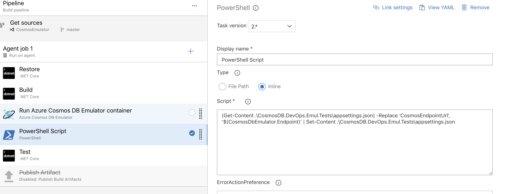

En todo desarrollo de software aparte de realizar *Unit Test*, también realizamos *Intgration Tests* para verificar que las conexiones que tiene que hacer nuestra aplicación con terceras partes funcionan y que con las nuevas versiones no se ha roto esta integración.

**Integration Tests contra CosmosDB**

CosmosDB es el servicio para NoSql que nos provee Azure, y es uno de los servicios más usados en estos momentos. Hasta ahora si queríamos hacer *Integration Testing* de nuestra aplicación contra CosmosDB teníamos que levantar el servicio de CosmosDB, ejecutar nuestras pruebas y después eliminarlo, con el coste que conlleva tanto de tiempo como económico.

Desde hace unos meses esto ya no es necesario ya que Microsoft ha implementado una tarea en AzureDevOps que nos levanta en un container el emulador de CosmosDB, lo que nos permite ejecutar nuestras pruebas de integración sobre el emulador y sin coste alguno.

En el siguiente link os podéis bajar el código del ejemplo que vamos a seguir:  [https://dev.azure.com/bermejo/CosmosDBEmulator/\_git/CosmosEmulator](https://dev.azure.com/bermejo/CosmosDBEmulator/_git/CosmosEmulator)

El código consiste en un pequeño proyecto de consola en .NET Core que lo único que hace es añadir un documento a una colección de CosmosDB.

Además, hay un proyecto de test que lo que hace es hacer el test de integración con CosmosDB.

El archivo de configuración de nuestro proyecto de test debe tener la siguiente forma:

De este archivo es importante dos cosas:

1. La AuthorizationKey es la key del emulador de CosmosDB, debe ser esta para funcionar.
2. Y el valor del EndPointUrl será un valor que más adelante modificaremos con el EndPoint que nos dé el contenedor del emulador de CosmosDB.

**Añadiendo la tarea de CosmosDB Emulator al pipeline**

Para añadir en nuestro pipeline de *build* el emulador de CosmosDB, vamos a añadir *task*, buscamos *Cosmos DB Emulator* y lo añadimos en nuestro pipeline.

Una vez la tenemos añadida, debemos ir a la opción *Output Variables* y añadiremos una descripción para la variable de salida, esta variable nos servirá para saber el endpoint que expondrá el contenedor.​

Una vez tenemos la tarea añadida, añadiremos una tarea de *powershell* que modifica el valor de la variable EndPointUrl del archivo de configuración de nuestros test, por el endpoint de emulador de CosmosDB, para ello ejecutaremos el siguiente script:

(Get-Content .\CosmosDB.DevOps.Emul.Tests\appsettings.json) -Replace 'CosmosEndpointUrl', '$(CosmosDbEmulator.Endpoint)' | Set-Content .\CosmosDB.DevOps.Emul.Tests\appsettings.json

Una vez tenemos esta configuración ya podemos lanzar nuestro *pipeline* de *build* con nuestros *Integration Tests* contra CosmosDB.

**Conclusiones**

La llegado del emulador dentro de nuestros *pipelines* es una gran noticia ya que nos ahorra dinero y tiempo de configuración de entornos.

En contra debemos tener los siguientes puntos:

- Sino tenemos un self hosted agent, solo funciona con el Hosted VS2017 que nos proporciona AzureDevOps.
- El proceso de build es muy lento ya que tiene que bajar el contenedor instalarlo, configurarlo y levantarlo.

Viendo los puntos anteriores lo más recomendable es ejecutar estos pipelines en un self hosted agent y de esta forma tendremos en cache el contenedor y la velocidad será mayor.

**Robert Bermejo Blasco**  
BackEnd Technical Lead in SCRM – Lidl Digital Hub | MVP Azure  
bermejoblasco@live.com 
 
import LayoutNumber from '../../../components/layout-article'
export default LayoutNumber
