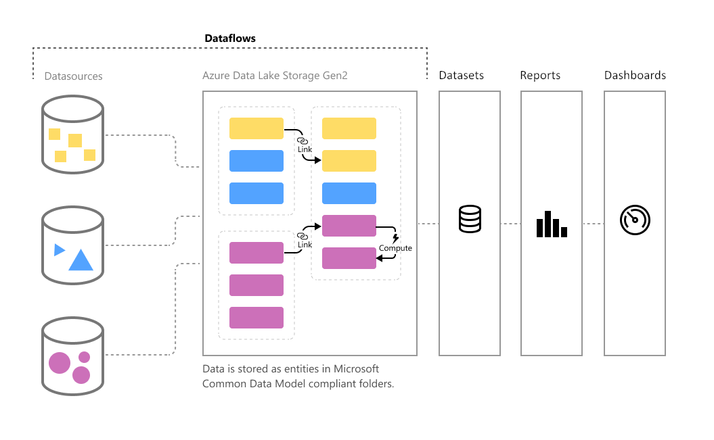
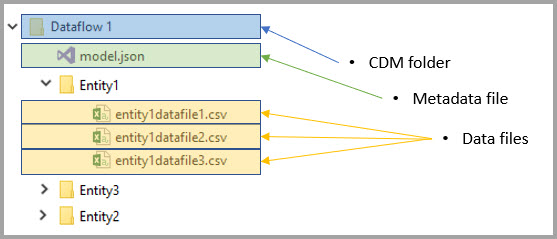
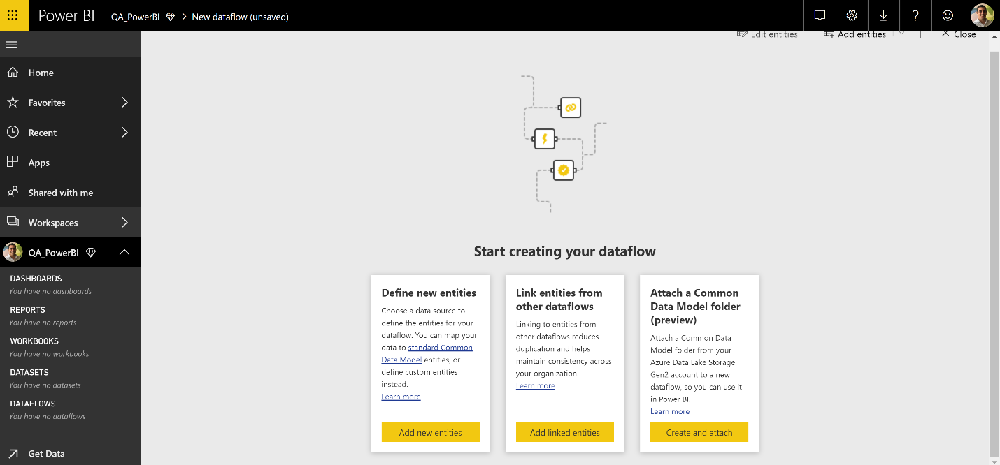
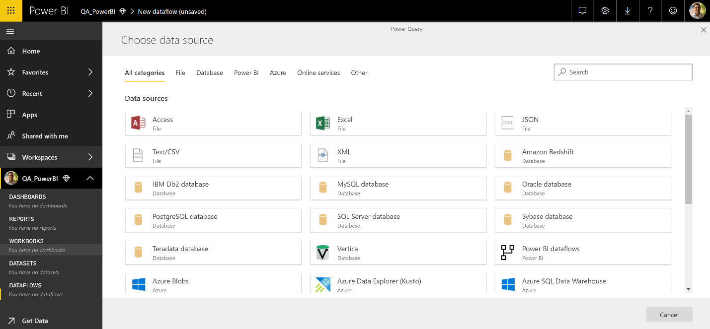
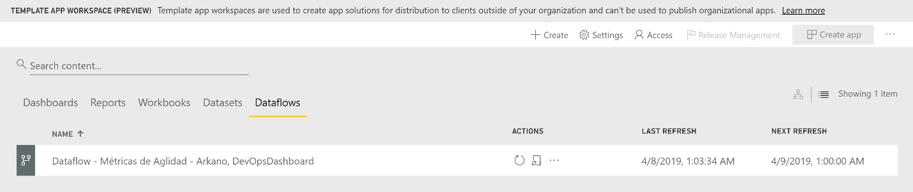
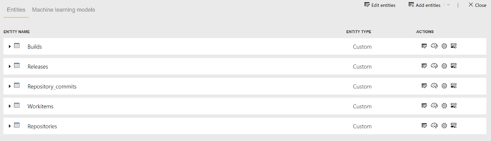
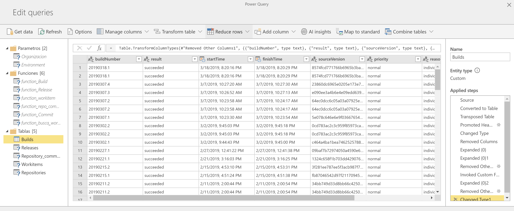
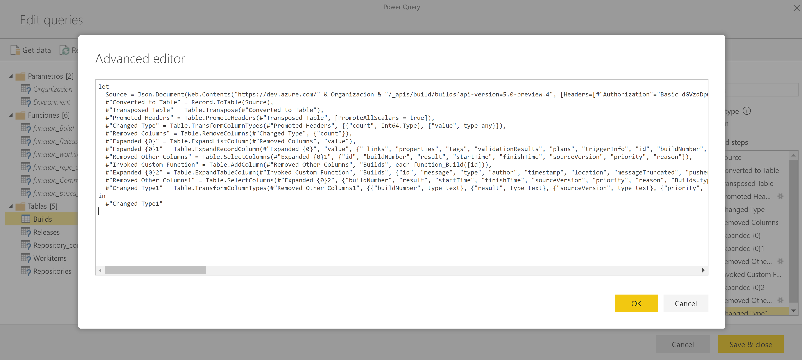

Desde hace unos meses, y encontrándose en etapa preliminar apareció en el servicio online de Power BI la capacidad de Dataflows. Hoy en día ya contamos con la disponibilidad general de esta tecnología en el servicio nube de Power BI.

Para adentrarnos en el tema comencemos con los conceptos más importantes detrás de esta tecnología.

Se trata de brindarle al usuario de negocio la capacidad de conectar directamente a sus fuentes de datos frecuentemente utilizados, permitiendo no solo extraer información desde ellas sino vincularla a otros sistemas, y más importante aún, contar con la capacidad de transformación, limpieza y manipulación sin necesitar una herramienta de escritorio para lograr dicha tarea.

Uno de los pilares detrás de Dataflows es también la conexión a Azure Data Lake Gen2 con capacidad de storage. Esta capacidad la tenemos tanto utilizando una cuenta Power BI PRO como la capacidad Premium de Power BI (en la que contaremos además con refrescos incrementales). A su vez como dato importante, también contamos con la posibilidad de contar con la capacidad de conectar con nuestro propio Azure Data Lake Gen2 utilizando nuestra propia suscripción de Azure.

**Arquitectura de Dataflows**

El concepto de Common Data Model no es menor ya que el roadmap trazado por Microsoft permitirá a todo el stack de lo que denominamos Power Platform compartir un storage en común, y asimismo entidades que podamos utilizar para compartir información entre sistemas. Esto permite un salto muy importante al momento de integrar información desde Dynamics 365, Office 365, Power BI, PowerApps, Flow.

A su vez el concepto de entidades no solo permite conexión entre sistemas sino realizar modificaciones sobre modelos de datos en formato JSON, así como cargar metadatos sobre entidades de nuestros Dataflows

Para comenzar con la implementación de un Dataflow lo que necesitamos es acceder directamente al servicio de online de Power BI, a través de [https://app.powerbi.com](https&#58;//app.powerbi.com/) con nuestras credenciales. Accedemos a un espacio de trabajo al que pertenezcamos, y desde la opción Crear en el punto superior derecho de la ventana podremos dar clic en Crear un nuevo Dataflow:

En esta ventana como podemos ver contamos con la capacidad de crear nuevas entidades a nuestro Dataflows, generar un vinculo a otras entidades provenientes de otros Dataflows que hayamos generado, así como también incorporar un CDM (Common Data Model) proveniente de nuestra propia suscripción de Azure a través de nuestro propio Azure Data Lake Gen2.

Las fuentes de datos a las que podemos acceder desde Dataflows es muy variada, y no se concentra solo en fuentes Online, sino que además cuenta con la capacidad de conexión a fuentes On Premises (como SQL Server, Oracle, IBM DB2, Teradata, entre otras). No olvidemos que en caso de querer contar con la capacidad de refresco automático debemos configurar un Enterprise Gateway que cumpla con dicho propósito.

**Fuentes de Datos (hoy en día… siguen sumándose cada vez más con el tiempo)**

Una vez conectamos con nuestro/s sistemas generando las entidades en Dataflows contamos con la capacidad de utilizar el lenguaje Power Query en toda su plenitud para realizar las transformaciones, limpieza y manejo de información necesaria para generar nuestro modelo de datos. Aquí es donde viene una de las preguntas mas frecuentes al momento de realizar entrenamientos. ¿Es Dataflows un sistema que reemplaza a los Datasets en Power BI? No.

Dataflows se utiliza como paso previo a la generación de un dataset. Dataflows nos ayuda al momento de la conexión a fuentes, pero no es dataflow el encargado de contener nuestro modelo de datos.

En el siguiente ejemplo podemos ver un dataflow generado a través de una conexión a una Web API de Azure DevOps para obtener información de varios endpoints de dicha API:

​Las entidades en este ejemplo son:

Si editamos una de estas entidades accederemos al lenguaje Power Query que nos mostrara en cada entidad los pasos que se dieron para lograr el resultado final. Sin dudas que, si el caso nos lo permite, tendremos mucho mas simple la tarea utilizando la interfaz grafica de Power Query, pero si lo que buscamos es potencia, y transformaciones complejas, el editor avanzado de Power Query nos provee de una capacidad prácticamente ilimitada para el manejo de datos.

**Interfaz Power Query (edición de entidades en un dataflow)**

****
**Editor Avanzado de Power Query**

Una vez que tenemos preparadas las fuentes de información, y hemos transformado los datos, y consecuentemente hemos realizado una limpieza de los mismos, el dataflow genera automáticamente un dataset (modelo de datos) que nos permitirá a posteriori generar reportes ya sea utilizando el servicio nube de Power BI como también conectarnos desde nuestra herramienta de escritorio: Power BI Desktop.

A continuación, mostramos que desde Power BI Desktop, con nuestra opción de Obtener Datos se nos da la posibilidad ahora de conexión directo a dataflows:

**AI y más…**

Sin lugar a duda, dataflows está en los primeros pasos, pero lo vemos como una tecnología con amplias posibilidades, y que sigue agregando adeptos con el tiempo. De hecho, hace muy poco tiempo contamos con la posibilidad de utilizar Servicios Cognitivos de Azure desde dataflows para realizar un análisis de sentimientos a través del análisis de un campo de feedback de clientes, así como también el uso de reconocimiento de imágenes para agregar metadata sobre un campo que contenga la imagen de uno de nuestros productos (como ejemplo). Y esto sin tener la obligación de contar con una suscripción de Azure.

Y esto no queda en estos ejemplos, sino que también podemos escalar aún más, utilizando directamente modelos de Machine Learning creados por nuestro equipo de DataScientists y realizar análisis de nuestras entidades con la finalidad de hacer predicciones, o manejar forecastings.

Sigamos expectantes de esta tecnología que viene avanzando a pasos agigantados en el mundo del análisis de datos.

¡Hasta pronto!

**Gaston Cruz**  
Microsoft MVP Dataplatform  
Slalom LLC - Seattle​