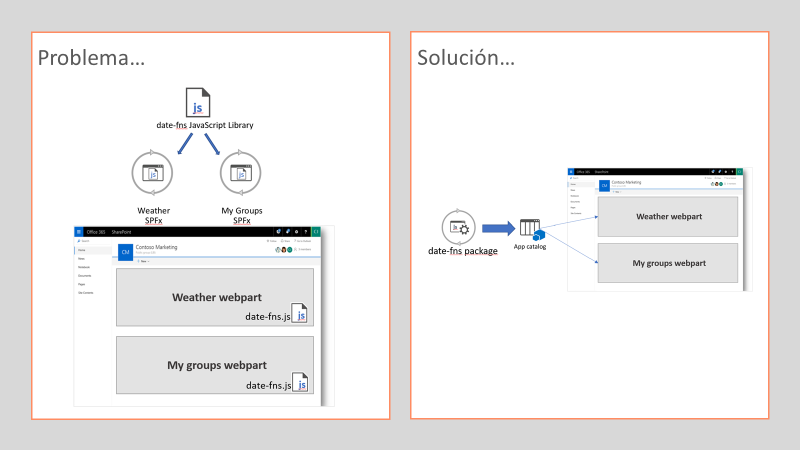

A finales de marzo tuvimos una nueva *major release* del spfx, la 1.8.0, que trajo algunas novedades interesantes, y que fue actualizada cerca de un mes después a la 1.8.1 (que simplemente corrige algunos de los bugs que se colaron en la 1.8). Si queréis conocer todas las novedades incluidas en la 1.8.0, os aconsejo visitar este artículo de Andrew Connell, que hace un resumen muy completo:

[http://www.andrewconnell.com/blog/sharepoint-framework-v1-8-0-what-s-in-the-latest-update-of-spfx](http://www.andrewconnell.com/blog/sharepoint-framework-v1-8-0-what-s-in-the-latest-update-of-spfx)

En este artículo nos vamos a centrar en una novedad de las más interesantes, llamada "**Library Components**", y que nos va a permitir crear código compartido (a modo de Librearías) entre diferentes soluciones SPFx. Seguro que tienes funciones de validaciones que copias en cada proyecto, utilidades para llamadas REST, o pequeños (*dumb*) componentes React, que pintan información con tu formato favorito (fecha en formato largo, imagen de un usuario con bordes redondeados, etc.). Si todavía no es tu caso, lo será en cuanto desarrolles más soluciones SPFx, ¡así que te aseguro que este artículo te interesa!



**El problema, y la regular solución con "externals"**

Si hasta ahora te limitas a copiar el código en cada solución SPFx, que sepas que, si tienes varios WebParts de diferentes soluciones, cargados en la misma página de SharePoint, ese código va a estar duplicado, penalizando el rendimiento en la carga de la página.

Antes de la 1.8, había una forma de solucionar este problema de código compartido, pero no era muy *friendly*, y requería de configuración extra. Dicha solución se basaba en crear tu propia librería de javascript, es decir, que te configurabas un proyecto con tu webpack, typescript compilation, tslint, etc, que daba como resultado final un fichero JavaScript .js. El siguiente paso era subir ese fichero a algún CDN, pudiendo ser el mismo de Office 365, que de nuevo has de configurar a mano. Y finalmente, en nuestro proyecto spfx, debemos configurar el nodo *externals* del fichero *config.json*:

```
  "externals": {    
    "contoso-utilities-library": "https://publiccdn.sharepointonline.com/contoso.sharepoint.com/sites/appcatalog/LibraryComponents/contoso-utilities-library-component.js"  
    },​
```

Con esto todavía no es suficiente, y tendremos que hacer algunas cosas con *npm link* para poder utilizar la librería desde nuestro proyecto spfx. Tenéis más detalle de como hacerlo en este artículo: [https://spblog.net/post/2019/03/26/a-new-beast-in-sharepoint-framework-development-library-component](https://spblog.net/post/2019/03/26/a-new-beast-in-sharepoint-framework-development-library-component)

Como veis, no es muy sencillo solucionar este problema sin las mejoras venidas en la versión 1.8.0

**Solución, "Components Library"**

Para ilustrar el artículo, vamos a crear nuestra librería de componentes, donde tendremos una función que formateará una fecha usando la librería date-fns. Dicha función será utilizada en dos soluciones spfx diferentes.

Primero crearemos un proyecto spfx haciendo uso de la plantilla yeoman que ya todos conocemos.


*Nota*: Esta característica está todavía en beta, así que tendremos que añadir el parámetro –plusbeta para poderla utilizar.

Al ser una librería compartida por cualquier solución SPFx, debemos contestar Y a la pregunta de "*allow solution to be deployed to all sites immediately."*

En un momento, el asistente de *yeoman* nos pregunta el tipo de proyecto, y seleccionaremos la opción "*Library*"


Luego daremos un nombre y descripción a nuestra Librería, y finalizaremos el proceso de creación del proyecto.


Una vez creado el proyecto, podemos ver como el *package.json* contiene una referencia a la dependencia *sp-core-library*

```
"dependencies": {    
    "@microsoft/sp-core-library": "1.8.1-plusbeta",    
    "@types/webpack-env": "1.13.1",    
    "@types/es6-promise": "0.0.33"  
},​
```

También vemos como el *manifest* de la librería, tiene un atributo *componentType* con el valor *Library*


Lo siguiente que haremos será incluir nuestra función reutilizable dentro del código de la librería. Como hemos dicho anteriormente, vamos a tener una función que va a formatear una fecha con formato *longdate* y además nos dirá cuánto tiempo ha pasado desde esa fecha, hasta hoy (el típico: "hace 3 días"). Para ello vamos a hacer uso de una librería muy famosa que facilita el trabajo con fechas, llamada *date-fns* (quizá conozcas *moment.js*, esta otra es similar a moment, pero algo más ligera y modular). Al ser una dependencia, tenemos primero que instalarla a nuestro proyecto, así que ejecutamos el siguiente comando npm:

*npm install date-fns --save*

Una vez instalado, añadimos el siguiente código a la Librería:


Ya tenemos el código de nuestra librería preparada, así que la siguiente parte es desplegarla en el App Catalog, como cualquier solución spfx. Si necesitas los pasos detallados, los tienes aquí:

[https://docs.microsoft.com/en-us/sharepoint/dev/spfx/library-component-tutorial#how-to-deploy-and-consume-a-3rd-party-spfx-library-from-tenant-app-catalog](https://docs.microsoft.com/en-us/sharepoint/dev/spfx/library-component-tutorial#how-to-deploy-and-consume-a-3rd-party-spfx-library-from-tenant-app-catalog)

**Probando nuestra Librería de componentes**

El siguiente paso será crear un proyecto SPFx de WebPart siguiendo el método ya conocido. Una vez creado el proyecto, debemos añadir una dependencia a nuestra Library. Esto lo haremos editando el package.json y añadiendo un dependencia más:


El nombre y la versión lo encontramos en el package.json del proyecto Librería:


Llegado a este punto, si intentamos hacer un import de nuestra librería para usarla en nuestro código, algo como:

```
import { InheritsCloudCoreLibrary } from 'inheritscloud-spfx-library';​
```

Veremos cómo VS Code nos dice que no sabe nada de ese módulo. Tenemos que, de alguna manera, exponer la Librería. Para ello, vamos a la carpeta del proyecto Librería, y ejecutamos:

*npm link*

Ahora, volvemos a la carpeta de nuestro proyecto WebPart SPFx, y ejecutamos:

*npm link inheritscloud-spfx-library*

Esto va a incluir una referencia dentro de la carpeta node\_modules a nuestro proyecto librería:


Ahora sí, ya podemos crear un objeto de nuestra librería, y poder utilizarlo en nuestro WebPart:


```
export default class HelloLibrary extends React.Component<IHelloLibraryProps, {}> {  
    public render(): React.ReactElement<IHelloLibraryProps> {     
        const library = new InheritsCloudCoreLibrary();    
        const testDate = new Date(2019, 5, 3);    
        const dateFormatted = library.formatDateAsCoolString(testDate);     
        return (      
            <div className={ styles.helloLibrary }>        
                <div className={ styles.container }>          
                    <div className={ styles.row }>            
                        <div className={ styles.column }>              
                            <span className={ styles.title }>Webpart using shared code from Library!</span>              
                            <p className={ styles.description }>Date formatted: {dateFormatted}</p>            
                        </div>          
                    </div>        
                </div>      
            </div>    
        );  
    }
}​
```

Para acabar, podemos desplegar nuestro WebPart SPFx al App Catalog, instalarlo en un site de SharePoint, y añadirlo a una página.


Lo interesante viene si añadimos una nueva instancia del WebPart a la página, y observamos las descargas, veremos como se descarga un .js que es el código de nuestra librería, y como se descarga una sola vez, y es reutilizado por las dos instancias del WebPart:


**Nota:** cabe destacar, que, si en algún momento necesitáis hacer un npm install en vuestro proyecto WebPart SPFx, la referencia a vuestra librería se va a perder, por lo que tendréis que volver a lanzar el comando *npm link inheritscloud-spfx-library*

Para acabar, tenéis el código disponible del ejemplo en mi repositorio de GitHub:

[https://github.com/luismanez/sp-dev-fx-library-sample](https://github.com/luismanez/sp-dev-fx-library-sample)

Hasta el próximo número!


**Luis Mañez** <br />
SharePoint / Cloud Solutions Architect en ClearPeople LTD <br />
@luismanez <br />
[https://medium.com/inherits-cloud](https://medium.com/inherits-cloud) 
 
import LayoutNumber from '../../../components/layout-article'
export default LayoutNumber
