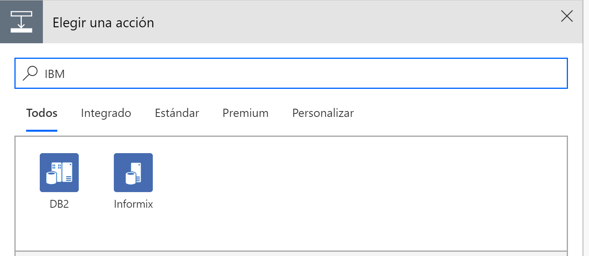
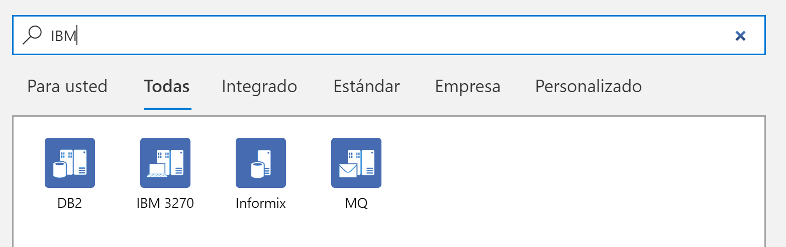
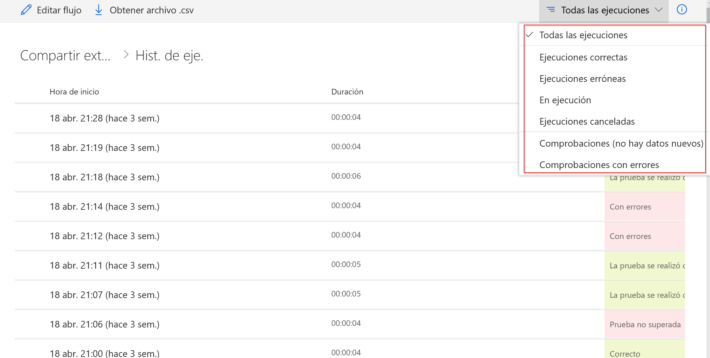
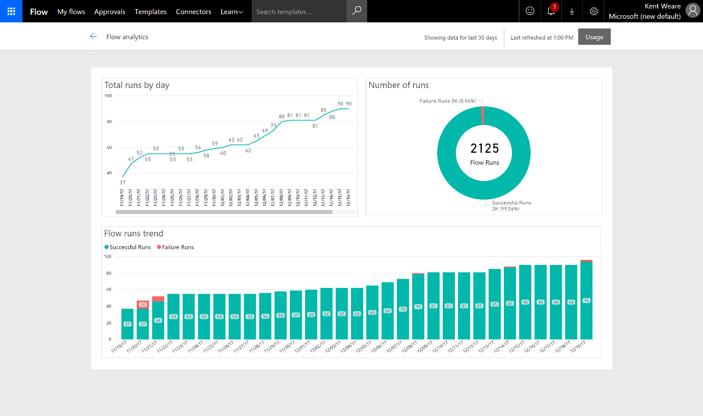
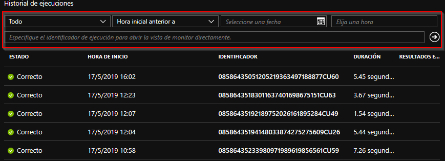
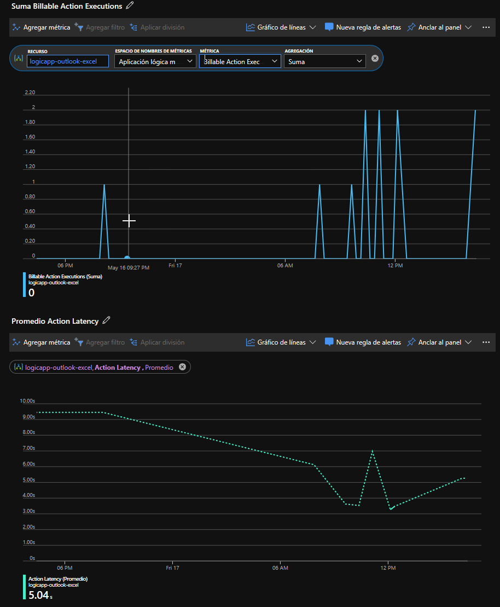
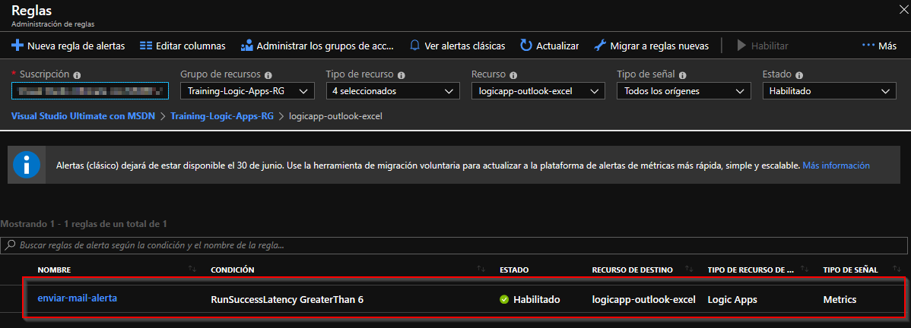
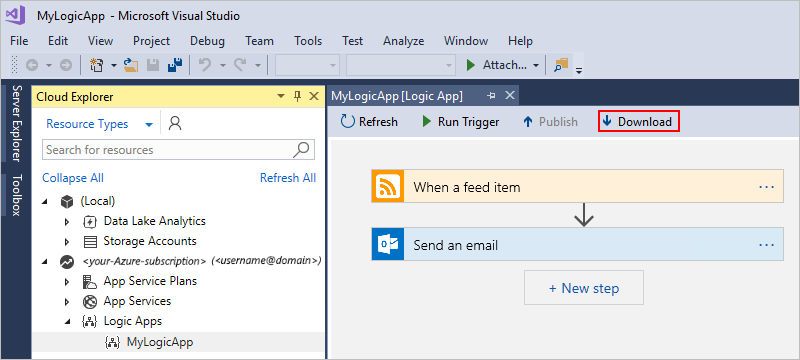
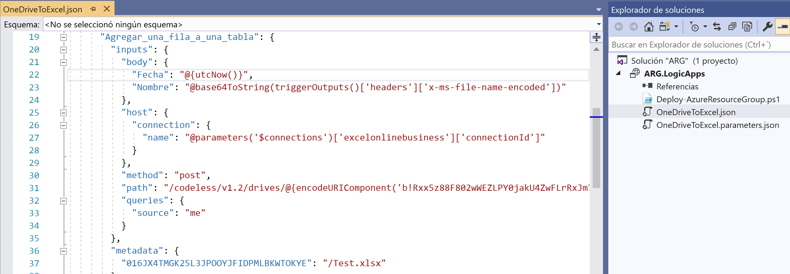
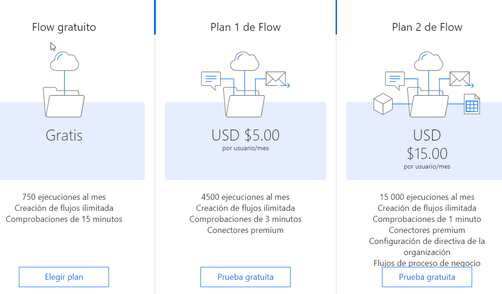

import ArticleHeader from '../../../components/article-header'

<ArticleHeader frontmatter={props.pageContext.frontmatter} />

La constante evolución de los servicios de *Microsoft* ha hecho que *Flow* sea ahora mismo una excelente opción para afrontar tareas que impliquen automatizaciones e integraciones, y no solo para usuarios finales, si no incluso para usuarios de TI.

Entonces, ¿Cuándo debemos usar *Azure Logic Apps*? Aunque en primera instancia podríamos pensar que ambos servicios comparten multitud de características, únicamente podemos constatar que comparten el mismo motor de ejecución y el mismo editor visual. ¡Nada más! Y si es así… ¿En qué se diferencian?

**Perfil del usuario**

Mientras que *Microsoft*Flow está enfocado al *Citizen Developer*, *Azure Logic Apps* está destinado a usuarios avanzados o de TI, que usualmente están involucrados en proyectos de mayor complejidad técnica, con lo que se hacen necesarias herramientas de monitorización avanzada, uso de *best practices* o técnicas de integración continua.

Generalmente para poder usar *Microsoft Flow* necesitamos una cuenta de *Office 365* y/o *Dynamics 365* (exceptuando si queremos usar *Microsoft Flow Free*[***\[1\]***](file&#58;///C&#58;/CompartiMOSS/Logic%20Apps%20vs%20Flow%20-%20Ferran%20Chopo.docx#_ftn1), versión gratuita y de aprendizaje) mientras que para usar *Logic Apps* necesitamos una cuenta de *Azure*. De esta manera, se puede comprobar como ya de entrada, el enfoque de ambos productos es totalmente distinto.

**Funcionalidad**

Precisamente el enfoque de ambos servicios hace que tengamos distintas funcionalidades. En *Logic Apps* disponemos de características de integración empresarial (por ejemplo, transformar un fichero XML), mientras que en *Flow*disponemos de algunas funcionalidades más de usuario final (por ejemplo, desencadenar un flujo desde un botón de en una aplicación móvil).

Curiosamente, para un mismo criterio de búsqueda sobre conectores en ambos servicios, obtenemos resultados distintos, como podemos observar en la siguiente figura:

En la siguiente tabla se detallan las funcionalidades que podemos encontrar en ambos servicios:

| **Funcionalidad** | **Flow** | **Logic Apps** | **Observaciones** |
| --- | --- | --- | --- |
| App móvil (Botón) | P | O |   |
| Aprobaciones | P | O |   |
| Blockchain | P | O |   |
| Creación de Flows con Visio | P | O | Solo disponible con licencia de Visio Online Plan 2 |
| Ejecución de código Javascript | O | P | En fase de prueba |
| Integración con Forms | P | P |   |
| Redes Sociales | P | P |   |
| Sincronización con OneDrive, DropBox, Box, … | P | P |   |
| Uso de ficheros XML | O | P |   |
| Uso de formatos de fichero EDI | O | P |   |

**Tabla****1****.****- Funcionalidades de Flow vs Logic Apps.**

Así, podemos concluir que según las necesidades que tengamos en nuestro desarrollo, deberemos elegir una opción u otra, o en el caso que se pueda realizar con ambas, deberemos valorar otros aspectos que veremos a continuación.

**Monitorización**

Tanto en *Flow* como en *Logic Apps* es posible consultar el *log* de ejecuciones de nuestras *apps*, aunque el segundo proporciona algunas opciones más para buscar en el histórico y analizarlo.

En la siguiente captura podemos el histórico de ejecución de un flujo concreto en *Flow*, en el que únicamente podemos filtrar por el resultado de la ejecución, pero no por fechas (para ello deberíamos exportar el histórico a un fichero csv y trabajarlo desde éste):

Si disponemos de una licencia de *Flow Plan 2* podemos acceder a un panel de gráficos con datos de uso y análisis sobre nuestras *Apps*, tal y como podemos ver en la siguiente figura:

Por lo contrario, en *Logic Apps* sí podemos filtrar por fechas e incluso por el identificador de la ejecución, tal y como se puede ver en la siguiente figura:

Adicionalmente en *Logic Apps* también podemos consultar información mediante gráficos, como podrían ser el número de acciones facturables o el tiempo medio de ejecución de una aplicación para un determinado periodo de tiempo, como podemos ver seguidamente:

Aun así, lo más interesante es que en *Azure Logic Apps* podemos configurar alertas basadas en distintas métricas de monitorización. Por ejemplo, podríamos crear una alerta para que recibamos un correo cuando el tiempo medio de ejecución correcta de una *Logic App* específica sea superior a 6 segundos, tal y como podemos ver en la siguiente figura:

Podemos concluir este apartado afirmando rotundamente que las posibilidades de monitorización y análisis son mucho mejores en *Logic Apps* respecto a *Flow*, con lo qué es un aspecto de peso que también deberemos tener en cuenta al elegir una opción u otra.

**Experiencia de desarrollo y programación**

Aunque en ambos servicios podemos trabajar con un editor visual mediante un navegador web, en el caso de *Azure Logic Apps* tenemos la opción de trabajar con Visual Studio. Concretamente podemos importar cualquier *Logic App* en un proyecto de tipo *Azure Resource Groups* en Visual Studio, lo que nos permite realizar tareas como control de código fuente e integración continua.

Si tenemos instalado en nuestro equipo las *Azure Logic Apps Tools for Visual Studio*[***\[2\]***](file&#58;///C&#58;/CompartiMOSS/Logic%20Apps%20vs%20Flow%20-%20Ferran%20Chopo.docx#_ftn1) podemos conectarnos a nuestra suscripción de *Azure* y ver cualquiera de nuestras *Logic Apps* desde el editor, tal y como podemos ver en la siguiente figura:

Desde el propio editor también podríamos ejecutar la *App*, habilitarla o deshabilitarla, ver el histórico de ejecuciones o ver y modificar el código fuente de la misma.​

Así, vemos como las posibilidades de *Logic Apps* en cuanto a experiencia de desarrollo son también totalmente distintas respecto a *Flow*.

**Precios**

Las características de facturación de ambos servicios son totalmente diferentes, haciendo que sea un factor de decisión con un peso importante. En *Flow* el modelo de facturación se basa en el numero de ejecuciones de nuestros *flows*, independientemente de las acciones que incluyan.

Por otra parte, en *Logic Apps* el modelo de facturación se basa en las acciones que se ejecutan en cada *App*. Por lo tanto, se basa en un modelo totalmente granular, haciendo que *apps* simples puedan ser muy económicas, mientras que las más complejas puedan tener unos costes más altos.

En *Logic Apps* también deberíamos contabilizar si usamos cuentas de integración (procesamiento de EDI y XML) o entornos de servicio de integración (entornos aislados para conectarnos de forma segura a aplicaciones locales).

Por lo tanto, si estamos trabajando con *Logic Apps* recomendaríamos la creación de *Apps* pequeñas y granulares, de forma que se pudiesen reutilizar las más veces posibles, ya que eso no afectaría al coste. Justamente en *Flow* seria todo lo contrario, ya que, si un *Flow* llama a otro, son 2 ejecuciones que se contabilizan.

**Escenarios**

A partir de lo que hemos visto en los apartados anteriores, podríamos resumir el uso de un servicio u otro en los siguientes puntos:

- ***Flow:***
    - Tenemos una suscripción de Office 365 y/o Dynamics 365, pero no de Azure.
    - Necesitamos poder usar flujos de aprobación.
    - Necesitamos poder ejecutar una app desde el teléfono móvil.
    - No necesitamos usar acciones complejas de integración (EDI o XML).
    - No tenemos conocimiento de desarrollo o éste es muy básico.
    - No necesitamos control de código fuente y versionado.
    - No necesitamos monitorización avanzada.
- ***Logic Apps:***
    - Tenemos una suscripción de Azure.
    - Queremos usar una experiencia de desarrollo con Visual Studio.
    - Necesitamos desarrollar *Apps* con cierta complejidad, así como trabajar con EDI o XML.
    - Necesitamos control sobre el código fuente y las versiones de nuestra App.
    - Necesitamos capacidades avanzadas de monitorización.

Conviene tener presente que cualquier aplicación desarrollad con *Flow* siempre se puede exportar a *Logic Apps*, con lo que la elección del servicio más básico no supone la exclusión del más avanzado.

**Conclusión**

En este artículo hemos visto las capacidades que nos ofrecen *Microsoft Flow* y *Azure Logic Apps* para desarrollar procesos de automatización de tareas e integración de datos. En ambos casos hemos visto las ventajas e inconvenientes que presentan, y, en definitiva, qué escenarios son los ideales para su uso.

Jugando a ser adivinos, creemos que probablemente, y en un futuro no muy lejano, *Microsoft Flow* incorporará nuevas funcionalidades o mejoras sobre las que ya están incluidas en *Logic Apps*, aunque quedará en las manos de Microsoft decidir qué tipo de funcionalidad es fácilmente usable para un *Citizen User* y cual no.

**Ferran Chopo Garcia**  
*IT Consultant & Trainer*  
[ferran@ferranchopo.com](mailto&#58;ferran@ferranchopo.com)  
@fchopo  
[http://www.ferranchopo.com](http&#58;//www.ferranchopo.com/)  

[\[1\]](file&#58;///C&#58;/CompartiMOSS/Logic%20Apps%20vs%20Flow%20-%20Ferran%20Chopo.docx#_ftnref1) [https://flow.microsoft.com/es-es/pricing/](https&#58;//flow.microsoft.com/es-es/pricing/)

[\[2\]](file&#58;///C&#58;/CompartiMOSS/Logic%20Apps%20vs%20Flow%20-%20Ferran%20Chopo.docx#_ftnref1) [https://github.com/MicrosoftDocs/azure-docs/blob/master/articles/logic-apps/manage-logic-apps-with-visual-studio.md](https&#58;//github.com/MicrosoftDocs/azure-docs/blob/master/articles/logic-apps/manage-logic-apps-with-visual-studio.md)

