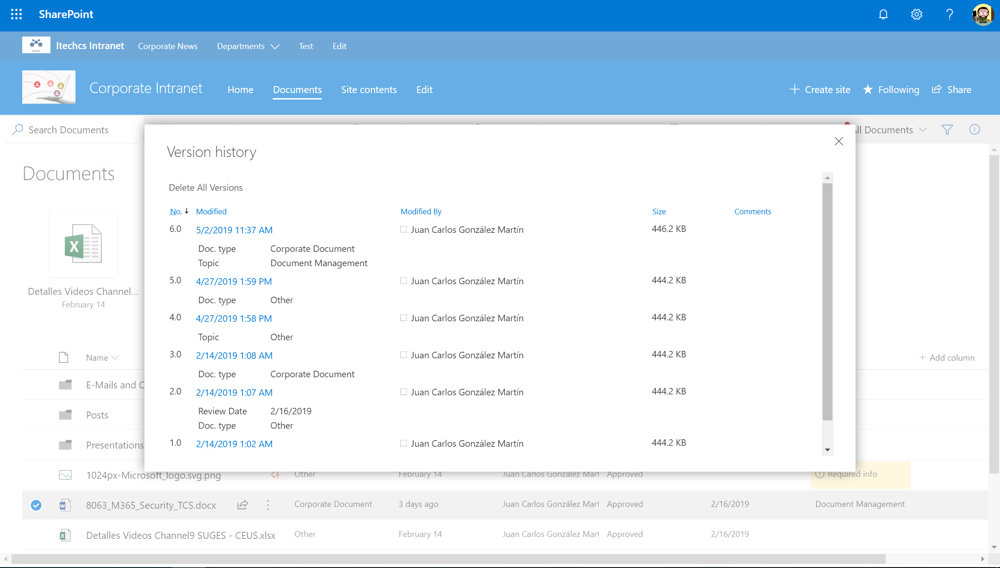
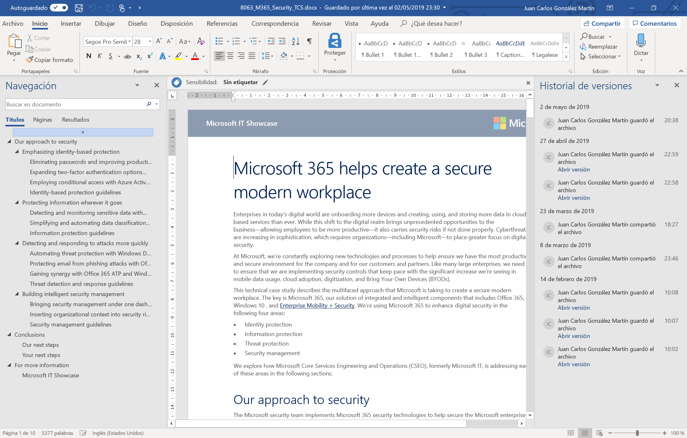
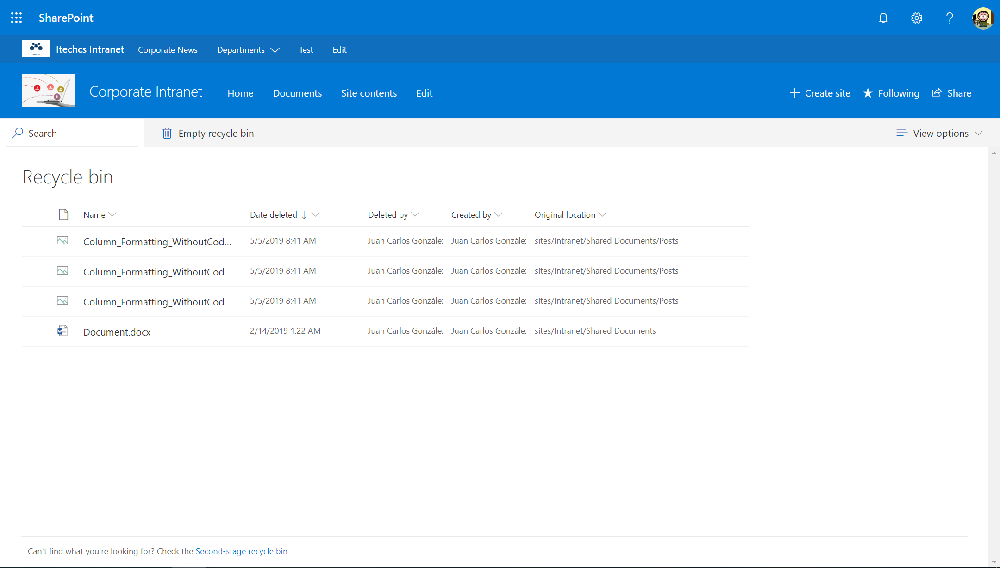
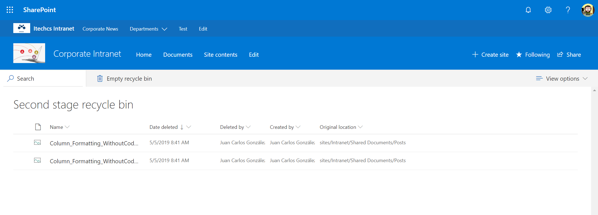
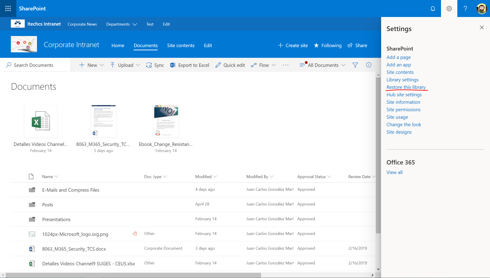
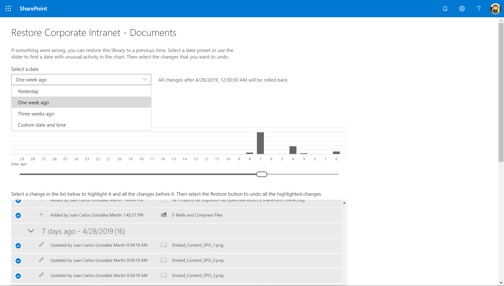

Una pregunta muy recurrente que he recibido en repetidas ocasiones es la relativa a que opciones proporciona de serie SharePoint Online (SPO) para hacer frente a "desastres" en lo que a perdida de información se refiere. Como os podéis imaginar, en realidad la cuestión de fondo es si Microsoft proporciona algún tipo de mecanismo de Copias de Seguridad y Restauración en SPO. La respuesta a esa pregunta es que "No de forma directa", aunque de forma indirecta si tenemos una serie de herramientas que nos permiten poder recuperar información almacenada en sitios de SPO y en OneDrive For Business (ODFB) en caso de desastre. En este artículo vamos a hacer un repaso a las distintas opciones disponibles.

**¿Por qué Microsoft no proporciona características nativas de copia de seguridad y restauración?**

La pregunta del millón como se suele decir y para la que Microsoft siempre da la misma respuesta: Office 365 y SPO son unos servicios tan fiables, que no es necesario disponer de una característica nativa de copia de seguridad y restauración a disposición de los clientes. Microsoft proporciona una disponibilidad garantizada del servicio de SPO como parte de Office 365 en base al SLA de Microsoft con sus clientes de Office 365: Microsoft se compromete a garantizar un 99,9 % de disponibilidad en los servicios provistos en la plataforma Office 365 tal y como se refleja en el siguiente enlace: [https://docs.microsoft.com/en-us/office365/servicedescriptions/office-365-platform-service-description/service-level-agreement](https&#58;//docs.microsoft.com/en-us/office365/servicedescriptions/office-365-platform-service-description/service-level-agreement)

**Versionado de documentos**

Por defecto, toda Biblioteca de Documentos en SPO y ODFB tienen habilitado el versionado por lo que si se ha producido un problema / error en una versión de un documento podemos recuperar alguna de sus versiones anteriores. Esta recuperación es posible mediante las siguientes técnicas:

- La interfaz de usuario de SPO y ODFB, de forma que cuando se selecciona un documento en una Biblioteca o en ODFB podemos visualizar las versiones que se han ido generando del mismo, abrir una versión previa y restaurar, si es necesario, una versión previa que sobrescriba la actual.

- En el caso de documentos Office, cuando los abrimos con los clientes de escritorio podemos visualizar también las versiones previas que se han generado del documento y abrirlas.

- De forma programática mediante el uso de las APIs de SPO podemos acceder al historial de versiones de un documento almacenado en una Biblioteca de PSO o en ODFB. Por ejemplo, en [este artículo](https&#58;//www.c-sharpcorner.com/article/retrieve-file-version-properties-and-version-author-details-on-sharepoint-using/) se puede ver cómo hacer uso del Modelo de Objetos en Cliente (CSOM) para acceder las versiones de un documento.

**Papelera de Reciclaje**

Todo Sitio de SPO y espacio de ODFB cuenta con una papelera de reciclaje de 2 niveles:

- En el primer nivel de la papelera de reciclaje, cualquier usuario de un Sitio de SPO con al menos permisos de colaborador puede recuperar información eliminada en el sitio durante un período máximo de 90 días. Esta regla aplica también al especio de ODFB, de manera que cada usuario puede recuperar en el primer nivel de la papelera de reciclaje de su ODDFB cualquier documento eliminado durante la ventana de tiempo indicada:

- El segundo nivel de la papelera de reciclaje permite recuperar durante esos 90 días a un usuario administrador cualquier documento que haya sido eliminado del primer nivel. Lógicamente, en el espacio de ODFB cada usuario es administrador del mismo por lo que también puede acceder a ese segundo nivel para recuperar elementos eliminados.

Al igual que en el caso de las versiones de un documento, por medio de las APIs de SPO se puede acceder al contenido de la papelera de reciclaje y realizar su restauración. Un ejemplo sobre cómo acceder a la papelera de reciclaje de un sitio de SPO mediante CSOM se puede encontrar en [este enlace](https&#58;//gallery.technet.microsoft.com/How-to-get-recycle-bin-409cadb5?redir=0).

**Restaurar ODFB / Bibliotecas de Documentos**

A nivel de Biblioteca de Documentos y de ODFB también tenemos la posibilidad de realizar un Restore completo o parcial de su contenido a través de la funcionalidad de Restaurar esta Biblioteca / Restaurar Mi OneDrive. En ambos casos, se puede restaurar el estado de la Biblioteca /Espacio de ODFB de forma completa o bien de ciertos documentos en una fecha anterior a la actual siempre y cuando no excedamos una ventana de 30 días. La característica de "Restaurar esta biblioteca" aparece como una opción más en el menú de configuración:

- Esta opción está disponible para el usuario a través del menú de configuración. En el caso de un Sitio de SPO, la acción de "Restore this library" estará disponible para usuarios administradores. En el caso de ODFB, cualquier usuario, como administrador de su ODFB, podrá hacer uso de la opción de "Restore my OneDrive".

- A continuación, se muestra la página de "Restaurar esta biblioteca" que es idéntica a la de "Restaurar mi OneDrive". Desde la misma podremos elegir restaurar la biblioteca de acuerdo con las siguientes opciones:
    - Ayer.
    - Hace una semana.
    - Hace tres semanas.
    - Un rango de fechas personalizado.​

- Una vez el administrador selecciona el período de tiempo, puede decidir si restaura todo el contenido de la Biblioteca o bien contenido concreto.

**Copias de seguridad y restauración realizadas por Microsoft**

Microsoft realiza de manera diaria 2 copias de seguridad de los sitios de SPO y espacios de ODFB de un tenant. Cada copia de seguridad realizada es mantenida por Microsoft un máximo de 14 días y es posible solicitar una restauración a nivel de Colección de Sitios a través de tickets de soporte. Como se puede deducir, Microsoft no proporciona Copias de seguridad y Restauración con una mayor granularidad.

**Herramientas de Backup**

Como sección final de este artículo, además de las opciones por defecto para poder recuperarnos frente a pérdidas de información en SPO y ODFB, existen soluciones de terceros que permiten realizar copias de seguridad y restauraciones haciendo uso de las APIs de SPO. Esto implica que estas herramientas no van a proporcionar nunca la flexibilidad a la hora de hacer copias de seguridad que tradicionalmente se ha podido realizar OnPremises y que la velocidad y rendimiento para realizar dichas operaciones dependen de las posibilidades de las APIs.

**Conclusión**

Microsoft no proporciona de forma nativa herramientas / funcionalidades para que los administradores de Office 365 y/o del servicio de SPO puedan realizar de forma sencilla copias de seguridad / restauraciones. Aunque no existan esas herramientas, si existen distintos mecanismos para facilitar la recuperación de información en caso de desastre.

**Juan Carlos González Martín**  
Office 365 SME | Office Apps & Services MVP  
@jcgm1978