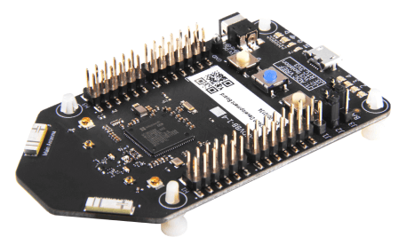
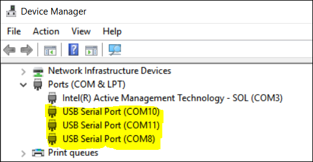
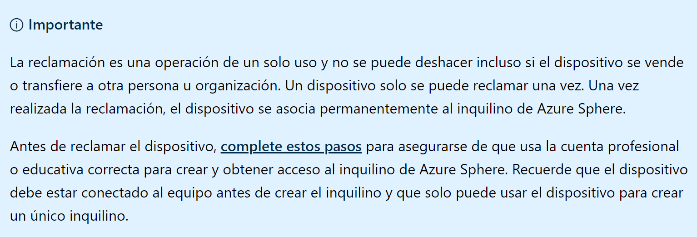
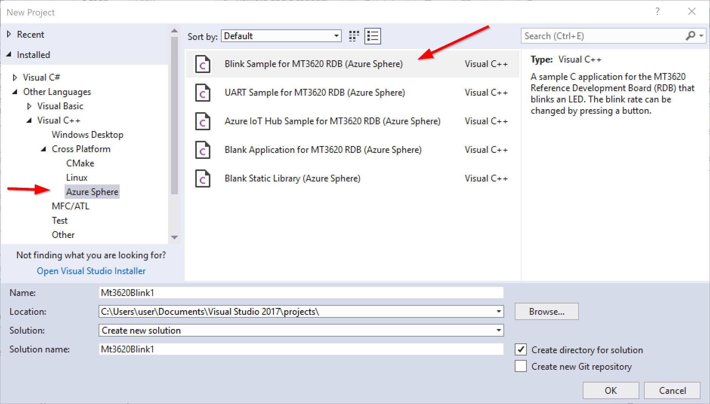
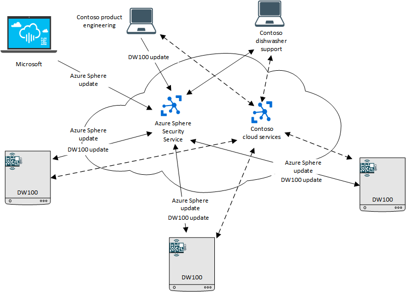

Después de estar un tiempo trabajando con estas placas multifunción como son Arduino, Raspberry, y algunas otras, la salida al mercado de la Azure Sphere despertó mi curiosidad. Por ello y luego de hacerme con una me ha parecido bueno resumir en este articulo los primeros pasos con esta tarjeta para compartir la experiencia de hacerla funcionar.

Una vez te has hecho con el kit encontrarás en la caja la tarjeta propiamente dicha y un cable USB, imprescindible este último para hacer funcionar la tarjeta las primeras veces, aunque como verás más adelante podrás prescindir de él, en lo que a comunicarse con la placa se refiere.

Lo primero que debes hacer es conectar la placa con el fin de que se descarguen los drivers, y es importante mencionar que para que todo vaya bien necesitas Windows 10 Anniversary Update instalado en tu ordenador como mínimo. Una vez que la hayas conectado, en el Gestor de Dispositivos verás que se han agregado una serie de Puertos USB cuya asignación COM puede variar de ordenador a ordenador, pero debería ser similar a algo como esto:

Si Windows no encuentra los drivers, ni siquiera conectándose a Windows Update, prueba descargarlos desde Future Technology Devices International (FTDI) en la url https://www.ftdichip.com/Drivers/VCP.htm.

Acto seguido toca descargarse el SDK, software que te permitirá la comunicación con la placa, el interfaz de desarrollo con Visual Studio y la operación del hardware directamente desde la línea de comandos (cosas que utilizarás muchas veces al principio). Este software es el Azure Sphere SDK Preview for Visual Studio, descargable desde [https://aka.ms/AzureSphereSDKDownload](https://aka.ms/AzureSphereSDKDownload).

A partir de este momento el resto de los pasos de configuración están harto documentados, pero dado que hay uno que es muy importante y que no tiene marcha atrás, te los resumiré aquí con el objetivo de tenerlos a todos en cuenta.

Todos los comandos que vamos a ejecutar se realizan a través de la consola de comandos de la Azure Sphere, llamada Azure Sphere Developer Command Prompt (de aquí en adelante ASDcp), que en realidad es la ventana de comandos de toda la vida lanzada con un script previo de configuración llamado "InitializeCommandPrompt.cmd". Para no complicarse la vida y tener que estar buscándose ese script mejor lanzarlo siempre ejecutando el ASDcp mencionado anteriormente y listo.

**Paso 1/5: Actualización del S.O.**

La mayoría de las Sphere que están listas para su distribución te llegarán con el sistema operativo sin actualizar, por lo que es imprescindible actualizarlo antes de realizar cualquier otra acción. Para hacerlo, con la Sphere conectada mediante el cable USB a tu ordenador, abres una ventana de ASDcp y lanzas una "recuperación" manual, lo que forzará la actualización del sistema operativo, con el siguiente comando: ***azsphere device recover***. Se paciente a hasta que termine, irás viendo en pantalla mensajes como estos:

*Starting device recovery. Please note that this may take up to 10 minutes.*

*Board found. Sending recovery bootloader.*

*Erasing flash.*

*Sending images.*

*Sending image 1 of 16.*

*Sending image 2 of 16.*

*. . .*

*Sending image 16 of 16.*

*Finished writing images; rebooting board.*

*Device ID: &lt;GUID&gt;*

*Device recovered successfully.*

*Command completed successfully in 00:02:37.3011134.*

**Paso 2/5: Iniciando sesión en la Sphere**

El inicio de sesión es sencillo: desde una ventana de ASDcp lanza el siguiente comando: azsphere login. Si toda va bien, saldrá una ventana donde se te piden credenciales, que deben ser credenciales con acceso a un Tenant de Azure (preferiblemente credenciales con rol de admin en el Tenant). Te recomiendo, por los pasos que verás a continuación, que la cuenta sea una cuenta de pago, especialmente porque más adelante la Sphere quedará asociada definitivamente a tu Tenant y el acceso es algo que no deberías perder si no quieres perder también la Sphere. En la ventana de ASDcp un mensaje del tipo:

"*Successfully logged in with the selected AAD user. This authentication will be used for subsequent commands.**Command completed successfully in 00:00:22.4007290.*"

confirma que todo ha ido bien.

**Paso 3/5: Reclamación del Dispositivo**

Este paso es el paso más importante de la configuración, ya que es un paso que una vez realizado no tendrá marcha atrás y tu Sphere quedará asociada definitivamente al Tenant sobre el que has iniciado sesión. Las advertencias de Microsoft al respecto están por todos lados, pero en las propias páginas de configuración te encuentras con este mensaje:

Para iniciar el proceso de reclamación (cosa imprescindible para poder utilizar tu Sphere) debes ejecutar en una ventana de ASDcp el comando: azsphere device claim. Una vez ejecutado el comando deberías obtener un resultado similar a este:

*Claiming device.*

*Claiming attached device ID '****Aqui el ID del device****' into tenant ID '****Tenant ID****'.*

*Successfully claimed device ID '****Aqui el ID del device****' into tenant ID '****Tenant ID****'.*

*Command completed successfully in 00:00:05.5459143.*

**Paso 4/5: Conexión a WiFi**

La conexión a una red Wifi es muy sencilla. Desde una ventana de ASDcp ejecutas el siguiente comando (reemplazando yourSSID por el nombre de tu red, y yourNetworkKey por la clave de tu red wifi): azsphere device wifi add --ssid &lt;yourSSID&gt; --key &lt;yourNetworkKey&gt;. Los parámetros se pasan sin comillas.

Si tienes algún problema recuerda que la Sphere solo soporta redes 802.11b/g/n y encriptación WPA/WPA2. Puedes verificar que la conexión es correcta ejecutando el comando azsphere device wifi show-status.

**Paso 5/5: Preparar el dispositivo para el desarrollo y depuración**

Antes de poder desarrollar y ejecutar aplicaciones en el dispositivo tendrás que habilitarlo para este fin, ya que viene bloqueado por defecto. Lo lograrás ejecutando desde la ventana ASDcp el comando: azsphere device prep-debug. Este comando en realidad hace dos cosas, en primer lugar, acepta que un PC le envíe aplicaciones para ser ejecutadas y depuradas, y en segunda lugar inicia un Debug Server en el dispositivo. Al mismo tiempo pone el dispositivo en modo OTA updates off (OTA=over the air) lo que hace que todo el desarrollo y despliegue se realice con y desde tu PC. El comando contrario a este modo de trabajo es azsphere device prep-field.

**Implementación OTA**

No voy a entrar en los detalles sobre cómo utilizar OTA en este articulo ya que su extensión sería demasiada, pero si es importante conocer que existe este modelo para gestionar y distribuir aplicaciones. Básicamente el modo OTA (over the air updates) hace que el dispositivo reciba las actualizaciones desde el mismo Azure y no desde tu PC. Debes elegir entre un modo u otro, es decir, o las aplicaciones se envían desde el PC (OTA desactivado) o desde Azure (OTA activado). En realidad la implementación OTA ofrece una aplicación a través de una [fuente](https://docs.microsoft.com/es-es/azure-sphere/deployment/deployment-concepts#feeds) (un feed) a los dispositivos pertenecientes a un [grupo de dispositivos](https://docs.microsoft.com/es-es/azure-sphere/deployment/deployment-concepts#device-groups) determinado y que coincida con la [referencia (SKU)](https://docs.microsoft.com/es-es/azure-sphere/deployment/deployment-concepts#skus-and-sku-sets) de destino para ese feed. Es muy útil cuando tienes varios dispositivos conectados y desperdigados entre varias ubicaciones, y deseas tanto monitorizarlos como actualizarlos desde un único lugar. En mi opinión, OTA es el mejor modelo de distribución y actualización una vez que tu aplicación está lista, siendo NO OTA el modelo ideal mientras estás en desarrollo y necesitas hacer pruebas, depurar, y hacer despliegues constantemente.

**Primera Aplicación**

Ejecutar tu primera aplicación es realmente muy sencillo y como muestra tenemos la aplicación Blink, que hará que uno de los leds integrados en la Sphere parpadee a intervalos regulares. Para ello no tienes más que abrir tu Visual Studio y crear un nuevo proyecto, seleccionando la nueva plantilla según ves en esta imagen:

Una vez hayas completado el campo de nombre y ubicación del proyecto, das OK y se habrá creado todo el código. A partir de ese momento solo tienes que ejecutarlo (no hay que tocar nada en el código) y verás que el primer led de la Sphere comienza a parpadear. Cada vez que presiones el primero de los botones de la Sphere (Botón A) verás que la frecuencia de parpadeo cambia. Te invito a que cambies lo necesario para hacer que el botón B cambie el color en el que parpadea el led, lo descubrirás simplemente estudiando un poco el código.

**Conclusión**

Como conclusión y totalmente personal debo decir que la Azure Sphere me ha impresionado para bien. Lo mejor para hacerse una idea propia es probar el dispositivo durante un tiempo y desarrollar aplicaciones según nuestras necesidades, pero a modo de pequeño resumen os dejo el siguiente cuadro:

**Contras:**

- La asignación única (reclamación) es un proceso que une al dispositivo a un Tenant de forma irremediable, por lo que desde mi punto de vista es un punto para revisar por el equipo de producto.
- En materia de sensores y otros "artilugios" conectables al dispositivo aún no hay mucha información. Hay muchos ejemplos prácticos que utilizan un kit adicional que yo no adquirí y que os recomiendo: Grove Starter Kit, aunque está claro que con el tiempo habrá más y más ejemplos chulos que no necesiten de este kit.

**Ventajas:**

- El modelo de seguridad y la conexión nativa a Azure es sin duda una gran ventaja a favor de este dispositivo.
- La capacidad de interconexión promete ser interminable.
- La facilidad de instalación.
- El funcionamiento en modo OTA permite la gestión de innumerables dispositivos desde un punto único, controlado y seguro, y que en realidad es el punto en el que más se ha pensado al momento de diseñar este dispositivo. Para muestra y final adjunto este pequeño diagrama de interconexión y update para múltiples dispositivos.

**Javier Menendez Pallo**  
Disruptive Solutions Manager en Insight 
 
import LayoutNumber from '../../../components/layout-article'
export default LayoutNumber
