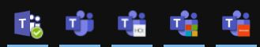
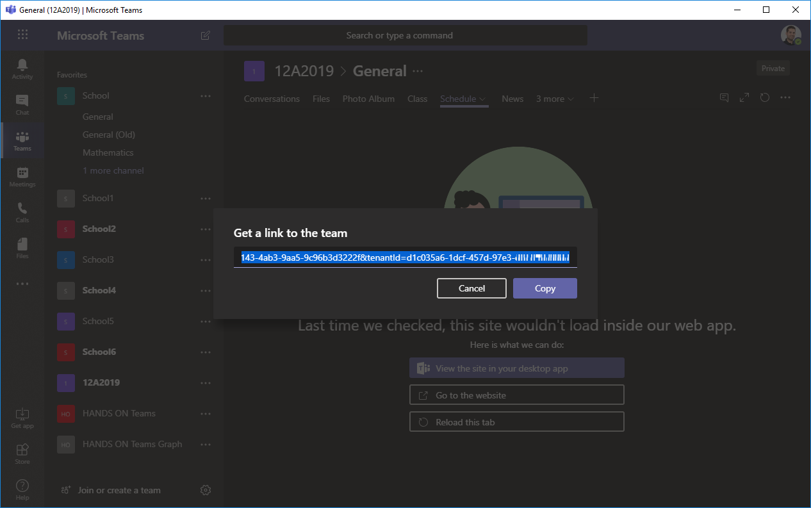
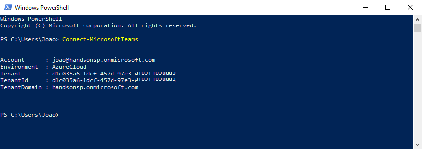

import ArticleHeader from '../../../components/article-header'

<ArticleHeader frontmatter={props.pageContext.frontmatter} />

Being able to execute multiple instances of Microsoft Teams is a long-waited feature that is affecting negatively all the users that belong to multiple organizations. If you are doing multiple tenant swaps during the day to keep up with everything that is happening in all your organizations this article is for you, even though Microsoft Teams does not support multiple instances you will be able to execute the web version as standalone app and you will be able to be signed in in all the organizations ate the same time.

In order to accomplish the steps described in this article you will need to install Node.js, instructions and the installation packages can be found [here](https&#58;//nodejs.org/en/download/).

Once Node.js is installed in your system open the command line and execute the command below.

npm install -g nativefier

Nativefier is a command-line tool to easily create a desktop application for any web site with succinct and minimal configuration. Apps are wrapped by Electron in an OS executable (.app, .exe, etc.) for use on Windows, macOS and Linux. More information about this project can be found in the GitHub repository [here](https&#58;//github.com/jiahaog/nativefier).

With all the requirements installed follow the steps bellow to create your own Microsoft Teams App.

1.       Create a folder where the new app will be created

2.       Open the console and navigate to the folder

3.       Execute the command below:

nativefier.cmd [https://teams.microsoft.com](https&#58;//teams.microsoft.com/)/\_?tenantID=YOURTENANTID --name "YOUR NAME" --internal-urls .\* --icon "Logo.ico"

- Provide a name for your new Microsoft Teams Application.
- Get the tenant ID to the organization where you want to connect, detailed instructions can be found down below.
- Copy the logo for your new Microsoft Teams application to the folder where the app will be created. (Note: On Windows the icon needs to be in the \*.ico format).

4.       Once the execution ends open the folder and look for the \*.exe file

**5.**       Open the application, provide your credentials and then select Use the Web App Instead

**How to get Microsoft Teams tenant ID**

Your Microsoft Teams tenant ID is a unique identifier that is different than the organization domain where you are connected. You can use two different methods to get this identifier, one using Teams graphic user interface and the other one using Teams PowerShell.

**Get Tenant ID using GUI**

1. Open one of the Teams where you belong inside the Teams Application.
2. Click on the … next to the Team title.
3. Click on Get link to team.
4. Copy the link to the team and grab the tenant ID form the URL.

**Get Tenant ID using PowerShell**

In order to follow this process, you need to install Teams PowerShell, it's available here.

1. Open the PowerShell window.
2. Execute the command Connect-MicrosoftTeams.
3. Provide your login credentials.
4. Copy the tenant ID from the console:

**Joao Ferreira**  
Office Development MVP | SharePoint Team Lead at BindTuning